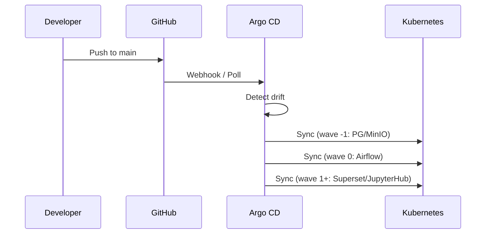
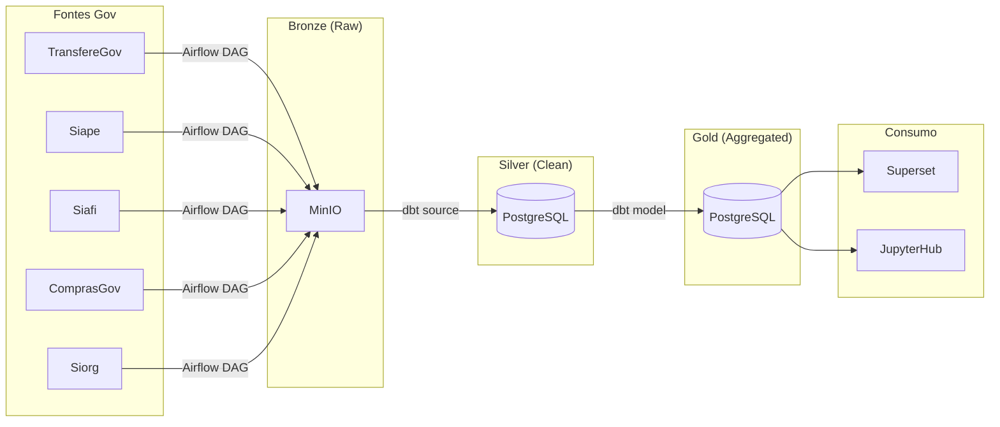

# Plano: Documentação da Infraestrutura e Pipeline — GovHub BR

## Objetivo

Documentar detalhadamente a infraestrutura GitOps e o pipeline de dados do GovHub BR, cobrindo desde o setup local até o deploy em produção via Argo CD.

---

## Infraestrutura (continuous-deployment)

### Componentes Gerenciados

| Componente | Descrição | Sync Wave |
|------------|-----------|-----------|
| **PostgreSQL** | Metastore e analytics | Negativa (base) |
| **MinIO** | Object storage (Bronze layer) | Negativa (base) |
| **Airflow** | Orquestração ETL/ELT | 0 |
| **Superset** | BI e dashboards | 1+ |
| **JupyterHub** | Notebooks interativos | 1+ |
| **Argo CD** | Controle GitOps | Bootstrap |

### Conceitos-Chave

#### GitOps com Argo CD

- Infraestrutura declarativa versionada no Git
- Argo CD sincroniza estado do cluster com o repositório
- Nenhum `kubectl apply` manual em produção

#### App-of-Apps

- Um `Application` raiz gera os Applications filhos
- Cada filho pode usar Helm, Kustomize ou plugin `kustomized-helm`
- Ordem de bootstrap definida por sync waves

#### Overlays por Ambiente

- `values.yaml` — configuração base
- `values.preprod.yaml` — override para pré-produção
- `values.prod.yaml` — override para produção
- Deep-merge por chave (herda o que não está no overlay)

### Deploy Flow



### Documentação a Produzir

| Arquivo | Conteúdo |
|---------|----------|
| `docs/infraestrutura/kubernetes.md` | Cluster, namespaces, kubeconfig, VPN |
| `docs/infraestrutura/argocd.md` | Install, app-of-apps, sync waves, overlays, troubleshooting |
| `docs/infraestrutura/minio.md` | Buckets, políticas, overlay prod, acesso |
| `docs/infraestrutura/postgres.md` | Schemas, roles, backups, conexão |
| `docs/infraestrutura/secrets.md` | kubectl secrets, certificados SIAFI/SIAPE, boas práticas |

---

## Pipeline de Dados (data-application-gov-hub)

### Fluxo Geral



### Apache Airflow

**Responsabilidade**: Orquestrar ingestão de dados dos sistemas governamentais.

| Tópico | Conteúdo a Documentar |
|--------|----------------------|
| DAGs | Estrutura, schedule, dependências |
| Conexões | TransfereGov API, Siape (certificado), Siafi, ComprasGov |
| Plugins | Operators customizados |
| Variáveis | Configurações por ambiente |
| Monitoramento | Logs, alertas, retries |

**Estrutura de DAGs**:

```
airflow/
├── dags/
│   ├── ingestao_transferegov.py
│   ├── ingestao_siape.py
│   ├── ingestao_siafi.py
│   ├── ingestao_comprasgov.py
│   └── ingestao_siorg.py
└── plugins/
    └── operators/
```

### dbt

**Responsabilidade**: Transformar dados de Bronze para Silver/Gold.

| Tópico | Conteúdo a Documentar |
|--------|----------------------|
| Models | bronze/, silver/, gold/ — naming conventions |
| Sources | Definição de fontes (MinIO → staging) |
| Tests | Schema tests, custom tests, data quality |
| Materializations | Table, view, incremental |
| Seeds | Dados de referência estáticos |

**Estrutura de Models**:

```
dbt/
└── models/
    ├── bronze/        # Raw staging
    ├── silver/        # Limpo, normalizado
    ├── gold/          # Agregado, métricas
    └── schema.yml     # Tests e docs
```

### Documentação a Produzir

| Arquivo | Conteúdo |
|---------|----------|
| `docs/pipeline/airflow.md` | DAGs, conexões, plugins, schedules, monitoramento |
| `docs/pipeline/dbt.md` | Models, materializations, tests, execução |
| `docs/pipeline/ingestao.md` | Fontes de dados, APIs, certificados, formatos |
| `docs/pipeline/qualidade.md` | Testes dbt, validações, alertas de qualidade |

---

## Visualização e Governança

### Apache Superset

| Tópico | Conteúdo a Documentar |
|--------|----------------------|
| Datasets | Conexão com PostgreSQL (Gold layer) |
| Dashboards | Painéis por tema (transferências, pessoal, financeiro) |
| Permissões | Roles, row-level security |
| Export/Import | Versionamento de dashboards |

### JupyterHub

| Tópico | Conteúdo a Documentar |
|--------|----------------------|
| Acesso | Autenticação, perfis de usuário |
| Kernels | Python, PySpark (se aplicável) |
| Conexão DB | SQLAlchemy com PostgreSQL |
| Notebooks | Convenções, versionamento |

### OpenMetadata

| Tópico | Conteúdo a Documentar |
|--------|----------------------|
| Domínios | Organização por órgão/sistema |
| Linhagem | Rastreio Bronze → Silver → Gold |
| Owners | Responsáveis por datasets |
| Qualidade | Integração com testes dbt |
| Config declarativa | Repo `openmetadata-declarative-governance` |

### Documentação a Produzir

| Arquivo | Conteúdo |
|---------|----------|
| `docs/visualizacao/superset.md` | Datasets, dashboards, permissões, deploy |
| `docs/visualizacao/jupyterhub.md` | Acesso, kernels, notebooks, conexão DB |
| `docs/governanca/openmetadata.md` | Catálogo, linhagem, domínios, declarativo |
| `docs/governanca/acesso.md` | Ranger/Trino, row-level security |

---

## Setup Local

### Pré-requisitos

- Docker e Docker Compose
- Make
- Python 3.11+
- Git (com GPG para commits assinados)

### Comandos Principais

```bash
# Setup completo
make setup

# Subir todos os serviços
docker-compose up -d

# Acessar
# Airflow:  http://localhost:8080
# Jupyter:  http://localhost:8888
# Superset: http://localhost:8088

# Qualidade de código
make lint
make test

# Build
make build
make clean
```

### Documentação a Produzir

| Arquivo | Conteúdo |
|---------|----------|
| `docs/onboarding/roteiro.md` | Visão geral, trilhas, primeiro dia |
| `docs/onboarding/setup-local.md` | Docker, Make, variáveis, serviços |
| `docs/onboarding/git-workflow.md` | GPG, branches, conventional commits, rebase |
| `docs/onboarding/airflow-tutorial.md` | Primeira DAG passo a passo |
| `docs/onboarding/dbt-tutorial.md` | Primeiro model, `dbt run`, `dbt test` |
| `docs/onboarding/superset-tutorial.md` | Primeiro dashboard |
| `docs/onboarding/troubleshooting.md` | Docker issues, permissões, conexões |

---

## Forks Temáticos

O GovHub suporta forks para contextos específicos:

| Fork | Contexto | Repositório |
|------|----------|-------------|
| `data-application-cidades` | Dados municipais | Fork de data-application-gov-hub |
| `data-application-minc` | Ministério da Cultura | Fork de data-application-gov-hub |

### Documentação a Produzir

| Arquivo | Conteúdo |
|---------|----------|
| `docs/comunidade/forks.md` | Como criar e manter um fork temático |
| `docs/comunidade/pesquisa.md` | govhub-research: IA, OCR, parsers de docs públicos |

---

## Ordem de Execução

| Fase | Arquivos | Prioridade |
|------|----------|-----------|
| 1. Arquitetura | 4 | 🔴 Alta |
| 2. Pipeline | 4 | 🔴 Alta |
| 3. Infraestrutura | 5 | 🔴 Alta |
| 4. Visualização & Governança | 4 | 🟡 Média |
| 5. Onboarding | 7 | 🟡 Média |
| 6. Comunidade | 3 | 🟢 Baixa |
| **Total** | **27** | — |

---

## Fontes de Informação

### Repositórios para Consulta

| Repo | O que extrair |
|------|---------------|
| `data-application-gov-hub` | DAGs, models dbt, docker-compose, Makefile |
| `continuous-deployment` | Manifests K8s, Helm values, overlays |
| `openmetadata-declarative-governance` | Config de governança |
| `govhub-research` | Descrição de pesquisas em andamento |
| `gov-hub` | Site institucional, e-book |

### Links Externos

- [Site GovHub](https://gov-hub.io)
- [Documentação de Instalação](https://govhub-br.github.io/gov-hub/documentacao/instalacao/)
- [Apache Airflow Docs](https://airflow.apache.org/docs/)
- [dbt Docs](https://docs.getdbt.com/)
- [Apache Superset Docs](https://superset.apache.org/docs/intro)
- [Argo CD Docs](https://argo-cd.readthedocs.io/)
- [MinIO Docs](https://min.io/docs/minio/linux/index.html)
- [OpenMetadata Docs](https://docs.open-metadata.org/)

---

**Status**: 📋 Plano documentado, aguardando início da implementação
**Última atualização**: 2026-05-19
