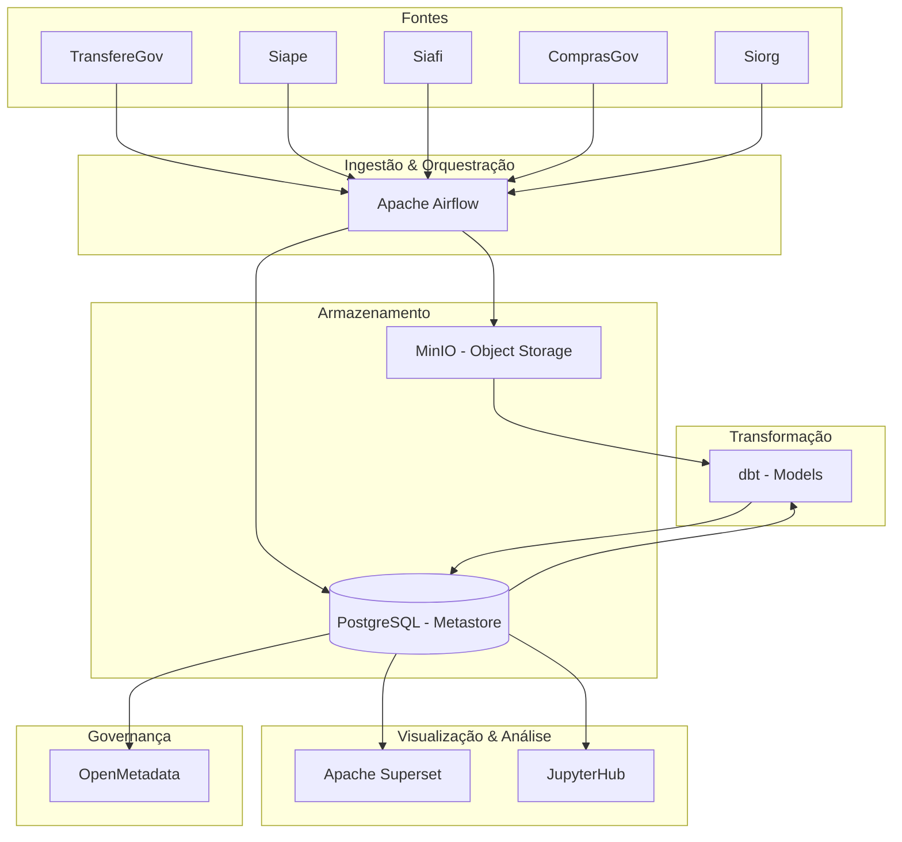

# Plano de Documentação — GovHub BR

## Sobre o Projeto

**GovHub BR** é uma iniciativa open source para integrar, qualificar e disponibilizar dados governamentais de forma estruturada, promovendo eficiência administrativa, transparência e melhor tomada de decisão.

**Organização**: https://github.com/GovHub-br
**Site**: https://gov-hub.io
**Apoio**: Lab Livre (UnB) + IPEA/Dides

### Fontes de Dados

Sistemas estruturantes do governo federal:

- **TransfereGov** — Transferências voluntárias
- **Siape** — Pessoal civil e militar
- **Siafi** — Administração financeira
- **ComprasGov** — Compras públicas
- **Siorg** — Estrutura organizacional

---

## Arquitetura Atual



### Arquitetura Medallion

| Camada | Descrição | Storage |
|--------|-----------|---------|
| **Bronze** | Dados brutos ingeridos (raw) | MinIO |
| **Silver** | Dados limpos e normalizados | PostgreSQL |
| **Gold** | Dados agregados e prontos para consumo | PostgreSQL |

### Stack Principal

| Componente | Tecnologia | Papel |
|------------|-----------|-------|
| Orquestração | Apache Airflow | ETL/ELT pipelines |
| Transformação | dbt | Data models e testes |
| Object Storage | MinIO | Armazenamento de dados brutos |
| Banco Analítico | PostgreSQL | Metastore e analytics |
| BI / Dashboards | Apache Superset | Visualização e exploração |
| Notebooks | JupyterHub | Análise interativa |
| Governança | OpenMetadata | Catálogo e linhagem de dados |
| Deploy | Argo CD (GitOps) | Kubernetes declarativo |
| Container | Docker / Kubernetes | Execução dos serviços |

---

## Repositórios

| Repositório | Descrição | Stack |
|-------------|-----------|-------|
| [`data-application-gov-hub`](https://github.com/GovHub-br/data-application-gov-hub) | Pipeline de dados principal | Airflow, dbt, Jupyter, Superset |
| [`gov-hub`](https://github.com/GovHub-br/gov-hub) | Site institucional e documentação | HTML |
| [`continuous-deployment`](https://github.com/GovHub-br/continuous-deployment) | Infra GitOps (K8s, Helm, Argo CD) | Python, YAML |
| [`data-application-cidades`](https://github.com/GovHub-br/data-application-cidades) | Fork — dados municipais | Airflow, dbt |
| [`data-application-minc`](https://github.com/GovHub-br/data-application-minc) | Fork — Ministério da Cultura | Airflow, dbt |
| [`govhub-research`](https://github.com/GovHub-br/govhub-research) | Pesquisa: IA, OCR, parsers | Python |
| [`openmetadata-declarative-governance`](https://github.com/GovHub-br/openmetadata-declarative-governance) | Governança declarativa | Python |
| [`data-governance-workshop`](https://github.com/GovHub-br/data-governance-workshop) | Workshop Ranger + Trino | HTML |

---

## Documentação a Criar

### Fase 1 — Arquitetura (Prioridade Alta)

| Arquivo | Conteúdo |
|---------|----------|
| `docs/index.md` | Home: missão, diagrama geral, links rápidos |
| `docs/arquitetura/visao-geral.md` | Medallion, stack, repositórios, decisões |
| `docs/arquitetura/fluxo-de-dados.md` | Pipeline: ingestão → bronze → silver → gold → BI |
| `docs/arquitetura/medallion.md` | Detalhamento das camadas Bronze/Silver/Gold |
| `docs/arquitetura/componentes.md` | Airflow, dbt, MinIO, PostgreSQL, Superset, JupyterHub |

### Fase 2 — Pipeline de Dados (Prioridade Alta)

| Arquivo | Conteúdo |
|---------|----------|
| `docs/pipeline/airflow.md` | DAGs, plugins, conexões, schedules |
| `docs/pipeline/dbt.md` | Models, seeds, tests, materializations |
| `docs/pipeline/ingestao.md` | Fontes (TransfereGov, Siape, etc.), conectores |
| `docs/pipeline/qualidade.md` | Testes dbt, validações, monitoramento |

### Fase 3 — Infraestrutura (Prioridade Alta)

| Arquivo | Conteúdo |
|---------|----------|
| `docs/infraestrutura/kubernetes.md` | Cluster K8s, namespaces, recursos |
| `docs/infraestrutura/argocd.md` | GitOps, app-of-apps, sync waves, overlays |
| `docs/infraestrutura/minio.md` | Object storage, buckets, políticas |
| `docs/infraestrutura/postgres.md` | Metastore, schemas, backups |
| `docs/infraestrutura/secrets.md` | Gestão de segredos, certificados (SIAFI/SIAPE) |

### Fase 4 — Visualização & Governança (Prioridade Média)

| Arquivo | Conteúdo |
|---------|----------|
| `docs/visualizacao/superset.md` | Dashboards, datasets, permissões |
| `docs/visualizacao/jupyterhub.md` | Notebooks, kernels, acesso |
| `docs/governanca/openmetadata.md` | Catálogo, linhagem, domínios, owners |
| `docs/governanca/acesso.md` | Políticas de acesso (Ranger/Trino se aplicável) |

### Fase 5 — Onboarding (Prioridade Média)

| Arquivo | Conteúdo |
|---------|----------|
| `docs/onboarding/roteiro.md` | Roteiro geral para novos contribuidores |
| `docs/onboarding/setup-local.md` | Docker Compose, Make, primeiros passos |
| `docs/onboarding/git-workflow.md` | Branches, commits assinados, GPG, PRs |
| `docs/onboarding/airflow-tutorial.md` | Primeira DAG, conexões, testes |
| `docs/onboarding/dbt-tutorial.md` | Primeiro model, run, test |
| `docs/onboarding/superset-tutorial.md` | Primeiro dashboard |
| `docs/onboarding/troubleshooting.md` | Problemas comuns |

### Fase 6 — Contribuição & Comunidade

| Arquivo | Conteúdo |
|---------|----------|
| `docs/CONTRIBUTING.md` | Guia de contribuição, padrões |
| `docs/comunidade/forks.md` | Como criar um fork temático (cidades, minc) |
| `docs/comunidade/pesquisa.md` | govhub-research: POCs, IA, OCR |

---

## Navegação (`mkdocs.yml`)

```yaml
nav:
  - Home: index.md
  - Arquitetura:
    - Visão Geral: arquitetura/visao-geral.md
    - Fluxo de Dados: arquitetura/fluxo-de-dados.md
    - Arquitetura Medallion: arquitetura/medallion.md
    - Componentes: arquitetura/componentes.md
  - Pipeline de Dados:
    - Apache Airflow: pipeline/airflow.md
    - dbt: pipeline/dbt.md
    - Ingestão de Dados: pipeline/ingestao.md
    - Qualidade de Dados: pipeline/qualidade.md
  - Infraestrutura:
    - Kubernetes: infraestrutura/kubernetes.md
    - Argo CD (GitOps): infraestrutura/argocd.md
    - MinIO: infraestrutura/minio.md
    - PostgreSQL: infraestrutura/postgres.md
    - Secrets & Segurança: infraestrutura/secrets.md
  - Visualização:
    - Apache Superset: visualizacao/superset.md
    - JupyterHub: visualizacao/jupyterhub.md
  - Governança:
    - OpenMetadata: governanca/openmetadata.md
    - Controle de Acesso: governanca/acesso.md
  - Onboarding:
    - Roteiro: onboarding/roteiro.md
    - Setup Local: onboarding/setup-local.md
    - Git Workflow: onboarding/git-workflow.md
    - Tutorial Airflow: onboarding/airflow-tutorial.md
    - Tutorial dbt: onboarding/dbt-tutorial.md
    - Tutorial Superset: onboarding/superset-tutorial.md
    - Troubleshooting: onboarding/troubleshooting.md
  - Comunidade:
    - Contribuir: CONTRIBUTING.md
    - Forks Temáticos: comunidade/forks.md
    - Pesquisa: comunidade/pesquisa.md
```

---

## Estrutura do Repositório `data-application-gov-hub`

```
.
├── airflow/
│   ├── dags/          # DAGs de ingestão e transformação
│   └── plugins/       # Plugins customizados
├── dbt/
│   └── models/        # Models bronze/silver/gold
├── jupyter/
│   └── notebooks/     # Análises exploratórias
├── superset/
│   └── dashboards/    # Dashboards exportados
├── docker-compose.yml
├── Makefile
└── README.md
```

## Estrutura do Repositório `continuous-deployment`

```
.
├── airflow/           # Manifests do Airflow (K8s)
├── app-of-apps/       # Chart que gera Applications filhos
├── argocd/            # Instalação Argo CD + entrypoints
├── jupyterhub/        # Manifests JupyterHub
├── minio/             # Manifests MinIO (+ overlay prod)
├── postgres/          # Manifests PostgreSQL
├── superset/          # Manifests Superset
└── README.md
```

---

## Verificação Final

1. `poetry run mkdocs build --strict` — build sem erros
2. `poetry run mkdocs serve` — preview local
3. Validar todos os links internos
4. Testar diagramas Mermaid
5. Verificar que não há referências ao projeto antigo (DestaquesGovbr, Cogfy, Bedrock, Typesense, HuggingFace)
6. Confirmar alinhamento com repos reais do GitHub
