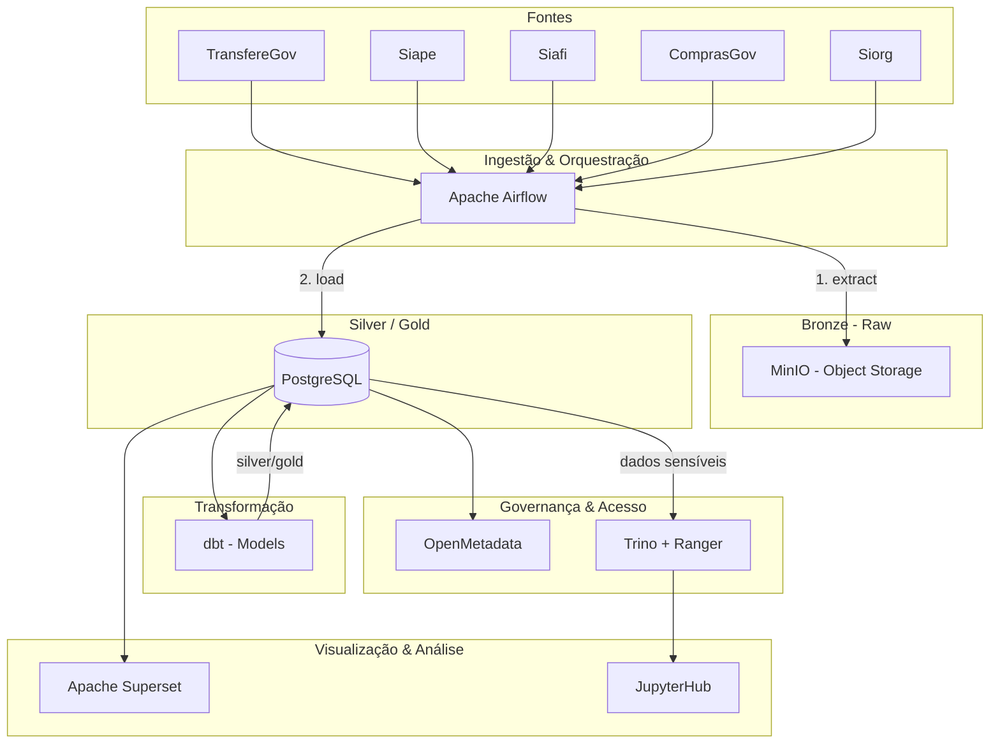

# Plano de Documentação — GovHub BR

## Sobre o Projeto

**GovHub BR** é uma iniciativa open source para integrar, qualificar e disponibilizar dados governamentais de forma estruturada, promovendo eficiência administrativa, transparência e melhor tomada de decisão.

**Organização**: https://github.com/GovHub-br
**Site**: https://gov-hub.io
**Apoio**: Lab Livre (UnB) + IPEA/Dides

### Público-Alvo

| Público | Perfil | Ponto de entrada |
|---------|--------|------------------|
| **Estudantes de Engenharia de Software** | Primeira contribuição open source, pouco contexto sobre governo | Onboarding → Tutoriais |
| **Equipes de TI do Governo** | Querem adotar/implantar o GovHub no seu órgão | Adoção → Infraestrutura |

### Tom e Estilo

- **Referência** (arquitetura, pipeline, infra, governança): técnico neutro, voz impessoal
- **Tutoriais e onboarding**: imperativo/segunda pessoa ("Clone o repositório", "Execute o comando")
- **Idioma**: pt-BR em todo o conteúdo

### Fontes de Dados

Sistemas estruturantes do governo federal:

- **TransfereGov** — Transferências voluntárias (convênios, contratos de repasse entre União e entes subnacionais)
- **Siape** — Pessoal civil e militar (cadastro de servidores, folha de pagamento)
- **Siafi** — Administração financeira (execução orçamentária e financeira da União)
- **ComprasGov** — Compras públicas (licitações, contratos, atas de registro de preço)
- **Siorg** — Estrutura organizacional (órgãos, unidades, cargos)

---

## Arquitetura Atual



### Fluxo Real da DAG (3 passos)

```
Fonte Gov → [Airflow: extract] → MinIO (raw)
MinIO → [Airflow: load] → PostgreSQL (staging/bronze tables)
PostgreSQL → [Airflow: trigger dbt] → PostgreSQL (silver/gold)
```

### Arquitetura Medallion

| Camada | Descrição | Storage |
|--------|-----------|---------|
| **Bronze** | Dados brutos ingeridos (raw files) | MinIO |
| **Silver** | Dados limpos e normalizados | PostgreSQL (schemas por fork) |
| **Gold** | Dados agregados e prontos para consumo | PostgreSQL (schemas por fork) |

### Stack Principal

| Componente | Tecnologia | Papel |
|------------|-----------|-------|
| Orquestração | Apache Airflow | DAGs de ingestão (extract → load → trigger dbt) |
| Transformação | dbt | Models SQL, testes, documentação |
| Object Storage | MinIO | Camada Bronze (dados brutos) |
| Banco Analítico | PostgreSQL | Camadas Silver e Gold |
| BI / Dashboards | Apache Superset | Visualização (acesso direto ao PG) |
| Notebooks | JupyterHub | Análise interativa (via Trino para dados sensíveis) |
| Governança | OpenMetadata | Catálogo e linhagem (deployed, config parcial) |
| Acesso Governado | Trino + Ranger | Row-level security para dados sensíveis (Siape) |
| Deploy | Argo CD (GitOps) | Kubernetes declarativo |
| Container | Docker / Kubernetes | Execução dos serviços |

### Modelo de Forks

Forks são **leves**: mesmo cluster/infra, novas DAGs + models dbt. Isolamento por **schemas PostgreSQL** (ex: `cidades_silver`, `minc_gold`).

---

## Repositórios

| Repositório | Descrição | Stack |
|-------------|-----------|-------|
| [`data-application-gov-hub`](https://github.com/GovHub-br/data-application-gov-hub) | Pipeline de dados principal | Airflow, dbt, Jupyter, Superset |
| [`gov-hub`](https://github.com/GovHub-br/gov-hub) | Site institucional e documentação | HTML |
| [`continuous-deployment`](https://github.com/GovHub-br/continuous-deployment) | Infra GitOps (K8s, Helm, Argo CD) | Python, YAML |
| [`data-application-cidades`](https://github.com/GovHub-br/data-application-cidades) | Fork leve — dados municipais | Airflow, dbt |
| [`data-application-minc`](https://github.com/GovHub-br/data-application-minc) | Fork leve — Ministério da Cultura | Airflow, dbt |
| [`govhub-research`](https://github.com/GovHub-br/govhub-research) | Pesquisa: IA, OCR, parsers | Python |
| [`openmetadata-declarative-governance`](https://github.com/GovHub-br/openmetadata-declarative-governance) | Governança declarativa | Python |
| [`data-governance-workshop`](https://github.com/GovHub-br/data-governance-workshop) | Workshop Ranger + Trino | HTML |

---

## Documentação a Produzir

### Fase 1 — Arquitetura + Fontes de Dados (Prioridade Alta)

Base conceitual para tudo. Inclui glossário de domínio governamental para estudantes.

| Arquivo | Conteúdo |
|---------|----------|
| `docs/index.md` | Home: missão, diagrama geral, links rápidos |
| `docs/arquitetura/visao-geral.md` | Medallion, stack, repositórios, decisões |
| `docs/arquitetura/fluxo-de-dados.md` | Pipeline: extract → load → dbt (3 passos) |
| `docs/arquitetura/medallion.md` | Detalhamento das camadas Bronze/Silver/Gold |
| `docs/arquitetura/componentes.md` | Airflow, dbt, MinIO, PostgreSQL, Superset, JupyterHub, Trino |
| `docs/arquitetura/fontes-de-dados.md` | **NOVO** — Glossário: o que é cada sistema gov, entidades principais, que perguntas o GovHub responde |

### Fase 2 — Onboarding (Prioridade Alta)

Desbloqueia estudantes imediatamente. Tom: imperativo, acessível.

| Arquivo | Conteúdo |
|---------|----------|
| `docs/onboarding/roteiro.md` | Roteiro geral, trilhas por perfil |
| `docs/onboarding/setup-local.md` | Docker Compose, Make, primeiros passos |
| `docs/onboarding/git-workflow.md` | Branches, commits assinados, GPG, PRs |
| `docs/onboarding/airflow-tutorial.md` | Primeira DAG (3 passos), conexões, testes |
| `docs/onboarding/dbt-tutorial.md` | Primeiro model, run, test |
| `docs/onboarding/superset-tutorial.md` | Primeiro dashboard |
| `docs/onboarding/troubleshooting.md` | Problemas comuns |

### Fase 3 — Pipeline + Dicionário de Dados (Prioridade Alta)

Core técnico. Dicionário conceitual com link para dbt docs para detalhe de colunas.

| Arquivo | Conteúdo |
|---------|----------|
| `docs/pipeline/airflow.md` | DAGs (3 passos), plugins, conexões, schedules |
| `docs/pipeline/dbt.md` | Models, seeds, tests, materializations |
| `docs/pipeline/ingestao.md` | Fontes, APIs, certificados, formatos |
| `docs/pipeline/qualidade.md` | Testes dbt, validações, monitoramento |
| `docs/dados/dicionario.md` | **NOVO** — Visão conceitual por fonte: entidades, relacionamentos, exemplos de queries Gold |
| `docs/dados/transferegov.md` | **NOVO** — Entidades TransfereGov, exemplos |
| `docs/dados/siape.md` | **NOVO** — Entidades Siape, exemplos |
| `docs/dados/siafi.md` | **NOVO** — Entidades Siafi, exemplos |
| `docs/dados/comprasgov.md` | **NOVO** — Entidades ComprasGov, exemplos |
| `docs/dados/siorg.md` | **NOVO** — Entidades Siorg, exemplos |

> Detalhe de colunas: apontar para [dbt docs](https://dbt.ipea.gov-hub.io/#!/overview)

### Fase 4 — Infraestrutura (Prioridade Alta)

Suporte ao deploy. Necessário para a seção de Adoção.

| Arquivo | Conteúdo |
|---------|----------|
| `docs/infraestrutura/kubernetes.md` | Cluster K8s, namespaces, recursos |
| `docs/infraestrutura/argocd.md` | GitOps, app-of-apps, sync waves, overlays |
| `docs/infraestrutura/minio.md` | Object storage, buckets, políticas |
| `docs/infraestrutura/postgres.md` | Metastore, schemas por fork, backups |
| `docs/infraestrutura/secrets.md` | Gestão de segredos, certificados (SIAFI/SIAPE) |

### Fase 5 — Adoção (Prioridade Média)

**NOVA SEÇÃO** — Desbloqueia equipes de TI do governo que querem implantar.

| Arquivo | Conteúdo |
|---------|----------|
| `docs/adocao/requisitos.md` | **NOVO** — Pré-requisitos de infra, recursos mínimos |
| `docs/adocao/deploy-inicial.md` | **NOVO** — Passo a passo do primeiro deploy |
| `docs/adocao/conectar-fontes.md` | **NOVO** — Como adicionar fontes de dados do órgão |
| `docs/adocao/fork-tematico.md` | **NOVO** — Como criar e manter um fork leve (schemas PG, DAGs, dbt models) |

### Fase 6 — Visualização & Governança (Prioridade Média)

Inclui Trino+Ranger como camada de acesso governado.

| Arquivo | Conteúdo |
|---------|----------|
| `docs/visualizacao/superset.md` | Dashboards, datasets, permissões |
| `docs/visualizacao/jupyterhub.md` | Notebooks, kernels, acesso (via Trino para dados sensíveis) |
| `docs/governanca/openmetadata.md` | Catálogo, linhagem, domínios, owners; como completar config |
| `docs/governanca/trino-ranger.md` | **NOVO** — Acesso governado: Trino como query layer para dados sensíveis, Ranger policies |
| `docs/governanca/acesso.md` | Visão geral: roles PG (básico) + Trino/Ranger (sensíveis) |

### Fase 7 — Contribuição & Comunidade (Prioridade Baixa)

| Arquivo | Conteúdo |
|---------|----------|
| `docs/CONTRIBUTING.md` | Guia de contribuição, padrões |
| `docs/comunidade/forks.md` | Referência técnica sobre forks (schemas, convenções) |
| `docs/comunidade/pesquisa.md` | govhub-research: POCs, IA, OCR |

---

## Navegação (`mkdocs.yml`)

```yaml
nav:
  - Home: index.md
  - Arquitetura:
    - Visão Geral: arquitetura/visao-geral.md
    - Fluxo de Dados: arquitetura/fluxo-de-dados.md
    - Arquitetura Medallion: arquitetura/medallion.md
    - Componentes: arquitetura/componentes.md
    - Fontes de Dados: arquitetura/fontes-de-dados.md
  - Onboarding:
    - Roteiro: onboarding/roteiro.md
    - Setup Local: onboarding/setup-local.md
    - Git Workflow: onboarding/git-workflow.md
    - Tutorial Airflow: onboarding/airflow-tutorial.md
    - Tutorial dbt: onboarding/dbt-tutorial.md
    - Tutorial Superset: onboarding/superset-tutorial.md
    - Troubleshooting: onboarding/troubleshooting.md
  - Pipeline de Dados:
    - Apache Airflow: pipeline/airflow.md
    - dbt: pipeline/dbt.md
    - Ingestão de Dados: pipeline/ingestao.md
    - Qualidade de Dados: pipeline/qualidade.md
  - Dicionário de Dados:
    - Visão Geral: dados/dicionario.md
    - TransfereGov: dados/transferegov.md
    - Siape: dados/siape.md
    - Siafi: dados/siafi.md
    - ComprasGov: dados/comprasgov.md
    - Siorg: dados/siorg.md
  - Infraestrutura:
    - Kubernetes: infraestrutura/kubernetes.md
    - Argo CD (GitOps): infraestrutura/argocd.md
    - MinIO: infraestrutura/minio.md
    - PostgreSQL: infraestrutura/postgres.md
    - Secrets & Segurança: infraestrutura/secrets.md
  - Adoção:
    - Requisitos: adocao/requisitos.md
    - Deploy Inicial: adocao/deploy-inicial.md
    - Conectar Fontes: adocao/conectar-fontes.md
    - Fork Temático: adocao/fork-tematico.md
  - Visualização:
    - Apache Superset: visualizacao/superset.md
    - JupyterHub: visualizacao/jupyterhub.md
  - Governança:
    - OpenMetadata: governanca/openmetadata.md
    - Trino + Ranger: governanca/trino-ranger.md
    - Controle de Acesso: governanca/acesso.md
  - Comunidade:
    - Contribuir: CONTRIBUTING.md
    - Pesquisa: comunidade/pesquisa.md
```

---

## Estrutura do Repositório `data-application-gov-hub`

```
.
├── airflow/
│   ├── dags/          # DAGs de ingestão (extract → load → trigger dbt)
│   └── plugins/       # Plugins customizados
├── dbt/
│   └── models/        # Models bronze/silver/gold
├── jupyter/
│   └── notebooks/     # Análises exploratórias
├── superset/
│   └── dashboards/    # Dashboards exportados
├── docker-compose.yml
├── Makefile
└── README.md
```

## Estrutura do Repositório `continuous-deployment`

```
.
├── airflow/           # Manifests do Airflow (K8s)
├── app-of-apps/       # Chart que gera Applications filhos
├── argocd/            # Instalação Argo CD + entrypoints
├── jupyterhub/        # Manifests JupyterHub
├── minio/             # Manifests MinIO (+ overlay prod)
├── postgres/          # Manifests PostgreSQL
├── superset/          # Manifests Superset
└── README.md
```

---

## Decisões de Design (Registro)

| # | Decisão | Contexto |
|---|---------|----------|
| 1 | Público-alvo: estudantes + equipes de TI gov | Dois perfis com pontos de entrada distintos |
| 2 | Tom: neutro em referência, imperativo em tutoriais | Equilibra acessibilidade e profissionalismo |
| 3 | DAG tem 3 passos: extract → load → trigger dbt | MinIO não é lido diretamente pelo dbt |
| 4 | Trino+Ranger: acesso governado para dados sensíveis | Superset acessa PG direto; Jupyter/análises sensíveis via Trino |
| 5 | Fork leve: mesmo cluster, schemas PG separados | Não requer infra própria por fork |
| 6 | OpenMetadata: deployed com config parcial | Documentar o que existe + como completar |
| 7 | Dicionário de dados híbrido | Conceitual no MkDocs, colunas no dbt docs |
| 8 | dbt docs hospedado | https://dbt.ipea.gov-hub.io/#!/overview |
| 9 | Nova seção "Adoção" | Caminho claro para equipes de governo implantarem |
| 10 | Nova seção "Fontes de Dados" | Glossário gov para estudantes sem contexto |
| 11 | Diagramas corrigidos | Mostrar 3 passos + Trino na governança |
| 12 | Docs existentes: mix | Auditar antes de revisar (completos/drafts/stubs) |

---

## Verificação Final

1. `docker run --rm -v .:/docs squidfunk/mkdocs-material build` — build sem erros
2. `docker run --rm -p 8000:8000 -v .:/docs squidfunk/mkdocs-material serve -a 0.0.0.0:8000` — preview local
3. Validar todos os links internos
4. Testar diagramas Mermaid
5. Verificar que não há referências ao projeto antigo (DestaquesGovbr, Cogfy, Bedrock, Typesense, HuggingFace)
6. Confirmar alinhamento com repos reais do GitHub
7. Verificar que diagramas mostram os 3 passos da DAG e Trino+Ranger

---

## Próximos Passos

1. [ ] Auditar os 27 docs existentes (classificar: completo / draft / stub)
2. [ ] Criar arquivos novos: `fontes-de-dados.md`, `dados/*.md`, `adocao/*.md`, `trino-ranger.md`
3. [ ] Corrigir diagramas em `visao-geral.md`, `index.md`, `fluxo-de-dados.md`
4. [ ] Atualizar `mkdocs.yml` com nova navegação
5. [ ] Revisar docs existentes para consistência com decisões acima

**Status**: 📋 Plano revisado com decisões de design consolidadas
**Última atualização**: 2026-05-20
