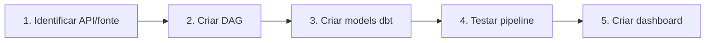

# Conectar Fontes de Dados

Como adicionar fontes de dados do seu órgão ao GovHub.

## Pré-requisitos

- [Deploy inicial](deploy-inicial.md) funcionando
- Airflow acessível
- MinIO e PostgreSQL operacionais
- Credenciais/APIs das fontes identificadas

## Fluxo para Nova Fonte



## 1. Identificar a Fonte

Documente antes de codificar:

| Item | Exemplo |
|------|---------|
| Nome do sistema | "SisGestão" |
| Tipo de acesso | API REST / banco / arquivo |
| Autenticação | API Key / certificado / pública |
| Formato | JSON / CSV / XML |
| Volume estimado | 10k registros/dia |
| Frequência | Diária / semanal |
| Sensibilidade | Pública / restrita |

## 2. Criar a DAG de Ingestão

Siga o padrão de 3 passos:

```python
# airflow/dags/ingestao_minhafonte.py
from airflow import DAG
from airflow.operators.python import PythonOperator
from airflow.operators.trigger_dagrun import TriggerDagRunOperator
from datetime import datetime, timedelta

default_args = {
    "owner": "meuorgao",
    "retries": 3,
    "retry_delay": timedelta(minutes=5),
}

with DAG(
    "ingestao_minhafonte",
    default_args=default_args,
    schedule_interval="0 6 * * *",
    start_date=datetime(2025, 1, 1),
    catchup=False,
    tags=["ingestao", "minhafonte"],
) as dag:

    # 1. Extract: API → MinIO (Bronze)
    extract = PythonOperator(
        task_id="extract",
        python_callable=extract_minhafonte,
    )

    # 2. Load: MinIO → PostgreSQL (staging)
    load = PythonOperator(
        task_id="load",
        python_callable=load_to_postgres,
    )

    # 3. Trigger dbt
    trigger_dbt = TriggerDagRunOperator(
        task_id="trigger_dbt",
        trigger_dag_id="dbt_transform",
        wait_for_completion=True,
    )

    extract >> load >> trigger_dbt
```

## 3. Configurar Connections no Airflow

Via UI (Admin → Connections) ou CLI:

```bash
# Exemplo: API com autenticação
airflow connections add minhafonte_api \
    --conn-type http \
    --conn-host api.minhafonte.gov.br \
    --conn-extra '{"api_key": "xxx"}'
```

## 4. Criar Bucket MinIO

```bash
# Via mc (MinIO Client)
mc alias set govhub http://minio:9000 <ACCESS_KEY> <SECRET_KEY>
mc mb govhub/bronze-minhafonte
```

## 5. Criar Models dbt

### Source (staging)

```yaml
# dbt/models/staging/schema.yml
sources:
  - name: bronze
    tables:
      - name: minhafonte_raw
        freshness:
          warn_after: {count: 24, period: hour}
          error_after: {count: 48, period: hour}
```

### Model Silver

```sql
-- dbt/models/silver/minhafonte.sql
{{ config(materialized='table', schema='silver') }}

SELECT
    id,
    TRIM(campo_texto) AS campo_texto,
    CAST(valor AS NUMERIC(15,2)) AS valor,
    CAST(data AS DATE) AS data,
    NOW() AS loaded_at
FROM {{ source('bronze', 'minhafonte_raw') }}
WHERE id IS NOT NULL
```

### Testes

```yaml
# dbt/models/schema.yml
models:
  - name: minhafonte
    columns:
      - name: id
        tests: [not_null, unique]
      - name: valor
        tests: [not_null]
```

## 6. Testar o Pipeline

```bash
# Trigger manual da DAG
airflow dags trigger ingestao_minhafonte

# Verificar no Airflow UI
# http://localhost:8080 → ingestao_minhafonte → Graph

# Rodar dbt localmente
cd dbt/
dbt run --select minhafonte
dbt test --select minhafonte
```

## 7. Criar Dataset no Superset

1. Data → Datasets → + Dataset
2. Database: GovHub, Schema: silver (ou gold), Table: minhafonte
3. Save → Create Chart

## Checklist

- [ ] API/fonte documentada
- [ ] DAG criada com 3 tasks
- [ ] Connection configurada no Airflow
- [ ] Bucket MinIO criado
- [ ] Models dbt (staging + silver + testes)
- [ ] Pipeline testado end-to-end
- [ ] Dataset no Superset criado

## Próximo Passo

→ [Fork Temático](fork-tematico.md) (se quiser isolar em schemas dedicados)
