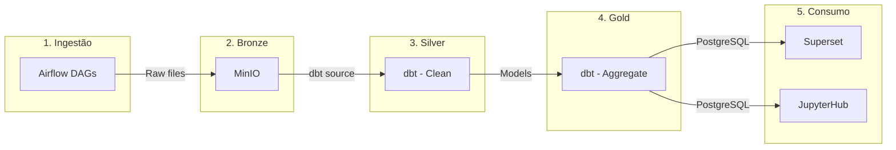
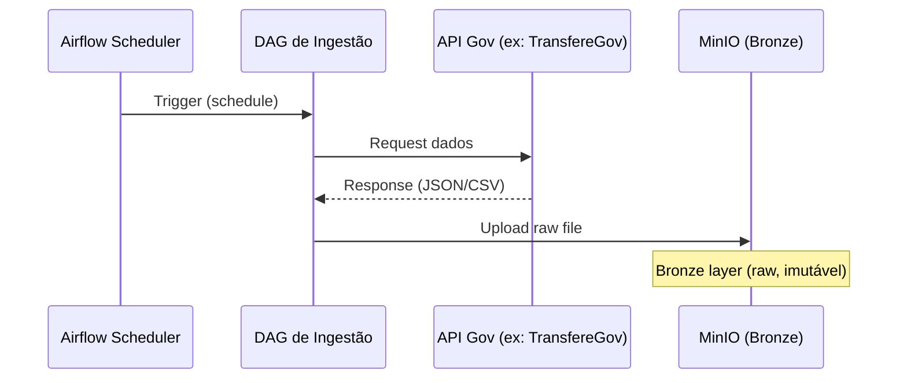
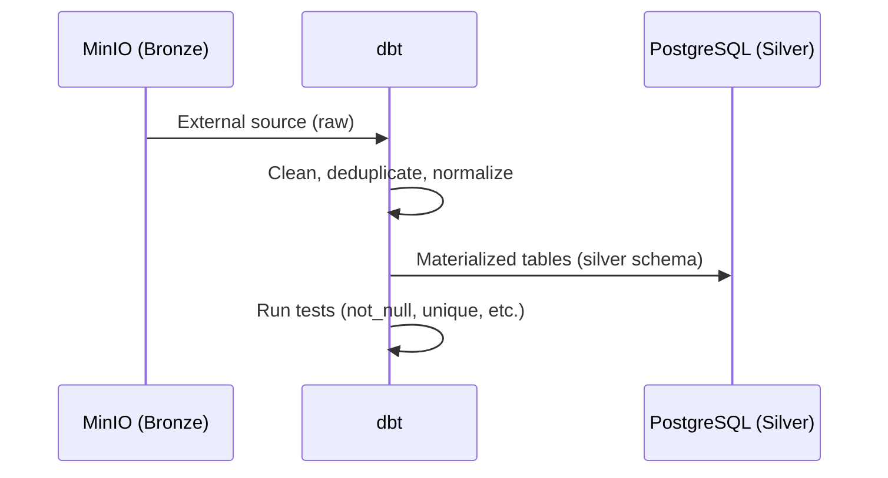
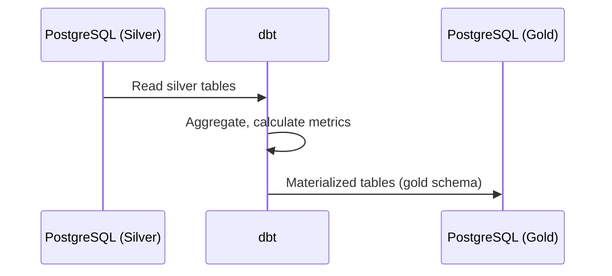
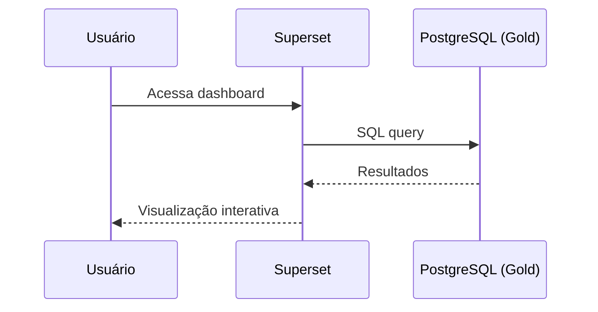

# Fluxo de Dados

Pipeline completo do GovHub BR: desde a ingestão de sistemas governamentais até a visualização em dashboards.

## Visão Geral

## Etapas Detalhadas

### Etapa 1: Ingestão (Airflow)

DAGs do Apache Airflow extraem dados de APIs e sistemas governamentais.

**Fontes**:

| Sistema | Método | Formato |
|---------|--------|---------|
| TransfereGov | API REST | JSON |
| Siape | Certificado digital | CSV |
| Siafi | API + certificado | JSON |
| ComprasGov | API REST | JSON |
| Siorg | API REST | JSON |

### Etapa 2: Bronze → Silver (dbt)

dbt lê dados brutos do MinIO (via staging) e aplica limpeza e normalização.

**Transformações típicas**:

- Remoção de duplicatas
- Normalização de tipos (datas, moedas)
- Padronização de nomes de órgãos
- Validação de integridade referencial

### Etapa 3: Silver → Gold (dbt)

dbt agrega e enriquece dados para consumo direto.

**Exemplos de modelos Gold**:

- `fato_transferencias` — Transferências por órgão/período
- `fato_servidores` — Indicadores de pessoal
- `fato_compras` — Métricas de compras públicas
- `dim_orgaos` — Dimensão consolidada de órgãos

### Etapa 4: Consumo (Superset / JupyterHub)

## Schedule de Execução

| DAG | Frequência | Fontes |
|-----|-----------|--------|
| `ingestao_transferegov` | Diária | TransfereGov API |
| `ingestao_siape` | Semanal | Siape (certificado) |
| `ingestao_siafi` | Diária | Siafi API |
| `ingestao_comprasgov` | Diária | ComprasGov API |
| `ingestao_siorg` | Semanal | Siorg API |
| `dbt_run` | Diária (pós-ingestão) | — |
| `dbt_test` | Diária (pós-dbt_run) | — |

## Qualidade de Dados

Garantida em múltiplas camadas:

| Camada | Mecanismo |
|--------|-----------|
| Ingestão | Retries, idempotência, logging |
| Silver | dbt tests: `not_null`, `unique`, `accepted_values` |
| Gold | dbt tests: `relationships`, custom SQL tests |
| Governança | OpenMetadata: linhagem, freshness, ownership |
