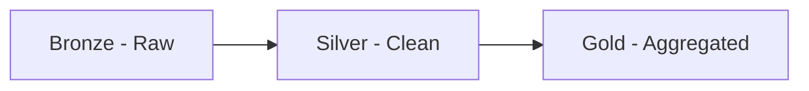
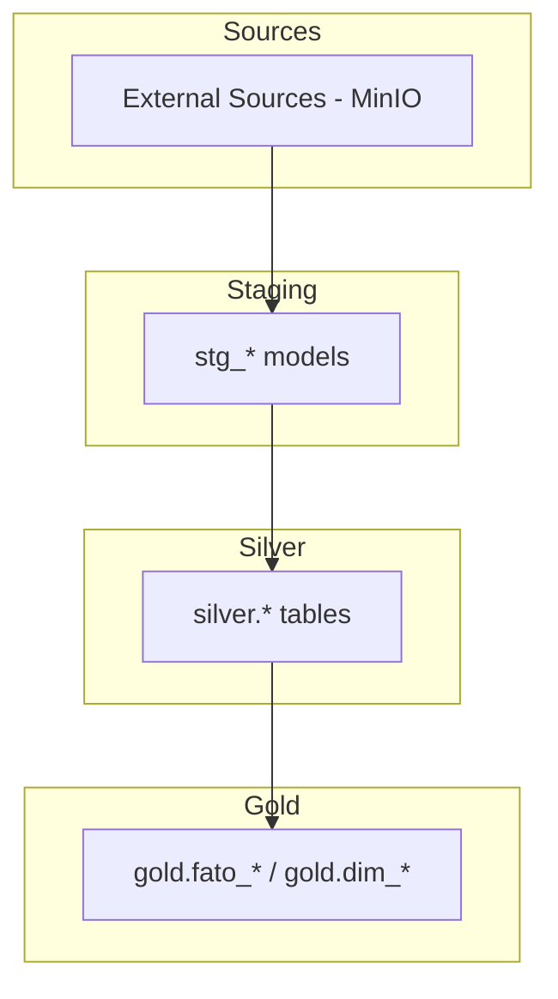

# Arquitetura Medallion

O GovHub BR adota a arquitetura Medallion para organizar dados em camadas progressivas de qualidade.

## Camadas



### Bronze (Raw)

**Storage**: MinIO (Object Storage)

Dados brutos exatamente como recebidos das fontes. Imutáveis e auditáveis.

| Aspecto | Detalhe |
|---------|---------|
| Formato | JSON, CSV, Parquet (raw) |
| Retenção | Indefinida |
| Qualidade | Nenhuma transformação |
| Objetivo | Reprodutibilidade, auditoria |

**Estrutura no MinIO**:

```
bronze/
├── transferegov/
│   └── 2026-05-19/raw.json
├── siape/
│   └── 2026-05-12/servidores.csv
├── siafi/
│   └── 2026-05-19/execucao.json
├── comprasgov/
│   └── 2026-05-19/contratos.json
└── siorg/
    └── 2026-05-12/orgaos.json
```

### Silver (Clean)

**Storage**: PostgreSQL (schema `silver`)

Dados limpos, deduplicados e normalizados. Prontos para análise básica.

| Aspecto | Detalhe |
|---------|---------|
| Formato | Tabelas PostgreSQL |
| Transformações | Limpeza, dedup, normalização de tipos |
| Testes | `not_null`, `unique`, `accepted_values` |
| Objetivo | Base confiável para transformações |

**Exemplos de tabelas Silver**:

- `silver.transferencias` — Transferências limpas
- `silver.servidores` — Servidores normalizados
- `silver.execucao_financeira` — Execução financeira
- `silver.contratos` — Contratos padronizados
- `silver.orgaos` — Estrutura organizacional

### Gold (Aggregated)

**Storage**: PostgreSQL (schema `gold`)

Dados agregados, métricas calculadas, prontos para consumo em BI.

| Aspecto | Detalhe |
|---------|---------|
| Formato | Tabelas e views PostgreSQL |
| Transformações | Agregações, joins, métricas |
| Testes | `relationships`, business rules |
| Objetivo | Consumo direto por Superset/JupyterHub |

**Exemplos de tabelas Gold**:

- `gold.fato_transferencias` — Fato: transferências por órgão/período
- `gold.fato_servidores` — Fato: indicadores de pessoal
- `gold.fato_compras` — Fato: métricas de compras
- `gold.dim_orgaos` — Dimensão: órgãos consolidados
- `gold.dim_tempo` — Dimensão: calendário

## Fluxo dbt



## Benefícios

- **Reprodutibilidade**: Sempre possível reprocessar a partir do Bronze
- **Auditoria**: Dados raw preservados indefinidamente
- **Qualidade progressiva**: Cada camada adiciona confiabilidade
- **Separação de concerns**: Ingestão ≠ transformação ≠ consumo
- **Debug**: Problemas isoláveis por camada
