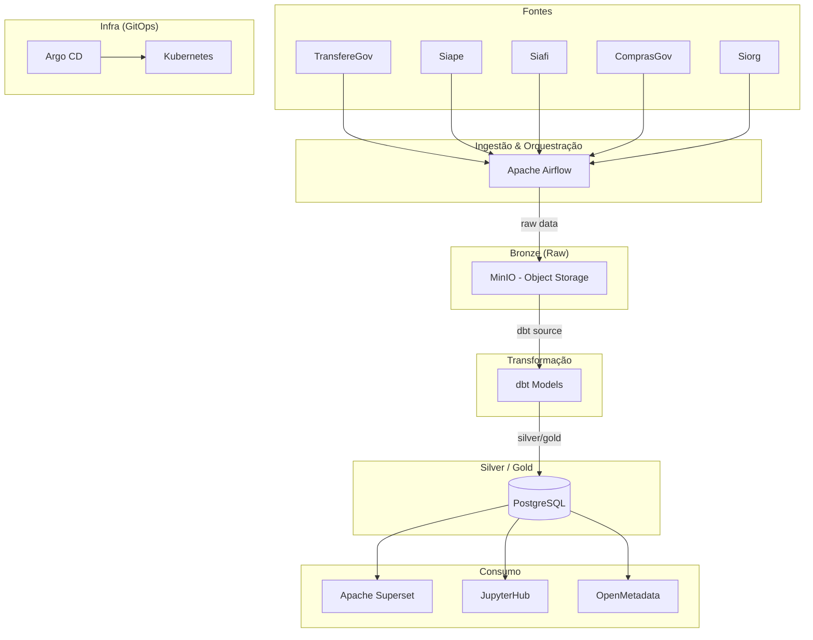

# Visão Geral da Arquitetura

O GovHub BR adota a **Arquitetura Medallion** (Bronze → Silver → Gold) para processar dados de sistemas estruturantes do governo federal.

## Diagrama de Arquitetura

## Camadas Medallion

| Camada | Storage | Descrição |
|--------|---------|-----------|
| **Bronze** | MinIO | Dados brutos ingeridos (JSON, CSV, Parquet raw) |
| **Silver** | PostgreSQL | Dados limpos, deduplicados, normalizados |
| **Gold** | PostgreSQL | Dados agregados, métricas, prontos para BI |

## Stack Tecnológica

| Componente | Tecnologia | Papel |
|------------|-----------|-------|
| Orquestração | Apache Airflow | Schedules, DAGs de ingestão |
| Transformação | dbt | Models SQL, testes, documentação |
| Object Storage | MinIO | Camada Bronze (dados brutos) |
| Banco Analítico | PostgreSQL | Camadas Silver e Gold |
| BI / Dashboards | Apache Superset | Visualização, exploração |
| Notebooks | JupyterHub | Análise interativa, POCs |
| Governança | OpenMetadata | Catálogo, linhagem, ownership |
| GitOps | Argo CD | Deploy declarativo em K8s |
| Containers | Docker / Kubernetes | Runtime de todos os serviços |

## Repositórios

| Repositório | Descrição |
|-------------|-----------|
| `data-application-gov-hub` | Pipeline principal (Airflow, dbt, Jupyter, Superset) |
| `continuous-deployment` | Infra GitOps (K8s manifests, Helm, Argo CD) |
| `gov-hub` | Site institucional |
| `govhub-research` | Pesquisa: IA, OCR, parsers |
| `openmetadata-declarative-governance` | Governança declarativa |
| `data-governance-workshop` | Workshop Ranger + Trino |

## Decisões Arquiteturais

- **Medallion Architecture**: Separação clara entre raw (Bronze), limpo (Silver) e agregado (Gold)
- **GitOps**: Infraestrutura 100% declarativa via Argo CD — nenhum `kubectl apply` manual em produção
- **App-of-Apps**: Padrão Argo CD para gerenciar múltiplos serviços com sync waves
- **Forks temáticos**: Arquitetura permite instâncias por contexto (cidades, MinC)
- **Open source**: Todo código público, comunidade aberta a contribuições

## Ambientes

| Ambiente | Descrição | Overlay |
|----------|-----------|---------|
| Local | Docker Compose (`docker-compose up -d`) | — |
| Pré-produção | Cluster K8s (validação) | `values.preprod.yaml` |
| Produção | Cluster K8s (GitOps) | `values.prod.yaml` |
