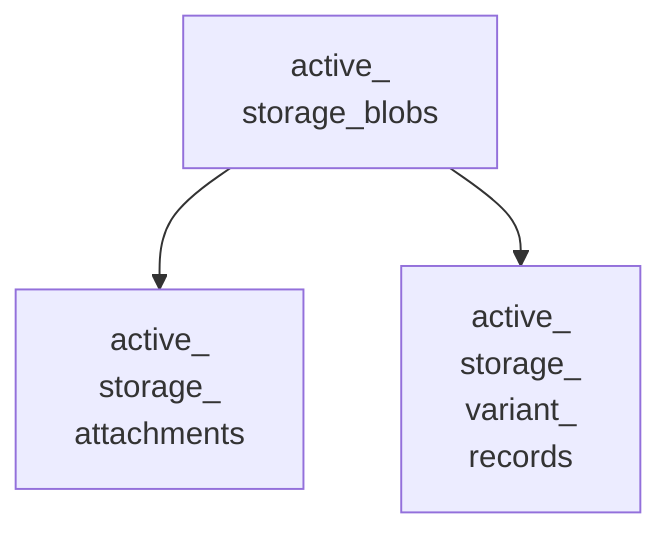
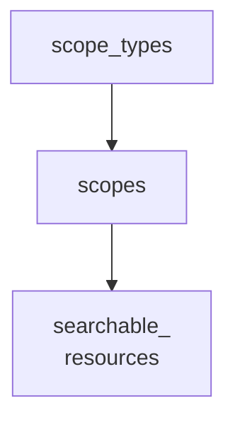
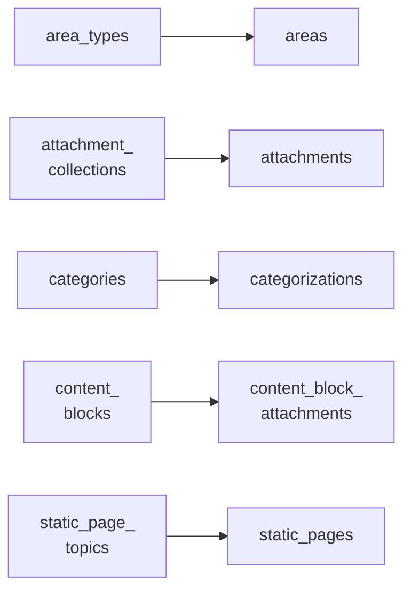

<!-- Gerado por scripts/banco_de_dados.py em 2026-10-07T13:00:08+00:00. Não edite à mão. -->

# Componentes, taxonomia, conteúdo e arquivos

Componentes de cada espaço, escopos, áreas, categorias, anexos, blocos de conteúdo, páginas estáticas, newsletters e arquivos do ActiveStorage.

**25 tabelas.** Schema versão `20260405195511`. Legenda da coluna **Referência**: *FK* = chave estrangeira declarada no banco; *→* = referência por convenção de nome (sem restrição no banco).

## Relacionamentos

Cada seta vai da tabela referenciada para a tabela que guarda a referência. Referências para outros domínios aparecem na coluna **Referência** das tabelas abaixo.

**A partir de `active_storage_blobs`**

**A partir de `decidim_scope_types`**

**Outras relações**

## Tabelas

| Tabela | Descrição | Colunas | Origem |
|---|---|---:|---|
| [`active_storage_attachments`](#active-storage-attachments) | Associação polimórfica entre registros e arquivos. | 6 | Decidim |
| [`active_storage_blobs`](#active-storage-blobs) | Metadados dos arquivos enviados (o conteúdo fica no storage). | 9 | Decidim |
| [`active_storage_variant_records`](#active-storage-variant-records) | — | 3 | Decidim |
| [`decidim_area_types`](#decidim-area-types) | — | 4 | Decidim |
| [`decidim_areas`](#decidim-areas) | Áreas. | 6 | Decidim |
| [`decidim_attachment_collections`](#decidim-attachment-collections) | Pastas (coleções) de anexos. | 6 | Decidim |
| [`decidim_attachments`](#decidim-attachments) | Anexos de espaços e recursos. | 14 | Decidim |
| [`decidim_categories`](#decidim-categories) | Categorias de um espaço participativo. | 7 | Decidim |
| [`decidim_categorizations`](#decidim-categorizations) | Associação polimórfica entre recursos e categorias. | 6 | Decidim |
| [`decidim_components`](#decidim-components) | Componentes de cada espaço (`manifest_name`: proposals, meetings, surveys, homes…). Polimórfico em `participatory_space`. | 14 | Decidim |
| [`decidim_content_block_attachments`](#decidim-content-block-attachments) | — | 3 | Decidim |
| [`decidim_content_blocks`](#decidim-content-blocks) | Blocos de conteúdo de páginas (home da organização e de espaços). | 11 | Decidim |
| [`decidim_contextual_help_sections`](#decidim-contextual-help-sections) | — | 4 | Decidim |
| [`decidim_editor_images`](#decidim-editor-images) | — | 5 | Decidim |
| [`decidim_hashtags`](#decidim-hashtags) | — | 5 | Decidim |
| [`decidim_newsletters`](#decidim-newsletters) | Newsletters. | 10 | Decidim |
| [`decidim_resource_links`](#decidim-resource-links) | Ligações entre recursos (ex.: proposta ↔ reunião). | 7 | Decidim |
| [`decidim_resource_permissions`](#decidim-resource-permissions) | — | 6 | Decidim |
| [`decidim_scope_types`](#decidim-scope-types) | Tipos de escopo. | 8 | Decidim |
| [`decidim_scopes`](#decidim-scopes) | Escopos (territoriais ou temáticos). Os escopos de órgãos públicos geram instâncias automaticamente. | 11 | Decidim |
| [`decidim_searchable_resources`](#decidim-searchable-resources) | Índice de busca global. | 15 | Decidim |
| [`decidim_share_tokens`](#decidim-share-tokens) | — | 10 | Decidim |
| [`decidim_short_links`](#decidim-short-links) | — | 10 | Decidim |
| [`decidim_static_page_topics`](#decidim-static-page-topics) | Tópicos que agrupam páginas estáticas. | 6 | Decidim |
| [`decidim_static_pages`](#decidim-static-pages) | Páginas estáticas (`/pages`), como termos de uso e tutoriais. | 11 | Decidim |

### `active_storage_attachments` { #active-storage-attachments }

Associação polimórfica entre registros e arquivos.

Origem: Decidim.

| Coluna | Tipo | Nulo | Padrão | Referência / observação | Origem |
|---|---|:---:|---|---|---|
| `id` | `bigint` | não |  | chave primária |  |
| `name` | `string` | não |  |  |  |
| `record_type` | `string` | não |  |  |  |
| `record_id` | `bigint` | não |  | polimórfico (tipo em `record_type`) |  |
| `blob_id` | `bigint` | não |  | FK → [`active_storage_blobs`](componentes-conteudo.md#active-storage-blobs) |  |
| `created_at` | `datetime` | não |  |  |  |

??? note "Índices (2)"

    | Nome | Colunas | Único | Tipo |
    |---|---|:---:|---|
    | `index_active_storage_attachments_on_blob_id` | `blob_id` |  | btree |
    | `index_active_storage_attachments_uniqueness` | `record_type`, `record_id`, `name`, `blob_id` | sim | btree |

### `active_storage_blobs` { #active-storage-blobs }

Metadados dos arquivos enviados (o conteúdo fica no storage).

Origem: Decidim.

| Coluna | Tipo | Nulo | Padrão | Referência / observação | Origem |
|---|---|:---:|---|---|---|
| `id` | `bigint` | não |  | chave primária |  |
| `key` | `string` | não |  |  |  |
| `filename` | `string` | não |  |  |  |
| `content_type` | `string` | sim |  |  |  |
| `metadata` | `text` | sim |  |  |  |
| `byte_size` | `bigint` | não |  |  |  |
| `checksum` | `string` | não |  |  |  |
| `created_at` | `datetime` | não |  |  |  |
| `service_name` | `string` | não |  |  |  |

??? note "Índices (1)"

    | Nome | Colunas | Único | Tipo |
    |---|---|:---:|---|
    | `index_active_storage_blobs_on_key` | `key` | sim | btree |

### `active_storage_variant_records` { #active-storage-variant-records }

Origem: Decidim.

| Coluna | Tipo | Nulo | Padrão | Referência / observação | Origem |
|---|---|:---:|---|---|---|
| `id` | `bigint` | não |  | chave primária |  |
| `blob_id` | `bigint` | não |  | FK → [`active_storage_blobs`](componentes-conteudo.md#active-storage-blobs) |  |
| `variation_digest` | `string` | não |  |  |  |

??? note "Índices (1)"

    | Nome | Colunas | Único | Tipo |
    |---|---|:---:|---|
    | `index_active_storage_variant_records_uniqueness` | `blob_id`, `variation_digest` | sim | btree |

### `decidim_area_types` { #decidim-area-types }

Origem: Decidim.

| Coluna | Tipo | Nulo | Padrão | Referência / observação | Origem |
|---|---|:---:|---|---|---|
| `id` | `bigint` | não |  | chave primária |  |
| `decidim_organization_id` | `bigint` | sim |  | FK → [`decidim_organizations`](organizacao-usuarios.md#decidim-organizations) |  |
| `name` | `jsonb` | não |  | traduzível (`{"pt-BR": …}`) |  |
| `plural` | `jsonb` | não |  |  |  |

??? note "Índices (1)"

    | Nome | Colunas | Único | Tipo |
    |---|---|:---:|---|
    | `index_decidim_area_types_on_decidim_organization_id` | `decidim_organization_id` |  | btree |

### `decidim_areas` { #decidim-areas }

Áreas.

Origem: Decidim.

| Coluna | Tipo | Nulo | Padrão | Referência / observação | Origem |
|---|---|:---:|---|---|---|
| `id` | `bigint` | não |  | chave primária |  |
| `name` | `jsonb` | sim |  | traduzível (`{"pt-BR": …}`) |  |
| `area_type_id` | `bigint` | sim |  | FK → [`decidim_area_types`](componentes-conteudo.md#decidim-area-types) |  |
| `decidim_organization_id` | `bigint` | sim |  | FK → [`decidim_organizations`](organizacao-usuarios.md#decidim-organizations) |  |
| `created_at` | `datetime` | não |  |  |  |
| `updated_at` | `datetime` | não |  |  |  |

??? note "Índices (2)"

    | Nome | Colunas | Único | Tipo |
    |---|---|:---:|---|
    | `index_decidim_areas_on_area_type_id` | `area_type_id` |  | btree |
    | `index_decidim_areas_on_decidim_organization_id` | `decidim_organization_id` |  | btree |

### `decidim_attachment_collections` { #decidim-attachment-collections }

Pastas (coleções) de anexos.

Origem: Decidim.

| Coluna | Tipo | Nulo | Padrão | Referência / observação | Origem |
|---|---|:---:|---|---|---|
| `id` | `bigint` | não |  | chave primária |  |
| `name` | `jsonb` | não |  | traduzível (`{"pt-BR": …}`) |  |
| `description` | `jsonb` | não |  | traduzível (`{"pt-BR": …}`) |  |
| `weight` | `integer` | não | `0` |  |  |
| `collection_for_type` | `string` | não |  |  |  |
| `collection_for_id` | `bigint` | não |  | polimórfico (tipo em `collection_for_type`) |  |

??? note "Índices (1)"

    | Nome | Colunas | Único | Tipo |
    |---|---|:---:|---|
    | `decidim_attachment_collections_collection_for_id_and_type` | `collection_for_type`, `collection_for_id` |  | btree |

### `decidim_attachments` { #decidim-attachments }

Anexos de espaços e recursos.

Origem: Decidim.

| Coluna | Tipo | Nulo | Padrão | Referência / observação | Origem |
|---|---|:---:|---|---|---|
| `id` | `serial` | não |  | chave primária |  |
| `title` | `jsonb` | não |  | traduzível (`{"pt-BR": …}`) |  |
| `description` | `jsonb` | sim |  | traduzível (`{"pt-BR": …}`) |  |
| `file` | `string` | sim |  |  |  |
| `content_type` | `string` | não |  |  |  |
| `file_size` | `string` | não |  |  |  |
| `attached_to_id` | `integer` | não |  | polimórfico (tipo em `attached_to_type`) |  |
| `created_at` | `datetime` | não |  |  |  |
| `updated_at` | `datetime` | não |  |  |  |
| `attached_to_type` | `string` | não |  |  |  |
| `weight` | `integer` | não | `0` |  |  |
| `attachment_collection_id` | `integer` | sim |  | FK → [`decidim_attachment_collections`](componentes-conteudo.md#decidim-attachment-collections) |  |
| `visibility` | `integer` | sim | `0` |  | [:flag_br: BP](https://gitlab.com/lappis-unb/decidimbr/decidim-govbr/-/blob/main/db/migrate/20241127174748_add_attachment_type_to_attachments.rb "20241127174748_add_attachment_type_to_attachments.rb") |
| `purpose` | `string` | sim |  |  | [:flag_br: BP](https://gitlab.com/lappis-unb/decidimbr/decidim-govbr/-/blob/main/db/migrate/20250408152650_add_purpose_to_attachments.rb "20250408152650_add_purpose_to_attachments.rb") |

??? note "Índices (2)"

    | Nome | Colunas | Único | Tipo |
    |---|---|:---:|---|
    | `index_decidim_attachments_on_attached_to` | `attached_to_id`, `attached_to_type` |  | btree |
    | `index_decidim_attachments_on_attachment_collection_id` | `attachment_collection_id` |  | btree |

### `decidim_categories` { #decidim-categories }

Categorias de um espaço participativo.

Origem: Decidim.

| Coluna | Tipo | Nulo | Padrão | Referência / observação | Origem |
|---|---|:---:|---|---|---|
| `id` | `serial` | não |  | chave primária |  |
| `name` | `jsonb` | não |  | traduzível (`{"pt-BR": …}`) |  |
| `description` | `jsonb` | sim |  | traduzível (`{"pt-BR": …}`) |  |
| `parent_id` | `integer` | sim |  | → [`decidim_categories`](componentes-conteudo.md#decidim-categories) |  |
| `decidim_participatory_space_id` | `integer` | sim |  | polimórfico (tipo em `decidim_participatory_space_type`) | — |
| `decidim_participatory_space_type` | `string` | sim |  |  |  |
| `weight` | `integer` | não | `0` |  |  |

??? note "Índices (2)"

    | Nome | Colunas | Único | Tipo |
    |---|---|:---:|---|
    | `index_decidim_categories_on_decidim_participatory_space` | `decidim_participatory_space_id`, `decidim_participatory_space_type` |  | btree |
    | `index_decidim_categories_on_parent_id` | `parent_id` |  | btree |

### `decidim_categorizations` { #decidim-categorizations }

Associação polimórfica entre recursos e categorias.

Origem: Decidim.

| Coluna | Tipo | Nulo | Padrão | Referência / observação | Origem |
|---|---|:---:|---|---|---|
| `id` | `bigint` | não |  | chave primária |  |
| `decidim_category_id` | `bigint` | não |  | → [`decidim_categories`](componentes-conteudo.md#decidim-categories) |  |
| `categorizable_type` | `string` | não |  |  |  |
| `categorizable_id` | `bigint` | não |  | polimórfico (tipo em `categorizable_type`) |  |
| `created_at` | `datetime` | não |  |  |  |
| `updated_at` | `datetime` | não |  |  |  |

??? note "Índices (2)"

    | Nome | Colunas | Único | Tipo |
    |---|---|:---:|---|
    | `decidim_categorizations_categorizable_id_and_type` | `categorizable_type`, `categorizable_id` |  | btree |
    | `index_decidim_categorizations_on_decidim_category_id` | `decidim_category_id` |  | btree |

### `decidim_components` { #decidim-components }

Componentes de cada espaço (`manifest_name`: proposals, meetings, surveys, homes…). Polimórfico em `participatory_space`.

Origem: Decidim.

| Coluna | Tipo | Nulo | Padrão | Referência / observação | Origem |
|---|---|:---:|---|---|---|
| `id` | `serial` | não |  | chave primária |  |
| `manifest_name` | `string` | sim |  |  |  |
| `name` | `jsonb` | sim |  | traduzível (`{"pt-BR": …}`) |  |
| `participatory_space_id` | `integer` | não |  | polimórfico (tipo em `participatory_space_type`) |  |
| `settings` | `jsonb` | sim | `{}` |  |  |
| `weight` | `integer` | sim | `0` |  |  |
| `permissions` | `jsonb` | sim |  |  |  |
| `published_at` | `datetime` | sim |  |  |  |
| `created_at` | `datetime` | não |  |  |  |
| `updated_at` | `datetime` | não |  |  |  |
| `participatory_space_type` | `string` | não |  |  |  |
| `singular_name` | `jsonb` | sim |  |  | [:flag_br: BP](https://gitlab.com/lappis-unb/decidimbr/decidim-govbr/-/blob/main/db/migrate/20240123143845_add_pluralized_name_to_decidim_components.rb "20240123143845_add_pluralized_name_to_decidim_components.rb") |
| `hide_in_menu` | `boolean` | sim |  |  | [:flag_br: BP](https://gitlab.com/lappis-unb/decidimbr/decidim-govbr/-/blob/main/db/migrate/20240131201221_add_hide_in_menu_to_component.rb "20240131201221_add_hide_in_menu_to_component.rb") |
| `menu_name` | `jsonb` | sim |  |  | [:flag_br: BP](https://gitlab.com/lappis-unb/decidimbr/decidim-govbr/-/blob/main/db/migrate/20240319135345_add_menu_name_to_decidim_component.rb "20240319135345_add_menu_name_to_decidim_component.rb") |

??? note "Índices (1)"

    | Nome | Colunas | Único | Tipo |
    |---|---|:---:|---|
    | `index_decidim_components_on_decidim_participatory_space` | `participatory_space_id`, `participatory_space_type` |  | btree |

### `decidim_content_block_attachments` { #decidim-content-block-attachments }

Origem: Decidim.

| Coluna | Tipo | Nulo | Padrão | Referência / observação | Origem |
|---|---|:---:|---|---|---|
| `id` | `bigint` | não |  | chave primária |  |
| `name` | `string` | sim |  |  |  |
| `decidim_content_block_id` | `bigint` | não |  | → [`decidim_content_blocks`](componentes-conteudo.md#decidim-content-blocks) |  |

??? note "Índices (1)"

    | Nome | Colunas | Único | Tipo |
    |---|---|:---:|---|
    | `decidim_content_block_attachments_on_content_block` | `decidim_content_block_id` |  | btree |

### `decidim_content_blocks` { #decidim-content-blocks }

Blocos de conteúdo de páginas (home da organização e de espaços).

Origem: Decidim.

| Coluna | Tipo | Nulo | Padrão | Referência / observação | Origem |
|---|---|:---:|---|---|---|
| `id` | `bigint` | não |  | chave primária |  |
| `decidim_organization_id` | `integer` | não |  | → [`decidim_organizations`](organizacao-usuarios.md#decidim-organizations) |  |
| `manifest_name` | `string` | não |  |  |  |
| `scope_name` | `string` | não |  |  |  |
| `settings` | `jsonb` | sim |  |  |  |
| `published_at` | `datetime` | sim |  |  |  |
| `weight` | `integer` | sim |  |  |  |
| `images` | `jsonb` | sim | `{}` |  |  |
| `scoped_resource_id` | `integer` | sim |  |  |  |
| `created_at` | `datetime` | não |  |  |  |
| `updated_at` | `datetime` | não |  |  |  |

??? note "Índices (5)"

    | Nome | Colunas | Único | Tipo |
    |---|---|:---:|---|
    | `idx_decidim_content_blocks_org_id_scope_scope_id_manifest` | `decidim_organization_id`, `scope_name`, `scoped_resource_id`, `manifest_name` |  | btree |
    | `index_decidim_content_blocks_on_decidim_organization_id` | `decidim_organization_id` |  | btree |
    | `index_decidim_content_blocks_on_manifest_name` | `manifest_name` |  | btree |
    | `index_decidim_content_blocks_on_published_at` | `published_at` |  | btree |
    | `index_decidim_content_blocks_on_scope_name` | `scope_name` |  | btree |

### `decidim_contextual_help_sections` { #decidim-contextual-help-sections }

Origem: Decidim.

| Coluna | Tipo | Nulo | Padrão | Referência / observação | Origem |
|---|---|:---:|---|---|---|
| `id` | `bigint` | não |  | chave primária |  |
| `section_id` | `string` | não |  | → [`decidim_contextual_help_sections`](componentes-conteudo.md#decidim-contextual-help-sections) |  |
| `organization_id` | `bigint` | não |  | → [`decidim_organizations`](organizacao-usuarios.md#decidim-organizations) |  |
| `content` | `jsonb` | não |  | traduzível (`{"pt-BR": …}`) |  |

??? note "Índices (2)"

    | Nome | Colunas | Único | Tipo |
    |---|---|:---:|---|
    | `index_decidim_contextual_help_sections_on_organization_id` | `organization_id` |  | btree |
    | `index_decidim_contextual_help_sections_on_section_id` | `section_id` |  | btree |

### `decidim_editor_images` { #decidim-editor-images }

Origem: Decidim.

| Coluna | Tipo | Nulo | Padrão | Referência / observação | Origem |
|---|---|:---:|---|---|---|
| `id` | `bigint` | não |  | chave primária |  |
| `decidim_author_id` | `bigint` | não |  | FK → [`decidim_users`](organizacao-usuarios.md#decidim-users) |  |
| `decidim_organization_id` | `bigint` | não |  | FK → [`decidim_organizations`](organizacao-usuarios.md#decidim-organizations) |  |
| `created_at` | `datetime` | não |  |  |  |
| `updated_at` | `datetime` | não |  |  |  |

??? note "Índices (2)"

    | Nome | Colunas | Único | Tipo |
    |---|---|:---:|---|
    | `decidim_editor_images_author` | `decidim_author_id` |  | btree |
    | `decidim_editor_images_constraint_organization` | `decidim_organization_id` |  | btree |

### `decidim_hashtags` { #decidim-hashtags }

Origem: Decidim.

| Coluna | Tipo | Nulo | Padrão | Referência / observação | Origem |
|---|---|:---:|---|---|---|
| `id` | `bigint` | não |  | chave primária |  |
| `decidim_organization_id` | `bigint` | sim |  | → [`decidim_organizations`](organizacao-usuarios.md#decidim-organizations) |  |
| `name` | `string` | sim |  |  |  |
| `created_at` | `datetime` | não |  |  |  |
| `updated_at` | `datetime` | não |  |  |  |

??? note "Índices (2)"

    | Nome | Colunas | Único | Tipo |
    |---|---|:---:|---|
    | `index_decidim_hashtags_on_decidim_organization_id` | `decidim_organization_id` |  | btree |
    | `index_decidim_hashtags_on_name` | `name` |  | btree |

### `decidim_newsletters` { #decidim-newsletters }

Newsletters.

Origem: Decidim.

| Coluna | Tipo | Nulo | Padrão | Referência / observação | Origem |
|---|---|:---:|---|---|---|
| `id` | `serial` | não |  | chave primária |  |
| `subject` | `jsonb` | sim |  |  |  |
| `organization_id` | `integer` | sim |  | → [`decidim_organizations`](organizacao-usuarios.md#decidim-organizations) |  |
| `author_id` | `integer` | sim |  | FK → [`decidim_users`](organizacao-usuarios.md#decidim-users) |  |
| `total_recipients` | `integer` | sim |  |  |  |
| `total_deliveries` | `integer` | sim |  |  |  |
| `sent_at` | `datetime` | sim |  |  |  |
| `created_at` | `datetime` | não |  |  |  |
| `updated_at` | `datetime` | não |  |  |  |
| `extended_data` | `jsonb` | sim | `{}` |  |  |

??? note "Índices (2)"

    | Nome | Colunas | Único | Tipo |
    |---|---|:---:|---|
    | `index_decidim_newsletters_on_author_id` | `author_id` |  | btree |
    | `index_decidim_newsletters_on_organization_id` | `organization_id` |  | btree |

### `decidim_resource_links` { #decidim-resource-links }

Ligações entre recursos (ex.: proposta ↔ reunião).

Origem: Decidim.

| Coluna | Tipo | Nulo | Padrão | Referência / observação | Origem |
|---|---|:---:|---|---|---|
| `id` | `serial` | não |  | chave primária |  |
| `from_type` | `string` | não |  |  |  |
| `from_id` | `integer` | não |  | polimórfico (tipo em `from_type`) |  |
| `to_type` | `string` | não |  |  |  |
| `to_id` | `integer` | não |  | polimórfico (tipo em `to_type`) |  |
| `name` | `string` | não |  |  |  |
| `data` | `jsonb` | sim |  |  |  |

??? note "Índices (3)"

    | Nome | Colunas | Único | Tipo |
    |---|---|:---:|---|
    | `index_decidim_resource_links_on_from_type_and_from_id` | `from_type`, `from_id` |  | btree |
    | `index_decidim_resource_links_on_name` | `name` |  | btree |
    | `index_decidim_resource_links_on_to_type_and_to_id` | `to_type`, `to_id` |  | btree |

### `decidim_resource_permissions` { #decidim-resource-permissions }

Origem: Decidim.

| Coluna | Tipo | Nulo | Padrão | Referência / observação | Origem |
|---|---|:---:|---|---|---|
| `id` | `bigint` | não |  | chave primária |  |
| `resource_type` | `string` | sim |  |  |  |
| `resource_id` | `bigint` | sim |  | polimórfico (tipo em `resource_type`) |  |
| `permissions` | `jsonb` | sim | `{}` |  |  |
| `created_at` | `datetime` | não |  |  |  |
| `updated_at` | `datetime` | não |  |  |  |

??? note "Índices (1)"

    | Nome | Colunas | Único | Tipo |
    |---|---|:---:|---|
    | `index_decidim_resource_permissions_on_r_type_and_r_id` | `resource_type`, `resource_id` | sim | btree |

### `decidim_scope_types` { #decidim-scope-types }

Tipos de escopo.

Origem: Decidim.

| Coluna | Tipo | Nulo | Padrão | Referência / observação | Origem |
|---|---|:---:|---|---|---|
| `id` | `serial` | não |  | chave primária |  |
| `decidim_organization_id` | `integer` | sim |  | FK → [`decidim_organizations`](organizacao-usuarios.md#decidim-organizations) |  |
| `name` | `jsonb` | não |  | traduzível (`{"pt-BR": …}`) |  |
| `plural` | `jsonb` | não |  |  |  |
| `has_staff_team` | `boolean` | não | `false` |  | `decidim-enhanced_process_groups_and_scopes` (LabLivre) |
| `icon` | `string` | sim |  |  | `decidim-enhanced_process_groups_and_scopes` (LabLivre) |
| `epng_enhanced` | `boolean` | sim |  |  | `decidim-enhanced_process_groups_and_scopes` (LabLivre) |
| `code` | `string` | sim |  |  | `decidim-enhanced_process_groups_and_scopes` (LabLivre) |

??? note "Índices (1)"

    | Nome | Colunas | Único | Tipo |
    |---|---|:---:|---|
    | `index_decidim_scope_types_on_decidim_organization_id` | `decidim_organization_id` |  | btree |

### `decidim_scopes` { #decidim-scopes }

Escopos (territoriais ou temáticos). Os escopos de órgãos públicos geram instâncias automaticamente.

Origem: Decidim.

| Coluna | Tipo | Nulo | Padrão | Referência / observação | Origem |
|---|---|:---:|---|---|---|
| `id` | `serial` | não |  | chave primária |  |
| `decidim_organization_id` | `integer` | sim |  | FK → [`decidim_organizations`](organizacao-usuarios.md#decidim-organizations) |  |
| `created_at` | `datetime` | não |  |  |  |
| `updated_at` | `datetime` | não |  |  |  |
| `name` | `jsonb` | não |  | traduzível (`{"pt-BR": …}`) |  |
| `scope_type_id` | `integer` | sim |  | FK → [`decidim_scope_types`](componentes-conteudo.md#decidim-scope-types) |  |
| `parent_id` | `integer` | sim |  | FK → [`decidim_scopes`](componentes-conteudo.md#decidim-scopes) |  |
| `code` | `string` | não |  |  |  |
| `part_of` | `integer[]` | não | `[]` |  |  |
| `epng_enhanced` | `boolean` | sim |  |  | `decidim-enhanced_process_groups_and_scopes` (LabLivre) |
| `available_sectors_scope_types_ids` | `string[]` | sim | `[]` |  | `decidim-enhanced_process_groups_and_scopes` (LabLivre) |

??? note "Índices (5)"

    | Nome | Colunas | Único | Tipo |
    |---|---|:---:|---|
    | `index_decidim_scopes_on_decidim_organization_id_and_code` | `decidim_organization_id`, `code` | sim | btree |
    | `index_decidim_scopes_on_decidim_organization_id` | `decidim_organization_id` |  | btree |
    | `index_decidim_scopes_on_parent_id` | `parent_id` |  | btree |
    | `index_decidim_scopes_on_part_of` | `part_of` |  | gin |
    | `index_decidim_scopes_on_scope_type_id` | `scope_type_id` |  | btree |

### `decidim_searchable_resources` { #decidim-searchable-resources }

Índice de busca global.

Origem: Decidim.

| Coluna | Tipo | Nulo | Padrão | Referência / observação | Origem |
|---|---|:---:|---|---|---|
| `id` | `bigint` | não |  | chave primária |  |
| `content_a` | `text` | sim |  |  |  |
| `content_b` | `text` | sim |  |  |  |
| `content_c` | `text` | sim |  |  |  |
| `content_d` | `text` | sim |  |  |  |
| `locale` | `string` | não |  |  |  |
| `datetime` | `datetime` | sim |  |  |  |
| `decidim_scope_id` | `bigint` | sim |  | → [`decidim_scopes`](componentes-conteudo.md#decidim-scopes) |  |
| `decidim_participatory_space_type` | `string` | sim |  |  |  |
| `decidim_participatory_space_id` | `bigint` | sim |  | polimórfico (tipo em `decidim_participatory_space_type`) |  |
| `decidim_organization_id` | `bigint` | sim |  | → [`decidim_organizations`](organizacao-usuarios.md#decidim-organizations) |  |
| `resource_type` | `string` | sim |  |  |  |
| `resource_id` | `bigint` | sim |  | polimórfico (tipo em `resource_type`) |  |
| `created_at` | `datetime` | não |  |  |  |
| `updated_at` | `datetime` | não |  |  |  |

??? note "Índices (4)"

    | Nome | Colunas | Único | Tipo |
    |---|---|:---:|---|
    | `index_decidim_searchable_resources_on_decidim_organization_id` | `decidim_organization_id` |  | btree |
    | `index_decidim_searchable_resource_on_pspace_type_and_pspace_id` | `decidim_participatory_space_type`, `decidim_participatory_space_id` |  | btree |
    | `index_decidim_searchable_resources_on_decidim_scope_id` | `decidim_scope_id` |  | btree |
    | `index_decidim_searchable_rsrcs_on_s_type_and_s_id` | `resource_type`, `resource_id` |  | btree |

### `decidim_share_tokens` { #decidim-share-tokens }

Origem: Decidim.

| Coluna | Tipo | Nulo | Padrão | Referência / observação | Origem |
|---|---|:---:|---|---|---|
| `id` | `bigint` | não |  | chave primária |  |
| `decidim_organization_id` | `bigint` | não |  | → [`decidim_organizations`](organizacao-usuarios.md#decidim-organizations) |  |
| `decidim_user_id` | `bigint` | não |  | → [`decidim_users`](organizacao-usuarios.md#decidim-users) |  |
| `token_for_type` | `string` | não |  |  |  |
| `token_for_id` | `bigint` | não |  | polimórfico (tipo em `token_for_type`) |  |
| `token` | `string` | não |  |  |  |
| `times_used` | `integer` | sim | `0` |  |  |
| `created_at` | `datetime` | sim |  |  |  |
| `last_used_at` | `datetime` | sim |  |  |  |
| `expires_at` | `datetime` | sim |  |  |  |

??? note "Índices (3)"

    | Nome | Colunas | Único | Tipo |
    |---|---|:---:|---|
    | `index_decidim_share_tokens_on_decidim_organization_id` | `decidim_organization_id` |  | btree |
    | `index_decidim_share_tokens_on_decidim_user_id` | `decidim_user_id` |  | btree |
    | `decidim_share_tokens_token_for` | `token_for_type`, `token_for_id` |  | btree |

### `decidim_short_links` { #decidim-short-links }

Origem: Decidim.

| Coluna | Tipo | Nulo | Padrão | Referência / observação | Origem |
|---|---|:---:|---|---|---|
| `id` | `bigint` | não |  | chave primária |  |
| `decidim_organization_id` | `bigint` | não |  | → [`decidim_organizations`](organizacao-usuarios.md#decidim-organizations) |  |
| `target_type` | `string` | não |  |  |  |
| `target_id` | `bigint` | não |  | polimórfico (tipo em `target_type`) |  |
| `identifier` | `string` | não |  |  |  |
| `mounted_engine_name` | `string` | sim |  |  |  |
| `route_name` | `string` | sim |  |  |  |
| `params` | `jsonb` | sim |  |  |  |
| `created_at` | `datetime` | não |  |  |  |
| `updated_at` | `datetime` | não |  |  |  |

??? note "Índices (5)"

    | Nome | Colunas | Único | Tipo |
    |---|---|:---:|---|
    | `idx_decidim_short_links_organization_id_identifier` | `decidim_organization_id`, `identifier` | sim | btree |
    | `index_decidim_short_links_on_decidim_organization_id` | `decidim_organization_id` |  | btree |
    | `index_decidim_short_links_on_mounted_engine_name` | `mounted_engine_name` |  | btree |
    | `index_decidim_short_links_on_route_name` | `route_name` |  | btree |
    | `index_decidim_short_links_on_target` | `target_type`, `target_id` |  | btree |

### `decidim_static_page_topics` { #decidim-static-page-topics }

Tópicos que agrupam páginas estáticas.

Origem: Decidim.

| Coluna | Tipo | Nulo | Padrão | Referência / observação | Origem |
|---|---|:---:|---|---|---|
| `id` | `bigint` | não |  | chave primária |  |
| `title` | `jsonb` | não |  | traduzível (`{"pt-BR": …}`) |  |
| `description` | `jsonb` | não |  | traduzível (`{"pt-BR": …}`) |  |
| `organization_id` | `bigint` | não |  | → [`decidim_organizations`](organizacao-usuarios.md#decidim-organizations) |  |
| `weight` | `integer` | sim |  |  |  |
| `show_in_footer` | `boolean` | não | `false` |  |  |

??? note "Índices (1)"

    | Nome | Colunas | Único | Tipo |
    |---|---|:---:|---|
    | `index_decidim_static_page_topics_on_organization_id` | `organization_id` |  | btree |

### `decidim_static_pages` { #decidim-static-pages }

Páginas estáticas (`/pages`), como termos de uso e tutoriais.

Origem: Decidim.

| Coluna | Tipo | Nulo | Padrão | Referência / observação | Origem |
|---|---|:---:|---|---|---|
| `id` | `serial` | não |  | chave primária |  |
| `title` | `jsonb` | não |  | traduzível (`{"pt-BR": …}`) |  |
| `slug` | `string` | não |  |  |  |
| `content` | `jsonb` | não |  | traduzível (`{"pt-BR": …}`) |  |
| `decidim_organization_id` | `integer` | sim |  | FK → [`decidim_organizations`](organizacao-usuarios.md#decidim-organizations) |  |
| `created_at` | `datetime` | não |  |  |  |
| `updated_at` | `datetime` | não |  |  |  |
| `weight` | `integer` | sim |  |  |  |
| `show_in_footer` | `boolean` | não | `false` |  |  |
| `topic_id` | `bigint` | sim |  | → [`decidim_static_page_topics`](componentes-conteudo.md#decidim-static-page-topics) |  |
| `allow_public_access` | `boolean` | não | `false` |  |  |

??? note "Índices (2)"

    | Nome | Colunas | Único | Tipo |
    |---|---|:---:|---|
    | `index_decidim_static_pages_on_decidim_organization_id` | `decidim_organization_id` |  | btree |
    | `index_decidim_static_pages_on_topic_id` | `topic_id` |  | btree |

