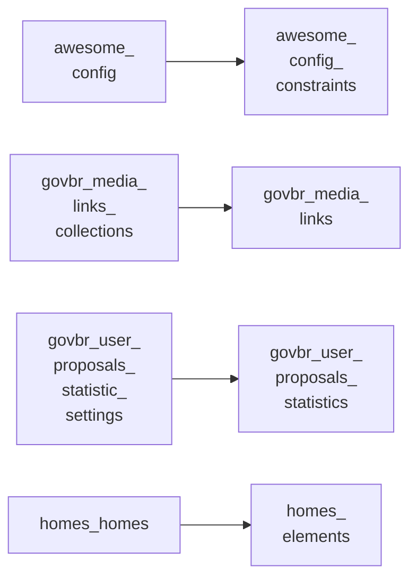

<!-- Gerado por scripts/banco_de_dados.py em 2026-10-07T13:48:25+00:00. Não edite à mão. -->

# Extensões do Brasil Participativo

Tabelas criadas pelo Brasil Participativo e pelas gems instaladas no core (decidim-homes, decidim-ej, decidim_awesome).

**13 tabelas.** Schema versão `20260405195511`. Legenda da coluna **Referência**: *FK* = chave estrangeira declarada no banco; *→* = referência por convenção de nome (sem restrição no banco).

## Relacionamentos

Cada seta vai da tabela referenciada para a tabela que guarda a referência. Referências para outros domínios aparecem na coluna **Referência** das tabelas abaixo.

## Tabelas

| Tabela | Descrição | Colunas | Origem |
|---|---|---:|---|
| [`decidim_awesome_config`](#decidim-awesome-config) | — | 6 | `decidim_awesome` |
| [`decidim_awesome_config_constraints`](#decidim-awesome-config-constraints) | — | 5 | `decidim_awesome` |
| [`decidim_awesome_editor_images`](#decidim-awesome-editor-images) | — | 7 | `decidim_awesome` |
| [`decidim_awesome_proposal_extra_fields`](#decidim-awesome-proposal-extra-fields) | — | 6 | `decidim_awesome` |
| [`decidim_awesome_vote_weights`](#decidim-awesome-vote-weights) | — | 5 | `decidim_awesome` |
| [`decidim_ej_ej_clients`](#decidim-ej-ej-clients) | Configuração de cliente do Empurrando Juntas (gem decidim-ej). | 6 | `decidim-ej` (LabLivre) |
| [`decidim_govbr_media_links`](#decidim-govbr-media-links) | Links de mídia de processos e instâncias (Brasil Participativo). | 10 | :flag_br: Brasil Participativo |
| [`decidim_govbr_media_links_collections`](#decidim-govbr-media-links-collections) | Coleções de links de mídia (Brasil Participativo). | 7 | :flag_br: Brasil Participativo |
| [`decidim_govbr_partners`](#decidim-govbr-partners) | Parceiros exibidos em processos e instâncias (Brasil Participativo). | 10 | :flag_br: Brasil Participativo |
| [`decidim_govbr_user_proposals_statistic_settings`](#decidim-govbr-user-proposals-statistic-settings) | Configuração dos relatórios de estatísticas por processo (Brasil Participativo). | 15 | :flag_br: Brasil Participativo |
| [`decidim_govbr_user_proposals_statistics`](#decidim-govbr-user-proposals-statistics) | Estatísticas de propostas por usuário, geradas diariamente (Brasil Participativo). | 15 | :flag_br: Brasil Participativo |
| [`decidim_homes_elements`](#decidim-homes-elements) | Blocos da Página Inicial (`element_type`, `properties`) (gem decidim-homes). | 4 | :flag_br: Brasil Participativo |
| [`decidim_homes_homes`](#decidim-homes-homes) | Página Inicial de um componente `homes` (gem decidim-homes). | 9 | `decidim-homes` (LabLivre) |

### `decidim_awesome_config` { #decidim-awesome-config }

Origem: `decidim_awesome`.

| Coluna | Tipo | Nulo | Padrão | Referência / observação | Origem |
|---|---|:---:|---|---|---|
| `id` | `bigint` | não |  | chave primária |  |
| `var` | `string` | sim |  |  |  |
| `value` | `jsonb` | sim |  |  |  |
| `decidim_organization_id` | `integer` | sim |  | → [`decidim_organizations`](organizacao-usuarios.md#decidim-organizations) |  |
| `created_at` | `datetime` | não |  |  |  |
| `updated_at` | `datetime` | não |  |  |  |

??? note "Índices (2)"

    | Nome | Colunas | Único | Tipo |
    |---|---|:---:|---|
    | `index_decidim_awesome_on_decidim_organization_id` | `decidim_organization_id` |  | btree |
    | `index_decidim_awesome_organization_var` | `var`, `decidim_organization_id` | sim | btree |

### `decidim_awesome_config_constraints` { #decidim-awesome-config-constraints }

Origem: `decidim_awesome`.

| Coluna | Tipo | Nulo | Padrão | Referência / observação | Origem |
|---|---|:---:|---|---|---|
| `id` | `bigint` | não |  | chave primária |  |
| `settings` | `jsonb` | sim |  |  |  |
| `decidim_awesome_config_id` | `bigint` | não |  | FK → [`decidim_awesome_config`](extensoes.md#decidim-awesome-config) |  |
| `created_at` | `datetime` | não |  |  |  |
| `updated_at` | `datetime` | não |  |  |  |

??? note "Índices (2)"

    | Nome | Colunas | Único | Tipo |
    |---|---|:---:|---|
    | `decidim_awesome_config_constraints_config` | `decidim_awesome_config_id` |  | btree |
    | `index_decidim_awesome_settings_awesome_config` | `settings`, `decidim_awesome_config_id` | sim | btree |

### `decidim_awesome_editor_images` { #decidim-awesome-editor-images }

Origem: `decidim_awesome`.

| Coluna | Tipo | Nulo | Padrão | Referência / observação | Origem |
|---|---|:---:|---|---|---|
| `id` | `bigint` | não |  | chave primária |  |
| `image` | `string` | sim |  |  |  |
| `path` | `string` | sim |  |  |  |
| `decidim_author_id` | `bigint` | não |  | FK → [`decidim_users`](organizacao-usuarios.md#decidim-users) |  |
| `decidim_organization_id` | `bigint` | não |  | FK → [`decidim_organizations`](organizacao-usuarios.md#decidim-organizations) |  |
| `created_at` | `datetime` | não |  |  |  |
| `updated_at` | `datetime` | não |  |  |  |

??? note "Índices (2)"

    | Nome | Colunas | Único | Tipo |
    |---|---|:---:|---|
    | `decidim_awesome_editor_images_author` | `decidim_author_id` |  | btree |
    | `decidim_awesome_editor_images_constraint_organization` | `decidim_organization_id` |  | btree |

### `decidim_awesome_proposal_extra_fields` { #decidim-awesome-proposal-extra-fields }

Origem: `decidim_awesome`.

| Coluna | Tipo | Nulo | Padrão | Referência / observação | Origem |
|---|---|:---:|---|---|---|
| `id` | `bigint` | não |  | chave primária |  |
| `decidim_proposal_id` | `bigint` | não |  | → [`decidim_proposals_proposals`](propostas.md#decidim-proposals-proposals) |  |
| `vote_weight_totals` | `jsonb` | sim |  |  |  |
| `weight_total` | `integer` | sim | `0` |  |  |
| `created_at` | `datetime` | não |  |  |  |
| `updated_at` | `datetime` | não |  |  |  |

??? note "Índices (1)"

    | Nome | Colunas | Único | Tipo |
    |---|---|:---:|---|
    | `decidim_awesome_extra_fields_on_proposal` | `decidim_proposal_id` |  | btree |

### `decidim_awesome_vote_weights` { #decidim-awesome-vote-weights }

Origem: `decidim_awesome`.

| Coluna | Tipo | Nulo | Padrão | Referência / observação | Origem |
|---|---|:---:|---|---|---|
| `id` | `bigint` | não |  | chave primária |  |
| `proposal_vote_id` | `bigint` | não |  | → [`decidim_proposals_proposal_votes`](propostas.md#decidim-proposals-proposal-votes) |  |
| `weight` | `integer` | não | `1` |  |  |
| `created_at` | `datetime` | não |  |  |  |
| `updated_at` | `datetime` | não |  |  |  |

??? note "Índices (1)"

    | Nome | Colunas | Único | Tipo |
    |---|---|:---:|---|
    | `decidim_awesome_proposals_weights_vote` | `proposal_vote_id` |  | btree |

### `decidim_ej_ej_clients` { #decidim-ej-ej-clients }

Configuração de cliente do Empurrando Juntas (gem decidim-ej).

Origem: `decidim-ej` (LabLivre).

| Coluna | Tipo | Nulo | Padrão | Referência / observação | Origem |
|---|---|:---:|---|---|---|
| `id` | `bigint` | não |  | chave primária |  |
| `host` | `string` | sim |  |  |  |
| `conversation_id` | `integer` | sim |  | → [`decidim_messaging_conversations`](interacao.md#decidim-messaging-conversations) |  |
| `created_at` | `datetime` | não |  |  |  |
| `updated_at` | `datetime` | não |  |  |  |
| `decidim_component_id` | `integer` | sim |  | → [`decidim_components`](componentes-conteudo.md#decidim-components) |  |

### `decidim_govbr_media_links` { #decidim-govbr-media-links }

Links de mídia de processos e instâncias (Brasil Participativo).

Origem: :flag_br: Brasil Participativo.

| Coluna | Tipo | Nulo | Padrão | Referência / observação | Origem |
|---|---|:---:|---|---|---|
| `id` | `bigint` | não |  | chave primária | [:flag_br: BP](https://gitlab.com/lappis-unb/decidimbr/decidim-govbr/-/blob/main/db/migrate/20240211190548_create_media_link.rb "20240211190548_create_media_link.rb") |
| `participatory_space_type` | `string` | sim |  |  | [:flag_br: BP](https://gitlab.com/lappis-unb/decidimbr/decidim-govbr/-/blob/main/db/migrate/20240211190548_create_media_link.rb "20240211190548_create_media_link.rb") |
| `participatory_space_id` | `bigint` | sim |  | polimórfico (tipo em `participatory_space_type`) | [:flag_br: BP](https://gitlab.com/lappis-unb/decidimbr/decidim-govbr/-/blob/main/db/migrate/20240211190548_create_media_link.rb "20240211190548_create_media_link.rb") |
| `title` | `jsonb` | não |  | traduzível (`{"pt-BR": …}`) | [:flag_br: BP](https://gitlab.com/lappis-unb/decidimbr/decidim-govbr/-/blob/main/db/migrate/20240211190548_create_media_link.rb "20240211190548_create_media_link.rb") |
| `link` | `string` | não |  |  | [:flag_br: BP](https://gitlab.com/lappis-unb/decidimbr/decidim-govbr/-/blob/main/db/migrate/20240211190548_create_media_link.rb "20240211190548_create_media_link.rb") |
| `date` | `date` | sim |  |  | [:flag_br: BP](https://gitlab.com/lappis-unb/decidimbr/decidim-govbr/-/blob/main/db/migrate/20240211190548_create_media_link.rb "20240211190548_create_media_link.rb") |
| `weight` | `integer` | não | `0` |  | [:flag_br: BP](https://gitlab.com/lappis-unb/decidimbr/decidim-govbr/-/blob/main/db/migrate/20240211190548_create_media_link.rb "20240211190548_create_media_link.rb") |
| `created_at` | `datetime` | não |  |  | [:flag_br: BP](https://gitlab.com/lappis-unb/decidimbr/decidim-govbr/-/blob/main/db/migrate/20240211190548_create_media_link.rb "20240211190548_create_media_link.rb") |
| `updated_at` | `datetime` | não |  |  | [:flag_br: BP](https://gitlab.com/lappis-unb/decidimbr/decidim-govbr/-/blob/main/db/migrate/20240211190548_create_media_link.rb "20240211190548_create_media_link.rb") |
| `media_links_collection_id` | `bigint` | sim |  | FK → [`decidim_govbr_media_links_collections`](extensoes.md#decidim-govbr-media-links-collections) | [:flag_br: BP](https://gitlab.com/lappis-unb/decidimbr/decidim-govbr/-/blob/main/db/migrate/20250605143037_create_media_links_collections.rb "20250605143037_create_media_links_collections.rb") |

??? note "Índices (2)"

    | Nome | Colunas | Único | Tipo |
    |---|---|:---:|---|
    | `index_media_links_on_collection_id` | `media_links_collection_id` |  | btree |
    | `decidim_govbr_media_links_ps_index` | `participatory_space_type`, `participatory_space_id` |  | btree |

### `decidim_govbr_media_links_collections` { #decidim-govbr-media-links-collections }

Coleções de links de mídia (Brasil Participativo).

Origem: :flag_br: Brasil Participativo.

| Coluna | Tipo | Nulo | Padrão | Referência / observação | Origem |
|---|---|:---:|---|---|---|
| `id` | `bigint` | não |  | chave primária | [:flag_br: BP](https://gitlab.com/lappis-unb/decidimbr/decidim-govbr/-/blob/main/db/migrate/20250605143037_create_media_links_collections.rb "20250605143037_create_media_links_collections.rb") |
| `participatory_space_type` | `string` | não |  |  | [:flag_br: BP](https://gitlab.com/lappis-unb/decidimbr/decidim-govbr/-/blob/main/db/migrate/20250605143037_create_media_links_collections.rb "20250605143037_create_media_links_collections.rb") |
| `participatory_space_id` | `bigint` | não |  | polimórfico (tipo em `participatory_space_type`) | [:flag_br: BP](https://gitlab.com/lappis-unb/decidimbr/decidim-govbr/-/blob/main/db/migrate/20250605143037_create_media_links_collections.rb "20250605143037_create_media_links_collections.rb") |
| `title` | `jsonb` | não |  | traduzível (`{"pt-BR": …}`) | [:flag_br: BP](https://gitlab.com/lappis-unb/decidimbr/decidim-govbr/-/blob/main/db/migrate/20250605143037_create_media_links_collections.rb "20250605143037_create_media_links_collections.rb") |
| `weight` | `integer` | não | `0` |  | [:flag_br: BP](https://gitlab.com/lappis-unb/decidimbr/decidim-govbr/-/blob/main/db/migrate/20250605143037_create_media_links_collections.rb "20250605143037_create_media_links_collections.rb") |
| `created_at` | `datetime` | não |  |  | [:flag_br: BP](https://gitlab.com/lappis-unb/decidimbr/decidim-govbr/-/blob/main/db/migrate/20250605143037_create_media_links_collections.rb "20250605143037_create_media_links_collections.rb") |
| `updated_at` | `datetime` | não |  |  | [:flag_br: BP](https://gitlab.com/lappis-unb/decidimbr/decidim-govbr/-/blob/main/db/migrate/20250605143037_create_media_links_collections.rb "20250605143037_create_media_links_collections.rb") |

??? note "Índices (1)"

    | Nome | Colunas | Único | Tipo |
    |---|---|:---:|---|
    | `decidim_govbr_media_links_collections_ps_index` | `participatory_space_type`, `participatory_space_id` |  | btree |

### `decidim_govbr_partners` { #decidim-govbr-partners }

Parceiros exibidos em processos e instâncias (Brasil Participativo).

Origem: :flag_br: Brasil Participativo.

| Coluna | Tipo | Nulo | Padrão | Referência / observação | Origem |
|---|---|:---:|---|---|---|
| `id` | `bigint` | não |  | chave primária | [:flag_br: BP](https://gitlab.com/lappis-unb/decidimbr/decidim-govbr/-/blob/main/db/migrate/20240128140241_create_partner.rb "20240128140241_create_partner.rb") |
| `partnerable_type` | `string` | sim |  |  | [:flag_br: BP](https://gitlab.com/lappis-unb/decidimbr/decidim-govbr/-/blob/main/db/migrate/20240128140241_create_partner.rb "20240128140241_create_partner.rb") |
| `partnerable_id` | `bigint` | sim |  | polimórfico (tipo em `partnerable_type`) | [:flag_br: BP](https://gitlab.com/lappis-unb/decidimbr/decidim-govbr/-/blob/main/db/migrate/20240128140241_create_partner.rb "20240128140241_create_partner.rb") |
| `name` | `string` | não |  |  | [:flag_br: BP](https://gitlab.com/lappis-unb/decidimbr/decidim-govbr/-/blob/main/db/migrate/20240128140241_create_partner.rb "20240128140241_create_partner.rb") |
| `partner_type` | `string` | não |  |  | [:flag_br: BP](https://gitlab.com/lappis-unb/decidimbr/decidim-govbr/-/blob/main/db/migrate/20240128140241_create_partner.rb "20240128140241_create_partner.rb") |
| `weight` | `integer` | não | `0` |  | [:flag_br: BP](https://gitlab.com/lappis-unb/decidimbr/decidim-govbr/-/blob/main/db/migrate/20240128140241_create_partner.rb "20240128140241_create_partner.rb") |
| `link` | `string` | sim |  |  | [:flag_br: BP](https://gitlab.com/lappis-unb/decidimbr/decidim-govbr/-/blob/main/db/migrate/20240128140241_create_partner.rb "20240128140241_create_partner.rb") |
| `logo` | `string` | sim |  |  | [:flag_br: BP](https://gitlab.com/lappis-unb/decidimbr/decidim-govbr/-/blob/main/db/migrate/20240128140241_create_partner.rb "20240128140241_create_partner.rb") |
| `created_at` | `datetime` | não |  |  | [:flag_br: BP](https://gitlab.com/lappis-unb/decidimbr/decidim-govbr/-/blob/main/db/migrate/20240128140241_create_partner.rb "20240128140241_create_partner.rb") |
| `updated_at` | `datetime` | não |  |  | [:flag_br: BP](https://gitlab.com/lappis-unb/decidimbr/decidim-govbr/-/blob/main/db/migrate/20240128140241_create_partner.rb "20240128140241_create_partner.rb") |

??? note "Índices (1)"

    | Nome | Colunas | Único | Tipo |
    |---|---|:---:|---|
    | `partner_partnerable_index` | `partnerable_type`, `partnerable_id` |  | btree |

### `decidim_govbr_user_proposals_statistic_settings` { #decidim-govbr-user-proposals-statistic-settings }

Configuração dos relatórios de estatísticas por processo (Brasil Participativo).

Origem: :flag_br: Brasil Participativo.

| Coluna | Tipo | Nulo | Padrão | Referência / observação | Origem |
|---|---|:---:|---|---|---|
| `id` | `bigint` | não |  | chave primária | [:flag_br: BP](https://gitlab.com/lappis-unb/decidimbr/decidim-govbr/-/blob/main/db/migrate/20230820014517_create_decidim_govbr_user_proposals_statistic_settings.rb "20230820014517_create_decidim_govbr_user_proposals_statistic_settings.rb") |
| `name` | `string` | não | `""` |  | [:flag_br: BP](https://gitlab.com/lappis-unb/decidimbr/decidim-govbr/-/blob/main/db/migrate/20230820014517_create_decidim_govbr_user_proposals_statistic_settings.rb "20230820014517_create_decidim_govbr_user_proposals_statistic_settings.rb") |
| `decidim_participatory_space_type` | `string` | não |  |  | [:flag_br: BP](https://gitlab.com/lappis-unb/decidimbr/decidim-govbr/-/blob/main/db/migrate/20230820014517_create_decidim_govbr_user_proposals_statistic_settings.rb "20230820014517_create_decidim_govbr_user_proposals_statistic_settings.rb") |
| `decidim_participatory_space_id` | `integer` | não |  | polimórfico (tipo em `decidim_participatory_space_type`) | [:flag_br: BP](https://gitlab.com/lappis-unb/decidimbr/decidim-govbr/-/blob/main/db/migrate/20230820014517_create_decidim_govbr_user_proposals_statistic_settings.rb "20230820014517_create_decidim_govbr_user_proposals_statistic_settings.rb") |
| `proposals_done_weight` | `float` | sim | `1.0` |  | [:flag_br: BP](https://gitlab.com/lappis-unb/decidimbr/decidim-govbr/-/blob/main/db/migrate/20230820014517_create_decidim_govbr_user_proposals_statistic_settings.rb "20230820014517_create_decidim_govbr_user_proposals_statistic_settings.rb") |
| `comments_done_weight` | `float` | sim | `1.0` |  | [:flag_br: BP](https://gitlab.com/lappis-unb/decidimbr/decidim-govbr/-/blob/main/db/migrate/20230820014517_create_decidim_govbr_user_proposals_statistic_settings.rb "20230820014517_create_decidim_govbr_user_proposals_statistic_settings.rb") |
| `votes_done_weight` | `float` | sim | `1.0` |  | [:flag_br: BP](https://gitlab.com/lappis-unb/decidimbr/decidim-govbr/-/blob/main/db/migrate/20230820014517_create_decidim_govbr_user_proposals_statistic_settings.rb "20230820014517_create_decidim_govbr_user_proposals_statistic_settings.rb") |
| `follows_done_weight` | `float` | sim | `1.0` |  | [:flag_br: BP](https://gitlab.com/lappis-unb/decidimbr/decidim-govbr/-/blob/main/db/migrate/20230820014517_create_decidim_govbr_user_proposals_statistic_settings.rb "20230820014517_create_decidim_govbr_user_proposals_statistic_settings.rb") |
| `votes_received_weight` | `float` | sim | `1.0` |  | [:flag_br: BP](https://gitlab.com/lappis-unb/decidimbr/decidim-govbr/-/blob/main/db/migrate/20230820014517_create_decidim_govbr_user_proposals_statistic_settings.rb "20230820014517_create_decidim_govbr_user_proposals_statistic_settings.rb") |
| `comments_received_weight` | `float` | sim | `1.0` |  | [:flag_br: BP](https://gitlab.com/lappis-unb/decidimbr/decidim-govbr/-/blob/main/db/migrate/20230820014517_create_decidim_govbr_user_proposals_statistic_settings.rb "20230820014517_create_decidim_govbr_user_proposals_statistic_settings.rb") |
| `follows_received_weight` | `float` | sim | `1.0` |  | [:flag_br: BP](https://gitlab.com/lappis-unb/decidimbr/decidim-govbr/-/blob/main/db/migrate/20230820014517_create_decidim_govbr_user_proposals_statistic_settings.rb "20230820014517_create_decidim_govbr_user_proposals_statistic_settings.rb") |
| `users_to_be_exported` | `integer` | não | `200` |  | [:flag_br: BP](https://gitlab.com/lappis-unb/decidimbr/decidim-govbr/-/blob/main/db/migrate/20230820014517_create_decidim_govbr_user_proposals_statistic_settings.rb "20230820014517_create_decidim_govbr_user_proposals_statistic_settings.rb") |
| `created_at` | `datetime` | não |  |  | [:flag_br: BP](https://gitlab.com/lappis-unb/decidimbr/decidim-govbr/-/blob/main/db/migrate/20230820014517_create_decidim_govbr_user_proposals_statistic_settings.rb "20230820014517_create_decidim_govbr_user_proposals_statistic_settings.rb") |
| `updated_at` | `datetime` | não |  |  | [:flag_br: BP](https://gitlab.com/lappis-unb/decidimbr/decidim-govbr/-/blob/main/db/migrate/20230820014517_create_decidim_govbr_user_proposals_statistic_settings.rb "20230820014517_create_decidim_govbr_user_proposals_statistic_settings.rb") |
| `statistics_data_updated_at` | `datetime` | sim |  |  | [:flag_br: BP](https://gitlab.com/lappis-unb/decidimbr/decidim-govbr/-/blob/main/db/migrate/20240218030602_add_statistics_data_updated_at_to_user_proposals_statistic_setting.rb "20240218030602_add_statistics_data_updated_at_to_user_proposals_statistic_setting.rb") |

??? note "Índices (1)"

    | Nome | Colunas | Único | Tipo |
    |---|---|:---:|---|
    | `user_proposals_statistic_settings_participatory_space_idx` | `decidim_participatory_space_type`, `decidim_participatory_space_id` |  | btree |

### `decidim_govbr_user_proposals_statistics` { #decidim-govbr-user-proposals-statistics }

Estatísticas de propostas por usuário, geradas diariamente (Brasil Participativo).

Origem: :flag_br: Brasil Participativo.

| Coluna | Tipo | Nulo | Padrão | Referência / observação | Origem |
|---|---|:---:|---|---|---|
| `id` | `bigint` | não |  | chave primária | [:flag_br: BP](https://gitlab.com/lappis-unb/decidimbr/decidim-govbr/-/blob/main/db/migrate/20230820015020_create_decidim_govbr_user_proposals_statistics.rb "20230820015020_create_decidim_govbr_user_proposals_statistics.rb") |
| `decidim_user_id` | `bigint` | não |  | → [`decidim_users`](organizacao-usuarios.md#decidim-users) | [:flag_br: BP](https://gitlab.com/lappis-unb/decidimbr/decidim-govbr/-/blob/main/db/migrate/20230820015020_create_decidim_govbr_user_proposals_statistics.rb "20230820015020_create_decidim_govbr_user_proposals_statistics.rb") |
| `decidim_user_identification_number` | `string` | não | `""` |  | [:flag_br: BP](https://gitlab.com/lappis-unb/decidimbr/decidim-govbr/-/blob/main/db/migrate/20230820015020_create_decidim_govbr_user_proposals_statistics.rb "20230820015020_create_decidim_govbr_user_proposals_statistics.rb") |
| `decidim_user_name` | `string` | sim |  |  | [:flag_br: BP](https://gitlab.com/lappis-unb/decidimbr/decidim-govbr/-/blob/main/db/migrate/20230820015020_create_decidim_govbr_user_proposals_statistics.rb "20230820015020_create_decidim_govbr_user_proposals_statistics.rb") |
| `proposals_done` | `integer` | sim | `0` |  | [:flag_br: BP](https://gitlab.com/lappis-unb/decidimbr/decidim-govbr/-/blob/main/db/migrate/20230820015020_create_decidim_govbr_user_proposals_statistics.rb "20230820015020_create_decidim_govbr_user_proposals_statistics.rb") |
| `comments_done` | `integer` | sim | `0` |  | [:flag_br: BP](https://gitlab.com/lappis-unb/decidimbr/decidim-govbr/-/blob/main/db/migrate/20230820015020_create_decidim_govbr_user_proposals_statistics.rb "20230820015020_create_decidim_govbr_user_proposals_statistics.rb") |
| `votes_done` | `integer` | sim | `0` |  | [:flag_br: BP](https://gitlab.com/lappis-unb/decidimbr/decidim-govbr/-/blob/main/db/migrate/20230820015020_create_decidim_govbr_user_proposals_statistics.rb "20230820015020_create_decidim_govbr_user_proposals_statistics.rb") |
| `follows_done` | `integer` | sim | `0` |  | [:flag_br: BP](https://gitlab.com/lappis-unb/decidimbr/decidim-govbr/-/blob/main/db/migrate/20230820015020_create_decidim_govbr_user_proposals_statistics.rb "20230820015020_create_decidim_govbr_user_proposals_statistics.rb") |
| `votes_received` | `integer` | sim | `0` |  | [:flag_br: BP](https://gitlab.com/lappis-unb/decidimbr/decidim-govbr/-/blob/main/db/migrate/20230820015020_create_decidim_govbr_user_proposals_statistics.rb "20230820015020_create_decidim_govbr_user_proposals_statistics.rb") |
| `comments_received` | `integer` | sim | `0` |  | [:flag_br: BP](https://gitlab.com/lappis-unb/decidimbr/decidim-govbr/-/blob/main/db/migrate/20230820015020_create_decidim_govbr_user_proposals_statistics.rb "20230820015020_create_decidim_govbr_user_proposals_statistics.rb") |
| `follows_received` | `integer` | sim | `0` |  | [:flag_br: BP](https://gitlab.com/lappis-unb/decidimbr/decidim-govbr/-/blob/main/db/migrate/20230820015020_create_decidim_govbr_user_proposals_statistics.rb "20230820015020_create_decidim_govbr_user_proposals_statistics.rb") |
| `score` | `float` | sim | `0.0` |  | [:flag_br: BP](https://gitlab.com/lappis-unb/decidimbr/decidim-govbr/-/blob/main/db/migrate/20230820015020_create_decidim_govbr_user_proposals_statistics.rb "20230820015020_create_decidim_govbr_user_proposals_statistics.rb") |
| `created_at` | `datetime` | não |  |  | [:flag_br: BP](https://gitlab.com/lappis-unb/decidimbr/decidim-govbr/-/blob/main/db/migrate/20230820015020_create_decidim_govbr_user_proposals_statistics.rb "20230820015020_create_decidim_govbr_user_proposals_statistics.rb") |
| `updated_at` | `datetime` | não |  |  | [:flag_br: BP](https://gitlab.com/lappis-unb/decidimbr/decidim-govbr/-/blob/main/db/migrate/20230820015020_create_decidim_govbr_user_proposals_statistics.rb "20230820015020_create_decidim_govbr_user_proposals_statistics.rb") |
| `user_proposals_statistic_setting_id` | `bigint` | sim |  | → [`decidim_govbr_user_proposals_statistic_settings`](extensoes.md#decidim-govbr-user-proposals-statistic-settings) | [:flag_br: BP](https://gitlab.com/lappis-unb/decidimbr/decidim-govbr/-/blob/main/db/migrate/20230820015020_create_decidim_govbr_user_proposals_statistics.rb "20230820015020_create_decidim_govbr_user_proposals_statistics.rb") |

??? note "Índices (2)"

    | Nome | Colunas | Único | Tipo |
    |---|---|:---:|---|
    | `decidim_govbr_user_proposals_statistic_user_idx` | `decidim_user_id` |  | btree |
    | `user_proposals_statistics_on_settings_idx` | `user_proposals_statistic_setting_id` |  | btree |

### `decidim_homes_elements` { #decidim-homes-elements }

Blocos da Página Inicial (`element_type`, `properties`) (gem decidim-homes).

Origem: :flag_br: Brasil Participativo.

| Coluna | Tipo | Nulo | Padrão | Referência / observação | Origem |
|---|---|:---:|---|---|---|
| `id` | `bigint` | não |  | chave primária | [:flag_br: BP](https://gitlab.com/lappis-unb/decidimbr/decidim-govbr/-/blob/main/db/migrate/20240724173947_add_new_decidim_homes_elements.rb "20240724173947_add_new_decidim_homes_elements.rb") |
| `decidim_homes_home_id` | `bigint` | não |  | FK → [`decidim_homes_homes`](extensoes.md#decidim-homes-homes) | [:flag_br: BP](https://gitlab.com/lappis-unb/decidimbr/decidim-govbr/-/blob/main/db/migrate/20240724173947_add_new_decidim_homes_elements.rb "20240724173947_add_new_decidim_homes_elements.rb") |
| `element_type` | `string` | não |  |  | [:flag_br: BP](https://gitlab.com/lappis-unb/decidimbr/decidim-govbr/-/blob/main/db/migrate/20240724173947_add_new_decidim_homes_elements.rb "20240724173947_add_new_decidim_homes_elements.rb") |
| `properties` | `jsonb` | não | `{}` |  | [:flag_br: BP](https://gitlab.com/lappis-unb/decidimbr/decidim-govbr/-/blob/main/db/migrate/20240724173947_add_new_decidim_homes_elements.rb "20240724173947_add_new_decidim_homes_elements.rb") |

??? note "Índices (1)"

    | Nome | Colunas | Único | Tipo |
    |---|---|:---:|---|
    | `index_decidim_homes_elements_on_decidim_homes_home_id` | `decidim_homes_home_id` |  | btree |

### `decidim_homes_homes` { #decidim-homes-homes }

Página Inicial de um componente `homes` (gem decidim-homes).

Origem: `decidim-homes` (LabLivre).

| Coluna | Tipo | Nulo | Padrão | Referência / observação | Origem |
|---|---|:---:|---|---|---|
| `id` | `serial` | não |  | chave primária |  |
| `title` | `jsonb` | sim |  | traduzível (`{"pt-BR": …}`) |  |
| `decidim_component_id` | `integer` | sim |  | → [`decidim_components`](componentes-conteudo.md#decidim-components) |  |
| `organizers` | `jsonb` | sim | `[]` |  |  |
| `supporters` | `jsonb` | sim | `[]` |  |  |
| `created_at` | `datetime` | não |  |  |  |
| `updated_at` | `datetime` | não |  |  |  |
| `meetings_map` | `boolean` | sim | `false` |  |  |
| `element_orders` | `jsonb` | sim | `[]` |  | [:flag_br: BP](https://gitlab.com/lappis-unb/decidimbr/decidim-govbr/-/blob/main/db/migrate/20240806135019_add_element_orders_to_decidim_homes_homes.rb "20240806135019_add_element_orders_to_decidim_homes_homes.rb") |

??? note "Índices (1)"

    | Nome | Colunas | Único | Tipo |
    |---|---|:---:|---|
    | `index_decidim_homes_homes_on_decidim_component_id` | `decidim_component_id` |  | btree |

