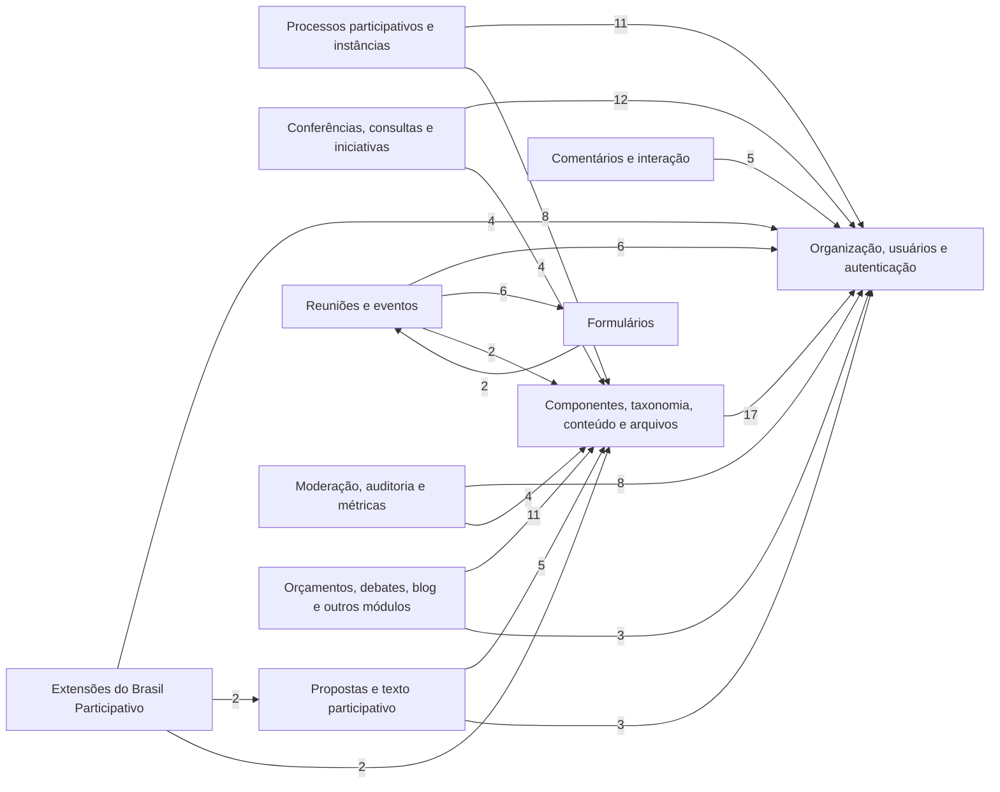

<!-- Gerado por scripts/banco_de_dados.py em 2026-10-07T12:08:06+00:00. Não edite à mão. -->

# Banco de Dados

Dicionário de dados do PostgreSQL do Brasil Participativo, gerado a partir do `db/schema.rb` e das migrações da branch `main` do [decidim-govbr](https://gitlab.com/lappis-unb/decidimbr/decidim-govbr).

!!! info "Versão do schema: `20260405195511`"
    Gerado em 07/10/2026. Para atualizar, rode `python3 scripts/banco_de_dados.py`.

## Em números

| Item | Quantidade |
|---|---:|
| Tabelas | 147 |
| Colunas | 1542 |
| Índices | 385 |
| Chaves estrangeiras declaradas | 62 |
| Referências por convenção (sem FK) | 152 |
| Associações polimórficas | 52 |
| Migrações | 745 (71 do Brasil Participativo) |
| Extensões do PostgreSQL | `ltree`, `pg_trgm`, `plpgsql` |

## Domínios

-   :material-account-key:{ .lg .middle } **[Organização, usuários e autenticação](organizacao-usuarios.md)**

    ---

    Organizações (tenants), usuários, administradores de sistema, identidades de login (gov.br), autorizações e tokens de API.

    13 tabelas

-   :material-sitemap:{ .lg .middle } **[Processos participativos e instâncias](processos-instancias.md)**

    ---

    Espaços participativos usados em produção: processos (consultas, conferências, planos, audiências) e assembleias, chamadas de instâncias (conselhos, colegiados, fóruns).

    13 tabelas

-   :material-account-group:{ .lg .middle } **[Conferências, consultas e iniciativas](outros-espacos.md)**

    ---

    Espaços participativos do Decidim instalados no core. Em produção, as modalidades Conferências e Consultas Públicas usam processos participativos, não estas tabelas.

    21 tabelas

-   :material-puzzle:{ .lg .middle } **[Componentes, taxonomia, conteúdo e arquivos](componentes-conteudo.md)**

    ---

    Componentes de cada espaço, escopos, áreas, categorias, anexos, blocos de conteúdo, páginas estáticas, newsletters e arquivos do ActiveStorage.

    25 tabelas

-   :material-lightbulb-on:{ .lg .middle } **[Propostas e texto participativo](propostas.md)**

    ---

    Propostas, votos, emendas, coautorias, rascunhos colaborativos, avaliação e textos participativos.

    9 tabelas

-   :material-calendar:{ .lg .middle } **[Reuniões e eventos](reunioes.md)**

    ---

    Reuniões, inscrições, convites, pautas, enquetes ao vivo e eventos externos de calendário.

    13 tabelas

-   :material-form-select:{ .lg .middle } **[Formulários](formularios.md)**

    ---

    Questionários, perguntas, condições de exibição e respostas dos componentes de formulário.

    8 tabelas

-   :material-comment-multiple:{ .lg .middle } **[Comentários e interação](interacao.md)**

    ---

    Comentários, apoios, seguidores, notificações, mensagens privadas, lembretes e conquistas.

    13 tabelas

-   :material-shield-search:{ .lg .middle } **[Moderação, auditoria e métricas](moderacao-auditoria.md)**

    ---

    Denúncias, moderações, bloqueios de usuários, log de ações administrativas, versões (PaperTrail) e métricas agregadas.

    8 tabelas

-   :material-view-grid-plus:{ .lg .middle } **[Orçamentos, debates, blog e outros módulos](outros-modulos.md)**

    ---

    Demais módulos nativos do Decidim: orçamentos, accountability, debates, blog, páginas e sorteios.

    11 tabelas

-   :material-flag:{ .lg .middle } **[Extensões do Brasil Participativo](extensoes.md)**

    ---

    Tabelas criadas pelo Brasil Participativo e pelas gems instaladas no core (decidim-homes, decidim-ej, decidim_awesome).

    13 tabelas

## Mapa entre domínios

Cada seta indica que tabelas de um domínio referenciam tabelas de outro. O número é a quantidade de colunas de referência.

Referências isoladas (uma só coluna) foram omitidas do mapa.

## Convenções do Decidim

| Convenção | Exemplo | Significado |
|---|---|---|
| Prefixo por módulo | `decidim_proposals_proposals` | `decidim_<módulo>_<entidade>`. Tabelas do núcleo usam só `decidim_<entidade>` |
| Organização em tudo | `decidim_organization_id` | Isolamento entre organizações (multi-tenant) |
| Textos traduzíveis em JSONB | `title = {"pt-BR": "…", "en": "…"}` | Campos de texto exibidos ficam em `jsonb`, um valor por idioma. Consulta: `title->>'pt-BR'` |
| Polimorfismo | `participatory_space_type` + `participatory_space_id` | A linha aponta para tabelas diferentes conforme o tipo (nome da classe Ruby) |
| Referência sem FK | `decidim_component_id` | A maioria das relações não tem restrição no banco; a integridade é garantida pela aplicação |
| Contadores em cache | `comments_count`, `proposal_votes_count` | Atualizados pela aplicação para evitar `COUNT(*)` |
| Publicação | `published_at` | Nulo = rascunho / não publicado |
| Ocultação por moderação | `decidim_moderations.hidden_at` | Recurso oculto continua no banco |
| Configurações em JSONB | `decidim_components.settings` | Configurações globais e por etapa do componente |

## Tipos de coluna

| Tipo | Colunas |
|---|---:|
| `datetime` | 313 |
| `string` | 286 |
| `bigint` | 274 |
| `integer` | 255 |
| `jsonb` | 206 |
| `boolean` | 86 |
| `serial` | 42 |
| `text` | 30 |
| `date` | 28 |
| `float` | 17 |
| `decimal` | 3 |
| `ltree` | 1 |
| `time` | 1 |

## O que o Brasil Participativo acrescentou

### Tabelas criadas

| Tabela | Domínio |
|---|---|
| [`decidim_govbr_media_links`](extensoes.md#decidim-govbr-media-links) | Extensões do Brasil Participativo |
| [`decidim_govbr_media_links_collections`](extensoes.md#decidim-govbr-media-links-collections) | Extensões do Brasil Participativo |
| [`decidim_govbr_partners`](extensoes.md#decidim-govbr-partners) | Extensões do Brasil Participativo |
| [`decidim_govbr_user_proposals_statistic_settings`](extensoes.md#decidim-govbr-user-proposals-statistic-settings) | Extensões do Brasil Participativo |
| [`decidim_govbr_user_proposals_statistics`](extensoes.md#decidim-govbr-user-proposals-statistics) | Extensões do Brasil Participativo |
| [`decidim_homes_elements`](extensoes.md#decidim-homes-elements) | Extensões do Brasil Participativo |

### Colunas adicionadas a tabelas do Decidim (56)

| Tabela | Coluna | Tipo | Migração |
|---|---|---|---|
| [`decidim_assemblies`](processos-instancias.md#decidim-assemblies) | `initial_page_component_id` | `bigint` | [`20240213153148_add_custom_initial_page_to_assemblies.rb`](https://gitlab.com/lappis-unb/decidimbr/decidim-govbr/-/blob/main/db/migrate/20240213153148_add_custom_initial_page_to_assemblies.rb) |
| [`decidim_assemblies`](processos-instancias.md#decidim-assemblies) | `initial_page_type` | `string` | [`20240213153148_add_custom_initial_page_to_assemblies.rb`](https://gitlab.com/lappis-unb/decidimbr/decidim-govbr/-/blob/main/db/migrate/20240213153148_add_custom_initial_page_to_assemblies.rb) |
| [`decidim_assemblies`](processos-instancias.md#decidim-assemblies) | `show_documents` | `boolean` | [`20250618180428_add_show_documents_and_show_members_to_decidim_assemblies.rb`](https://gitlab.com/lappis-unb/decidimbr/decidim-govbr/-/blob/main/db/migrate/20250618180428_add_show_documents_and_show_members_to_decidim_assemblies.rb) |
| [`decidim_assemblies`](processos-instancias.md#decidim-assemblies) | `show_members` | `boolean` | [`20250618180428_add_show_documents_and_show_members_to_decidim_assemblies.rb`](https://gitlab.com/lappis-unb/decidimbr/decidim-govbr/-/blob/main/db/migrate/20250618180428_add_show_documents_and_show_members_to_decidim_assemblies.rb) |
| [`decidim_assemblies`](processos-instancias.md#decidim-assemblies) | `unlisted` | `boolean` | [`20260112173425_add_unlisted_attribute_to_assemblies.rb`](https://gitlab.com/lappis-unb/decidimbr/decidim-govbr/-/blob/main/db/migrate/20260112173425_add_unlisted_attribute_to_assemblies.rb) |
| [`decidim_attachments`](componentes-conteudo.md#decidim-attachments) | `purpose` | `string` | [`20250408152650_add_purpose_to_attachments.rb`](https://gitlab.com/lappis-unb/decidimbr/decidim-govbr/-/blob/main/db/migrate/20250408152650_add_purpose_to_attachments.rb) |
| [`decidim_attachments`](componentes-conteudo.md#decidim-attachments) | `visibility` | `integer` | [`20241127174748_add_attachment_type_to_attachments.rb`](https://gitlab.com/lappis-unb/decidimbr/decidim-govbr/-/blob/main/db/migrate/20241127174748_add_attachment_type_to_attachments.rb) |
| [`decidim_blogs_posts`](outros-modulos.md#decidim-blogs-posts) | `subtitle` | `jsonb` | [`20231004032051_add_subtitle_to_blog_post.rb`](https://gitlab.com/lappis-unb/decidimbr/decidim-govbr/-/blob/main/db/migrate/20231004032051_add_subtitle_to_blog_post.rb) |
| [`decidim_comments_comments`](interacao.md#decidim-comments-comments) | `sensitive_content` | `boolean` | [`20241121195848_add_sensitive_content_to_decidim_comments_comments.rb`](https://gitlab.com/lappis-unb/decidimbr/decidim-govbr/-/blob/main/db/migrate/20241121195848_add_sensitive_content_to_decidim_comments_comments.rb) |
| [`decidim_comments_comments`](interacao.md#decidim-comments-comments) | `status` | `integer` | [`20240206132929_add_status_column_to_decidim_comments_comments.rb`](https://gitlab.com/lappis-unb/decidimbr/decidim-govbr/-/blob/main/db/migrate/20240206132929_add_status_column_to_decidim_comments_comments.rb) |
| [`decidim_components`](componentes-conteudo.md#decidim-components) | `hide_in_menu` | `boolean` | [`20240131201221_add_hide_in_menu_to_component.rb`](https://gitlab.com/lappis-unb/decidimbr/decidim-govbr/-/blob/main/db/migrate/20240131201221_add_hide_in_menu_to_component.rb) |
| [`decidim_components`](componentes-conteudo.md#decidim-components) | `menu_name` | `jsonb` | [`20240319135345_add_menu_name_to_decidim_component.rb`](https://gitlab.com/lappis-unb/decidimbr/decidim-govbr/-/blob/main/db/migrate/20240319135345_add_menu_name_to_decidim_component.rb) |
| [`decidim_components`](componentes-conteudo.md#decidim-components) | `singular_name` | `jsonb` | [`20240123143845_add_pluralized_name_to_decidim_components.rb`](https://gitlab.com/lappis-unb/decidimbr/decidim-govbr/-/blob/main/db/migrate/20240123143845_add_pluralized_name_to_decidim_components.rb) |
| [`decidim_forms_answers`](formularios.md#decidim-forms-answers) | `anonymous_answer` | `boolean` | [`20231128195549_add_anonymous_answer_to_answer.rb`](https://gitlab.com/lappis-unb/decidimbr/decidim-govbr/-/blob/main/db/migrate/20231128195549_add_anonymous_answer_to_answer.rb) |
| [`decidim_forms_answers`](formularios.md#decidim-forms-answers) | `decidim_meetings_meeting_id` | `integer` | [`20240807171104_add_questions_answers_to_meeting.rb`](https://gitlab.com/lappis-unb/decidimbr/decidim-govbr/-/blob/main/db/migrate/20240807171104_add_questions_answers_to_meeting.rb) |
| [`decidim_forms_answers`](formularios.md#decidim-forms-answers) | `extra_fields` | `jsonb` | [`20240812200008_add_extra_fields_to_answers.rb`](https://gitlab.com/lappis-unb/decidimbr/decidim-govbr/-/blob/main/db/migrate/20240812200008_add_extra_fields_to_answers.rb) |
| [`decidim_forms_questionnaires`](formularios.md#decidim-forms-questionnaires) | `collect_user_data` | `boolean` | [`20231128211231_add_topp_fields_to_questionnaires.rb`](https://gitlab.com/lappis-unb/decidimbr/decidim-govbr/-/blob/main/db/migrate/20231128211231_add_topp_fields_to_questionnaires.rb) |
| [`decidim_forms_questionnaires`](formularios.md#decidim-forms-questionnaires) | `topp` | `jsonb` | [`20231128211231_add_topp_fields_to_questionnaires.rb`](https://gitlab.com/lappis-unb/decidimbr/decidim-govbr/-/blob/main/db/migrate/20231128211231_add_topp_fields_to_questionnaires.rb) |
| [`decidim_forms_questions`](formularios.md#decidim-forms-questions) | `decidim_meetings_meeting_id` | `integer` | [`20240807171104_add_questions_answers_to_meeting.rb`](https://gitlab.com/lappis-unb/decidimbr/decidim-govbr/-/blob/main/db/migrate/20240807171104_add_questions_answers_to_meeting.rb) |
| [`decidim_forms_questions`](formularios.md#decidim-forms-questions) | `max_files` | `integer` | [`20250909160405_add_max_files_to_decidim_forms_questions.rb`](https://gitlab.com/lappis-unb/decidimbr/decidim-govbr/-/blob/main/db/migrate/20250909160405_add_max_files_to_decidim_forms_questions.rb) |
| [`decidim_homes_homes`](extensoes.md#decidim-homes-homes) | `element_orders` | `jsonb` | [`20240806135019_add_element_orders_to_decidim_homes_homes.rb`](https://gitlab.com/lappis-unb/decidimbr/decidim-govbr/-/blob/main/db/migrate/20240806135019_add_element_orders_to_decidim_homes_homes.rb) |
| [`decidim_meetings_meetings`](reunioes.md#decidim-meetings-meetings) | `associated_state` | `integer` | [`20240326181857_add_associated_state_to_decidim_meetings_meetings.rb`](https://gitlab.com/lappis-unb/decidimbr/decidim-govbr/-/blob/main/db/migrate/20240326181857_add_associated_state_to_decidim_meetings_meetings.rb) |
| [`decidim_meetings_meetings`](reunioes.md#decidim-meetings-meetings) | `elected_delegates` | `text` | [`20250326133700_add_elected_delegates_to_decidim_meetings_meetings.rb`](https://gitlab.com/lappis-unb/decidimbr/decidim-govbr/-/blob/main/db/migrate/20250326133700_add_elected_delegates_to_decidim_meetings_meetings.rb) |
| [`decidim_meetings_meetings`](reunioes.md#decidim-meetings-meetings) | `elected_delegates_enabled` | `boolean` | [`20241127193453_add_elected_availability_colum_to_meeting_table.rb`](https://gitlab.com/lappis-unb/decidimbr/decidim-govbr/-/blob/main/db/migrate/20241127193453_add_elected_availability_colum_to_meeting_table.rb) |
| [`decidim_meetings_meetings`](reunioes.md#decidim-meetings-meetings) | `to_define` | `boolean` | [`20240822125552_new_date_option_in_decidim_meetings.rb`](https://gitlab.com/lappis-unb/decidimbr/decidim-govbr/-/blob/main/db/migrate/20240822125552_new_date_option_in_decidim_meetings.rb) |
| [`decidim_organizations`](organizacao-usuarios.md#decidim-organizations) | `dashboard_url` | `jsonb` | [`20250602133057_add_dashboard_url_to_decidim_organization.rb`](https://gitlab.com/lappis-unb/decidimbr/decidim-govbr/-/blob/main/db/migrate/20250602133057_add_dashboard_url_to_decidim_organization.rb) |
| [`decidim_organizations`](organizacao-usuarios.md#decidim-organizations) | `footer_menu_links` | `jsonb` | [`20240205194345_footer_menu_links.rb`](https://gitlab.com/lappis-unb/decidimbr/decidim-govbr/-/blob/main/db/migrate/20240205194345_footer_menu_links.rb) |
| [`decidim_organizations`](organizacao-usuarios.md#decidim-organizations) | `menu_links` | `jsonb` | [`20230922193655_add_menu_links_to_organization.rb`](https://gitlab.com/lappis-unb/decidimbr/decidim-govbr/-/blob/main/db/migrate/20230922193655_add_menu_links_to_organization.rb) |
| [`decidim_organizations`](organizacao-usuarios.md#decidim-organizations) | `participatory_text_v2_release_date` | `date` | [`20250525170012_add_participatory_text_v2_release_date_to_decidim_organization.rb`](https://gitlab.com/lappis-unb/decidimbr/decidim-govbr/-/blob/main/db/migrate/20250525170012_add_participatory_text_v2_release_date_to_decidim_organization.rb) |
| [`decidim_organizations`](organizacao-usuarios.md#decidim-organizations) | `prune_duplicated_govbr_identities` | `boolean` | [`20260114151505_add_prune_duplicated_govbr_identities_feature_flag_to_organizations.rb`](https://gitlab.com/lappis-unb/decidimbr/decidim-govbr/-/blob/main/db/migrate/20260114151505_add_prune_duplicated_govbr_identities_feature_flag_to_organizations.rb) |
| [`decidim_organizations`](organizacao-usuarios.md#decidim-organizations) | `prune_duplicated_govbr_identities_users_quantity` | `integer` | [`20260114151505_add_prune_duplicated_govbr_identities_feature_flag_to_organizations.rb`](https://gitlab.com/lappis-unb/decidimbr/decidim-govbr/-/blob/main/db/migrate/20260114151505_add_prune_duplicated_govbr_identities_feature_flag_to_organizations.rb) |
| [`decidim_organizations`](organizacao-usuarios.md#decidim-organizations) | `super_admins` | `string[]` | [`20240830024117_add_super_admins_to_organizations.rb`](https://gitlab.com/lappis-unb/decidimbr/decidim-govbr/-/blob/main/db/migrate/20240830024117_add_super_admins_to_organizations.rb) |
| [`decidim_organizations`](organizacao-usuarios.md#decidim-organizations) | `user_profile_survey_id` | `integer` | [`20240304175221_add_user_profile_poll_link_to_decidim_organization.rb`](https://gitlab.com/lappis-unb/decidimbr/decidim-govbr/-/blob/main/db/migrate/20240304175221_add_user_profile_poll_link_to_decidim_organization.rb) |
| [`decidim_pages_pages`](outros-modulos.md#decidim-pages-pages) | `description` | `string` | [`20240606181840_add_description_to_pages.rb`](https://gitlab.com/lappis-unb/decidimbr/decidim-govbr/-/blob/main/db/migrate/20240606181840_add_description_to_pages.rb) |
| [`decidim_participatory_process_groups`](processos-instancias.md#decidim-participatory-process-groups) | `decidim_area_id` | `bigint` | [`20240421213322_add_area_to_participatory_process_group.rb`](https://gitlab.com/lappis-unb/decidimbr/decidim-govbr/-/blob/main/db/migrate/20240421213322_add_area_to_participatory_process_group.rb) |
| [`decidim_participatory_process_types`](processos-instancias.md#decidim-participatory-process-types) | `description` | `jsonb` | [`20240730140945_add_process_type_description.rb`](https://gitlab.com/lappis-unb/decidimbr/decidim-govbr/-/blob/main/db/migrate/20240730140945_add_process_type_description.rb) |
| [`decidim_participatory_processes`](processos-instancias.md#decidim-participatory-processes) | `extra_fields` | `jsonb` | [`20240722183817_add_extra_fields_to_decidim_participatory_process.rb`](https://gitlab.com/lappis-unb/decidimbr/decidim-govbr/-/blob/main/db/migrate/20240722183817_add_extra_fields_to_decidim_participatory_process.rb) |
| [`decidim_participatory_processes`](processos-instancias.md#decidim-participatory-processes) | `group_chat_id` | `string` | [`20240220181855_add_telegram_group_id_to_participatory_processes.rb`](https://gitlab.com/lappis-unb/decidimbr/decidim-govbr/-/blob/main/db/migrate/20240220181855_add_telegram_group_id_to_participatory_processes.rb) |
| [`decidim_participatory_processes`](processos-instancias.md#decidim-participatory-processes) | `initial_page_component_id` | `bigint` | [`20240213153444_add_custom_initial_page_to_processes.rb`](https://gitlab.com/lappis-unb/decidimbr/decidim-govbr/-/blob/main/db/migrate/20240213153444_add_custom_initial_page_to_processes.rb) |
| [`decidim_participatory_processes`](processos-instancias.md#decidim-participatory-processes) | `initial_page_type` | `string` | [`20240213153444_add_custom_initial_page_to_processes.rb`](https://gitlab.com/lappis-unb/decidimbr/decidim-govbr/-/blob/main/db/migrate/20240213153444_add_custom_initial_page_to_processes.rb) |
| [`decidim_participatory_processes`](processos-instancias.md#decidim-participatory-processes) | `is_template` | `boolean` | [`20240412152629_add_is_template_to_participatory_process.rb`](https://gitlab.com/lappis-unb/decidimbr/decidim-govbr/-/blob/main/db/migrate/20240412152629_add_is_template_to_participatory_process.rb) |
| [`decidim_participatory_processes`](processos-instancias.md#decidim-participatory-processes) | `mobilization_position` | `integer` | [`20240820121007_add_index_of_mobilization_to_participatory_processes.rb`](https://gitlab.com/lappis-unb/decidimbr/decidim-govbr/-/blob/main/db/migrate/20240820121007_add_index_of_mobilization_to_participatory_processes.rb) |
| [`decidim_participatory_processes`](processos-instancias.md#decidim-participatory-processes) | `mobilization_title` | `string` | [`20240819194623_add_mobilization_title_to_decidim_participatory_processes.rb`](https://gitlab.com/lappis-unb/decidimbr/decidim-govbr/-/blob/main/db/migrate/20240819194623_add_mobilization_title_to_decidim_participatory_processes.rb) |
| [`decidim_participatory_processes`](processos-instancias.md#decidim-participatory-processes) | `mutually_exclusive_votes_in_proposals_components` | `boolean` | [`20260405195511_add_mutually_exclusive_votes_in_proposals_components_flag_to_participatory_processes.rb`](https://gitlab.com/lappis-unb/decidimbr/decidim-govbr/-/blob/main/db/migrate/20260405195511_add_mutually_exclusive_votes_in_proposals_components_flag_to_participatory_processes.rb) |
| [`decidim_participatory_processes`](processos-instancias.md#decidim-participatory-processes) | `publish_date` | `date` | [`20240321172506_add_publish_date_to_participatory_processes.rb`](https://gitlab.com/lappis-unb/decidimbr/decidim-govbr/-/blob/main/db/migrate/20240321172506_add_publish_date_to_participatory_processes.rb) |
| [`decidim_participatory_processes`](processos-instancias.md#decidim-participatory-processes) | `should_have_user_full_profile` | `boolean` | [`20240304183136_add_should_have_user_full_profile_to_decidim_participatory_processes.rb`](https://gitlab.com/lappis-unb/decidimbr/decidim-govbr/-/blob/main/db/migrate/20240304183136_add_should_have_user_full_profile_to_decidim_participatory_processes.rb) |
| [`decidim_participatory_processes`](processos-instancias.md#decidim-participatory-processes) | `show_mobilization` | `boolean` | [`20240409134438_add_show_mobilization.rb`](https://gitlab.com/lappis-unb/decidimbr/decidim-govbr/-/blob/main/db/migrate/20240409134438_add_show_mobilization.rb) |
| [`decidim_proposals_proposals`](propostas.md#decidim-proposals-proposals) | `associated_state` | `integer` | [`20241115031145_add_associated_state_to_decidim_proposals_proposals.rb`](https://gitlab.com/lappis-unb/decidimbr/decidim-govbr/-/blob/main/db/migrate/20241115031145_add_associated_state_to_decidim_proposals_proposals.rb) |
| [`decidim_proposals_proposals`](propostas.md#decidim-proposals-proposals) | `badge_array` | `string[]` | [`20240603171727_add_badge_array_to_decidim_proposals_proposals.rb`](https://gitlab.com/lappis-unb/decidimbr/decidim-govbr/-/blob/main/db/migrate/20240603171727_add_badge_array_to_decidim_proposals_proposals.rb) |
| [`decidim_proposals_proposals`](propostas.md#decidim-proposals-proposals) | `is_hidden` | `boolean` | [`20241203204147_add_is_hidden_to_decidim_proposals_proposals.rb`](https://gitlab.com/lappis-unb/decidimbr/decidim-govbr/-/blob/main/db/migrate/20241203204147_add_is_hidden_to_decidim_proposals_proposals.rb) |
| [`decidim_proposals_proposals`](propostas.md#decidim-proposals-proposals) | `is_interactive` | `boolean` | [`20240207132116_add_is_interactive_to_decidim_proposals_proposals.rb`](https://gitlab.com/lappis-unb/decidimbr/decidim-govbr/-/blob/main/db/migrate/20240207132116_add_is_interactive_to_decidim_proposals_proposals.rb) |
| [`decidim_users`](organizacao-usuarios.md#decidim-users) | `decidim_participatory_process_group_id` | `bigint` | [`20240308020918_add_participatory_group_reference_to_decidim_users.rb`](https://gitlab.com/lappis-unb/decidimbr/decidim-govbr/-/blob/main/db/migrate/20240308020918_add_participatory_group_reference_to_decidim_users.rb) |
| [`decidim_users`](organizacao-usuarios.md#decidim-users) | `decidim_participatory_process_group_role` | `string` | [`20240308020918_add_participatory_group_reference_to_decidim_users.rb`](https://gitlab.com/lappis-unb/decidimbr/decidim-govbr/-/blob/main/db/migrate/20240308020918_add_participatory_group_reference_to_decidim_users.rb) |
| [`decidim_users`](organizacao-usuarios.md#decidim-users) | `entity_fields` | `jsonb` | [`20240415121955_add_extra_fields_to_decidim_user.rb`](https://gitlab.com/lappis-unb/decidimbr/decidim-govbr/-/blob/main/db/migrate/20240415121955_add_extra_fields_to_decidim_user.rb) |
| [`decidim_users`](organizacao-usuarios.md#decidim-users) | `needs_entity_fields` | `boolean` | [`20240415121955_add_extra_fields_to_decidim_user.rb`](https://gitlab.com/lappis-unb/decidimbr/decidim-govbr/-/blob/main/db/migrate/20240415121955_add_extra_fields_to_decidim_user.rb) |
| [`decidim_users`](organizacao-usuarios.md#decidim-users) | `user_profile_poll_answered` | `boolean` | [`20240304181339_add_user_profile_poll_answered_to_decidim_user.rb`](https://gitlab.com/lappis-unb/decidimbr/decidim-govbr/-/blob/main/db/migrate/20240304181339_add_user_profile_poll_answered_to_decidim_user.rb) |

### Colunas e tabelas de gems do LabLivre

| Gem | Colunas |
|---|---:|
| `decidim-homes` | 18 |
| `decidim-enhanced_process_groups_and_scopes` | 15 |
| `decidim-ej` | 9 |
| `decidim-extra_user_fields` | 1 |

## Como usar este dicionário

- Cada página de domínio lista as tabelas com colunas, tipos, padrões, referências e índices.
- A coluna **Origem** mostra quando uma coluna foi criada pelo Brasil Participativo (:flag_br: BP) ou por uma gem, com link para a migração.
- Exemplos de SQL estão em [Consultas úteis](consultas.md).

