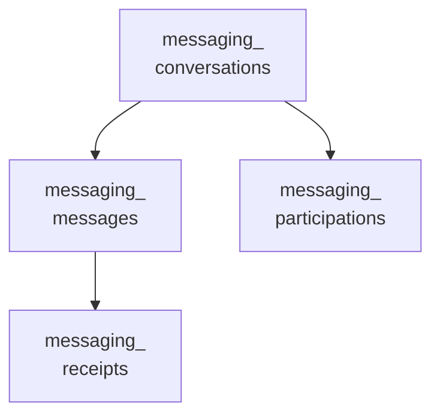
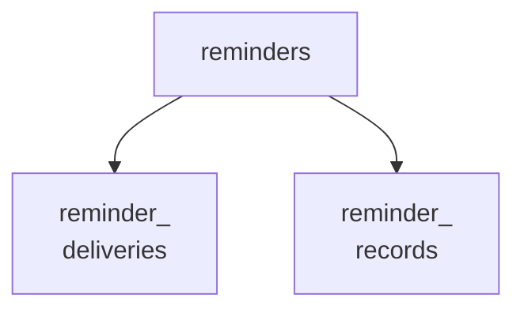
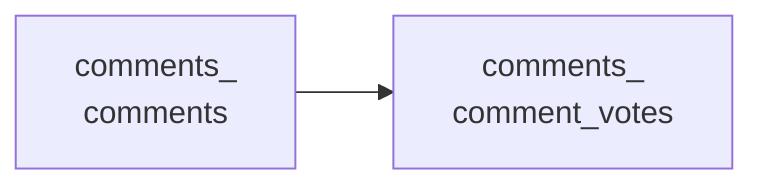

<!-- Gerado por scripts/banco_de_dados.py em 2026-10-07T13:00:08+00:00. Não edite à mão. -->

# Comentários e interação

Comentários, apoios, seguidores, notificações, mensagens privadas, lembretes e conquistas.

**13 tabelas.** Schema versão `20260405195511`. Legenda da coluna **Referência**: *FK* = chave estrangeira declarada no banco; *→* = referência por convenção de nome (sem restrição no banco).

## Relacionamentos

Cada seta vai da tabela referenciada para a tabela que guarda a referência. Referências para outros domínios aparecem na coluna **Referência** das tabelas abaixo.

**A partir de `decidim_messaging_conversations`**

**A partir de `decidim_reminders`**

**Outras relações**

## Tabelas

| Tabela | Descrição | Colunas | Origem |
|---|---|---:|---|
| [`decidim_comments_comment_votes`](#decidim-comments-comment-votes) | Votos (positivo/negativo) em comentários. | 7 | Decidim |
| [`decidim_comments_comments`](#decidim-comments-comments) | Comentários. `decidim_commentable_*` aponta para o recurso e `decidim_root_commentable_*` para a raiz da conversa. | 19 | Decidim |
| [`decidim_endorsements`](#decidim-endorsements) | Apoios a recursos. | 8 | Decidim |
| [`decidim_follows`](#decidim-follows) | Usuários que seguem recursos. | 6 | Decidim |
| [`decidim_gamification_badge_scores`](#decidim-gamification-badge-scores) | — | 4 | Decidim |
| [`decidim_messaging_conversations`](#decidim-messaging-conversations) | — | 3 | Decidim |
| [`decidim_messaging_messages`](#decidim-messaging-messages) | — | 6 | Decidim |
| [`decidim_messaging_participations`](#decidim-messaging-participations) | — | 5 | Decidim |
| [`decidim_messaging_receipts`](#decidim-messaging-receipts) | — | 6 | Decidim |
| [`decidim_notifications`](#decidim-notifications) | Notificações dos usuários. | 9 | Decidim |
| [`decidim_reminder_deliveries`](#decidim-reminder-deliveries) | — | 4 | Decidim |
| [`decidim_reminder_records`](#decidim-reminder-records) | — | 6 | Decidim |
| [`decidim_reminders`](#decidim-reminders) | — | 5 | Decidim |

### `decidim_comments_comment_votes` { #decidim-comments-comment-votes }

Votos (positivo/negativo) em comentários.

Origem: Decidim.

| Coluna | Tipo | Nulo | Padrão | Referência / observação | Origem |
|---|---|:---:|---|---|---|
| `id` | `serial` | não |  | chave primária |  |
| `weight` | `integer` | não |  |  |  |
| `decidim_comment_id` | `integer` | não |  | → [`decidim_comments_comments`](interacao.md#decidim-comments-comments) |  |
| `decidim_author_id` | `integer` | não |  | polimórfico (tipo em `decidim_author_type`) |  |
| `created_at` | `datetime` | não |  |  |  |
| `updated_at` | `datetime` | não |  |  |  |
| `decidim_author_type` | `string` | não |  |  |  |

??? note "Índices (4)"

    | Nome | Colunas | Único | Tipo |
    |---|---|:---:|---|
    | `index_decidim_comments_comment_votes_on_decidim_author` | `decidim_author_id`, `decidim_author_type` |  | btree |
    | `decidim_comments_comment_vote_author` | `decidim_author_id` |  | btree |
    | `decidim_comments_comment_vote_comment_author_unique` | `decidim_comment_id`, `decidim_author_id` | sim | btree |
    | `decidim_comments_comment_vote_comment` | `decidim_comment_id` |  | btree |

### `decidim_comments_comments` { #decidim-comments-comments }

Comentários. `decidim_commentable_*` aponta para o recurso e `decidim_root_commentable_*` para a raiz da conversa.

Origem: Decidim.

| Coluna | Tipo | Nulo | Padrão | Referência / observação | Origem |
|---|---|:---:|---|---|---|
| `id` | `serial` | não |  | chave primária |  |
| `decidim_commentable_type` | `string` | não |  |  |  |
| `decidim_commentable_id` | `integer` | não |  | polimórfico (tipo em `decidim_commentable_type`) |  |
| `decidim_author_id` | `integer` | não |  | polimórfico (tipo em `decidim_author_type`) |  |
| `created_at` | `datetime` | não |  |  |  |
| `updated_at` | `datetime` | não |  |  |  |
| `depth` | `integer` | não | `0` |  |  |
| `alignment` | `integer` | não | `0` |  |  |
| `decidim_user_group_id` | `integer` | sim |  | → [`decidim_users`](organizacao-usuarios.md#decidim-users) |  |
| `decidim_root_commentable_type` | `string` | não |  |  |  |
| `decidim_root_commentable_id` | `integer` | não |  | polimórfico (tipo em `decidim_root_commentable_type`) |  |
| `decidim_author_type` | `string` | não |  |  |  |
| `body` | `jsonb` | sim |  | traduzível (`{"pt-BR": …}`) |  |
| `comments_count` | `integer` | não | `0` | contador em cache |  |
| `decidim_participatory_space_type` | `string` | sim |  |  |  |
| `decidim_participatory_space_id` | `integer` | sim |  | polimórfico (tipo em `decidim_participatory_space_type`) |  |
| `deleted_at` | `datetime` | sim |  |  |  |
| `status` | `integer` | sim | `0` |  | [:flag_br: BP](https://gitlab.com/lappis-unb/decidimbr/decidim-govbr/-/blob/main/db/migrate/20240206132929_add_status_column_to_decidim_comments_comments.rb "20240206132929_add_status_column_to_decidim_comments_comments.rb") |
| `sensitive_content` | `boolean` | sim | `false` |  | [:flag_br: BP](https://gitlab.com/lappis-unb/decidimbr/decidim-govbr/-/blob/main/db/migrate/20241121195848_add_sensitive_content_to_decidim_comments_comments.rb "20241121195848_add_sensitive_content_to_decidim_comments_comments.rb") |

??? note "Índices (7)"

    | Nome | Colunas | Único | Tipo |
    |---|---|:---:|---|
    | `index_decidim_comments_comments_on_created_at` | `created_at` |  | btree |
    | `index_decidim_comments_comments_on_decidim_author` | `decidim_author_id`, `decidim_author_type` |  | btree |
    | `decidim_comments_comment_author` | `decidim_author_id` |  | btree |
    | `decidim_comments_comment_commentable` | `decidim_commentable_type`, `decidim_commentable_id` |  | btree |
    | `index_decidim_comments_on_decidim_participatory_space` | `decidim_participatory_space_id`, `decidim_participatory_space_type` |  | btree |
    | `decidim_comments_comment_root_commentable` | `decidim_root_commentable_type`, `decidim_root_commentable_id` |  | btree |
    | `index_decidim_comments_comments_on_decidim_user_group_id` | `decidim_user_group_id` |  | btree |

### `decidim_endorsements` { #decidim-endorsements }

Apoios a recursos.

Origem: Decidim.

| Coluna | Tipo | Nulo | Padrão | Referência / observação | Origem |
|---|---|:---:|---|---|---|
| `id` | `bigint` | não |  | chave primária |  |
| `resource_type` | `string` | sim |  |  |  |
| `resource_id` | `bigint` | sim |  | polimórfico (tipo em `resource_type`) |  |
| `decidim_author_type` | `string` | sim |  |  |  |
| `decidim_author_id` | `bigint` | sim |  | polimórfico (tipo em `decidim_author_type`) |  |
| `decidim_user_group_id` | `integer` | sim |  | → [`decidim_users`](organizacao-usuarios.md#decidim-users) |  |
| `created_at` | `datetime` | não |  |  |  |
| `updated_at` | `datetime` | não |  |  |  |

??? note "Índices (4)"

    | Nome | Colunas | Único | Tipo |
    |---|---|:---:|---|
    | `idx_endorsements_authors` | `decidim_author_type`, `decidim_author_id` |  | btree |
    | `index_decidim_endorsements_on_decidim_user_group_id` | `decidim_user_group_id` |  | btree |
    | `idx_endorsements_rsrcs_and_authors` | `resource_type`, `resource_id`, `decidim_author_type`, `decidim_author_id`, `decidim_user_group_id` | sim | btree |
    | `index_decidim_endorsements_on_resource_type_and_resource_id` | `resource_type`, `resource_id` |  | btree |

### `decidim_follows` { #decidim-follows }

Usuários que seguem recursos.

Origem: Decidim.

| Coluna | Tipo | Nulo | Padrão | Referência / observação | Origem |
|---|---|:---:|---|---|---|
| `id` | `bigint` | não |  | chave primária |  |
| `decidim_user_id` | `bigint` | não |  | → [`decidim_users`](organizacao-usuarios.md#decidim-users) |  |
| `decidim_followable_type` | `string` | sim |  |  |  |
| `decidim_followable_id` | `bigint` | sim |  | polimórfico (tipo em `decidim_followable_type`) |  |
| `created_at` | `datetime` | não |  |  |  |
| `updated_at` | `datetime` | não |  |  |  |

??? note "Índices (3)"

    | Nome | Colunas | Único | Tipo |
    |---|---|:---:|---|
    | `index_follows_followable_id_and_type` | `decidim_followable_id`, `decidim_followable_type` |  | btree |
    | `index_uniq_on_follows_user_and_followable` | `decidim_user_id`, `decidim_followable_id`, `decidim_followable_type` | sim | btree |
    | `index_decidim_follows_on_decidim_user_id` | `decidim_user_id` |  | btree |

### `decidim_gamification_badge_scores` { #decidim-gamification-badge-scores }

Origem: Decidim.

| Coluna | Tipo | Nulo | Padrão | Referência / observação | Origem |
|---|---|:---:|---|---|---|
| `id` | `bigint` | não |  | chave primária |  |
| `user_id` | `bigint` | não |  |  |  |
| `badge_name` | `string` | não |  |  |  |
| `value` | `integer` | não | `0` |  |  |

??? note "Índices (1)"

    | Nome | Colunas | Único | Tipo |
    |---|---|:---:|---|
    | `index_decidim_gamification_badge_scores_on_user_id` | `user_id` |  | btree |

### `decidim_messaging_conversations` { #decidim-messaging-conversations }

Origem: Decidim.

| Coluna | Tipo | Nulo | Padrão | Referência / observação | Origem |
|---|---|:---:|---|---|---|
| `id` | `bigint` | não |  | chave primária |  |
| `created_at` | `datetime` | não |  |  | — |
| `updated_at` | `datetime` | não |  |  | — |

### `decidim_messaging_messages` { #decidim-messaging-messages }

Origem: Decidim.

| Coluna | Tipo | Nulo | Padrão | Referência / observação | Origem |
|---|---|:---:|---|---|---|
| `id` | `bigint` | não |  | chave primária |  |
| `decidim_conversation_id` | `bigint` | não |  | → [`decidim_messaging_conversations`](interacao.md#decidim-messaging-conversations) |  |
| `decidim_sender_id` | `bigint` | não |  |  |  |
| `body` | `text` | não |  |  |  |
| `created_at` | `datetime` | não |  |  |  |
| `updated_at` | `datetime` | não |  |  |  |

??? note "Índices (2)"

    | Nome | Colunas | Único | Tipo |
    |---|---|:---:|---|
    | `index_decidim_messaging_messages_on_decidim_conversation_id` | `decidim_conversation_id` |  | btree |
    | `index_decidim_messaging_messages_on_decidim_sender_id` | `decidim_sender_id` |  | btree |

### `decidim_messaging_participations` { #decidim-messaging-participations }

Origem: Decidim.

| Coluna | Tipo | Nulo | Padrão | Referência / observação | Origem |
|---|---|:---:|---|---|---|
| `id` | `bigint` | não |  | chave primária |  |
| `decidim_conversation_id` | `bigint` | não |  | → [`decidim_messaging_conversations`](interacao.md#decidim-messaging-conversations) |  |
| `decidim_participant_id` | `bigint` | não |  |  |  |
| `created_at` | `datetime` | não |  |  |  |
| `updated_at` | `datetime` | não |  |  |  |

??? note "Índices (2)"

    | Nome | Colunas | Único | Tipo |
    |---|---|:---:|---|
    | `index_conversation_participations_on_conversation_id` | `decidim_conversation_id` |  | btree |
    | `index_conversation_participations_on_participant_id` | `decidim_participant_id` |  | btree |

### `decidim_messaging_receipts` { #decidim-messaging-receipts }

Origem: Decidim.

| Coluna | Tipo | Nulo | Padrão | Referência / observação | Origem |
|---|---|:---:|---|---|---|
| `id` | `bigint` | não |  | chave primária |  |
| `decidim_message_id` | `bigint` | não |  | → [`decidim_messaging_messages`](interacao.md#decidim-messaging-messages) |  |
| `decidim_recipient_id` | `bigint` | não |  |  |  |
| `read_at` | `datetime` | sim |  |  |  |
| `created_at` | `datetime` | não |  |  |  |
| `updated_at` | `datetime` | não |  |  |  |

??? note "Índices (2)"

    | Nome | Colunas | Único | Tipo |
    |---|---|:---:|---|
    | `index_decidim_messaging_receipts_on_decidim_message_id` | `decidim_message_id` |  | btree |
    | `index_decidim_messaging_receipts_on_decidim_recipient_id` | `decidim_recipient_id` |  | btree |

### `decidim_notifications` { #decidim-notifications }

Notificações dos usuários.

Origem: Decidim.

| Coluna | Tipo | Nulo | Padrão | Referência / observação | Origem |
|---|---|:---:|---|---|---|
| `id` | `bigint` | não |  | chave primária |  |
| `decidim_user_id` | `bigint` | não |  | → [`decidim_users`](organizacao-usuarios.md#decidim-users) |  |
| `decidim_resource_type` | `string` | não |  |  |  |
| `decidim_resource_id` | `bigint` | não |  | polimórfico (tipo em `decidim_resource_type`) |  |
| `event_name` | `string` | não |  |  |  |
| `event_class` | `string` | não |  |  |  |
| `created_at` | `datetime` | não |  |  |  |
| `updated_at` | `datetime` | não |  |  |  |
| `extra` | `jsonb` | sim |  |  |  |

??? note "Índices (2)"

    | Nome | Colunas | Único | Tipo |
    |---|---|:---:|---|
    | `index_decidim_notifications_on_decidim_resource_id` | `decidim_resource_id` |  | btree |
    | `index_decidim_notifications_on_decidim_user_id` | `decidim_user_id` |  | btree |

### `decidim_reminder_deliveries` { #decidim-reminder-deliveries }

Origem: Decidim.

| Coluna | Tipo | Nulo | Padrão | Referência / observação | Origem |
|---|---|:---:|---|---|---|
| `id` | `bigint` | não |  | chave primária |  |
| `decidim_reminder_id` | `bigint` | sim |  | FK → [`decidim_reminders`](interacao.md#decidim-reminders) |  |
| `created_at` | `datetime` | não |  |  |  |
| `updated_at` | `datetime` | não |  |  |  |

??? note "Índices (1)"

    | Nome | Colunas | Único | Tipo |
    |---|---|:---:|---|
    | `index_decidim_reminder_deliveries_on_decidim_reminder_id` | `decidim_reminder_id` |  | btree |

### `decidim_reminder_records` { #decidim-reminder-records }

Origem: Decidim.

| Coluna | Tipo | Nulo | Padrão | Referência / observação | Origem |
|---|---|:---:|---|---|---|
| `id` | `bigint` | não |  | chave primária |  |
| `state` | `string` | sim | `"active"` |  |  |
| `string` | `string` | sim | `"active"` |  | — |
| `decidim_reminder_id` | `bigint` | sim |  | FK → [`decidim_reminders`](interacao.md#decidim-reminders) |  |
| `remindable_type` | `string` | não |  |  |  |
| `remindable_id` | `bigint` | não |  | polimórfico (tipo em `remindable_type`) |  |

??? note "Índices (4)"

    | Nome | Colunas | Único | Tipo |
    |---|---|:---:|---|
    | `index_decidim_reminder_records_on_decidim_reminder_id` | `decidim_reminder_id` |  | btree |
    | `index_decidim_reminder_records_remindable` | `remindable_type`, `remindable_id` |  | btree |
    | `index_decidim_reminder_records_on_state` | `state` |  | btree |
    | `index_decidim_reminder_records_on_string` | `string` |  | btree |

### `decidim_reminders` { #decidim-reminders }

Origem: Decidim.

| Coluna | Tipo | Nulo | Padrão | Referência / observação | Origem |
|---|---|:---:|---|---|---|
| `id` | `bigint` | não |  | chave primária |  |
| `decidim_user_id` | `bigint` | não |  | FK → [`decidim_users`](organizacao-usuarios.md#decidim-users) |  |
| `decidim_component_id` | `bigint` | sim |  | FK → [`decidim_components`](componentes-conteudo.md#decidim-components) |  |
| `created_at` | `datetime` | não |  |  |  |
| `updated_at` | `datetime` | não |  |  |  |

??? note "Índices (2)"

    | Nome | Colunas | Único | Tipo |
    |---|---|:---:|---|
    | `index_decidim_reminders_on_decidim_component_id` | `decidim_component_id` |  | btree |
    | `index_decidim_reminders_on_decidim_user_id` | `decidim_user_id` |  | btree |

