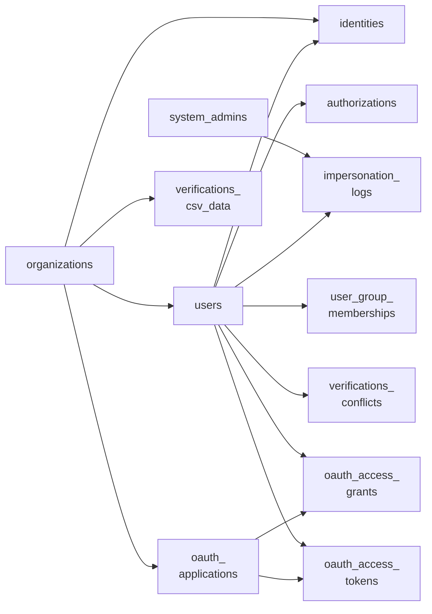

<!-- Gerado por scripts/banco_de_dados.py em 2026-10-07T13:00:08+00:00. Não edite à mão. -->

# Organização, usuários e autenticação

Organizações (tenants), usuários, administradores de sistema, identidades de login (gov.br), autorizações e tokens de API.

**13 tabelas.** Schema versão `20260405195511`. Legenda da coluna **Referência**: *FK* = chave estrangeira declarada no banco; *→* = referência por convenção de nome (sem restrição no banco).

## Relacionamentos

Cada seta vai da tabela referenciada para a tabela que guarda a referência. Referências para outros domínios aparecem na coluna **Referência** das tabelas abaixo.

## Tabelas

| Tabela | Descrição | Colunas | Origem |
|---|---|---:|---|
| [`decidim_apiauth_jwt_blacklists`](#decidim-apiauth-jwt-blacklists) | — | 3 | `decidim-apiauth` |
| [`decidim_authorizations`](#decidim-authorizations) | Autorizações (verificações) concedidas a usuários. | 10 | Decidim |
| [`decidim_identities`](#decidim-identities) | Identidades de login externo (OmniAuth). Para o gov.br, `provider = 'govbr'` e `uid` é o CPF. | 7 | Decidim |
| [`decidim_impersonation_logs`](#decidim-impersonation-logs) | — | 9 | Decidim |
| [`decidim_organizations`](#decidim-organizations) | Organização (tenant). Cada host atende uma organização; quase todas as tabelas se ligam a ela. | 66 | Decidim |
| [`decidim_system_admins`](#decidim-system-admins) | Administradores do painel `/system`. | 11 | Decidim |
| [`decidim_user_group_memberships`](#decidim-user-group-memberships) | — | 6 | Decidim |
| [`decidim_users`](#decidim-users) | Participantes e grupos de usuários (coluna `type`). Guarda perfil, preferências de notificação e `extended_data`. | 71 | Decidim |
| [`decidim_verifications_conflicts`](#decidim-verifications-conflicts) | — | 8 | Decidim |
| [`decidim_verifications_csv_data`](#decidim-verifications-csv-data) | — | 5 | Decidim |
| [`oauth_access_grants`](#oauth-access-grants) | — | 9 | Decidim |
| [`oauth_access_tokens`](#oauth-access-tokens) | — | 10 | Decidim |
| [`oauth_applications`](#oauth-applications) | — | 14 | Decidim |

### `decidim_apiauth_jwt_blacklists` { #decidim-apiauth-jwt-blacklists }

Origem: `decidim-apiauth`.

| Coluna | Tipo | Nulo | Padrão | Referência / observação | Origem |
|---|---|:---:|---|---|---|
| `id` | `bigint` | não |  | chave primária |  |
| `jti` | `string` | não |  |  |  |
| `exp` | `datetime` | não |  |  |  |

??? note "Índices (1)"

    | Nome | Colunas | Único | Tipo |
    |---|---|:---:|---|
    | `index_decidim_apiauth_jwt_blacklists_on_jti` | `jti` |  | btree |

### `decidim_authorizations` { #decidim-authorizations }

Autorizações (verificações) concedidas a usuários.

Origem: Decidim.

| Coluna | Tipo | Nulo | Padrão | Referência / observação | Origem |
|---|---|:---:|---|---|---|
| `id` | `serial` | não |  | chave primária |  |
| `name` | `string` | não |  |  |  |
| `metadata` | `jsonb` | sim |  |  |  |
| `decidim_user_id` | `integer` | não |  | FK → [`decidim_users`](organizacao-usuarios.md#decidim-users) |  |
| `created_at` | `datetime` | não |  |  |  |
| `updated_at` | `datetime` | não |  |  |  |
| `unique_id` | `string` | sim |  |  |  |
| `granted_at` | `datetime` | sim |  |  |  |
| `verification_metadata` | `jsonb` | sim | `{}` |  |  |
| `verification_attachment` | `string` | sim |  |  |  |

??? note "Índices (3)"

    | Nome | Colunas | Único | Tipo |
    |---|---|:---:|---|
    | `index_decidim_authorizations_on_decidim_user_id_and_name` | `decidim_user_id`, `name` | sim | btree |
    | `index_decidim_authorizations_on_decidim_user_id` | `decidim_user_id` |  | btree |
    | `index_decidim_authorizations_on_unique_id` | `unique_id` |  | btree |

### `decidim_identities` { #decidim-identities }

Identidades de login externo (OmniAuth). Para o gov.br, `provider = 'govbr'` e `uid` é o CPF.

Origem: Decidim.

| Coluna | Tipo | Nulo | Padrão | Referência / observação | Origem |
|---|---|:---:|---|---|---|
| `id` | `serial` | não |  | chave primária |  |
| `provider` | `string` | não |  |  |  |
| `uid` | `string` | não |  |  |  |
| `decidim_user_id` | `integer` | não |  | → [`decidim_users`](organizacao-usuarios.md#decidim-users) |  |
| `created_at` | `datetime` | não |  |  |  |
| `updated_at` | `datetime` | não |  |  |  |
| `decidim_organization_id` | `integer` | sim |  | FK → [`decidim_organizations`](organizacao-usuarios.md#decidim-organizations) |  |

??? note "Índices (3)"

    | Nome | Colunas | Único | Tipo |
    |---|---|:---:|---|
    | `index_decidim_identities_on_decidim_organization_id` | `decidim_organization_id` |  | btree |
    | `index_decidim_identities_on_decidim_user_id` | `decidim_user_id` |  | btree |
    | `decidim_identities_provider_uid_organization_unique` | `provider`, `uid`, `decidim_organization_id` | sim | btree |

### `decidim_impersonation_logs` { #decidim-impersonation-logs }

Origem: Decidim.

| Coluna | Tipo | Nulo | Padrão | Referência / observação | Origem |
|---|---|:---:|---|---|---|
| `id` | `bigint` | não |  | chave primária |  |
| `decidim_admin_id` | `bigint` | sim |  | → [`decidim_system_admins`](organizacao-usuarios.md#decidim-system-admins) |  |
| `decidim_user_id` | `bigint` | sim |  | → [`decidim_users`](organizacao-usuarios.md#decidim-users) |  |
| `started_at` | `datetime` | sim |  |  |  |
| `ended_at` | `datetime` | sim |  |  |  |
| `expired_at` | `datetime` | sim |  |  |  |
| `created_at` | `datetime` | não |  |  |  |
| `updated_at` | `datetime` | não |  |  |  |
| `reason` | `text` | sim |  |  |  |

??? note "Índices (2)"

    | Nome | Colunas | Único | Tipo |
    |---|---|:---:|---|
    | `index_decidim_impersonation_logs_on_decidim_admin_id` | `decidim_admin_id` |  | btree |
    | `index_decidim_impersonation_logs_on_decidim_user_id` | `decidim_user_id` |  | btree |

### `decidim_organizations` { #decidim-organizations }

Organização (tenant). Cada host atende uma organização; quase todas as tabelas se ligam a ela.

Origem: Decidim.

| Coluna | Tipo | Nulo | Padrão | Referência / observação | Origem |
|---|---|:---:|---|---|---|
| `id` | `serial` | não |  | chave primária |  |
| `name` | `string` | não |  |  |  |
| `host` | `string` | não |  |  |  |
| `default_locale` | `string` | não |  |  |  |
| `available_locales` | `string[]` | sim | `[]` |  |  |
| `created_at` | `datetime` | não |  |  |  |
| `updated_at` | `datetime` | não |  |  |  |
| `description` | `jsonb` | sim |  | traduzível (`{"pt-BR": …}`) |  |
| `logo` | `string` | sim |  |  |  |
| `twitter_handler` | `string` | sim |  |  |  |
| `favicon` | `string` | sim |  |  |  |
| `instagram_handler` | `string` | sim |  |  |  |
| `facebook_handler` | `string` | sim |  |  |  |
| `youtube_handler` | `string` | sim |  |  |  |
| `github_handler` | `string` | sim |  |  |  |
| `official_img_header` | `string` | sim |  |  |  |
| `official_img_footer` | `string` | sim |  |  |  |
| `official_url` | `string` | sim |  |  |  |
| `reference_prefix` | `string` | não |  |  |  |
| `secondary_hosts` | `string[]` | sim | `[]` |  |  |
| `available_authorizations` | `string[]` | sim | `[]` |  |  |
| `header_snippets` | `text` | sim |  |  |  |
| `cta_button_text` | `jsonb` | sim |  |  |  |
| `cta_button_path` | `string` | sim |  |  |  |
| `enable_omnipresent_banner` | `boolean` | não | `false` |  |  |
| `omnipresent_banner_title` | `jsonb` | sim |  |  |  |
| `omnipresent_banner_short_description` | `jsonb` | sim |  |  |  |
| `omnipresent_banner_url` | `string` | sim |  |  |  |
| `highlighted_content_banner_enabled` | `boolean` | não | `false` |  |  |
| `highlighted_content_banner_title` | `jsonb` | sim |  |  |  |
| `highlighted_content_banner_short_description` | `jsonb` | sim |  |  |  |
| `highlighted_content_banner_action_title` | `jsonb` | sim |  |  |  |
| `highlighted_content_banner_action_subtitle` | `jsonb` | sim |  |  |  |
| `highlighted_content_banner_action_url` | `string` | sim |  |  |  |
| `highlighted_content_banner_image` | `string` | sim |  |  |  |
| `tos_version` | `datetime` | sim |  |  |  |
| `badges_enabled` | `boolean` | não | `false` |  |  |
| `send_welcome_notification` | `boolean` | não | `false` |  |  |
| `welcome_notification_subject` | `jsonb` | sim |  |  |  |
| `welcome_notification_body` | `jsonb` | sim |  |  |  |
| `users_registration_mode` | `integer` | não | `0` |  |  |
| `id_documents_methods` | `string[]` | sim |  |  |  |
| `id_documents_explanation_text` | `jsonb` | sim | `{}` |  |  |
| `user_groups_enabled` | `boolean` | não | `false` |  |  |
| `smtp_settings` | `jsonb` | sim |  |  |  |
| `colors` | `jsonb` | sim | `{}` |  |  |
| `force_users_to_authenticate_before_access_organization` | `boolean` | sim | `false` |  | — |
| `omniauth_settings` | `jsonb` | sim |  |  |  |
| `rich_text_editor_in_public_views` | `boolean` | sim | `false` |  | — |
| `admin_terms_of_use_body` | `jsonb` | sim |  |  |  |
| `time_zone` | `string` | sim | `"UTC"` |  |  |
| `enable_machine_translations` | `boolean` | sim | `false` |  |  |
| `comments_max_length` | `integer` | sim | `1000` |  |  |
| `file_upload_settings` | `jsonb` | sim |  |  |  |
| `machine_translation_display_priority` | `string` | não | `"original"` |  |  |
| `external_domain_whitelist` | `string[]` | sim | `[]` |  |  |
| `enable_participatory_space_filters` | `boolean` | sim | `true` |  |  |
| `menu_links` | `jsonb` | não | `"{}"` |  | [:flag_br: BP](https://gitlab.com/lappis-unb/decidimbr/decidim-govbr/-/blob/main/db/migrate/20230922193655_add_menu_links_to_organization.rb "20230922193655_add_menu_links_to_organization.rb") |
| `footer_menu_links` | `jsonb` | não | `"{}"` |  | [:flag_br: BP](https://gitlab.com/lappis-unb/decidimbr/decidim-govbr/-/blob/main/db/migrate/20240205194345_footer_menu_links.rb "20240205194345_footer_menu_links.rb") |
| `user_profile_survey_id` | `integer` | sim |  |  | [:flag_br: BP](https://gitlab.com/lappis-unb/decidimbr/decidim-govbr/-/blob/main/db/migrate/20240304175221_add_user_profile_poll_link_to_decidim_organization.rb "20240304175221_add_user_profile_poll_link_to_decidim_organization.rb") |
| `extra_user_fields` | `jsonb` | sim |  |  | `decidim-extra_user_fields` (LabLivre) |
| `super_admins` | `string[]` | sim | `[]` |  | [:flag_br: BP](https://gitlab.com/lappis-unb/decidimbr/decidim-govbr/-/blob/main/db/migrate/20240830024117_add_super_admins_to_organizations.rb "20240830024117_add_super_admins_to_organizations.rb") |
| `participatory_text_v2_release_date` | `date` | sim | `"2025-05-25"` |  | [:flag_br: BP](https://gitlab.com/lappis-unb/decidimbr/decidim-govbr/-/blob/main/db/migrate/20250525170012_add_participatory_text_v2_release_date_to_decidim_organization.rb "20250525170012_add_participatory_text_v2_release_date_to_decidim_organization.rb") |
| `dashboard_url` | `jsonb` | sim |  |  | [:flag_br: BP](https://gitlab.com/lappis-unb/decidimbr/decidim-govbr/-/blob/main/db/migrate/20250602133057_add_dashboard_url_to_decidim_organization.rb "20250602133057_add_dashboard_url_to_decidim_organization.rb") |
| `prune_duplicated_govbr_identities` | `boolean` | sim | `false` |  | [:flag_br: BP](https://gitlab.com/lappis-unb/decidimbr/decidim-govbr/-/blob/main/db/migrate/20260114151505_add_prune_duplicated_govbr_identities_feature_flag_to_organizations.rb "20260114151505_add_prune_duplicated_govbr_identities_feature_flag_to_organizations.rb") |
| `prune_duplicated_govbr_identities_users_quantity` | `integer` | sim | `5` |  | [:flag_br: BP](https://gitlab.com/lappis-unb/decidimbr/decidim-govbr/-/blob/main/db/migrate/20260114151505_add_prune_duplicated_govbr_identities_feature_flag_to_organizations.rb "20260114151505_add_prune_duplicated_govbr_identities_feature_flag_to_organizations.rb") |

??? note "Índices (2)"

    | Nome | Colunas | Único | Tipo |
    |---|---|:---:|---|
    | `index_decidim_organizations_on_host` | `host` | sim | btree |
    | `index_decidim_organizations_on_name` | `name` | sim | btree |

### `decidim_system_admins` { #decidim-system-admins }

Administradores do painel `/system`.

Origem: Decidim.

| Coluna | Tipo | Nulo | Padrão | Referência / observação | Origem |
|---|---|:---:|---|---|---|
| `id` | `serial` | não |  | chave primária |  |
| `email` | `string` | não | `""` |  |  |
| `encrypted_password` | `string` | não | `""` |  |  |
| `reset_password_token` | `string` | sim |  |  |  |
| `reset_password_sent_at` | `datetime` | sim |  |  |  |
| `remember_created_at` | `datetime` | sim |  |  |  |
| `failed_attempts` | `integer` | não | `0` |  |  |
| `unlock_token` | `string` | sim |  |  |  |
| `locked_at` | `datetime` | sim |  |  |  |
| `created_at` | `datetime` | não |  |  |  |
| `updated_at` | `datetime` | não |  |  |  |

??? note "Índices (2)"

    | Nome | Colunas | Único | Tipo |
    |---|---|:---:|---|
    | `index_decidim_system_admins_on_email` | `email` | sim | btree |
    | `index_decidim_system_admins_on_reset_password_token` | `reset_password_token` | sim | btree |

### `decidim_user_group_memberships` { #decidim-user-group-memberships }

Origem: Decidim.

| Coluna | Tipo | Nulo | Padrão | Referência / observação | Origem |
|---|---|:---:|---|---|---|
| `id` | `serial` | não |  | chave primária |  |
| `decidim_user_id` | `integer` | não |  | → [`decidim_users`](organizacao-usuarios.md#decidim-users) |  |
| `decidim_user_group_id` | `integer` | não |  | → [`decidim_users`](organizacao-usuarios.md#decidim-users) |  |
| `created_at` | `datetime` | não |  |  |  |
| `updated_at` | `datetime` | não |  |  |  |
| `role` | `string` | não | `"requested"` |  |  |

??? note "Índices (5)"

    | Nome | Colunas | Único | Tipo |
    |---|---|:---:|---|
    | `index_user_group_memberships_group_id_user_id` | `decidim_user_group_id`, `decidim_user_id` |  | btree |
    | `index_decidim_user_group_memberships_on_decidim_user_group_id` | `decidim_user_group_id` |  | btree |
    | `decidim_user_group_memberships_unique_user_and_group_ids` | `decidim_user_id`, `decidim_user_group_id` | sim | btree |
    | `index_decidim_user_group_memberships_on_decidim_user_id` | `decidim_user_id` |  | btree |
    | `decidim_group_membership_one_creator_per_group` | `role`, `decidim_user_group_id` | sim | btree (parcial: `((role)::text = 'creator'::text)`) |

### `decidim_users` { #decidim-users }

Participantes e grupos de usuários (coluna `type`). Guarda perfil, preferências de notificação e `extended_data`.

Origem: Decidim.

| Coluna | Tipo | Nulo | Padrão | Referência / observação | Origem |
|---|---|:---:|---|---|---|
| `id` | `serial` | não |  | chave primária |  |
| `email` | `string` | não | `""` |  |  |
| `encrypted_password` | `string` | não | `""` |  |  |
| `reset_password_token` | `string` | sim |  |  |  |
| `reset_password_sent_at` | `datetime` | sim |  |  |  |
| `remember_created_at` | `datetime` | sim |  |  |  |
| `sign_in_count` | `integer` | não | `0` | contador em cache |  |
| `current_sign_in_at` | `datetime` | sim |  |  |  |
| `last_sign_in_at` | `datetime` | sim |  |  |  |
| `current_sign_in_ip` | `string` | sim |  |  |  |
| `last_sign_in_ip` | `string` | sim |  |  |  |
| `created_at` | `datetime` | não |  |  |  |
| `updated_at` | `datetime` | não |  |  |  |
| `invitation_token` | `string` | sim |  |  |  |
| `invitation_created_at` | `datetime` | sim |  |  |  |
| `invitation_sent_at` | `datetime` | sim |  |  |  |
| `invitation_accepted_at` | `datetime` | sim |  |  |  |
| `invitation_limit` | `integer` | sim |  |  |  |
| `invited_by_type` | `string` | sim |  |  |  |
| `invited_by_id` | `integer` | sim |  | polimórfico (tipo em `invited_by_type`) |  |
| `invitations_count` | `integer` | sim | `0` | contador em cache |  |
| `decidim_organization_id` | `integer` | sim |  | FK → [`decidim_organizations`](organizacao-usuarios.md#decidim-organizations) |  |
| `confirmation_token` | `string` | sim |  |  |  |
| `confirmed_at` | `datetime` | sim |  |  |  |
| `confirmation_sent_at` | `datetime` | sim |  |  |  |
| `unconfirmed_email` | `string` | sim |  |  |  |
| `name` | `string` | não |  |  |  |
| `locale` | `string` | sim |  |  |  |
| `avatar` | `string` | sim |  |  |  |
| `delete_reason` | `text` | sim |  |  |  |
| `deleted_at` | `datetime` | sim |  |  |  |
| `admin` | `boolean` | não | `false` |  |  |
| `managed` | `boolean` | não | `false` |  |  |
| `roles` | `string[]` | sim | `[]` |  |  |
| `nickname` | `string` | não | `""` |  |  |
| `personal_url` | `string` | sim |  |  |  |
| `about` | `text` | sim |  |  |  |
| `accepted_tos_version` | `datetime` | sim |  |  |  |
| `newsletter_token` | `string` | sim | `""` |  |  |
| `newsletter_notifications_at` | `datetime` | sim | `"2025-08-11 13:44:12"` |  |  |
| `type` | `string` | não |  |  |  |
| `extended_data` | `jsonb` | sim | `{}` |  |  |
| `following_count` | `integer` | não | `0` | contador em cache |  |
| `followers_count` | `integer` | não | `0` | contador em cache |  |
| `notification_types` | `string` | não | `"all"` |  |  |
| `failed_attempts` | `integer` | não | `0` |  |  |
| `unlock_token` | `string` | sim |  |  |  |
| `locked_at` | `datetime` | sim |  |  |  |
| `officialized_at` | `datetime` | sim |  |  |  |
| `officialized_as` | `jsonb` | sim |  |  |  |
| `admin_terms_accepted_at` | `datetime` | sim |  |  |  |
| `session_token` | `string` | sim |  |  |  |
| `direct_message_types` | `string` | não | `"all"` |  |  |
| `blocked` | `boolean` | não | `false` |  |  |
| `blocked_at` | `datetime` | sim |  |  |  |
| `block_id` | `integer` | sim |  |  |  |
| `email_on_moderations` | `boolean` | sim | `true` |  |  |
| `follows_count` | `integer` | não | `0` | contador em cache |  |
| `notification_settings` | `jsonb` | sim |  |  |  |
| `notifications_sending_frequency` | `string` | sim | `"none"` |  |  |
| `digest_sent_at` | `datetime` | sim |  |  |  |
| `password_updated_at` | `datetime` | sim |  |  |  |
| `previous_passwords` | `string[]` | sim | `[]` |  |  |
| `user_profile_poll_answered` | `boolean` | sim | `false` |  | [:flag_br: BP](https://gitlab.com/lappis-unb/decidimbr/decidim-govbr/-/blob/main/db/migrate/20240304181339_add_user_profile_poll_answered_to_decidim_user.rb "20240304181339_add_user_profile_poll_answered_to_decidim_user.rb") |
| `decidim_participatory_process_group_id` | `bigint` | sim |  | → [`decidim_participatory_process_groups`](processos-instancias.md#decidim-participatory-process-groups) | [:flag_br: BP](https://gitlab.com/lappis-unb/decidimbr/decidim-govbr/-/blob/main/db/migrate/20240308020918_add_participatory_group_reference_to_decidim_users.rb "20240308020918_add_participatory_group_reference_to_decidim_users.rb") |
| `decidim_participatory_process_group_role` | `string` | sim |  |  | [:flag_br: BP](https://gitlab.com/lappis-unb/decidimbr/decidim-govbr/-/blob/main/db/migrate/20240308020918_add_participatory_group_reference_to_decidim_users.rb "20240308020918_add_participatory_group_reference_to_decidim_users.rb") |
| `entity_fields` | `jsonb` | sim |  |  | [:flag_br: BP](https://gitlab.com/lappis-unb/decidimbr/decidim-govbr/-/blob/main/db/migrate/20240415121955_add_extra_fields_to_decidim_user.rb "20240415121955_add_extra_fields_to_decidim_user.rb") |
| `needs_entity_fields` | `boolean` | sim | `false` |  | [:flag_br: BP](https://gitlab.com/lappis-unb/decidimbr/decidim-govbr/-/blob/main/db/migrate/20240415121955_add_extra_fields_to_decidim_user.rb "20240415121955_add_extra_fields_to_decidim_user.rb") |
| `has_ej_account` | `boolean` | não | `false` |  | `decidim-ej` (LabLivre) |
| `encrypted_ej_password` | `string` | sim |  |  | `decidim-ej` (LabLivre) |
| `ej_external_identifier` | `string` | sim |  |  | `decidim-ej` (LabLivre) |

??? note "Índices (15)"

    | Nome | Colunas | Único | Tipo |
    |---|---|:---:|---|
    | `index_decidim_users_on_confirmation_token` | `confirmation_token` | sim | btree |
    | `index_decidim_users_on_decidim_organization_id` | `decidim_organization_id` |  | btree |
    | `index_decidim_users_on_decidim_participatory_process_group_id` | `decidim_participatory_process_group_id` |  | btree |
    | `index_decidim_users_on_ej_external_identifier` | `ej_external_identifier` |  | btree |
    | `index_decidim_users_on_email_and_decidim_organization_id` | `email`, `decidim_organization_id` | sim | btree (parcial: `((deleted_at IS NULL) AND (managed = false) AND ((type)::text = 'Decidim::User'::text))`) |
    | `index_decidim_users_on_id_and_type` | `id`, `type` |  | btree |
    | `index_decidim_users_on_invitation_token` | `invitation_token` | sim | btree |
    | `index_decidim_users_on_invitations_count` | `invitations_count` |  | btree |
    | `index_decidim_users_on_invited_by_id_and_invited_by_type` | `invited_by_id`, `invited_by_type` |  | btree |
    | `index_decidim_users_on_invited_by_id` | `invited_by_id` |  | btree |
    | `index_decidim_users_on_nickame_and_decidim_organization_id` | `nickname`, `decidim_organization_id` | sim | btree (parcial: `((deleted_at IS NULL) AND (managed = false))`) |
    | `index_decidim_users_on_notifications_sending_frequency` | `notifications_sending_frequency` |  | btree |
    | `index_decidim_users_on_officialized_at` | `officialized_at` |  | btree |
    | `index_decidim_users_on_reset_password_token` | `reset_password_token` | sim | btree |
    | `index_decidim_users_on_unlock_token` | `unlock_token` | sim | btree |

### `decidim_verifications_conflicts` { #decidim-verifications-conflicts }

Origem: Decidim.

| Coluna | Tipo | Nulo | Padrão | Referência / observação | Origem |
|---|---|:---:|---|---|---|
| `id` | `bigint` | não |  | chave primária |  |
| `current_user_id` | `bigint` | sim |  | FK → [`decidim_users`](organizacao-usuarios.md#decidim-users) |  |
| `managed_user_id` | `bigint` | sim |  | FK → [`decidim_users`](organizacao-usuarios.md#decidim-users) |  |
| `times` | `integer` | sim | `0` |  |  |
| `unique_id` | `string` | sim |  |  |  |
| `solved` | `boolean` | sim | `false` |  |  |
| `created_at` | `datetime` | não |  |  |  |
| `updated_at` | `datetime` | não |  |  |  |

??? note "Índices (2)"

    | Nome | Colunas | Único | Tipo |
    |---|---|:---:|---|
    | `authorization_current_user` | `current_user_id` |  | btree |
    | `authorization_managed_user` | `managed_user_id` |  | btree |

### `decidim_verifications_csv_data` { #decidim-verifications-csv-data }

Origem: Decidim.

| Coluna | Tipo | Nulo | Padrão | Referência / observação | Origem |
|---|---|:---:|---|---|---|
| `id` | `bigint` | não |  | chave primária |  |
| `email` | `string` | sim |  |  |  |
| `decidim_organization_id` | `bigint` | sim |  | FK → [`decidim_organizations`](organizacao-usuarios.md#decidim-organizations) |  |
| `created_at` | `datetime` | não |  |  |  |
| `updated_at` | `datetime` | não |  |  |  |

??? note "Índices (1)"

    | Nome | Colunas | Único | Tipo |
    |---|---|:---:|---|
    | `index_verifications_csv_census_to_organization` | `decidim_organization_id` |  | btree |

### `oauth_access_grants` { #oauth-access-grants }

Origem: Decidim.

| Coluna | Tipo | Nulo | Padrão | Referência / observação | Origem |
|---|---|:---:|---|---|---|
| `id` | `bigint` | não |  | chave primária |  |
| `resource_owner_id` | `integer` | não |  | FK → [`decidim_users`](organizacao-usuarios.md#decidim-users) |  |
| `application_id` | `bigint` | não |  | FK → [`oauth_applications`](organizacao-usuarios.md#oauth-applications) |  |
| `token` | `string` | não |  |  |  |
| `expires_in` | `integer` | não |  |  |  |
| `redirect_uri` | `text` | não |  |  |  |
| `created_at` | `datetime` | não |  |  |  |
| `revoked_at` | `datetime` | sim |  |  |  |
| `scopes` | `string` | sim |  |  |  |

??? note "Índices (3)"

    | Nome | Colunas | Único | Tipo |
    |---|---|:---:|---|
    | `index_oauth_access_grants_on_application_id` | `application_id` |  | btree |
    | `index_oauth_access_grants_on_resource_owner_id` | `resource_owner_id` |  | btree |
    | `index_oauth_access_grants_on_token` | `token` | sim | btree |

### `oauth_access_tokens` { #oauth-access-tokens }

Origem: Decidim.

| Coluna | Tipo | Nulo | Padrão | Referência / observação | Origem |
|---|---|:---:|---|---|---|
| `id` | `bigint` | não |  | chave primária |  |
| `resource_owner_id` | `integer` | sim |  | FK → [`decidim_users`](organizacao-usuarios.md#decidim-users) |  |
| `application_id` | `bigint` | sim |  | FK → [`oauth_applications`](organizacao-usuarios.md#oauth-applications) |  |
| `token` | `string` | não |  |  |  |
| `refresh_token` | `string` | sim |  |  |  |
| `expires_in` | `integer` | sim |  |  |  |
| `revoked_at` | `datetime` | sim |  |  |  |
| `created_at` | `datetime` | não |  |  |  |
| `scopes` | `string` | sim |  |  |  |
| `previous_refresh_token` | `string` | não | `""` |  |  |

??? note "Índices (4)"

    | Nome | Colunas | Único | Tipo |
    |---|---|:---:|---|
    | `index_oauth_access_tokens_on_application_id` | `application_id` |  | btree |
    | `index_oauth_access_tokens_on_refresh_token` | `refresh_token` | sim | btree |
    | `index_oauth_access_tokens_on_resource_owner_id` | `resource_owner_id` |  | btree |
    | `index_oauth_access_tokens_on_token` | `token` | sim | btree |

### `oauth_applications` { #oauth-applications }

Origem: Decidim.

| Coluna | Tipo | Nulo | Padrão | Referência / observação | Origem |
|---|---|:---:|---|---|---|
| `id` | `bigint` | não |  | chave primária |  |
| `name` | `string` | não |  |  |  |
| `organization_name` | `string` | não |  |  |  |
| `organization_url` | `string` | não |  |  |  |
| `organization_logo` | `string` | sim |  |  |  |
| `uid` | `string` | não |  |  |  |
| `secret` | `string` | não |  |  |  |
| `redirect_uri` | `text` | não |  |  |  |
| `scopes` | `string` | não | `""` |  |  |
| `decidim_organization_id` | `bigint` | sim |  | FK → [`decidim_organizations`](organizacao-usuarios.md#decidim-organizations) |  |
| `created_at` | `datetime` | não |  |  |  |
| `updated_at` | `datetime` | não |  |  |  |
| `type` | `string` | sim |  |  |  |
| `confidential` | `boolean` | não | `true` |  | — |

??? note "Índices (2)"

    | Nome | Colunas | Único | Tipo |
    |---|---|:---:|---|
    | `index_oauth_applications_on_decidim_organization_id` | `decidim_organization_id` |  | btree |
    | `index_oauth_applications_on_uid` | `uid` | sim | btree |

