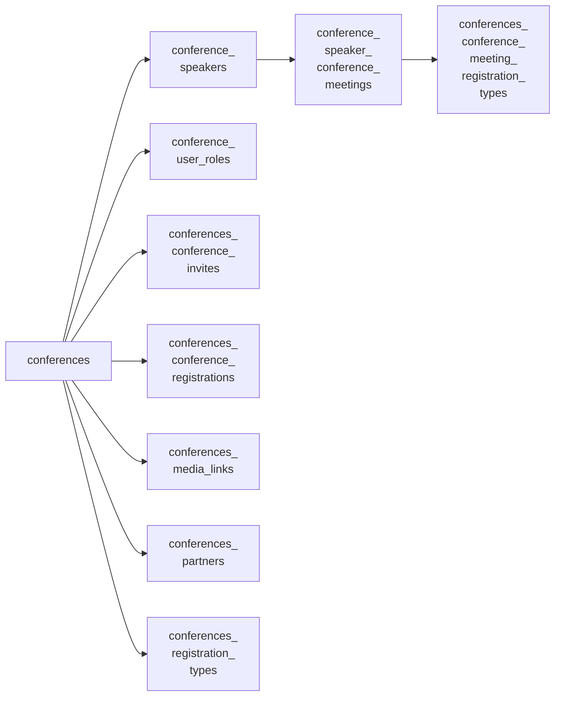
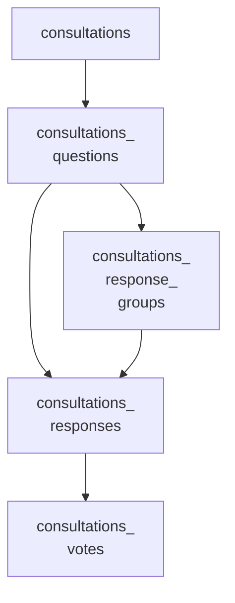
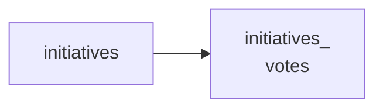

<!-- Gerado por scripts/banco_de_dados.py em 2026-10-07T13:00:08+00:00. Não edite à mão. -->

# Conferências, consultas e iniciativas

Espaços participativos do Decidim instalados no core. Em produção, as modalidades Conferências e Consultas Públicas usam processos participativos, não estas tabelas.

**21 tabelas.** Schema versão `20260405195511`. Legenda da coluna **Referência**: *FK* = chave estrangeira declarada no banco; *→* = referência por convenção de nome (sem restrição no banco).

## Relacionamentos

Cada seta vai da tabela referenciada para a tabela que guarda a referência. Referências para outros domínios aparecem na coluna **Referência** das tabelas abaixo.

**A partir de `decidim_conferences`**

**A partir de `decidim_consultations`**

**Outras relações**

## Tabelas

| Tabela | Descrição | Colunas | Origem |
|---|---|---:|---|
| [`decidim_conference_speaker_conference_meetings`](#decidim-conference-speaker-conference-meetings) | — | 3 | Decidim |
| [`decidim_conference_speakers`](#decidim-conference-speakers) | — | 12 | Decidim |
| [`decidim_conference_user_roles`](#decidim-conference-user-roles) | — | 6 | Decidim |
| [`decidim_conferences`](#decidim-conferences) | — | 31 | Decidim |
| [`decidim_conferences_conference_invites`](#decidim-conferences-conference-invites) | — | 9 | Decidim |
| [`decidim_conferences_conference_meeting_registration_types`](#decidim-conferences-conference-meeting-registration-types) | — | 3 | Decidim |
| [`decidim_conferences_conference_registrations`](#decidim-conferences-conference-registrations) | — | 7 | Decidim |
| [`decidim_conferences_media_links`](#decidim-conferences-media-links) | — | 8 | Decidim |
| [`decidim_conferences_partners`](#decidim-conferences-partners) | — | 9 | Decidim |
| [`decidim_conferences_registration_types`](#decidim-conferences-registration-types) | — | 9 | Decidim |
| [`decidim_consultations`](#decidim-consultations) | — | 16 | Decidim |
| [`decidim_consultations_questions`](#decidim-consultations-questions) | — | 32 | Decidim |
| [`decidim_consultations_response_groups`](#decidim-consultations-response-groups) | — | 6 | Decidim |
| [`decidim_consultations_responses`](#decidim-consultations-responses) | — | 7 | Decidim |
| [`decidim_consultations_votes`](#decidim-consultations-votes) | — | 7 | Decidim |
| [`decidim_initiatives`](#decidim-initiatives) | — | 27 | Decidim |
| [`decidim_initiatives_committee_members`](#decidim-initiatives-committee-members) | — | 6 | Decidim |
| [`decidim_initiatives_settings`](#decidim-initiatives-settings) | — | 3 | Decidim |
| [`decidim_initiatives_type_scopes`](#decidim-initiatives-type-scopes) | — | 6 | Decidim |
| [`decidim_initiatives_types`](#decidim-initiatives-types) | — | 21 | Decidim |
| [`decidim_initiatives_votes`](#decidim-initiatives-votes) | — | 9 | Decidim |

### `decidim_conference_speaker_conference_meetings` { #decidim-conference-speaker-conference-meetings }

Origem: Decidim.

| Coluna | Tipo | Nulo | Padrão | Referência / observação | Origem |
|---|---|:---:|---|---|---|
| `id` | `bigint` | não |  | chave primária |  |
| `conference_speaker_id` | `bigint` | não |  | → [`decidim_conference_speakers`](outros-espacos.md#decidim-conference-speakers) |  |
| `conference_meeting_id` | `bigint` | não |  | → [`decidim_conference_speaker_conference_meetings`](outros-espacos.md#decidim-conference-speaker-conference-meetings) |  |

??? note "Índices (2)"

    | Nome | Colunas | Único | Tipo |
    |---|---|:---:|---|
    | `index_meetings_on_decidim_conference_meeting_id` | `conference_meeting_id` |  | btree |
    | `index_meetings_on_decidim_conference_speaker_id` | `conference_speaker_id` |  | btree |

### `decidim_conference_speakers` { #decidim-conference-speakers }

Origem: Decidim.

| Coluna | Tipo | Nulo | Padrão | Referência / observação | Origem |
|---|---|:---:|---|---|---|
| `id` | `bigint` | não |  | chave primária |  |
| `decidim_conference_id` | `bigint` | sim |  | → [`decidim_conferences`](outros-espacos.md#decidim-conferences) |  |
| `full_name` | `string` | sim |  |  |  |
| `position` | `jsonb` | sim |  |  |  |
| `affiliation` | `jsonb` | sim |  |  |  |
| `twitter_handle` | `string` | sim |  |  |  |
| `short_bio` | `jsonb` | sim |  |  |  |
| `personal_url` | `string` | sim |  |  |  |
| `avatar` | `string` | sim |  |  |  |
| `decidim_user_id` | `bigint` | sim |  | → [`decidim_users`](organizacao-usuarios.md#decidim-users) |  |
| `created_at` | `datetime` | não |  |  |  |
| `updated_at` | `datetime` | não |  |  |  |

??? note "Índices (2)"

    | Nome | Colunas | Único | Tipo |
    |---|---|:---:|---|
    | `index_decidim_conference_speakers_on_decidim_conference_id` | `decidim_conference_id` |  | btree |
    | `index_decidim_conference_speaker_on_decidim_user_id` | `decidim_user_id` |  | btree |

### `decidim_conference_user_roles` { #decidim-conference-user-roles }

Origem: Decidim.

| Coluna | Tipo | Nulo | Padrão | Referência / observação | Origem |
|---|---|:---:|---|---|---|
| `id` | `bigint` | não |  | chave primária |  |
| `decidim_user_id` | `integer` | sim |  | → [`decidim_users`](organizacao-usuarios.md#decidim-users) |  |
| `decidim_conference_id` | `integer` | sim |  | → [`decidim_conferences`](outros-espacos.md#decidim-conferences) |  |
| `role` | `string` | sim |  |  |  |
| `created_at` | `datetime` | não |  |  |  |
| `updated_at` | `datetime` | não |  |  |  |

??? note "Índices (1)"

    | Nome | Colunas | Único | Tipo |
    |---|---|:---:|---|
    | `index_unique_user_and_conference_role` | `decidim_conference_id`, `decidim_user_id`, `role` | sim | btree |

### `decidim_conferences` { #decidim-conferences }

Origem: Decidim.

| Coluna | Tipo | Nulo | Padrão | Referência / observação | Origem |
|---|---|:---:|---|---|---|
| `id` | `bigint` | não |  | chave primária |  |
| `title` | `jsonb` | não |  | traduzível (`{"pt-BR": …}`) |  |
| `slogan` | `jsonb` | não |  |  |  |
| `slug` | `string` | não |  |  |  |
| `hashtag` | `string` | sim |  |  |  |
| `reference` | `string` | sim |  |  |  |
| `location` | `string` | sim |  |  |  |
| `decidim_organization_id` | `integer` | sim |  | → [`decidim_organizations`](organizacao-usuarios.md#decidim-organizations) |  |
| `short_description` | `jsonb` | não |  | traduzível (`{"pt-BR": …}`) |  |
| `description` | `jsonb` | não |  | traduzível (`{"pt-BR": …}`) |  |
| `hero_image` | `string` | sim |  |  |  |
| `banner_image` | `string` | sim |  |  |  |
| `promoted` | `boolean` | sim | `false` |  |  |
| `published_at` | `datetime` | sim |  |  |  |
| `objectives` | `jsonb` | não |  |  |  |
| `show_statistics` | `boolean` | sim | `false` |  |  |
| `start_date` | `date` | sim |  |  |  |
| `end_date` | `date` | sim |  |  |  |
| `scopes_enabled` | `boolean` | não | `true` |  |  |
| `decidim_scope_id` | `integer` | sim |  | → [`decidim_scopes`](componentes-conteudo.md#decidim-scopes) |  |
| `registrations_enabled` | `boolean` | não | `false` |  |  |
| `available_slots` | `integer` | não | `0` |  |  |
| `registration_terms` | `jsonb` | sim |  |  |  |
| `created_at` | `datetime` | não |  |  |  |
| `updated_at` | `datetime` | não |  |  |  |
| `signature_name` | `string` | sim |  |  |  |
| `signature` | `string` | sim |  |  |  |
| `main_logo` | `string` | sim |  |  |  |
| `sign_date` | `date` | sim |  |  |  |
| `diploma_sent_at` | `datetime` | sim |  |  |  |
| `follows_count` | `integer` | não | `0` | contador em cache |  |

??? note "Índices (3)"

    | Nome | Colunas | Único | Tipo |
    |---|---|:---:|---|
    | `index_unique_conference_slug_and_organization` | `decidim_organization_id`, `slug` | sim | btree |
    | `index_decidim_conferences_on_decidim_organization_id` | `decidim_organization_id` |  | btree |
    | `index_decidim_conferences_on_decidim_scope_id` | `decidim_scope_id` |  | btree |

### `decidim_conferences_conference_invites` { #decidim-conferences-conference-invites }

Origem: Decidim.

| Coluna | Tipo | Nulo | Padrão | Referência / observação | Origem |
|---|---|:---:|---|---|---|
| `id` | `bigint` | não |  | chave primária |  |
| `decidim_user_id` | `bigint` | não |  | → [`decidim_users`](organizacao-usuarios.md#decidim-users) |  |
| `decidim_conference_id` | `bigint` | não |  | → [`decidim_conferences`](outros-espacos.md#decidim-conferences) |  |
| `sent_at` | `datetime` | sim |  |  |  |
| `accepted_at` | `datetime` | sim |  |  |  |
| `rejected_at` | `datetime` | sim |  |  |  |
| `created_at` | `datetime` | não |  |  |  |
| `updated_at` | `datetime` | não |  |  |  |
| `decidim_conference_registration_type_id` | `integer` | sim |  |  |  |

??? note "Índices (3)"

    | Nome | Colunas | Único | Tipo |
    |---|---|:---:|---|
    | `idx_decidim_conferences_invites_on_conference_id` | `decidim_conference_id` |  | btree |
    | `ixd_conferences_on_registration_type_id` | `decidim_conference_registration_type_id` |  | btree |
    | `index_decidim_conferences_conference_invites_on_decidim_user_id` | `decidim_user_id` |  | btree |

### `decidim_conferences_conference_meeting_registration_types` { #decidim-conferences-conference-meeting-registration-types }

Origem: Decidim.

| Coluna | Tipo | Nulo | Padrão | Referência / observação | Origem |
|---|---|:---:|---|---|---|
| `id` | `bigint` | não |  | chave primária |  |
| `registration_type_id` | `bigint` | não |  |  |  |
| `conference_meeting_id` | `bigint` | não |  | → [`decidim_conference_speaker_conference_meetings`](outros-espacos.md#decidim-conference-speaker-conference-meetings) |  |

??? note "Índices (2)"

    | Nome | Colunas | Único | Tipo |
    |---|---|:---:|---|
    | `index_registrations_on_decidim_conference_meeting_id` | `conference_meeting_id` |  | btree |
    | `index_meetings_on_decidim_registration_type_id` | `registration_type_id` |  | btree |

### `decidim_conferences_conference_registrations` { #decidim-conferences-conference-registrations }

Origem: Decidim.

| Coluna | Tipo | Nulo | Padrão | Referência / observação | Origem |
|---|---|:---:|---|---|---|
| `id` | `bigint` | não |  | chave primária |  |
| `decidim_user_id` | `bigint` | não |  | → [`decidim_users`](organizacao-usuarios.md#decidim-users) |  |
| `decidim_conference_id` | `bigint` | não |  | → [`decidim_conferences`](outros-espacos.md#decidim-conferences) |  |
| `created_at` | `datetime` | não |  |  |  |
| `updated_at` | `datetime` | não |  |  |  |
| `decidim_conference_registration_type_id` | `integer` | sim |  |  |  |
| `confirmed_at` | `datetime` | sim |  |  |  |

??? note "Índices (4)"

    | Nome | Colunas | Único | Tipo |
    |---|---|:---:|---|
    | `index_conferences_registrations_on_decidim_conference` | `decidim_conference_id` |  | btree |
    | `idx_conferences_registrations_on_registration_type_id` | `decidim_conference_registration_type_id` |  | btree |
    | `decidim_conferences_registrations_user_conference_unique` | `decidim_user_id`, `decidim_conference_id` | sim | btree |
    | `index_decidim_conferences_registrations_on_decidim_user_id` | `decidim_user_id` |  | btree |

### `decidim_conferences_media_links` { #decidim-conferences-media-links }

Origem: Decidim.

| Coluna | Tipo | Nulo | Padrão | Referência / observação | Origem |
|---|---|:---:|---|---|---|
| `id` | `bigint` | não |  | chave primária |  |
| `decidim_conference_id` | `bigint` | sim |  | → [`decidim_conferences`](outros-espacos.md#decidim-conferences) |  |
| `title` | `jsonb` | não |  | traduzível (`{"pt-BR": …}`) |  |
| `link` | `string` | não |  |  |  |
| `date` | `date` | sim |  |  |  |
| `weight` | `integer` | não | `0` |  |  |
| `created_at` | `datetime` | não |  |  |  |
| `updated_at` | `datetime` | não |  |  |  |

??? note "Índices (1)"

    | Nome | Colunas | Único | Tipo |
    |---|---|:---:|---|
    | `index_decidim_conferences_media_links_on_decidim_conference_id` | `decidim_conference_id` |  | btree |

### `decidim_conferences_partners` { #decidim-conferences-partners }

Origem: Decidim.

| Coluna | Tipo | Nulo | Padrão | Referência / observação | Origem |
|---|---|:---:|---|---|---|
| `id` | `bigint` | não |  | chave primária |  |
| `decidim_conference_id` | `bigint` | sim |  | → [`decidim_conferences`](outros-espacos.md#decidim-conferences) |  |
| `name` | `string` | não |  |  |  |
| `partner_type` | `string` | não |  |  |  |
| `weight` | `integer` | não | `0` |  |  |
| `link` | `string` | sim |  |  |  |
| `logo` | `string` | sim |  |  |  |
| `created_at` | `datetime` | não |  |  |  |
| `updated_at` | `datetime` | não |  |  |  |

??? note "Índices (2)"

    | Nome | Colunas | Único | Tipo |
    |---|---|:---:|---|
    | `index_decidim_conferences_partners_on_decidim_conference_id` | `decidim_conference_id` |  | btree |
    | `index_decidim_conferences_partners_on_weight_and_partner_type` | `weight`, `partner_type` |  | btree |

### `decidim_conferences_registration_types` { #decidim-conferences-registration-types }

Origem: Decidim.

| Coluna | Tipo | Nulo | Padrão | Referência / observação | Origem |
|---|---|:---:|---|---|---|
| `id` | `bigint` | não |  | chave primária |  |
| `decidim_conference_id` | `bigint` | sim |  | → [`decidim_conferences`](outros-espacos.md#decidim-conferences) |  |
| `title` | `jsonb` | não |  | traduzível (`{"pt-BR": …}`) |  |
| `description` | `jsonb` | não |  | traduzível (`{"pt-BR": …}`) |  |
| `price` | `decimal` | sim | `"0.0"` |  |  |
| `weight` | `integer` | não | `0` |  |  |
| `published_at` | `datetime` | sim |  |  |  |
| `created_at` | `datetime` | não |  |  |  |
| `updated_at` | `datetime` | não |  |  |  |

??? note "Índices (2)"

    | Nome | Colunas | Único | Tipo |
    |---|---|:---:|---|
    | `idx_registration_types_on_decidim_conference_id` | `decidim_conference_id` |  | btree |
    | `index_decidim_conferences_registration_types_on_published_at` | `published_at` |  | btree |

### `decidim_consultations` { #decidim-consultations }

Origem: Decidim.

| Coluna | Tipo | Nulo | Padrão | Referência / observação | Origem |
|---|---|:---:|---|---|---|
| `id` | `bigint` | não |  | chave primária |  |
| `slug` | `string` | não |  |  |  |
| `decidim_organization_id` | `integer` | sim |  | → [`decidim_organizations`](organizacao-usuarios.md#decidim-organizations) |  |
| `title` | `jsonb` | não |  | traduzível (`{"pt-BR": …}`) |  |
| `subtitle` | `jsonb` | não |  | traduzível (`{"pt-BR": …}`) |  |
| `description` | `jsonb` | não |  | traduzível (`{"pt-BR": …}`) |  |
| `banner_image` | `string` | sim |  |  |  |
| `introductory_video_url` | `string` | sim |  |  |  |
| `start_voting_date` | `date` | não |  |  |  |
| `decidim_highlighted_scope_id` | `integer` | sim |  |  |  |
| `published_at` | `datetime` | sim |  |  |  |
| `created_at` | `datetime` | não |  |  |  |
| `updated_at` | `datetime` | não |  |  |  |
| `end_voting_date` | `date` | não |  |  |  |
| `results_published_at` | `date` | sim |  |  |  |
| `introductory_image` | `string` | sim |  |  |  |

??? note "Índices (7)"

    | Nome | Colunas | Único | Tipo |
    |---|---|:---:|---|
    | `index_decidim_consultations_on_decidim_highlighted_scope_id` | `decidim_highlighted_scope_id` |  | btree |
    | `index_unique_consultation_slug_and_organization` | `decidim_organization_id`, `slug` | sim | btree |
    | `index_decidim_consultations_on_decidim_organization_id` | `decidim_organization_id` |  | btree |
    | `decidim_consultations_description_search` | `description` |  | btree |
    | `index_decidim_consultations_on_published_at` | `published_at` |  | btree |
    | `decidim_consultations_subtitle_search` | `subtitle` |  | btree |
    | `decidim_consultations_title_search` | `title` |  | btree |

### `decidim_consultations_questions` { #decidim-consultations-questions }

Origem: Decidim.

| Coluna | Tipo | Nulo | Padrão | Referência / observação | Origem |
|---|---|:---:|---|---|---|
| `id` | `bigint` | não |  | chave primária |  |
| `decidim_consultation_id` | `bigint` | sim |  | → [`decidim_consultations`](outros-espacos.md#decidim-consultations) |  |
| `decidim_scope_id` | `bigint` | sim |  | → [`decidim_scopes`](componentes-conteudo.md#decidim-scopes) |  |
| `title` | `jsonb` | não |  | traduzível (`{"pt-BR": …}`) |  |
| `subtitle` | `jsonb` | não |  | traduzível (`{"pt-BR": …}`) |  |
| `what_is_decided` | `jsonb` | não |  |  |  |
| `promoter_group` | `jsonb` | não |  |  |  |
| `participatory_scope` | `jsonb` | não |  |  |  |
| `question_context` | `jsonb` | sim |  |  |  |
| `banner_image` | `string` | sim |  |  |  |
| `reference` | `string` | sim |  |  |  |
| `hashtag` | `string` | sim |  |  |  |
| `published_at` | `datetime` | sim |  |  |  |
| `created_at` | `datetime` | não |  |  |  |
| `updated_at` | `datetime` | não |  |  |  |
| `decidim_organization_id` | `integer` | não |  | → [`decidim_organizations`](organizacao-usuarios.md#decidim-organizations) | — |
| `slug` | `string` | não |  |  |  |
| `votes_count` | `integer` | não | `0` | contador em cache |  |
| `origin_scope` | `jsonb` | sim |  |  |  |
| `origin_title` | `jsonb` | sim |  |  |  |
| `origin_url` | `string` | sim |  |  |  |
| `i_frame_url` | `string` | sim |  |  |  |
| `external_voting` | `boolean` | sim |  |  |  |
| `responses_count` | `integer` | não | `0` | contador em cache |  |
| `hero_image` | `string` | sim |  |  |  |
| `order` | `integer` | sim |  |  |  |
| `max_votes` | `integer` | sim |  |  |  |
| `min_votes` | `integer` | sim |  |  |  |
| `response_groups_count` | `integer` | não | `0` | contador em cache |  |
| `instructions` | `jsonb` | sim |  |  |  |
| `comments_count` | `integer` | não | `0` | contador em cache |  |
| `follows_count` | `integer` | não | `0` | contador em cache |  |

??? note "Índices (6)"

    | Nome | Colunas | Único | Tipo |
    |---|---|:---:|---|
    | `index_consultations_questions_on_consultation_id` | `decidim_consultation_id` |  | btree |
    | `index_unique_question_slug_and_organization` | `decidim_organization_id`, `slug` | sim | btree |
    | `index_decidim_consultations_questions_on_decidim_scope_id` | `decidim_scope_id` |  | btree |
    | `consultation_questions_origin_scope_search` | `origin_scope` |  | btree |
    | `consultation_questions_origin_title_search` | `origin_title` |  | btree |
    | `index_decidim_consultations_questions_on_published_at` | `published_at` |  | btree |

### `decidim_consultations_response_groups` { #decidim-consultations-response-groups }

Origem: Decidim.

| Coluna | Tipo | Nulo | Padrão | Referência / observação | Origem |
|---|---|:---:|---|---|---|
| `id` | `bigint` | não |  | chave primária |  |
| `title` | `jsonb` | sim |  | traduzível (`{"pt-BR": …}`) |  |
| `decidim_consultations_questions_id` | `bigint` | sim |  | FK → [`decidim_consultations_questions`](outros-espacos.md#decidim-consultations-questions) |  |
| `responses_count` | `integer` | não | `0` | contador em cache |  |
| `created_at` | `datetime` | não |  |  |  |
| `updated_at` | `datetime` | não |  |  |  |

??? note "Índices (1)"

    | Nome | Colunas | Único | Tipo |
    |---|---|:---:|---|
    | `index_consultations_response_groups_on_consultation_questions` | `decidim_consultations_questions_id` |  | btree |

### `decidim_consultations_responses` { #decidim-consultations-responses }

Origem: Decidim.

| Coluna | Tipo | Nulo | Padrão | Referência / observação | Origem |
|---|---|:---:|---|---|---|
| `id` | `bigint` | não |  | chave primária |  |
| `title` | `jsonb` | sim |  | traduzível (`{"pt-BR": …}`) |  |
| `decidim_consultations_questions_id` | `bigint` | sim |  | FK → [`decidim_consultations_questions`](outros-espacos.md#decidim-consultations-questions) |  |
| `created_at` | `datetime` | não |  |  |  |
| `updated_at` | `datetime` | não |  |  |  |
| `votes_count` | `integer` | não | `0` | contador em cache |  |
| `decidim_consultations_response_group_id` | `bigint` | sim |  | FK → [`decidim_consultations_response_groups`](outros-espacos.md#decidim-consultations-response-groups) | — |

??? note "Índices (2)"

    | Nome | Colunas | Único | Tipo |
    |---|---|:---:|---|
    | `index_consultations_responses_on_consultation_questions` | `decidim_consultations_questions_id` |  | btree |
    | `index_consultations_response_groups_on_consultation_responses` | `decidim_consultations_response_group_id` |  | btree |

### `decidim_consultations_votes` { #decidim-consultations-votes }

Origem: Decidim.

| Coluna | Tipo | Nulo | Padrão | Referência / observação | Origem |
|---|---|:---:|---|---|---|
| `id` | `bigint` | não |  | chave primária |  |
| `decidim_consultation_question_id` | `bigint` | sim |  |  |  |
| `decidim_author_id` | `bigint` | sim |  |  |  |
| `created_at` | `datetime` | não |  |  |  |
| `updated_at` | `datetime` | não |  |  |  |
| `decidim_user_group_id` | `integer` | sim |  | → [`decidim_users`](organizacao-usuarios.md#decidim-users) |  |
| `decidim_consultations_response_id` | `bigint` | sim |  | FK → [`decidim_consultations_responses`](outros-espacos.md#decidim-consultations-responses) | — |

??? note "Índices (5)"

    | Nome | Colunas | Único | Tipo |
    |---|---|:---:|---|
    | `index_consultations_votes_on_author` | `decidim_author_id` |  | btree |
    | `index_question_votes_author_unique` | `decidim_consultation_question_id`, `decidim_author_id`, `decidim_user_group_id` | sim | btree |
    | `index_consultations_votes_on_consultation_question` | `decidim_consultation_question_id` |  | btree |
    | `index_consultations_votes_on_consultations_response_id` | `decidim_consultations_response_id` |  | btree |
    | `index_decidim_consultations_votes_on_decidim_user_group_id` | `decidim_user_group_id` |  | btree |

### `decidim_initiatives` { #decidim-initiatives }

Origem: Decidim.

| Coluna | Tipo | Nulo | Padrão | Referência / observação | Origem |
|---|---|:---:|---|---|---|
| `id` | `bigint` | não |  | chave primária |  |
| `title` | `jsonb` | não |  | traduzível (`{"pt-BR": …}`) |  |
| `description` | `jsonb` | não |  | traduzível (`{"pt-BR": …}`) |  |
| `decidim_organization_id` | `integer` | sim |  | → [`decidim_organizations`](organizacao-usuarios.md#decidim-organizations) |  |
| `decidim_author_id` | `bigint` | não |  | polimórfico (tipo em `decidim_author_type`) |  |
| `published_at` | `datetime` | sim |  |  |  |
| `state` | `integer` | não | `0` |  |  |
| `signature_type` | `integer` | não | `0` |  |  |
| `signature_start_date` | `date` | sim |  |  |  |
| `signature_end_date` | `date` | sim |  |  |  |
| `answer` | `jsonb` | sim |  | traduzível (`{"pt-BR": …}`) |  |
| `answered_at` | `datetime` | sim |  |  |  |
| `answer_url` | `string` | sim |  |  |  |
| `created_at` | `datetime` | não |  |  |  |
| `updated_at` | `datetime` | não |  |  |  |
| `decidim_user_group_id` | `integer` | sim |  | → [`decidim_users`](organizacao-usuarios.md#decidim-users) | — |
| `hashtag` | `string` | sim |  |  |  |
| `scoped_type_id` | `integer` | sim |  |  | — |
| `first_progress_notification_at` | `datetime` | sim |  |  | — |
| `second_progress_notification_at` | `datetime` | sim |  |  | — |
| `decidim_author_type` | `string` | não |  |  |  |
| `reference` | `string` | sim |  |  |  |
| `online_votes` | `jsonb` | sim | `{}` |  |  |
| `offline_votes` | `jsonb` | sim | `{}` |  |  |
| `decidim_area_id` | `bigint` | sim |  | → [`decidim_areas`](componentes-conteudo.md#decidim-areas) |  |
| `comments_count` | `integer` | não | `0` | contador em cache |  |
| `follows_count` | `integer` | não | `0` | contador em cache |  |

??? note "Índices (9)"

    | Nome | Colunas | Único | Tipo |
    |---|---|:---:|---|
    | `decidim_initiatives_description_search` | `md5((description)::text)` |  | btree |
    | `index_decidim_initiatives_on_answered_at` | `answered_at` |  | btree |
    | `index_decidim_initiatives_on_decidim_area_id` | `decidim_area_id` |  | btree |
    | `index_decidim_initiatives_on_decidim_author` | `decidim_author_id`, `decidim_author_type` |  | btree |
    | `index_decidim_initiatives_on_decidim_organization_id` | `decidim_organization_id` |  | btree |
    | `index_decidim_initiatives_on_decidim_user_group_id` | `decidim_user_group_id` |  | btree |
    | `index_decidim_initiatives_on_published_at` | `published_at` |  | btree |
    | `index_decidim_initiatives_on_scoped_type_id` | `scoped_type_id` |  | btree |
    | `decidim_initiatives_title_search` | `title` |  | btree |

### `decidim_initiatives_committee_members` { #decidim-initiatives-committee-members }

Origem: Decidim.

| Coluna | Tipo | Nulo | Padrão | Referência / observação | Origem |
|---|---|:---:|---|---|---|
| `id` | `bigint` | não |  | chave primária |  |
| `decidim_initiatives_id` | `bigint` | sim |  |  |  |
| `decidim_users_id` | `bigint` | sim |  |  |  |
| `state` | `integer` | não | `0` |  |  |
| `created_at` | `datetime` | não |  |  |  |
| `updated_at` | `datetime` | não |  |  |  |

??? note "Índices (3)"

    | Nome | Colunas | Único | Tipo |
    |---|---|:---:|---|
    | `index_decidim_committee_members_initiative` | `decidim_initiatives_id` |  | btree |
    | `index_decidim_committee_members_user` | `decidim_users_id` |  | btree |
    | `index_decidim_initiatives_committee_members_on_state` | `state` |  | btree |

### `decidim_initiatives_settings` { #decidim-initiatives-settings }

Origem: Decidim.

| Coluna | Tipo | Nulo | Padrão | Referência / observação | Origem |
|---|---|:---:|---|---|---|
| `id` | `bigint` | não |  | chave primária |  |
| `initiatives_order` | `string` | sim | `"random"` |  |  |
| `decidim_organization_id` | `bigint` | sim |  | FK → [`decidim_organizations`](organizacao-usuarios.md#decidim-organizations) |  |

??? note "Índices (1)"

    | Nome | Colunas | Único | Tipo |
    |---|---|:---:|---|
    | `index_decidim_initiatives_settings_on_decidim_organization_id` | `decidim_organization_id` |  | btree |

### `decidim_initiatives_type_scopes` { #decidim-initiatives-type-scopes }

Origem: Decidim.

| Coluna | Tipo | Nulo | Padrão | Referência / observação | Origem |
|---|---|:---:|---|---|---|
| `id` | `bigint` | não |  | chave primária |  |
| `decidim_initiatives_types_id` | `bigint` | sim |  |  |  |
| `decidim_scopes_id` | `bigint` | sim |  |  |  |
| `supports_required` | `integer` | não |  |  |  |
| `created_at` | `datetime` | não |  |  |  |
| `updated_at` | `datetime` | não |  |  |  |

??? note "Índices (2)"

    | Nome | Colunas | Único | Tipo |
    |---|---|:---:|---|
    | `idx_scoped_initiative_type_type` | `decidim_initiatives_types_id` |  | btree |
    | `idx_scoped_initiative_type_scope` | `decidim_scopes_id` |  | btree |

### `decidim_initiatives_types` { #decidim-initiatives-types }

Origem: Decidim.

| Coluna | Tipo | Nulo | Padrão | Referência / observação | Origem |
|---|---|:---:|---|---|---|
| `id` | `bigint` | não |  | chave primária |  |
| `title` | `jsonb` | não |  | traduzível (`{"pt-BR": …}`) |  |
| `description` | `jsonb` | não |  | traduzível (`{"pt-BR": …}`) |  |
| `decidim_organization_id` | `integer` | sim |  | → [`decidim_organizations`](organizacao-usuarios.md#decidim-organizations) |  |
| `created_at` | `datetime` | não |  |  |  |
| `updated_at` | `datetime` | não |  |  |  |
| `banner_image` | `string` | sim |  |  |  |
| `collect_user_extra_fields` | `boolean` | sim | `false` |  |  |
| `extra_fields_legal_information` | `jsonb` | sim |  |  |  |
| `minimum_committee_members` | `integer` | sim |  |  |  |
| `validate_sms_code_on_votes` | `boolean` | sim | `false` |  |  |
| `document_number_authorization_handler` | `string` | sim |  |  |  |
| `undo_online_signatures_enabled` | `boolean` | não | `true` |  |  |
| `promoting_committee_enabled` | `boolean` | não | `true` |  |  |
| `signature_type` | `integer` | não | `0` |  |  |
| `child_scope_threshold_enabled` | `boolean` | não | `false` |  |  |
| `only_global_scope_enabled` | `boolean` | não | `false` |  |  |
| `custom_signature_end_date_enabled` | `boolean` | não | `false` |  |  |
| `attachments_enabled` | `boolean` | não | `false` |  |  |
| `area_enabled` | `boolean` | não | `false` |  |  |
| `comments_enabled` | `boolean` | não | `true` |  |  |

??? note "Índices (1)"

    | Nome | Colunas | Único | Tipo |
    |---|---|:---:|---|
    | `index_decidim_initiative_types_on_decidim_organization_id` | `decidim_organization_id` |  | btree |

### `decidim_initiatives_votes` { #decidim-initiatives-votes }

Origem: Decidim.

| Coluna | Tipo | Nulo | Padrão | Referência / observação | Origem |
|---|---|:---:|---|---|---|
| `id` | `bigint` | não |  | chave primária |  |
| `decidim_initiative_id` | `bigint` | não |  | → [`decidim_initiatives`](outros-espacos.md#decidim-initiatives) |  |
| `decidim_author_id` | `bigint` | não |  |  |  |
| `created_at` | `datetime` | não |  |  |  |
| `updated_at` | `datetime` | não |  |  |  |
| `encrypted_metadata` | `text` | sim |  |  |  |
| `timestamp` | `string` | sim |  |  |  |
| `hash_id` | `string` | sim |  |  |  |
| `decidim_scope_id` | `integer` | sim |  | → [`decidim_scopes`](componentes-conteudo.md#decidim-scopes) |  |

??? note "Índices (3)"

    | Nome | Colunas | Único | Tipo |
    |---|---|:---:|---|
    | `index_decidim_initiatives_votes_on_decidim_author_id` | `decidim_author_id` |  | btree |
    | `index_decidim_initiatives_votes_on_decidim_initiative_id` | `decidim_initiative_id` |  | btree |
    | `index_decidim_initiatives_votes_on_hash_id` | `hash_id` |  | btree |

