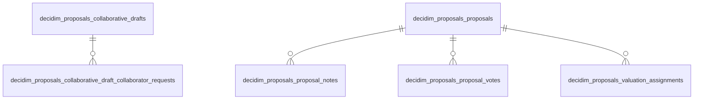

<!-- Gerado por scripts/banco_de_dados.py em 2026-10-07T12:08:06+00:00. Não edite à mão. -->

# Propostas e texto participativo

Propostas, votos, emendas, coautorias, rascunhos colaborativos, avaliação e textos participativos.

**9 tabelas.** Schema versão `20260405195511`. Legenda da coluna **Referência**: *FK* = chave estrangeira declarada no banco; *→* = referência por convenção de nome (sem restrição no banco).

## Relacionamentos

Relações entre as tabelas deste domínio. Referências para outros domínios aparecem nas tabelas abaixo.

## Tabelas

| Tabela | Descrição | Colunas | Origem |
|---|---|---:|---|
| [`decidim_amendments`](#decidim-amendments) | Emendas entre recursos emendáveis (propostas). | 9 | Decidim |
| [`decidim_coauthorships`](#decidim-coauthorships) | Coautoria polimórfica de recursos. | 8 | Decidim |
| [`decidim_proposals_collaborative_draft_collaborator_requests`](#decidim-proposals-collaborative-draft-collaborator-requests) | — | 5 | Decidim |
| [`decidim_proposals_collaborative_drafts`](#decidim-proposals-collaborative-drafts) | Rascunhos colaborativos de propostas. | 19 | Decidim |
| [`decidim_proposals_participatory_texts`](#decidim-proposals-participatory-texts) | Cabeçalho (título e descrição) do texto participativo de um componente. | 6 | Decidim |
| [`decidim_proposals_proposal_notes`](#decidim-proposals-proposal-notes) | Notas privadas de administradores sobre propostas. | 6 | Decidim |
| [`decidim_proposals_proposal_votes`](#decidim-proposals-proposal-votes) | Votos em propostas. | 6 | Decidim |
| [`decidim_proposals_proposals`](#decidim-proposals-proposals) | Propostas. Também representam parágrafos de textos participativos (`participatory_text_level`, `position`). | 32 | Decidim |
| [`decidim_proposals_valuation_assignments`](#decidim-proposals-valuation-assignments) | Atribuição de propostas a avaliadores. | 6 | Decidim |

### `decidim_amendments` { #decidim-amendments }

Emendas entre recursos emendáveis (propostas).

Origem: Decidim.

| Coluna | Tipo | Nulo | Padrão | Referência / observação | Origem |
|---|---|:---:|---|---|---|
| `id` | `bigint` | não |  | chave primária |  |
| `decidim_user_id` | `bigint` | não |  | → [`decidim_users`](organizacao-usuarios.md#decidim-users) |  |
| `decidim_amendable_type` | `string` | sim |  |  |  |
| `decidim_amendable_id` | `bigint` | sim |  | polimórfico (tipo em `decidim_amendable_type`) |  |
| `decidim_emendation_type` | `string` | sim |  |  |  |
| `decidim_emendation_id` | `bigint` | sim |  | polimórfico (tipo em `decidim_emendation_type`) |  |
| `state` | `string` | sim |  |  |  |
| `created_at` | `datetime` | não |  |  |  |
| `updated_at` | `datetime` | não |  |  |  |

??? note "Índices (5)"

    | Nome | Colunas | Único | Tipo |
    |---|---|:---:|---|
    | `index_on_amendable` | `decidim_amendable_id`, `decidim_amendable_type` |  | btree |
    | `index_decidim_amendments_on_decidim_emendation_id` | `decidim_emendation_id` |  | btree |
    | `index_on_amender_and_amendable` | `decidim_user_id`, `decidim_amendable_id`, `decidim_amendable_type` |  | btree |
    | `index_decidim_amendments_on_decidim_user_id` | `decidim_user_id` |  | btree |
    | `index_decidim_amendments_on_state` | `state` |  | btree |

### `decidim_coauthorships` { #decidim-coauthorships }

Coautoria polimórfica de recursos.

Origem: Decidim.

| Coluna | Tipo | Nulo | Padrão | Referência / observação | Origem |
|---|---|:---:|---|---|---|
| `id` | `bigint` | não |  | chave primária |  |
| `decidim_author_id` | `bigint` | não |  | polimórfico (tipo em `decidim_author_type`) |  |
| `decidim_user_group_id` | `bigint` | sim |  | → [`decidim_users`](organizacao-usuarios.md#decidim-users) |  |
| `coauthorable_type` | `string` | sim |  |  |  |
| `coauthorable_id` | `bigint` | sim |  | polimórfico (tipo em `coauthorable_type`) |  |
| `created_at` | `datetime` | não |  |  |  |
| `updated_at` | `datetime` | não |  |  |  |
| `decidim_author_type` | `string` | não |  |  |  |

??? note "Índices (3)"

    | Nome | Colunas | Único | Tipo |
    |---|---|:---:|---|
    | `index_coauthorable_on_coauthorship` | `coauthorable_type`, `coauthorable_id` |  | btree |
    | `index_decidim_coauthorships_on_decidim_author` | `decidim_author_id`, `decidim_author_type` |  | btree |
    | `index_user_group_on_coauthorsihp` | `decidim_user_group_id` |  | btree |

### `decidim_proposals_collaborative_draft_collaborator_requests` { #decidim-proposals-collaborative-draft-collaborator-requests }

Origem: Decidim.

| Coluna | Tipo | Nulo | Padrão | Referência / observação | Origem |
|---|---|:---:|---|---|---|
| `id` | `bigint` | não |  | chave primária |  |
| `decidim_proposals_collaborative_draft_id` | `bigint` | não |  | → [`decidim_proposals_collaborative_drafts`](propostas.md#decidim-proposals-collaborative-drafts) |  |
| `decidim_user_id` | `bigint` | não |  | → [`decidim_users`](organizacao-usuarios.md#decidim-users) |  |
| `created_at` | `datetime` | não |  |  |  |
| `updated_at` | `datetime` | não |  |  |  |

??? note "Índices (2)"

    | Nome | Colunas | Único | Tipo |
    |---|---|:---:|---|
    | `index_collab_requests_on_decidim_proposals_collab_draft_id` | `decidim_proposals_collaborative_draft_id` |  | btree |
    | `index_collab_requests_on_decidim_user_id` | `decidim_user_id` |  | btree |

### `decidim_proposals_collaborative_drafts` { #decidim-proposals-collaborative-drafts }

Rascunhos colaborativos de propostas.

Origem: Decidim.

| Coluna | Tipo | Nulo | Padrão | Referência / observação | Origem |
|---|---|:---:|---|---|---|
| `id` | `bigint` | não |  | chave primária |  |
| `title` | `text` | não |  |  |  |
| `body` | `text` | não |  |  |  |
| `decidim_component_id` | `integer` | não |  | → [`decidim_components`](componentes-conteudo.md#decidim-components) |  |
| `decidim_scope_id` | `integer` | sim |  | → [`decidim_scopes`](componentes-conteudo.md#decidim-scopes) |  |
| `state` | `string` | sim |  |  |  |
| `reference` | `string` | sim |  |  |  |
| `address` | `text` | sim |  |  |  |
| `latitude` | `float` | sim |  |  |  |
| `longitude` | `float` | sim |  |  |  |
| `published_at` | `datetime` | sim |  |  |  |
| `authors_count` | `integer` | não | `0` | contador em cache |  |
| `versions_count` | `integer` | não | `0` | contador em cache |  |
| `contributions_count` | `integer` | não | `0` | contador em cache |  |
| `created_at` | `datetime` | não |  |  |  |
| `updated_at` | `datetime` | não |  |  |  |
| `coauthorships_count` | `integer` | não | `0` | contador em cache |  |
| `comments_count` | `integer` | não | `0` | contador em cache |  |
| `follows_count` | `integer` | não | `0` | contador em cache |  |

??? note "Índices (6)"

    | Nome | Colunas | Único | Tipo |
    |---|---|:---:|---|
    | `decidim_proposals_collaborative_draft_body_search` | `body` |  | btree |
    | `decidim_proposals_collaborative_drafts_on_decidim_component_id` | `decidim_component_id` |  | btree |
    | `decidim_proposals_collaborative_drafts_on_decidim_scope_id` | `decidim_scope_id` |  | btree |
    | `decidim_proposals_collaborative_drafts_on_state` | `state` |  | btree |
    | `decidim_proposals_collaborative_drafts_title_search` | `title` |  | btree |
    | `decidim_proposals_collaborative_drafts_on_updated_at` | `updated_at` |  | btree |

### `decidim_proposals_participatory_texts` { #decidim-proposals-participatory-texts }

Cabeçalho (título e descrição) do texto participativo de um componente.

Origem: Decidim.

| Coluna | Tipo | Nulo | Padrão | Referência / observação | Origem |
|---|---|:---:|---|---|---|
| `id` | `bigint` | não |  | chave primária |  |
| `title` | `jsonb` | sim |  | traduzível (`{"pt-BR": …}`) |  |
| `description` | `jsonb` | sim |  | traduzível (`{"pt-BR": …}`) |  |
| `decidim_component_id` | `bigint` | não |  | → [`decidim_components`](componentes-conteudo.md#decidim-components) |  |
| `created_at` | `datetime` | não |  |  |  |
| `updated_at` | `datetime` | não |  |  |  |

??? note "Índices (1)"

    | Nome | Colunas | Único | Tipo |
    |---|---|:---:|---|
    | `idx_participatory_texts_on_decidim_component_id` | `decidim_component_id` |  | btree |

### `decidim_proposals_proposal_notes` { #decidim-proposals-proposal-notes }

Notas privadas de administradores sobre propostas.

Origem: Decidim.

| Coluna | Tipo | Nulo | Padrão | Referência / observação | Origem |
|---|---|:---:|---|---|---|
| `id` | `bigint` | não |  | chave primária |  |
| `decidim_proposal_id` | `bigint` | não |  | → [`decidim_proposals_proposals`](propostas.md#decidim-proposals-proposals) |  |
| `decidim_author_id` | `bigint` | não |  |  |  |
| `body` | `text` | não |  |  |  |
| `created_at` | `datetime` | não |  |  |  |
| `updated_at` | `datetime` | não |  |  |  |

??? note "Índices (3)"

    | Nome | Colunas | Único | Tipo |
    |---|---|:---:|---|
    | `index_decidim_proposals_proposal_notes_on_created_at` | `created_at` |  | btree |
    | `decidim_proposals_proposal_note_author` | `decidim_author_id` |  | btree |
    | `decidim_proposals_proposal_note_proposal` | `decidim_proposal_id` |  | btree |

### `decidim_proposals_proposal_votes` { #decidim-proposals-proposal-votes }

Votos em propostas.

Origem: Decidim.

| Coluna | Tipo | Nulo | Padrão | Referência / observação | Origem |
|---|---|:---:|---|---|---|
| `id` | `serial` | não |  | chave primária |  |
| `decidim_proposal_id` | `integer` | não |  | → [`decidim_proposals_proposals`](propostas.md#decidim-proposals-proposals) |  |
| `decidim_author_id` | `integer` | não |  |  |  |
| `created_at` | `datetime` | não |  |  |  |
| `updated_at` | `datetime` | não |  |  |  |
| `temporary` | `boolean` | não | `false` |  |  |

??? note "Índices (3)"

    | Nome | Colunas | Único | Tipo |
    |---|---|:---:|---|
    | `decidim_proposals_proposal_vote_author` | `decidim_author_id` |  | btree |
    | `decidim_proposals_proposal_vote_proposal_author_unique` | `decidim_proposal_id`, `decidim_author_id` | sim | btree |
    | `decidim_proposals_proposal_vote_proposal` | `decidim_proposal_id` |  | btree |

### `decidim_proposals_proposals` { #decidim-proposals-proposals }

Propostas. Também representam parágrafos de textos participativos (`participatory_text_level`, `position`).

Origem: Decidim.

| Coluna | Tipo | Nulo | Padrão | Referência / observação | Origem |
|---|---|:---:|---|---|---|
| `id` | `serial` | não |  | chave primária |  |
| `decidim_component_id` | `integer` | não |  | → [`decidim_components`](componentes-conteudo.md#decidim-components) |  |
| `decidim_scope_id` | `integer` | sim |  | → [`decidim_scopes`](componentes-conteudo.md#decidim-scopes) |  |
| `created_at` | `datetime` | não |  |  |  |
| `updated_at` | `datetime` | não |  |  |  |
| `proposal_votes_count` | `integer` | não | `0` | contador em cache |  |
| `state` | `string` | sim |  |  |  |
| `answered_at` | `datetime` | sim |  |  |  |
| `answer` | `jsonb` | sim |  | traduzível (`{"pt-BR": …}`) |  |
| `reference` | `string` | sim |  |  |  |
| `address` | `text` | sim |  |  |  |
| `latitude` | `float` | sim |  |  |  |
| `longitude` | `float` | sim |  |  |  |
| `published_at` | `datetime` | sim |  |  |  |
| `proposal_notes_count` | `integer` | não | `0` | contador em cache |  |
| `coauthorships_count` | `integer` | não | `0` | contador em cache |  |
| `participatory_text_level` | `string` | sim |  |  |  |
| `position` | `integer` | sim |  |  |  |
| `created_in_meeting` | `boolean` | sim | `false` |  |  |
| `cost` | `decimal` | sim |  |  |  |
| `cost_report` | `jsonb` | sim |  |  |  |
| `execution_period` | `jsonb` | sim |  |  |  |
| `state_published_at` | `datetime` | sim |  |  |  |
| `endorsements_count` | `integer` | não | `0` | contador em cache |  |
| `title` | `jsonb` | sim |  | traduzível (`{"pt-BR": …}`) |  |
| `body` | `jsonb` | sim |  | traduzível (`{"pt-BR": …}`) |  |
| `comments_count` | `integer` | não | `0` | contador em cache |  |
| `follows_count` | `integer` | não | `0` | contador em cache |  |
| `is_interactive` | `boolean` | sim | `true` |  | [:flag_br: BP](https://gitlab.com/lappis-unb/decidimbr/decidim-govbr/-/blob/main/db/migrate/20240207132116_add_is_interactive_to_decidim_proposals_proposals.rb "20240207132116_add_is_interactive_to_decidim_proposals_proposals.rb") |
| `badge_array` | `string[]` | sim | `[]` |  | [:flag_br: BP](https://gitlab.com/lappis-unb/decidimbr/decidim-govbr/-/blob/main/db/migrate/20240603171727_add_badge_array_to_decidim_proposals_proposals.rb "20240603171727_add_badge_array_to_decidim_proposals_proposals.rb") |
| `associated_state` | `integer` | sim |  |  | [:flag_br: BP](https://gitlab.com/lappis-unb/decidimbr/decidim-govbr/-/blob/main/db/migrate/20241115031145_add_associated_state_to_decidim_proposals_proposals.rb "20241115031145_add_associated_state_to_decidim_proposals_proposals.rb") |
| `is_hidden` | `boolean` | sim | `false` |  | [:flag_br: BP](https://gitlab.com/lappis-unb/decidimbr/decidim-govbr/-/blob/main/db/migrate/20241203204147_add_is_hidden_to_decidim_proposals_proposals.rb "20241203204147_add_is_hidden_to_decidim_proposals_proposals.rb") |

??? note "Índices (7)"

    | Nome | Colunas | Único | Tipo |
    |---|---|:---:|---|
    | `decidim_proposals_proposal_body_search` | `md5((body)::text)` |  | btree |
    | `decidim_proposals_proposal_title_search` | `md5((title)::text)` |  | btree |
    | `index_decidim_proposals_proposals_on_created_at` | `created_at` |  | btree |
    | `index_decidim_proposals_proposals_on_decidim_component_id` | `decidim_component_id` |  | btree |
    | `index_decidim_proposals_proposals_on_decidim_scope_id` | `decidim_scope_id` |  | btree |
    | `index_decidim_proposals_proposals_on_proposal_votes_count` | `proposal_votes_count` |  | btree |
    | `index_decidim_proposals_proposals_on_state` | `state` |  | btree |

### `decidim_proposals_valuation_assignments` { #decidim-proposals-valuation-assignments }

Atribuição de propostas a avaliadores.

Origem: Decidim.

| Coluna | Tipo | Nulo | Padrão | Referência / observação | Origem |
|---|---|:---:|---|---|---|
| `id` | `bigint` | não |  | chave primária |  |
| `decidim_proposal_id` | `bigint` | não |  | → [`decidim_proposals_proposals`](propostas.md#decidim-proposals-proposals) |  |
| `valuator_role_type` | `string` | não |  |  |  |
| `valuator_role_id` | `bigint` | não |  | polimórfico (tipo em `valuator_role_type`) |  |
| `created_at` | `datetime` | não |  |  |  |
| `updated_at` | `datetime` | não |  |  |  |

??? note "Índices (2)"

    | Nome | Colunas | Único | Tipo |
    |---|---|:---:|---|
    | `decidim_proposals_valuation_assignment_proposal` | `decidim_proposal_id` |  | btree |
    | `decidim_proposals_valuation_assignment_valuator_role` | `valuator_role_type`, `valuator_role_id` |  | btree |

