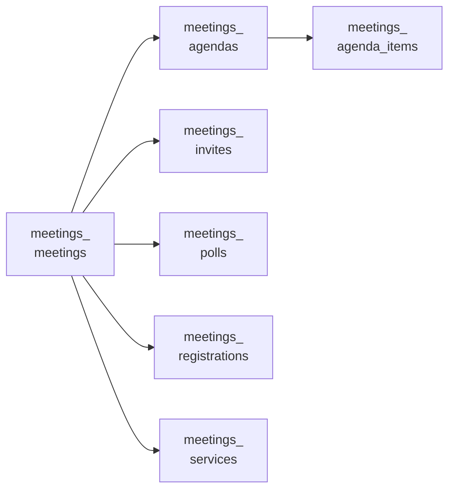

<!-- Gerado por scripts/banco_de_dados.py em 2026-10-07T13:00:08+00:00. Não edite à mão. -->

# Reuniões e eventos

Reuniões, inscrições, convites, pautas, enquetes ao vivo e eventos externos de calendário.

**13 tabelas.** Schema versão `20260405195511`. Legenda da coluna **Referência**: *FK* = chave estrangeira declarada no banco; *→* = referência por convenção de nome (sem restrição no banco).

## Relacionamentos

Cada seta vai da tabela referenciada para a tabela que guarda a referência. Referências para outros domínios aparecem na coluna **Referência** das tabelas abaixo.

## Tabelas

| Tabela | Descrição | Colunas | Origem |
|---|---|---:|---|
| [`decidim_event_calendar_external_events`](#decidim-event-calendar-external-events) | — | 8 | `decidim-calendar` |
| [`decidim_meetings_agenda_items`](#decidim-meetings-agenda-items) | — | 9 | Decidim |
| [`decidim_meetings_agendas`](#decidim-meetings-agendas) | — | 6 | Decidim |
| [`decidim_meetings_answer_choices`](#decidim-meetings-answer-choices) | — | 6 | Decidim |
| [`decidim_meetings_answer_options`](#decidim-meetings-answer-options) | — | 3 | Decidim |
| [`decidim_meetings_answers`](#decidim-meetings-answers) | — | 6 | Decidim |
| [`decidim_meetings_invites`](#decidim-meetings-invites) | — | 8 | Decidim |
| [`decidim_meetings_meetings`](#decidim-meetings-meetings) | Reuniões e eventos. | 53 | Decidim |
| [`decidim_meetings_polls`](#decidim-meetings-polls) | — | 4 | Decidim |
| [`decidim_meetings_questionnaires`](#decidim-meetings-questionnaires) | — | 5 | Decidim |
| [`decidim_meetings_questions`](#decidim-meetings-questions) | — | 9 | Decidim |
| [`decidim_meetings_registrations`](#decidim-meetings-registrations) | Inscrições em reuniões. | 9 | Decidim |
| [`decidim_meetings_services`](#decidim-meetings-services) | — | 6 | Decidim |

### `decidim_event_calendar_external_events` { #decidim-event-calendar-external-events }

Origem: `decidim-calendar`.

| Coluna | Tipo | Nulo | Padrão | Referência / observação | Origem |
|---|---|:---:|---|---|---|
| `id` | `bigint` | não |  | chave primária |  |
| `title` | `jsonb` | não |  | traduzível (`{"pt-BR": …}`) |  |
| `start_at` | `datetime` | não |  |  |  |
| `end_at` | `datetime` | não |  |  |  |
| `url` | `string` | sim |  |  |  |
| `decidim_author_id` | `integer` | não |  | polimórfico (tipo em `decidim_author_type`) |  |
| `decidim_author_type` | `string` | sim |  |  |  |
| `decidim_organization_id` | `integer` | não |  | → [`decidim_organizations`](organizacao-usuarios.md#decidim-organizations) |  |

??? note "Índices (2)"

    | Nome | Colunas | Único | Tipo |
    |---|---|:---:|---|
    | `decidim_calendar_external_event_author` | `decidim_author_id` |  | btree |
    | `decidim_calendar_external_event_organization` | `decidim_organization_id` |  | btree |

### `decidim_meetings_agenda_items` { #decidim-meetings-agenda-items }

Origem: Decidim.

| Coluna | Tipo | Nulo | Padrão | Referência / observação | Origem |
|---|---|:---:|---|---|---|
| `id` | `bigint` | não |  | chave primária |  |
| `decidim_agenda_id` | `bigint` | sim |  | → [`decidim_meetings_agendas`](reunioes.md#decidim-meetings-agendas) |  |
| `position` | `integer` | sim |  |  |  |
| `parent_id` | `bigint` | sim |  | → [`decidim_meetings_agenda_items`](reunioes.md#decidim-meetings-agenda-items) |  |
| `duration` | `integer` | sim |  |  |  |
| `title` | `jsonb` | sim |  | traduzível (`{"pt-BR": …}`) |  |
| `description` | `jsonb` | sim |  | traduzível (`{"pt-BR": …}`) |  |
| `created_at` | `datetime` | não |  |  |  |
| `updated_at` | `datetime` | não |  |  |  |

??? note "Índices (2)"

    | Nome | Colunas | Único | Tipo |
    |---|---|:---:|---|
    | `index_decidim_meetings_agenda_items_on_decidim_agenda_id` | `decidim_agenda_id` |  | btree |
    | `index_decidim_meetings_agenda_items_on_parent_id` | `parent_id` |  | btree |

### `decidim_meetings_agendas` { #decidim-meetings-agendas }

Origem: Decidim.

| Coluna | Tipo | Nulo | Padrão | Referência / observação | Origem |
|---|---|:---:|---|---|---|
| `id` | `bigint` | não |  | chave primária |  |
| `title` | `jsonb` | sim |  | traduzível (`{"pt-BR": …}`) |  |
| `decidim_meeting_id` | `bigint` | não |  | → [`decidim_meetings_meetings`](reunioes.md#decidim-meetings-meetings) |  |
| `visible` | `boolean` | sim |  |  |  |
| `created_at` | `datetime` | não |  |  |  |
| `updated_at` | `datetime` | não |  |  |  |

??? note "Índices (1)"

    | Nome | Colunas | Único | Tipo |
    |---|---|:---:|---|
    | `index_decidim_meetings_agendas_on_decidim_meeting_id` | `decidim_meeting_id` |  | btree |

### `decidim_meetings_answer_choices` { #decidim-meetings-answer-choices }

Origem: Decidim.

| Coluna | Tipo | Nulo | Padrão | Referência / observação | Origem |
|---|---|:---:|---|---|---|
| `id` | `bigint` | não |  | chave primária |  |
| `decidim_answer_id` | `bigint` | sim |  | → [`decidim_forms_answers`](formularios.md#decidim-forms-answers) |  |
| `decidim_answer_option_id` | `bigint` | sim |  | → [`decidim_forms_answer_options`](formularios.md#decidim-forms-answer-options) |  |
| `position` | `integer` | sim |  |  |  |
| `body` | `jsonb` | sim |  | traduzível (`{"pt-BR": …}`) |  |
| `custom_body` | `text` | sim |  |  |  |

??? note "Índices (2)"

    | Nome | Colunas | Único | Tipo |
    |---|---|:---:|---|
    | `index_decidim_meetings_answer_choices_answer_id` | `decidim_answer_id` |  | btree |
    | `index_decidim_meetings_answer_choices_answer_option_id` | `decidim_answer_option_id` |  | btree |

### `decidim_meetings_answer_options` { #decidim-meetings-answer-options }

Origem: Decidim.

| Coluna | Tipo | Nulo | Padrão | Referência / observação | Origem |
|---|---|:---:|---|---|---|
| `id` | `bigint` | não |  | chave primária |  |
| `decidim_question_id` | `bigint` | sim |  | → [`decidim_forms_questions`](formularios.md#decidim-forms-questions) |  |
| `body` | `jsonb` | sim |  | traduzível (`{"pt-BR": …}`) |  |

??? note "Índices (1)"

    | Nome | Colunas | Único | Tipo |
    |---|---|:---:|---|
    | `index_decidim_meetings_answer_options_question_id` | `decidim_question_id` |  | btree |

### `decidim_meetings_answers` { #decidim-meetings-answers }

Origem: Decidim.

| Coluna | Tipo | Nulo | Padrão | Referência / observação | Origem |
|---|---|:---:|---|---|---|
| `id` | `bigint` | não |  | chave primária |  |
| `decidim_user_id` | `bigint` | sim |  | → [`decidim_users`](organizacao-usuarios.md#decidim-users) |  |
| `decidim_questionnaire_id` | `bigint` | sim |  | → [`decidim_forms_questionnaires`](formularios.md#decidim-forms-questionnaires) |  |
| `decidim_question_id` | `bigint` | sim |  | → [`decidim_forms_questions`](formularios.md#decidim-forms-questions) |  |
| `created_at` | `datetime` | não |  |  |  |
| `updated_at` | `datetime` | não |  |  |  |

??? note "Índices (3)"

    | Nome | Colunas | Único | Tipo |
    |---|---|:---:|---|
    | `index_decidim_meetings_answers_question_id` | `decidim_question_id` |  | btree |
    | `index_decidim_meetings_answers_on_decidim_questionnaire_id` | `decidim_questionnaire_id` |  | btree |
    | `index_decidim_meetings_answers_on_decidim_user_id` | `decidim_user_id` |  | btree |

### `decidim_meetings_invites` { #decidim-meetings-invites }

Origem: Decidim.

| Coluna | Tipo | Nulo | Padrão | Referência / observação | Origem |
|---|---|:---:|---|---|---|
| `id` | `bigint` | não |  | chave primária |  |
| `decidim_user_id` | `bigint` | não |  | → [`decidim_users`](organizacao-usuarios.md#decidim-users) |  |
| `decidim_meeting_id` | `bigint` | não |  | → [`decidim_meetings_meetings`](reunioes.md#decidim-meetings-meetings) |  |
| `sent_at` | `datetime` | sim |  |  |  |
| `accepted_at` | `datetime` | sim |  |  |  |
| `rejected_at` | `datetime` | sim |  |  |  |
| `created_at` | `datetime` | não |  |  |  |
| `updated_at` | `datetime` | não |  |  |  |

??? note "Índices (2)"

    | Nome | Colunas | Único | Tipo |
    |---|---|:---:|---|
    | `index_decidim_meetings_invites_on_decidim_meeting_id` | `decidim_meeting_id` |  | btree |
    | `index_decidim_meetings_invites_on_decidim_user_id` | `decidim_user_id` |  | btree |

### `decidim_meetings_meetings` { #decidim-meetings-meetings }

Reuniões e eventos.

Origem: Decidim.

| Coluna | Tipo | Nulo | Padrão | Referência / observação | Origem |
|---|---|:---:|---|---|---|
| `id` | `serial` | não |  | chave primária |  |
| `title` | `jsonb` | sim |  | traduzível (`{"pt-BR": …}`) |  |
| `description` | `jsonb` | sim |  | traduzível (`{"pt-BR": …}`) |  |
| `start_time` | `datetime` | sim |  |  |  |
| `end_time` | `datetime` | sim |  |  |  |
| `address` | `text` | sim |  |  |  |
| `location` | `jsonb` | sim |  |  |  |
| `location_hints` | `jsonb` | sim |  |  |  |
| `decidim_component_id` | `integer` | sim |  | → [`decidim_components`](componentes-conteudo.md#decidim-components) |  |
| `decidim_author_id` | `integer` | sim |  | polimórfico (tipo em `decidim_author_type`) |  |
| `decidim_scope_id` | `integer` | sim |  | → [`decidim_scopes`](componentes-conteudo.md#decidim-scopes) |  |
| `created_at` | `datetime` | não |  |  |  |
| `updated_at` | `datetime` | não |  |  |  |
| `closing_report` | `jsonb` | sim |  |  |  |
| `attendees_count` | `integer` | sim |  | contador em cache |  |
| `contributions_count` | `integer` | sim |  | contador em cache |  |
| `attending_organizations` | `text` | sim |  |  |  |
| `closed_at` | `time` | sim |  |  |  |
| `latitude` | `float` | sim |  |  |  |
| `longitude` | `float` | sim |  |  |  |
| `reference` | `string` | sim |  |  |  |
| `registrations_enabled` | `boolean` | não | `false` |  |  |
| `available_slots` | `integer` | não | `0` |  |  |
| `registration_terms` | `jsonb` | sim |  |  |  |
| `reserved_slots` | `integer` | não | `0` |  |  |
| `private_meeting` | `boolean` | sim | `false` |  |  |
| `transparent` | `boolean` | sim | `true` |  |  |
| `registration_form_enabled` | `boolean` | sim | `false` |  |  |
| `decidim_author_type` | `string` | sim |  |  |  |
| `decidim_user_group_id` | `integer` | sim |  | → [`decidim_users`](organizacao-usuarios.md#decidim-users) |  |
| `comments_count` | `integer` | não | `0` | contador em cache |  |
| `salt` | `string` | sim |  |  |  |
| `online_meeting_url` | `string` | sim |  |  |  |
| `type_of_meeting` | `string` | sim | `"in_person"` |  |  |
| `registration_type` | `string` | não | `"registration_disabled"` |  |  |
| `registration_url` | `string` | sim |  |  |  |
| `follows_count` | `integer` | não | `0` | contador em cache |  |
| `customize_registration_email` | `boolean` | sim | `false` |  |  |
| `registration_email_custom_content` | `jsonb` | sim |  |  |  |
| `published_at` | `datetime` | sim |  |  |  |
| `video_url` | `string` | sim |  |  |  |
| `audio_url` | `string` | sim |  |  |  |
| `closing_visible` | `boolean` | sim |  |  |  |
| `comments_enabled` | `boolean` | sim | `true` |  |  |
| `comments_start_time` | `datetime` | sim |  |  |  |
| `comments_end_time` | `datetime` | sim |  |  |  |
| `state` | `string` | sim |  |  |  |
| `iframe_access_level` | `integer` | sim | `0` |  |  |
| `iframe_embed_type` | `integer` | sim | `0` |  |  |
| `associated_state` | `integer` | sim | `0` |  | [:flag_br: BP](https://gitlab.com/lappis-unb/decidimbr/decidim-govbr/-/blob/main/db/migrate/20240326181857_add_associated_state_to_decidim_meetings_meetings.rb "20240326181857_add_associated_state_to_decidim_meetings_meetings.rb") |
| `to_define` | `boolean` | sim | `false` |  | [:flag_br: BP](https://gitlab.com/lappis-unb/decidimbr/decidim-govbr/-/blob/main/db/migrate/20240822125552_new_date_option_in_decidim_meetings.rb "20240822125552_new_date_option_in_decidim_meetings.rb") |
| `elected_delegates_enabled` | `boolean` | sim | `false` |  | [:flag_br: BP](https://gitlab.com/lappis-unb/decidimbr/decidim-govbr/-/blob/main/db/migrate/20241127193453_add_elected_availability_colum_to_meeting_table.rb "20241127193453_add_elected_availability_colum_to_meeting_table.rb") |
| `elected_delegates` | `text` | sim |  |  | [:flag_br: BP](https://gitlab.com/lappis-unb/decidimbr/decidim-govbr/-/blob/main/db/migrate/20250326133700_add_elected_delegates_to_decidim_meetings_meetings.rb "20250326133700_add_elected_delegates_to_decidim_meetings_meetings.rb") |

??? note "Índices (4)"

    | Nome | Colunas | Único | Tipo |
    |---|---|:---:|---|
    | `index_decidim_meetings_meetings_on_author` | `decidim_author_id`, `decidim_author_type` |  | btree |
    | `index_decidim_meetings_meetings_on_decidim_author_id` | `decidim_author_id` |  | btree |
    | `index_decidim_meetings_meetings_on_decidim_component_id` | `decidim_component_id` |  | btree |
    | `index_decidim_meetings_meetings_on_decidim_scope_id` | `decidim_scope_id` |  | btree |

### `decidim_meetings_polls` { #decidim-meetings-polls }

Origem: Decidim.

| Coluna | Tipo | Nulo | Padrão | Referência / observação | Origem |
|---|---|:---:|---|---|---|
| `id` | `bigint` | não |  | chave primária |  |
| `decidim_meeting_id` | `bigint` | sim |  | → [`decidim_meetings_meetings`](reunioes.md#decidim-meetings-meetings) |  |
| `created_at` | `datetime` | não |  |  |  |
| `updated_at` | `datetime` | não |  |  |  |

??? note "Índices (1)"

    | Nome | Colunas | Único | Tipo |
    |---|---|:---:|---|
    | `index_decidim_meetings_polls_on_decidim_meeting_id` | `decidim_meeting_id` |  | btree |

### `decidim_meetings_questionnaires` { #decidim-meetings-questionnaires }

Origem: Decidim.

| Coluna | Tipo | Nulo | Padrão | Referência / observação | Origem |
|---|---|:---:|---|---|---|
| `id` | `bigint` | não |  | chave primária |  |
| `questionnaire_for_type` | `string` | sim |  |  |  |
| `questionnaire_for_id` | `bigint` | sim |  | polimórfico (tipo em `questionnaire_for_type`) |  |
| `created_at` | `datetime` | não |  |  |  |
| `updated_at` | `datetime` | não |  |  |  |

??? note "Índices (1)"

    | Nome | Colunas | Único | Tipo |
    |---|---|:---:|---|
    | `index_decidim_meetings_questionnaires_questionnaire_for` | `questionnaire_for_type`, `questionnaire_for_id` |  | btree |

### `decidim_meetings_questions` { #decidim-meetings-questions }

Origem: Decidim.

| Coluna | Tipo | Nulo | Padrão | Referência / observação | Origem |
|---|---|:---:|---|---|---|
| `id` | `bigint` | não |  | chave primária |  |
| `decidim_questionnaire_id` | `bigint` | sim |  | → [`decidim_forms_questionnaires`](formularios.md#decidim-forms-questionnaires) |  |
| `position` | `integer` | sim |  |  |  |
| `question_type` | `string` | sim |  |  |  |
| `body` | `jsonb` | sim |  | traduzível (`{"pt-BR": …}`) |  |
| `max_choices` | `integer` | sim |  |  |  |
| `created_at` | `datetime` | não |  |  |  |
| `updated_at` | `datetime` | não |  |  |  |
| `status` | `integer` | sim | `0` |  |  |

??? note "Índices (2)"

    | Nome | Colunas | Único | Tipo |
    |---|---|:---:|---|
    | `index_decidim_meetings_questions_on_decidim_questionnaire_id` | `decidim_questionnaire_id` |  | btree |
    | `index_decidim_meetings_questions_on_position` | `position` |  | btree |

### `decidim_meetings_registrations` { #decidim-meetings-registrations }

Inscrições em reuniões.

Origem: Decidim.

| Coluna | Tipo | Nulo | Padrão | Referência / observação | Origem |
|---|---|:---:|---|---|---|
| `id` | `bigint` | não |  | chave primária |  |
| `decidim_user_id` | `bigint` | não |  | → [`decidim_users`](organizacao-usuarios.md#decidim-users) |  |
| `decidim_meeting_id` | `bigint` | não |  | → [`decidim_meetings_meetings`](reunioes.md#decidim-meetings-meetings) |  |
| `created_at` | `datetime` | não |  |  |  |
| `updated_at` | `datetime` | não |  |  |  |
| `code` | `string` | sim |  |  |  |
| `validated_at` | `datetime` | sim |  |  |  |
| `decidim_user_group_id` | `bigint` | sim |  | → [`decidim_users`](organizacao-usuarios.md#decidim-users) |  |
| `public_participation` | `boolean` | sim | `false` |  |  |

??? note "Índices (4)"

    | Nome | Colunas | Único | Tipo |
    |---|---|:---:|---|
    | `index_decidim_meetings_registrations_on_decidim_meeting_id` | `decidim_meeting_id` |  | btree |
    | `index_decidim_meetings_registrations_on_decidim_user_group_id` | `decidim_user_group_id` |  | btree |
    | `decidim_meetings_registrations_user_meeting_unique` | `decidim_user_id`, `decidim_meeting_id` | sim | btree |
    | `index_decidim_meetings_registrations_on_decidim_user_id` | `decidim_user_id` |  | btree |

### `decidim_meetings_services` { #decidim-meetings-services }

Origem: Decidim.

| Coluna | Tipo | Nulo | Padrão | Referência / observação | Origem |
|---|---|:---:|---|---|---|
| `id` | `bigint` | não |  | chave primária |  |
| `title` | `jsonb` | sim |  | traduzível (`{"pt-BR": …}`) |  |
| `description` | `jsonb` | sim |  | traduzível (`{"pt-BR": …}`) |  |
| `decidim_meeting_id` | `bigint` | não |  | → [`decidim_meetings_meetings`](reunioes.md#decidim-meetings-meetings) |  |
| `created_at` | `datetime` | não |  |  |  |
| `updated_at` | `datetime` | não |  |  |  |

??? note "Índices (1)"

    | Nome | Colunas | Único | Tipo |
    |---|---|:---:|---|
    | `index_decidim_meetings_services_on_decidim_meeting_id` | `decidim_meeting_id` |  | btree |

