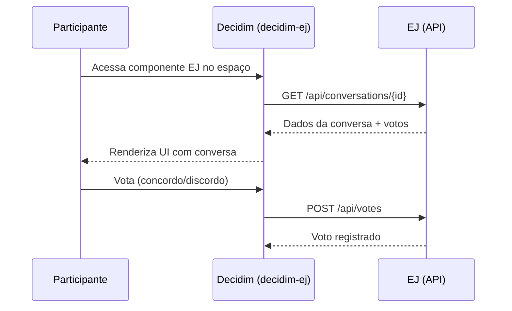

# decidim-ej

**Tipo**: Componente customizado (LAPPIS/UnB)
**Repositório**: [components-brasil-participativo](https://gitlab.com/lappis-unb/decidimbr/components-brasil-participativo)

Componente que integra o Brasil Participativo com o [Empurrando Juntas (EJ)](https://ejplatform.org/) — plataforma de opinião e votação desenvolvida pelo LAPPIS/UnB.

## Funcionalidades

- **Conversas EJ** — exibição de conversas do EJ dentro de espaços participativos do Decidim
- **Votação inline** — participantes votam (concordo/discordo/passo) diretamente na interface do Decidim
- **Visualização de resultados** — clusters de opinião e estatísticas do EJ exibidos com UI própria
- **Sincronização** — dados consumidos da API REST do EJ em tempo real

## Arquitetura de Integração

## Configuração

| Variável | Descrição |
|----------|-----------|
| `EJ_API_URL` | URL base da API do EJ |

No painel admin, ao adicionar o componente EJ a um espaço:

1. Selecione a conversa EJ a ser exibida
2. Configure opções de visualização

!!! warning "Dependência externa"
    O EJ é um serviço externo que precisa estar rodando e acessível. Se a API do EJ estiver indisponível, o componente não funcionará. Consulte o [Guia do Operador — Configuração](../operador/configuracao.md) para detalhes.

## Sobre o Empurrando Juntas

O EJ é uma plataforma de inteligência coletiva que organiza opiniões em clusters usando algoritmos de agrupamento. Desenvolvido pelo LAPPIS/UnB, é usado em diversos contextos de participação social no Brasil.

- **Site**: [ejplatform.org](https://ejplatform.org/)
- **Código**: [GitHub](https://github.com/ejplatform)
