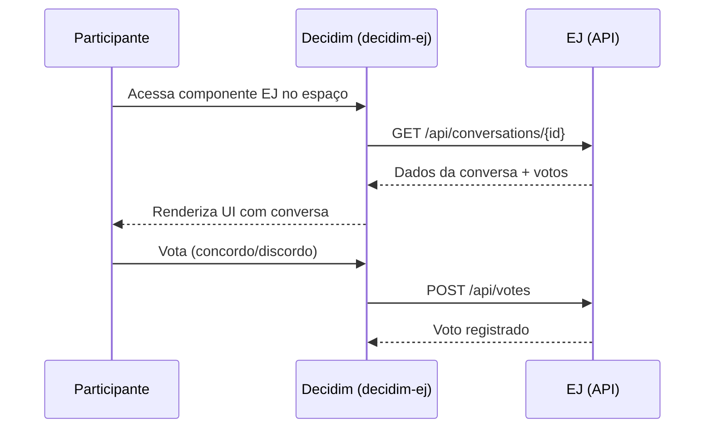

# decidim-ej

**Tipo**: Componente customizado (LabLivre/UnB)
**Gem no core**: `decidim-ej`
**Repositório**: [decidim-ej](https://gitlab.com/lappis-unb/decidimbr/components-brasil-participativo/decidim-ej)

Componente que integra o Brasil Participativo com o [Empurrando Juntas (EJ)](https://ejplatform.org/) — plataforma de opinião e votação desenvolvida pelo LabLivre/UnB.

## Funcionalidades

- **Conversas EJ** — exibição de conversas do EJ dentro de espaços participativos do Decidim
- **Votação inline** — participantes votam (concordo/discordo/passo) diretamente na interface do Decidim
- **Visualização de resultados** — clusters de opinião e estatísticas do EJ exibidos com UI própria
- **Sincronização** — dados consumidos da API REST do EJ em tempo real

## Arquitetura de Integração

```mermaid
sequenceDiagram
    participant U as Participante
    participant D as Decidim (decidim-ej)
    participant E as EJ (API)

    U->>D: Acessa componente EJ no espaço
    D->>E: GET /api/conversations/{id}
    E-->>D: Dados da conversa + votos
    D-->>U: Renderiza UI com conversa
    U->>D: Vota (concordo/discordo)
    D->>E: POST /api/votes
    E-->>D: Voto registrado
```

## Configuração

| Variável | Descrição |
|----------|-----------|
| `EJ_JWT_SECRET` | Segredo JWT compartilhado com o EJ |
| `EJ_SECRET_KEY` | Chave secreta da integração |

As variáveis são lidas em `config/secrets.yml` (`secrets.ej`). O core instala a gem da branch `main`.

No painel admin, ao adicionar o componente EJ a um espaço:

1. Selecione a conversa EJ a ser exibida
2. Configure opções de visualização

!!! warning "Dependência externa"
    O EJ é um serviço externo que precisa estar rodando e acessível. Se a API do EJ estiver indisponível, o componente não funcionará. Consulte o [Guia do Operador — Configuração](../operador/configuracao.md) para detalhes.

## Sobre o Empurrando Juntas

O EJ é uma plataforma de inteligência coletiva que organiza opiniões em clusters usando algoritmos de agrupamento. Desenvolvido pelo LabLivre/UnB, é usado em diversos contextos de participação social no Brasil.

- **Site**: [ejplatform.org](https://ejplatform.org/)
- **Código**: [GitHub](https://github.com/ejplatform)
