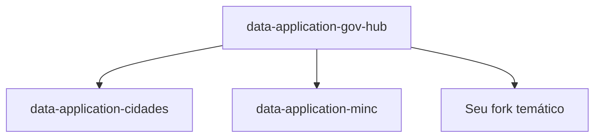

# Forks Temáticos

O GovHub BR suporta instâncias temáticas via forks do repositório principal.

## Conceito

Cada fork herda o pipeline base (Airflow + dbt + Superset) e adapta para um contexto específico: novo órgão, município, ou domínio de dados.



## Forks Existentes

| Fork | Contexto | Status |
|------|----------|--------|
| [`data-application-cidades`](https://github.com/GovHub-br/data-application-cidades) | Dados municipais | Ativo |
| [`data-application-minc`](https://github.com/GovHub-br/data-application-minc) | Ministério da Cultura | Ativo |

## Como Criar um Fork Temático

### 1. Fork no GitHub

Fork de `GovHub-br/data-application-gov-hub` para sua organização ou para `GovHub-br/data-application-<nome>`.

### 2. Adaptar fontes de dados

- Criar novas DAGs em `airflow/dags/` para suas fontes
- Configurar conexões específicas

### 3. Adaptar models dbt

- Adicionar sources para os novos dados
- Criar models Silver/Gold específicos do domínio

### 4. Criar dashboards

- Datasets no Superset apontando para as tabelas Gold
- Dashboards específicos do contexto

### 5. Manter sincronizado

```bash
# Adicionar upstream
git remote add upstream git@github.com:GovHub-br/data-application-gov-hub.git

# Sincronizar melhorias do base
git fetch upstream
git merge upstream/main
```

## Boas Práticas

- Manter a estrutura Medallion (Bronze/Silver/Gold)
- Contribuir melhorias genéricas de volta ao repo base (upstream PR)
- Documentar fontes de dados específicas
- Seguir os mesmos padrões de qualidade (dbt tests)
