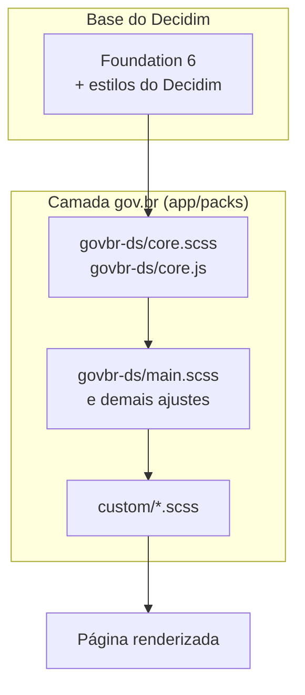

# Design System gov.br

O **Design System gov.br** (Padrão Digital de Governo) é o conjunto de componentes, estilos e diretrizes de interface do governo federal, mantido pela Secretaria de Governo Digital com o SERPRO. O Brasil Participativo usa esse padrão para ter a mesma identidade visual dos demais serviços gov.br.

- Documentação oficial: [gov.br/ds](https://www.gov.br/ds/)
- CDN oficial de fontes e arquivos: `cdngovbr-ds.estaleiro.serpro.gov.br`

## Como o padrão chega à plataforma

O Decidim 0.27 tem um front-end próprio, baseado no framework **Foundation**. O Brasil Participativo não substituiu essa base: ele **acrescentou** o CSS e o JavaScript do Design System gov.br por cima do Decidim e reescreveu as views das telas principais com as classes do padrão (`br-header`, `br-button`, `br-card`…).



A ordem importa: o CSS do gov.br é importado **depois** do Decidim, em `app/packs/stylesheets/decidim/decidim_application.scss`, e por isso prevalece quando há conflito.

### Arquivos

| Arquivo | Conteúdo |
|---------|----------|
| `app/packs/stylesheets/govbr-ds/core.scss` | CSS do Design System (≈31 mil linhas): tokens, grid e componentes |
| `app/packs/src/govbr-ds/core.js` | JavaScript do Design System (≈16 mil linhas), empacotado com Popper, flatpickr e focus-visible |
| `app/packs/stylesheets/govbr-ds/main.scss` | Ajustes globais do Brasil Participativo sobre o padrão (cores, banner, cabeçalho) |
| `app/packs/stylesheets/govbr-ds/{collapse,blog,participatory-text,pagination,filter}.scss` | Estilos gov.br para telas específicas |
| `app/packs/stylesheets/custom/*.scss` | 24 arquivos de ajustes por tela (propostas, reuniões, cards, comentários, cookies…) |
| `app/packs/stylesheets/decidim/_decidim-settings.scss` | Variáveis do Foundation/Decidim alinhadas ao padrão (`$primary-color: #1351b4`) |
| `app/views/layouts/decidim/_wrapper.html.erb` | Cabeçalho `br-header`, carregamento de fontes, ícones e VLibras |
| `app/views/layouts/decidim/_main_footer.html.erb` | Rodapé `br-footer` |

### Carregamento

| Recurso | Como é carregado |
|---------|------------------|
| CSS do padrão | Compilado pelo Webpacker junto com o pack do Decidim |
| JS do padrão | Importado em `app/packs/src/decidim/decidim_application.js` (`import "../govbr-ds/core"`) |
| Fonte Rawline | CDN do SERPRO (`_wrapper.html.erb`) e `fonts.cdnfonts.com` (`main.scss`) |
| Fonte Raleway (reserva) | Google Fonts |
| Ícones | Font Awesome 6.4.2 via cdnjs |
| VLibras | Script de `vlibras.gov.br` no fim do layout |

## Identidade visual

### Cores

A cor interativa do padrão, `--blue-warm-vivid-70` (`#1351b4`), é a cor primária da plataforma nos dois lados:

| Onde | Definição |
|------|-----------|
| Design System | `--interactive-light: var(--blue-warm-vivid-70)` |
| Brasil Participativo | `--primary: var(--blue-warm-vivid-70)` em `main.scss` |
| Foundation/Decidim | `$primary-color: #1351b4` em `_decidim-settings.scss` |

Os arquivos `custom/*.scss` usam o token `--blue-warm-vivid-70` 73 vezes. Ainda há 10 cores `#1351b4` escritas diretamente, que deveriam usar o token.

### Tipografia

A fonte do padrão é a **Rawline**, com Raleway e `sans-serif` como reserva:

```css
--font-family-base: Rawline, Raleway, sans-serif;
```

### Tokens de superfície e espaçamento

O `core.scss` traz os tokens do padrão: `--surface-width-*`, `--surface-rounder-*` (cantos), `--surface-overlay-*`, escalas de fonte e de espaçamento. Prefira esses tokens a valores fixos ao estilizar componentes novos.

## Acessibilidade

| Recurso | Implementação |
|---------|---------------|
| Tradução para Libras | Widget VLibras (`new window.VLibras.Widget(...)` em `_wrapper.html.erb`) |
| Alto contraste e ajuste de fonte | Widget próprio em `app/packs/src/acessibility_widget.js`, com modos `high-contrast` e `light-contrast`, chamado por `contrastButtonFunc()` |
| Foco visível | `focus-visible`, empacotado no JS do padrão |
| Leitura em voz alta | Estilos em `custom/tts.scss`. O plugin de texto para voz foi adicionado em 2023 e depois removido (commit `b8314d2c`) |

## Histórico

| Data | Marco | Commit |
|------|-------|--------|
| 14/08/2023 | Primeira importação do CSS e JS do padrão, junto com a nova home | `91eb64bb` |
| 21/08/2023 | Cabeçalho gov.br (`br-header`) | `724214d4` |
| 23–25/08/2023 | Rodapé no padrão e ajustes de menu | `e3f50c35`, `58f97003` |
| 26/09/2023 | Widget de acessibilidade e alto contraste | `176361dc` |
| 2024 | Cards de propostas e processos, filtros, paginação e reuniões no novo visual | vários |
| Abr/2025 | Novo rodapé e menu lateral | `9311bf88`, `3a7c32ef` |

Ao todo, 270 commits em `main` alteram os diretórios `govbr-ds/`. Desses, 91 mexem diretamente no `core.scss` ou no `core.js`.

## Pontos de atenção

!!! warning "O núcleo do padrão foi editado"
    `core.scss` e `core.js` deveriam ser cópias intactas de uma versão publicada do Design System. No repositório, eles foram editados em dezenas de commits, e a versão de origem não está registrada. Com isso, não dá para atualizar o padrão substituindo os arquivos: as mudanças locais seriam perdidas. Recomendação: identificar a versão de origem, mover as customizações para `main.scss` ou `custom/` e passar a instalar o padrão pelo pacote npm oficial (`@govbr-ds/core`) com versão fixa.

- **Duas bases de componentes ao mesmo tempo**: as views ainda usam comportamentos do Foundation (`data-reveal` em 26 lugares, `data-dropdown` em 17) ao lado dos componentes gov.br. Uma mesma tela pode ter um modal do Foundation e um modal `br-modal`.
- **Fonte carregada de várias origens**: a Rawline vem do CDN do SERPRO e do `fonts.cdnfonts.com`, e a Raleway do Google Fonts. São três requisições externas para a mesma família tipográfica.
- **Ícones**: o layout carrega o Font Awesome 6.4.2, mas `main.scss` ainda declara `Font Awesome 5 Free` em uma variável.
- **Banner fixo no CSS**: `main.scss` aponta `--banner-mobile` e `--banner-desktop` para arquivos do ambiente de produção. Em outros ambientes, a imagem vem da produção.
- **Prefixo `br-` em classes próprias**: classes como `br-processes`, `br-assemblies` e `br-announcement` usam o prefixo do padrão, mas são do Brasil Participativo. Isso dificulta saber o que é componente oficial.

Veja também: [Componentes usados](componentes.md) e [Como usar no desenvolvimento](guia.md).
