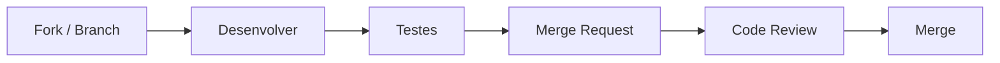

# Como Contribuir

Guia para contribuir com o Brasil Participativo.

## Antes de Começar

1. Faça o [setup local](setup.md) do ambiente de desenvolvimento
2. Familiarize-se com a [estrutura do código](estrutura.md)
3. Verifique as [issues abertas](https://gitlab.com/lappis-unb/decidimbr/decidim-govbr/-/issues) no GitLab

## Fluxo de Contribuição



### 1. Criar branch

Crie uma branch a partir de `develop`:

```bash
git checkout develop
git pull origin develop
git checkout -b feature/minha-feature
```

### 2. Convenção de branches

| Prefixo | Uso |
|---------|-----|
| `feature/` | Nova funcionalidade |
| `fix/` | Correção de bug |
| `docs/` | Documentação |
| `refactor/` | Refatoração sem mudança de comportamento |
| `chore/` | Tarefas de manutenção (CI, deps, etc.) |

### 3. Commits

Use [Conventional Commits](https://www.conventionalcommits.org/):

```
feat: adiciona filtro por região nas propostas
fix: corrige exibição de data em pt-BR no módulo reuniões
docs: atualiza guia de setup local
refactor: extrai validação de CPF para concern
```

### 4. Testes

Antes de abrir o MR, garanta que os testes passam:

```bash
bundle exec rspec
```

Se sua mudança adiciona funcionalidade nova, inclua testes correspondentes.

### 5. Merge Request

Abra um MR no GitLab apontando para `develop`:

- **Título**: seguindo Conventional Commits
- **Descrição**: explique o que mudou e por quê
- **Issues relacionadas**: referencie com `Closes #123` ou `Relates to #456`

### 6. Code Review

- Pelo menos 1 aprovação é necessária antes do merge
- Responda aos comentários e faça os ajustes solicitados
- O CI precisa estar verde (testes + linting)

## Contribuindo com Componentes Customizados

Se sua contribuição é um **componente customizado novo**, ele deve ir no repositório [components-brasil-participativo](https://gitlab.com/lappis-unb/decidimbr/components-brasil-participativo). Consulte o guia [Criar Componente](criar-componente.md).

## Reportando Bugs

Ao abrir uma issue de bug, inclua:

- **Passos para reproduzir** o problema
- **Comportamento esperado** vs **comportamento observado**
- **Ambiente** (versão do Ruby, SO, browser)
- **Screenshots** se aplicável
