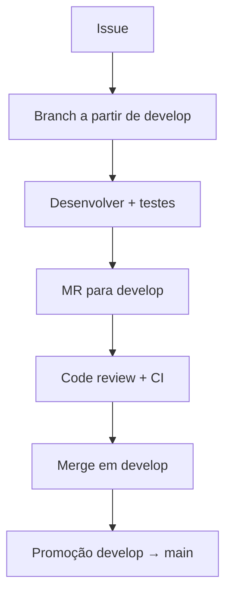

# Como Contribuir

Guia para contribuir com o `decidim-govbr`.

## Antes de começar

1. Faça o [setup local](setup.md).
2. Leia a [estrutura do código](estrutura.md), em especial como as sobrescritas do Decidim funcionam.
3. Veja as [issues abertas](https://gitlab.com/lappis-unb/decidimbr/decidim-govbr/-/issues) e o [código de conduta](https://gitlab.com/lappis-unb/decidimbr/decidim-govbr/-/blob/main/CODE-OF-CONDUCT.md).

## Fluxo de contribuição


```mermaid
flowchart TB
    A[Issue] --> B[Branch a partir de develop]
    B --> C[Desenvolver + testes]
    C --> D[MR para develop]
    D --> E[Code review + CI]
    E --> F[Merge em develop]
    F --> G[Promoção develop → main]
```

### 1. Crie a branch

```bash
git checkout develop
git pull origin develop
git checkout -b 123-descricao-curta
```

Os nomes de branch usados no projeto seguem dois padrões: número da issue com descrição (`740-melhoria-da-pagina-de-eventos`) ou prefixo de tipo (`feat/`, `fix/`, `refactor/`, `chore/`).

### 2. Commits

Use [Conventional Commits](https://www.conventionalcommits.org/), com escopo quando fizer sentido:

```
feat(external_auth): botão Voltar para o WhatsApp na tela de erro
fix: corrige bug de pergunta com condicional não salvar
test: adiciona spec de request para GET /api/home_processes
refactor: filtra tipos de processos sem processos associados da listagem da home
```

### 3. Testes e lint

```bash
bundle exec rubocop
bundle exec rails test
bundle exec rspec
```

Inclua testes para toda funcionalidade nova ou correção de bug.

### 4. Merge Request

Abra o MR no GitLab apontando para `develop`. O template padrão (`.gitlab/merge_request_templates/Default.md`) pede:

- descrição do problema ou história de usuário;
- alterações realizadas (trechos de código ou capturas de tela);
- issues relacionadas;
- checklist: diretrizes de código, documentação atualizada e testes.

Ao abrir o MR, mude o label da issue para `DEV::MR`. Quando o MR for aceito, o revisor (ou você) muda para `DEV::Homolog`.

### 5. CI

O pipeline (`.gitlab-ci.yml`) tem três estágios:

| Estágio | Job | O que faz | Bloqueia? |
|---------|-----|-----------|-----------|
| `lint` | `Lint` | `bundle exec rubocop` | Sim |
| `test` | `SAST` | Brakeman; envia o relatório por e-mail | Não (`allow_failure`) |
| `test` | `SCA` | Trivy 0.69.3 no filesystem (MEDIUM, HIGH, CRITICAL) | Não (`allow_failure`) |
| `test` | `Testing` | `rails test` e `rspec` com PostgreSQL 13.2 e Redis 6 | Sim |
| `build` | `Build` | Build da imagem Docker | Sim |

## Componentes customizados

Um componente novo vai num repositório próprio dentro do grupo [components-brasil-participativo](https://gitlab.com/lappis-unb/decidimbr/components-brasil-participativo). Veja [Criar Componente](criar-componente.md).

## Reportando bugs

Abra uma issue com:

- passos para reproduzir;
- comportamento esperado e observado;
- ambiente (navegador, sistema, URL do espaço);
- capturas de tela, se ajudarem.

Contato da equipe: decidim@unb.br. Comunidade: [grupo no Telegram](https://t.me/+nm4bkXxYukFlOWZh).

## Licença

As contribuições são licenciadas sob a [AGPLv3](https://gitlab.com/lappis-unb/decidimbr/decidim-govbr/-/blob/main/LICENSE-AGPLv3.txt).
