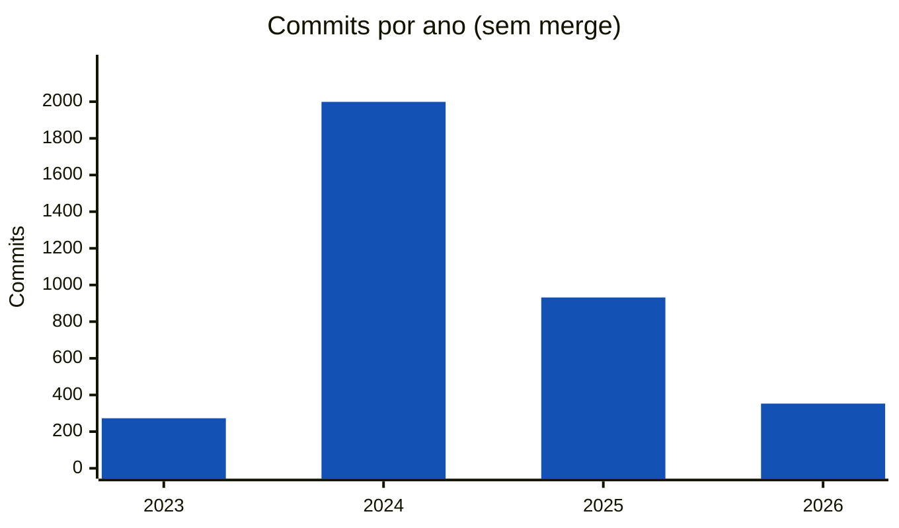
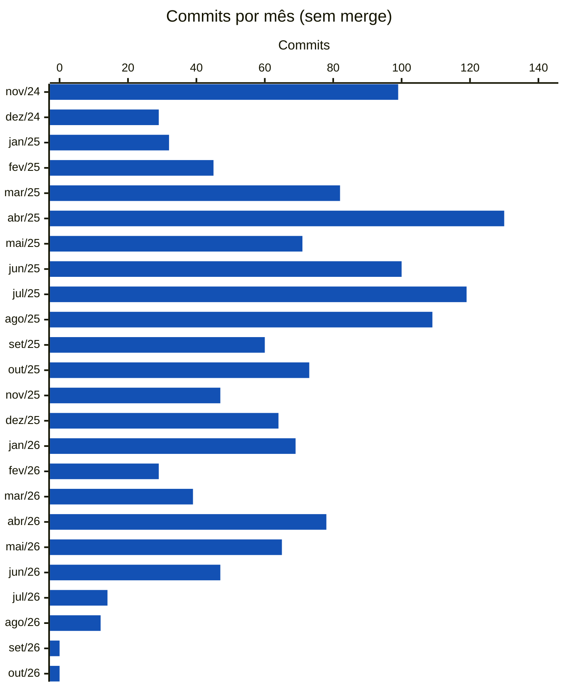
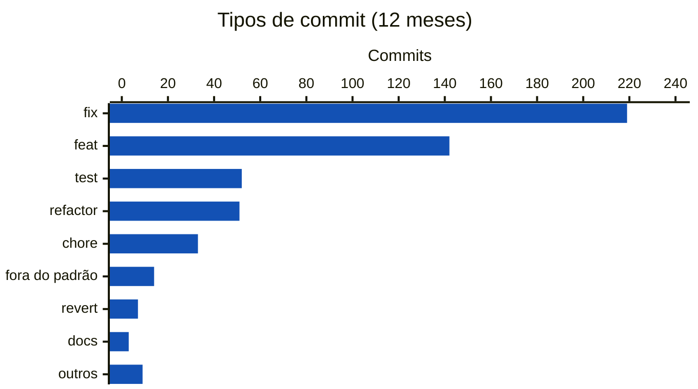

<!-- Gerado por scripts/estatisticas.py em 2026-10-07T13:21:12+00:00. Não edite à mão. -->

# Commits

!!! info "Coleta de 07/10/2026"
    Branches `main` e `develop` do [decidim-govbr](https://gitlab.com/lappis-unb/decidimbr/decidim-govbr) e API pública do GitLab. Série a partir de 01/04/2023. "Últimos 12 meses" = 07/10/2025 a 07/10/2026. Para atualizar, rode `python3 scripts/estatisticas.py`.

Commits das branches `main` e `develop`, sem duplicar os que estão nas duas. Commits de merge são contados à parte.

| Desde abr/2023 | Sem merge | Merges | Últimos 12 meses | 12 meses anteriores |
| ---: | ---: | ---: | ---: | ---: |
| 4.675 | 3.557 | 1.118 | 530 | 962 |

## Por ano

## Últimos 24 meses

??? note "Dados mensais"

    | Mês | Commits |
    | --- | ---: |
    | nov/24 | 99 |
    | dez/24 | 29 |
    | jan/25 | 32 |
    | fev/25 | 45 |
    | mar/25 | 82 |
    | abr/25 | 130 |
    | mai/25 | 71 |
    | jun/25 | 100 |
    | jul/25 | 119 |
    | ago/25 | 109 |
    | set/25 | 60 |
    | out/25 | 73 |
    | nov/25 | 47 |
    | dez/25 | 64 |
    | jan/26 | 69 |
    | fev/26 | 29 |
    | mar/26 | 39 |
    | abr/26 | 78 |
    | mai/26 | 65 |
    | jun/26 | 47 |
    | jul/26 | 14 |
    | ago/26 | 12 |
    | set/26 | 0 |
    | out/26 | 0 |

## Padrão das mensagens

Percentual de commits cujo título segue o formato [Conventional Commits](https://www.conventionalcommits.org/pt-br/) (`tipo(escopo): descrição`), adotado pelo projeto.

| Ano | Conventional Commits | Reverts |
| --- | ---: | ---: |
| 2023 | 56% | 7 |
| 2024 | 85% | 11 |
| 2025 | 94% | 3 |
| 2026 | 95% | 6 |

### Tipos de commit nos últimos 12 meses

## Arquivos mais alterados (12 meses)

Arquivos que mais aparecem em commits. Muitas alterações no mesmo arquivo indicam pontos de concentração de mudanças (*hotspots*), candidatos a refatoração ou a mais testes.

| Arquivo | Commits |
| --- | ---: |
| `app/views/layouts/decidim/_main_footer.html.erb` | 31 |
| `spec/controllers/assemblies_controller_spec.rb` | 25 |
| `app/controllers/api/home_processes_controller.rb` | 22 |
| `Gemfile.lock` | 20 |
| `app/services/external_auth_service.rb` | 18 |
| `config/locales/all_locales.yml` | 18 |
| `config/locales/pt-BR.yml` | 17 |
| `app/controllers/decidim/external_auth/external_auth_controller.rb` | 17 |
| `lib/decidim/comments/comment_serializer.rb` | 17 |
| `app/views/decidim/assemblies/admin/assemblies/_form.html.erb` | 16 |
| `app/views/decidim/external_auth/external_auth/link_success.html.erb` | 16 |
| `app/views/decidim/forms/questionnaires/_questionnaire_form.html.erb` | 14 |
| `app/views/decidim/devise/sessions/new.html.erb` | 12 |
| `app/views/decidim/admin/components/_form.html.erb` | 12 |
| `spec/lib/decidim/comments/comment_serializer_spec.rb` | 12 |

