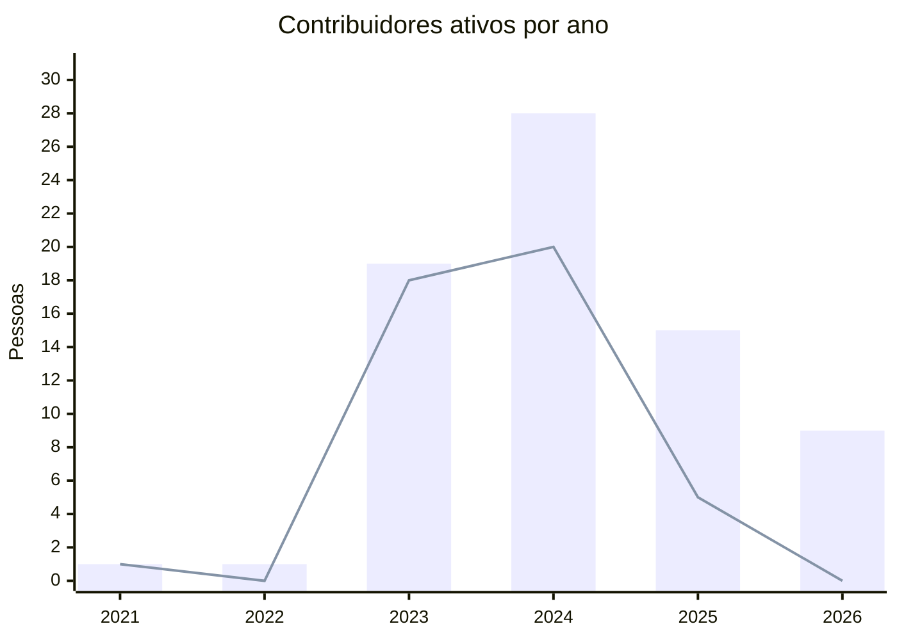
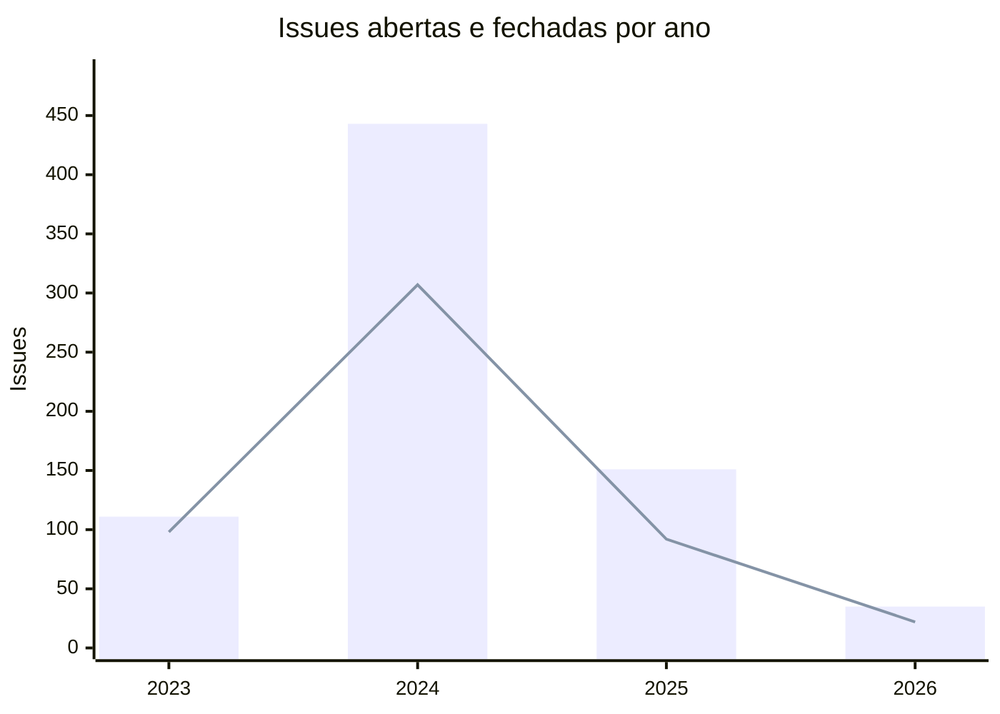
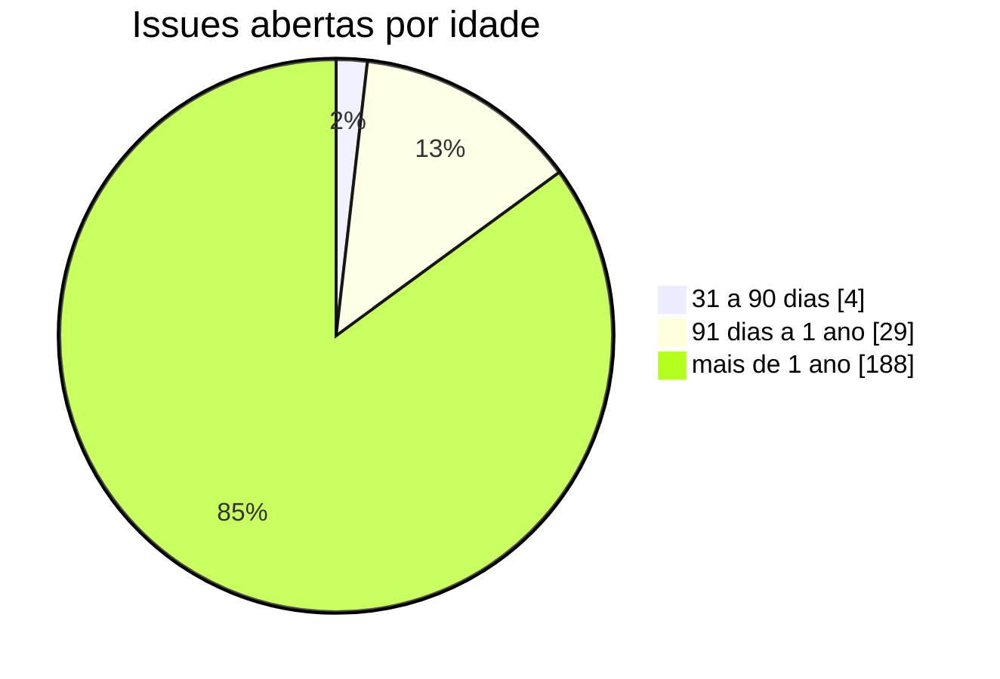

<!-- Gerado por scripts/estatisticas.py em 2026-10-07T11:56:25+00:00. Não edite à mão. -->

# Contribuições

!!! info "Coleta de 07/10/2026"
    Branches `main` e `develop` do [decidim-govbr](https://gitlab.com/lappis-unb/decidimbr/decidim-govbr) e API pública do GitLab. "Últimos 12 meses" = 07/10/2025 a 07/10/2026. Para atualizar, rode `python3 scripts/estatisticas.py`.

!!! note "Identidades"
    Uma mesma pessoa pode ter feito commits com nomes ou e-mails diferentes. As variações são agrupadas automaticamente (mesmo e-mail ou mesmo nome normalizado). A contagem é uma aproximação.

## Pessoas contribuindo

Barras: pessoas com ao menos um commit no ano. Linha: pessoas que fizeram o primeiro commit no ano.

| Ano | Ativas | Novas | Retenção |
| --- | ---: | ---: | ---: |
| 2021 | 1 | 1 | — |
| 2022 | 1 | 0 | 100% |
| 2023 | 19 | 18 | 100% |
| 2024 | 28 | 20 | 42% |
| 2025 | 15 | 5 | 36% |
| 2026 | 9 | 0 | 60% |

*Retenção*: parcela das pessoas ativas no ano anterior que continuaram contribuindo.

## Concentração das contribuições

O **fator de ausência** (*Contributor Absence Factor*, CHAOSS) é o menor número de pessoas que somam metade dos commits. Quanto menor, maior o risco de o projeto parar se essas pessoas saírem.

| Período | Fator de ausência | Contribuidores |
| --- | ---: | ---: |
| Todo o histórico | 4 | 44 |
| Últimos 12 meses | 3 | 10 |

=== "Últimos 12 meses"

    | # | Pessoa | Commits | Participação |
    | ---: | --- | ---: | ---: |
    | 1 | Vitor Borges dos Santos | 103 | 19% |
    | 2 | Victor Gonçalves | 99 | 19% |
    | 3 | Gustavo Henrique | 76 | 14% |
    | 4 | Eduardo Nunes | 69 | 13% |
    | 5 | Leonardo Lago Moreno | 67 | 13% |
    | 6 | Maicon Mares | 58 | 11% |
    | 7 | Lucca Medeiros | 51 | 10% |
    | 8 | Geovane Freitas | 4 | 1% |
    | 9 | Miguel Arthur | 2 | 0% |
    | 10 | chaydson | 2 | 0% |

=== "Todo o histórico"

    | # | Pessoa | Commits | Participação |
    | ---: | --- | ---: | ---: |
    | 1 | Victor Gonçalves | 584 | 16% |
    | 2 | Vitor Borges dos Santos | 575 | 16% |
    | 3 | Gustavo Henrique | 481 | 13% |
    | 4 | Maicon Mares | 384 | 11% |
    | 5 | Leonardo Lago Moreno | 365 | 10% |
    | 6 | Eduardo Nunes | 360 | 10% |
    | 7 | Geovane Freitas | 306 | 8% |
    | 8 | Lucca Medeiros | 106 | 3% |
    | 9 | Luiz Sanches | 92 | 3% |
    | 10 | Gui-fga | 48 | 1% |

## Issues

Só issues públicas aparecem na API sem autenticação.

| Abertas | Fechadas | Abertas em 12 meses | Fechadas em 12 meses | Mediana para fechar (12 meses) | Autores (12 meses) |
| ---: | ---: | ---: | ---: | ---: | ---: |
| 221 | 519 | 77 | 49 | 13,9 dias | 9 |

### Por ano

Barras: issues abertas no ano. Linha: issues fechadas no ano.

| Ano | Abertas | Fechadas | Mediana para fechar |
| --- | ---: | ---: | ---: |
| 2023 | 111 | 98 | 14,7 dias |
| 2024 | 443 | 307 | 19,0 dias |
| 2025 | 151 | 92 | 4,8 dias |
| 2026 | 35 | 22 | 27,8 dias |

### Idade das issues abertas

### Rótulos mais comuns nas issues abertas

| Rótulo | Issues |
| --- | ---: |
| `Desenvolvimento` | 122 |
| `Bug` | 62 |
| `Notion` | 59 |
| `Produção` | 32 |
| `WORKFLOW::Backlog` | 28 |
| `Brasil-Participativo` | 27 |
| `3 dias` | 27 |
| `Outros erros (resultados ou ações inesperadas).` | 23 |
| `7 dias` | 15 |
| `Erros em chatbots ou mapas (openstreetmap) ou ferramentas de dados;` | 13 |

