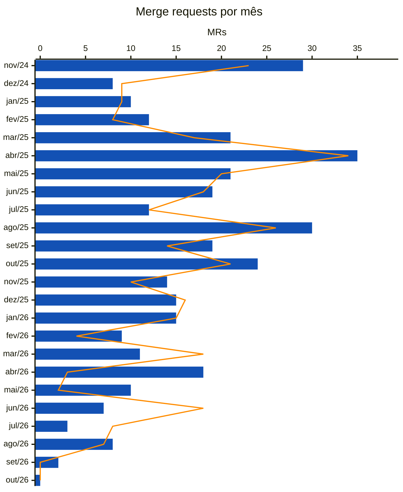

<!-- Gerado por scripts/estatisticas.py em 2026-10-07T13:48:32+00:00. Não edite à mão. -->

# Merge Requests

!!! info "Coleta de 07/10/2026"
    Branches `main` e `develop` do [decidim-govbr](https://gitlab.com/lappis-unb/decidimbr/decidim-govbr) e API pública do GitLab. Série a partir de 01/04/2023. "Últimos 12 meses" = 07/10/2025 a 07/10/2026. Para atualizar, rode `python3 scripts/estatisticas.py`.

| Desde abr/2023 | Integrados | Fechados sem merge | Abertos |
| ---: | ---: | ---: | ---: |
| 835 | 726 | 104 | 5 |

## Últimos 12 meses

| Indicador | Valor | O que mede |
| --- | ---: | --- |
| MRs abertos | 135 | Volume de propostas de mudança |
| MRs integrados | 112 | Mudanças aceitas |
| Taxa de aceitação | 86% | Integrados ÷ (integrados + fechados sem merge) |
| Mediana até o merge | 5,9 dias | Tempo típico entre abrir e integrar |
| 90º percentil até o merge | 61,8 dias | Tempo dos MRs mais demorados |
| MRs com comentário | 46% | Indício de revisão (comentários de qualquer pessoa) |
| Integrados pelo próprio autor | 15% | MRs sem uma segunda pessoa no merge |
| Autores distintos | 10 | Quantas pessoas propuseram mudanças |

## Por mês

Barras azuis: MRs abertos no mês. Linha laranja: MRs integrados no mês.

## Por ano

| Ano | Abertos | Integrados | Aceitação | Mediana até merge | P90 até merge | Com comentário | Auto-merge | Autores |
| --- | ---: | ---: | ---: | ---: | ---: | ---: | ---: | ---: |
| 2023 | 69 | 47 | 68% | 23 h | 20,5 dias | 32% | 40% | 15 |
| 2024 | 451 | 404 | 90% | 17 h | 14,0 dias | 24% | 22% | 30 |
| 2025 | 232 | 207 | 89% | 24 h | 26,1 dias | 27% | 4% | 15 |
| 2026 | 83 | 68 | 87% | 18,4 dias | 63,3 dias | 58% | 21% | 9 |

## Branch de destino

Para quais branches os MRs foram abertos em cada ano. O fluxo atual é MR para `develop` e promoção de `develop` para `main`.

| Ano | `main` | `develop` | `devel` | `participatory-text-release` |
| --- | ---: | ---: | ---: | ---: |
| 2023 | 68 | 0 | 0 | 0 |
| 2024 | 398 | 9 | 16 | 15 |
| 2025 | 227 | 2 | 0 | 1 |
| 2026 | 41 | 42 | 0 | 0 |

## Abertos agora

| MR | Título | Destino | Idade |
| --- | --- | --- | --- |
| [!829](https://gitlab.com/lappis-unb/decidimbr/decidim-govbr/-/merge_requests/829) | 722 - Estilização da Página de Erro com Alvo em Develop (Not Found e Internal Error) | `develop` | 56 dias |
| [!830](https://gitlab.com/lappis-unb/decidimbr/decidim-govbr/-/merge_requests/830) | Corrige duplicação da lista de arquivos em seleções por etapas | `develop` | 56 dias |
| [!831](https://gitlab.com/lappis-unb/decidimbr/decidim-govbr/-/merge_requests/831) | Restaura select de instância pai no formulário de assembleias | `develop` | 56 dias |
| [!835](https://gitlab.com/lappis-unb/decidimbr/decidim-govbr/-/merge_requests/835) | Corrige visualização de respostas em perguntas do tipo matriz de múltipla e única escolha | `develop` | 35 dias |
| [!836](https://gitlab.com/lappis-unb/decidimbr/decidim-govbr/-/merge_requests/836) | Otimiza exportação de contribuições | `develop` | 28 dias |

