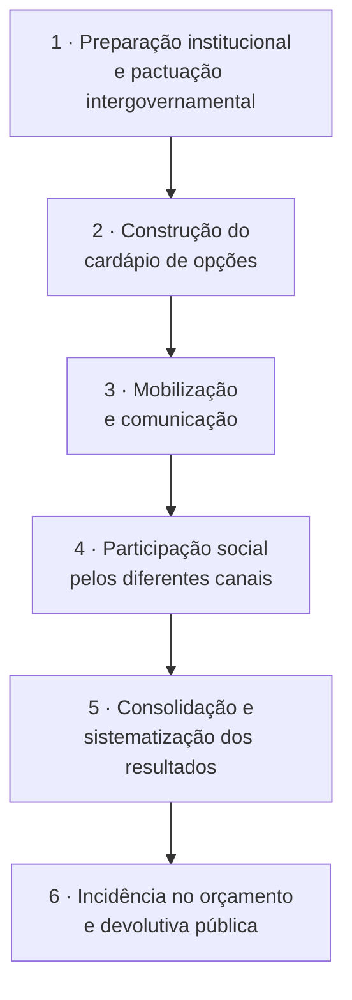
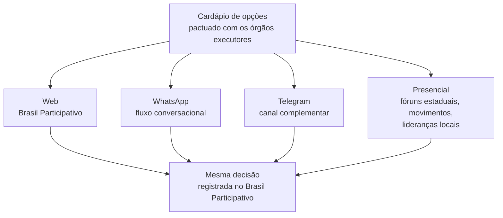
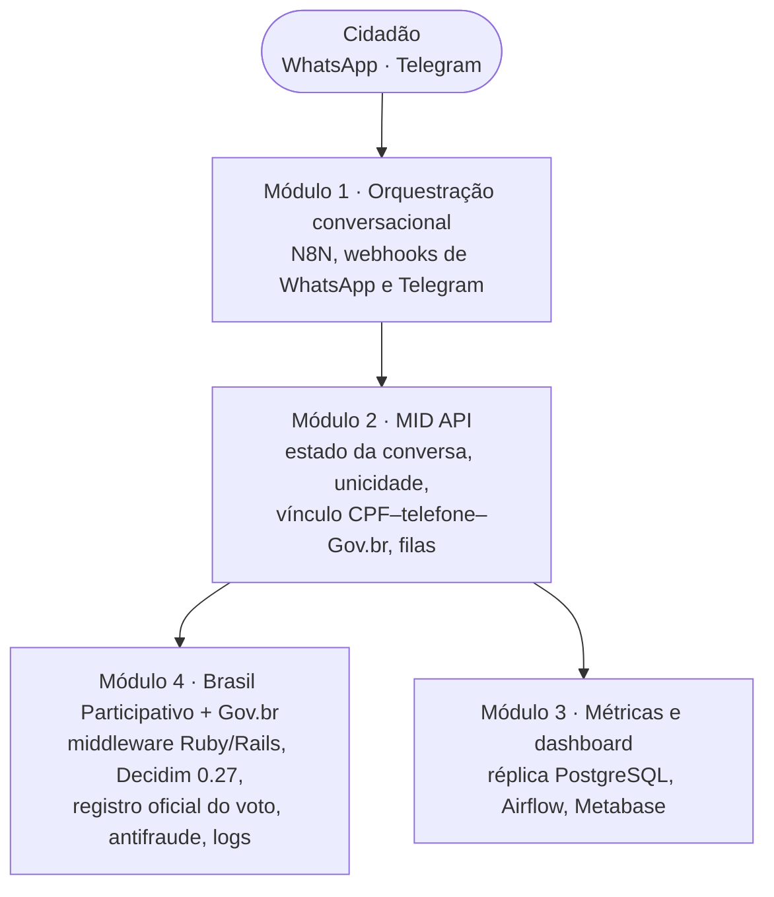
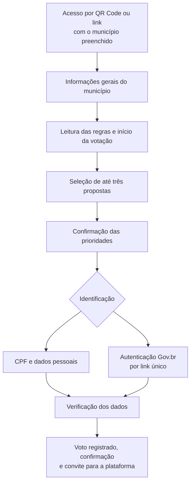
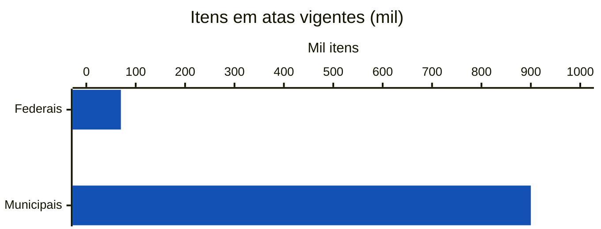

# Orçamento do Povo

**Construindo o processo participativo do Orçamento do Povo**: integração da plataforma Brasil Participativo com o WhatsApp, com sua construção técnica, metodologia de participação e dimensão política.

| Ficha | |
|-------|---|
| **Tipo** | Relatório técnico-acadêmico. Estudo de caso avaliativo de um projeto-piloto |
| **Instituições** | Universidade de Brasília, LabLivre · Secretaria Nacional de Participação Social (SNPS), Secretaria-Geral da Presidência da República |
| **Período analisado** | Dezembro de 2025 a fevereiro de 2026 (provas de conceito e MVP) |
| **Território do teste-piloto** | Distrito Federal |
| **Fontes** | Guia metodológico, nota técnica, roteiro de teste, materiais do teste-piloto, fluxo de conversa, repositórios do projeto e metodologia da SNPS/DPOP |
| **Situação** | Versão de trabalho (2026). A versão final, com figuras e formatação ABNT, será publicada em Word |
| **Documento** | [Texto integral (Google Docs)](https://docs.google.com/document/d/1O_hEacjzMZoZNc_SeRU-dDII2APYJLNAiAdrnagpHmM/edit?usp=sharing) |

!!! info "Sobre esta página"
    Resumo estruturado do relatório. As figuras foram recriadas a partir do texto, porque a versão de trabalho ainda não as inclui. Este primeiro estudo é **qualitativo**: o próprio relatório registra que não usa métricas quantitativas de participação nem de repositório. Veja a [agenda de ciência de dados](index.md#agenda-de-ciencia-de-dados).

## Em números

<strong>até 400</strong>municípios médios no piloto (70 a 300 mil habitantes)

<strong>até 3</strong>escolhas por participante

<strong>3</strong>modalidades de identificação na mensageria

<strong>4</strong>módulos na arquitetura técnica

<strong>99% · 20%</strong>de 41 mil usuários com dados cadastrais · com telefone na base

<strong>20 mi</strong>participantes potenciais considerados na análise de risco

## Resumo

O relatório analisa a construção do processo participativo do **Orçamento do Povo**, o orçamento participativo conduzido pelo Governo Federal, com foco na integração entre o Brasil Participativo e o WhatsApp. A execução técnica é do LabLivre/UnB, por meio de TED com a SNPS.

O estudo articula três dimensões:

1. **Técnica**: arquitetura, requisitos e implementação.
2. **Metodológica**: princípios, modelo lógico, cardápio de opções e arquitetura multicanal.
3. **Política**: incidência orçamentária, pactuação interinstitucional e legitimidade.

**Principais achados**

- A integração WhatsApp–Brasil Participativo é **tecnicamente viável**, com três modalidades de identificação e registro auditável do voto.
- A implementação foi condicionada por **restrições institucionais e contratuais**: ausência de conta institucional de WhatsApp Business, de contrato de verificação de CPF e de suporte ágil de infraestrutura.
- A centralidade da metodologia sobre a tecnologia organiza bem o processo, mas a **consequência orçamentária** e a **equivalência entre canais** dependem de decisões de governança ainda em aberto.

## Questão e objetivos

> Como se deu a construção técnica, metodológica e política do processo participativo do Orçamento do Povo na integração entre o Brasil Participativo e o WhatsApp, e em que medida o desenho metodológico planejado se realizou na implementação?

1. Descrever a arquitetura técnica e a trajetória de implementação da integração.
2. Caracterizar a metodologia de participação: princípios, modelo lógico, cardápio e regras de validação.
3. Analisar a dimensão política: incidência orçamentária, pactuação interinstitucional e tensões entre inclusão, integridade e legitimidade.

## Contexto

### Atores

| Ator | Papel |
|------|-------|
| SNPS / Secretaria-Geral da Presidência | Coordenação política |
| Diretoria de Planejamento e Orçamento Participativo (DPOP/SNPS) | Metodologia de priorização nas plenárias regionais presenciais |
| LabLivre/UnB | Execução técnica, por TED com a SNPS |
| Ministérios setoriais | Pactuação e execução das ações do cardápio |
| MGI e equipe do Gov.br | Identidade digital do cidadão |
| Dataprev | Infraestrutura e operação |
| Serpro | API de verificação de CPF |
| População dos municípios participantes | Centro do processo |

A equipe do LabLivre tem coordenação de Leonardo Michalski Miranda, vice-coordenação da Profa. Carla Rocha, liderança metodológica de participação da Profa. Loana Velasco e lideranças técnicas que incluem Ricardo Poppi, Eduardo Nunes, Bruna Pinos de Oliveira e João Henrique Egewarth, além de docentes colaboradores e estudantes. O código é mantido em repositórios públicos, sob o lema "dinheiro público, código público".

### Desafios

| Desafio | Descrição |
|---------|-----------|
| Escala | Participação de uma população numerosa e dispersa, sem comprometer a integridade |
| Federativo | Coordenação nacional com diversidade territorial, populacional e orçamentária |
| Tradução | Converter o orçamento público em escolhas concretas e compreensíveis |
| Inclusão digital | Barreiras de acesso ao Gov.br, conectividade e letramento digital |
| Integridade | Proteção contra votos múltiplos e robôs, sem perder simplicidade |
| Consequência institucional | Efeitos reais no ciclo orçamentário |

## Metodologia do processo participativo

### Princípios

1. Centralidade da metodologia sobre a tecnologia.
2. Simplicidade para o participante.
3. Concretude das escolhas.
4. Consequência institucional da participação.
5. Equilíbrio entre escala, inclusão e integridade.
6. Transparência e comunicabilidade.
7. Pacto federativo e entre poderes: incentivo à destinação de emendas a partir do cardápio, com contrapartida do Governo Federal.

### Modelo lógico

*Figura 1 do relatório, recriada a partir do texto.*

A consequência institucional e a integridade predominam na preparação e na consolidação; concretude e clareza orientam o cardápio; inclusão e comunicabilidade guiam a mobilização; a equivalência entre canais estrutura a participação.

### Desenho por perfil de município

| Dimensão | Municípios médios | Capitais |
|----------|-------------------|----------|
| Objeto da escolha | Entregas e serviços concretos do cardápio | Áreas e temas estratégicos |
| Horizonte | Curto prazo, preferencialmente 2026 | Ciclos futuros, em especial o orçamento de 2027 |
| Alcance de referência | Até 400 municípios de 70 a 300 mil habitantes | Capitais, com priorização para o PLOA 2027 |
| Lógica predominante | Maximizar a percepção de resultado concreto | Evitar frustração diante da baixa escala relativa |

### Arquitetura multicanal

*Figura 2 do relatório, recriada a partir do texto.* O princípio estruturante é a **equivalência metodológica**: as escolhas em qualquer canal têm o mesmo peso e incidem sobre o mesmo cardápio.

### Cardápios vigentes

=== "Municípios não capitais"

    Pergunta: *quais dessas entregas são as mais importantes para o seu município?* Até três opções.

    - Ambulância
    - Dentista gratuito em bairros e comunidades
    - Aulas de esporte para crianças e jovens
    - Apoio a festas e atividades da cultura local
    - Cursinho popular gratuito para o Enem
    - Cuidado e castração de animais
    - Ampliação da coleta e da reciclagem do lixo
    - Máquinas e equipamentos para agricultores
    - Mais segurança com base comunitária móvel
    - Melhoria do conselho tutelar
    - Patrulha Maria da Penha
    - Apoio a pequenos negócios de mulheres, jovens e negros
    - Computadores e acesso à internet
    - Cozinhas comunitárias para quem precisa
    - Espaços de convivência para idosos e apoio às famílias

=== "Capitais"

    Pergunta: *quais áreas deveriam ser priorizadas no orçamento federal de 2027?* Até três opções.

    - Saúde
    - Educação
    - Cultura e Esporte
    - Segurança Pública
    - Direitos Humanos e Igualdade Racial
    - Prevenção e enfrentamento à violência contra a mulher
    - Políticas para crianças, adolescentes e juventude
    - Inclusão produtiva, trabalho e empreendedorismo
    - Segurança alimentar, abastecimento e agricultura urbana

    Está em avaliação usar nas capitais o mesmo cardápio de entregas dos municípios médios.

### Regras de pontuação na priorização presencial

| Instrumento | Regra de escolha | Pontuação |
|-------------|------------------|-----------|
| Obras estruturantes do PAC | Até três obras ou projetos do estado, em ordem de prioridade | A soma dos votos na plataforma define as prioridades |
| Temas — programas e ações | Três temas distintos; uma proposta prioritária por tema | 1º lugar = 3 pontos; 2º = 2; 3º = 1 |
| Votação parcial | Voto em um ou dois temas | Multiplicadores preservam o peso |

### Identificação e validação por canal

*Figura 3 do relatório: do maior nível de segurança para o maior alcance.*

| Canal / modalidade | Validação | Implicações |
|--------------------|-----------|-------------|
| Web (Brasil Participativo) | Autenticação Gov.br | Maior segurança, unicidade e rastreabilidade. Referência de equivalência |
| Mensageria — autenticada | Link único para o Gov.br | Equivalência plena com a web |
| Mensageria — identificada | CPF, nome e data de nascimento no b-cadastro/Serpro (ConectaGov) | Maior acesso, segurança mais baixa, peso ainda a definir |
| Mensageria — não identificada | Nenhuma | Máximo acesso. Uso como indicador de mobilização |

Alternativas em avaliação para os votos só identificados: critério de desempate, peso diferenciado, indicador complementar de mobilização ou exigência de autenticação plena para a contagem final.

### Dilemas metodológicos

- **Ferramenta ou método**: o processo não pode ser definido pelas ferramentas. A metodologia precisa ser simples para engajar milhões, robusta contra questionamentos e clara sobre as consequências orçamentárias.
- **Cardápio**: conciliar concretude, padronização e políticas multissetoriais com mais de um órgão executor.
- **Carga cognitiva e número de votos**: o voto escasso (até três) força a priorização e gera um resultado simples de comunicar.
- **Seleção dos municípios**: critérios transparentes e defensáveis.
- **Consequência orçamentária**: remanejamento, ajustes no PLOA 2026, localizadores no PLOA 2027 ou emendas, sem prometer aumento automático de recursos.
- **Transversais**: articulação entre digital e presencial; validação forte demais exclui, fraca demais fragiliza; distinguir protótipo, piloto e operação em escala.

## Método da pesquisa

**Estudo de caso avaliativo**: compara o que foi planejado com o que foi construído, pela triangulação de dois tipos de evidência.

| Fonte | Natureza | Contribuição |
|-------|----------|--------------|
| Guia metodológico e nota técnica (LabLivre, 2026a) | Documental e técnica | Metodologia, arquitetura modular e fases |
| Roteiro de teste (LabLivre, 2026b) | Documental | Teste de usabilidade por canal |
| Teste-piloto (LabLivre, 2026c) | Documental | Governança, equipe, fluxos do piloto e painel |
| Fluxo de conversa (LabLivre, 2026d) | Design | Fluxo no WhatsApp |
| Repositórios (2026a–c) | Técnica | Código da integração, da participação multicanal e do fork do Decidim |
| Metodologia SNPS/DPOP (2026) | Documental | Priorização presencial e pontuação |

O teste de usabilidade cobriu web, WhatsApp (com autenticação Gov.br e por CPF) e Telegram, com pensamento em voz alta e intervenção mínima do facilitador.

**Limitações declaradas**: não foram usadas métricas quantitativas de desenvolvimento nem de participação; parte das fontes são documentos de trabalho; o piloto foi exploratório e restrito; decisões de governança estavam em aberto. O processo envolve dados pessoais e exige observância da LGPD, inclusive no registro de conversas.

## Resultados técnicos

### Arquitetura modular

*Figura 4 do relatório, recriada a partir do texto.*

| Módulo | Responsabilidade | Tecnologias |
|--------|------------------|-------------|
| 1 — Orquestração conversacional | Integrar canais e conduzir fluxos e modalidades | N8N; webhooks de WhatsApp e Telegram |
| 2 — MID API | Estado conversacional, unicidade, vínculos e filas | FastAPI ou Go; Redis Streams; PostgreSQL; Prometheus |
| 3 — Métricas e dashboard | Indicadores em tempo quase real | Réplica PostgreSQL; Airflow; Metabase |
| 4 — BP + Gov.br + middleware | Autenticar, registrar o voto no Decidim, antifraude e logs | Decidim 0.27; middleware Ruby/Rails; Gov.br |

!!! tip "Onde isso aparece no código do Brasil Participativo"
    O vínculo da conta gov.br a partir do WhatsApp, parte do Módulo 4, está documentado em [Integração OP-BP](../operador/integracao-op-bp.md) (inferência: a "API OP-BP" do core corresponde ao lado da MID API que recebe o callback). Ela foi reestruturada a partir de uma integração feita originalmente para o componente Empurrando Juntas, em julho de 2025.

### Fluxo de conversa no WhatsApp

*Figura 5 do relatório, recriada a partir do texto.*

No Telegram, a jornada é equivalente: aceite, estado e município, três propostas, confirmação e CPF. Na prova de conceito, a validação de formato do CPF funcionou, mas a verificação no ConectaGov não foi concluída, por pendência de liberação de IPs.

### Fases da implementação

*Figura 6 do relatório.*

| Fase | Período | Foco e entregas | Limitações observadas |
|------|---------|-----------------|-----------------------|
| 01 | 1 a 15 dez 2025 | Experimentação e riscos; reestruturação do login Gov.br–WhatsApp; desenho arquitetural; MVP do middleware | Sem suporte ágil de infraestrutura; sem conta institucional de WhatsApp Business |
| 02 | 15 dez 2025 a 9 jan 2026 | Provas de conceito de WhatsApp e Telegram (solução Evolution) e login Gov.br por API alternativa | Sem contrato institucional de verificação de CPF; arranjo provisório para a prova de conceito |
| 03 | 9 jan a 5 fev 2026 | Mínimo produto viável; primeira versão da API de integração | Validação no ConectaGov não concluída; sem número habilitado para o WhatsApp Flow |

Impactos registrados: a viabilidade técnica da integração e a capacidade da equipe de entregar em prazos curtos, mesmo com restrições institucionais.

### Painel em tempo real e EncontrAI

O painel de acompanhamento mostra os dados de participação de forma contínua (Módulo 3). O **EncontrAI**, ferramenta de IA do laboratório, localiza por linguagem natural itens em atas de registro de preços vigentes, apoiando a montagem do cardápio.

*Figura 7 do relatório: itens acessíveis pelo EncontrAI, por esfera (ordem de grandeza).*

### Funil de engajamento

A participação funciona como um funil em dois níveis:

1. **Identificação** (WhatsApp): CPF e atributos pessoais validados no ConectaGov e no Cadastro Base do Cidadão. Inclui quem não tem ou não consegue usar o Gov.br e permite medir desistências.
2. **Autenticação Gov.br** (web ou link único no WhatsApp): garante unicidade do CPF e confiabilidade dos resultados.

!!! note "Dado quantitativo do estudo"
    Em uma amostra de **41 mil usuários** do Brasil Participativo cruzada com o Cadastro Base do Cidadão, **99%** tinham data de nascimento, nome da mãe e endereço, mas só **20%** tinham telefone. Isso limita a validação por telefone.

**Questões técnicas críticas**: um mesmo número de WhatsApp usado por várias pessoas; o redirecionamento automático após a autenticação; o registro de conversas para pesquisa e auditoria, observando a LGPD; e os limites da interface do WhatsApp (até três botões por mensagem, textos curtos).

### Riscos por etapa e canal

| Etapa / canal | Riscos operacionais e tecnológicos | Riscos de segurança, LGPD e político-metodológicos |
|---------------|------------------------------------|---------------------------------------------------|
| Identificação — WhatsApp | Demanda de suporte sem equipe dedicada; bases com lacunas; ConectaGov sob alta demanda; vários usuários por número | Dados sensíveis em canal inadequado; consentimento; fraude por identificação probabilística; voto percebido como menos válido |
| Autenticação — Web (Gov.br) | Dependência total da Dataprev; atualização de infraestrutura; abandono no fluxo | Exclusão de quem não tem Gov.br; necessidade de comunicação clara |
| Autenticação — WhatsApp (link único) | Fluxo complexo entre Gov.br, Decidim e WhatsApp; falhas de token; dependência de redirecionamento | Proteção de tokens e sessões; explicar o peso dos votos; percepção de injustiça |

Referências de escala usadas no estudo: a infraestrutura precisaria suportar até **20 milhões** de participantes; o Gov.br, com cerca de **180 milhões** de usuários, faz cerca de **40 mil atendimentos por dia**; a API de mensageria tem janela gratuita de **48 horas** após o contato do usuário.

## Resultados políticos e metodológicos

- **Incidência orçamentária**: é a consequência institucional que distingue o processo de uma consulta simbólica. Nos municípios médios, o efeito é buscado em 2026; nas capitais, no orçamento de 2027. É a maior força e o maior risco do processo.
- **Pactuação interinstitucional**: cardápio e execução com os ministérios; autenticação e dados cadastrais com o MGI/Gov.br (incluindo usuários em planos de *zero-rating*); infraestrutura com a Dataprev; verificação de CPF com o Serpro. As lacunas nessas pactuações viraram limitações técnicas.
- **Peso dos votos e legitimidade**: três níveis de voto (anônimo, fora do resultado oficial; identificado, confiabilidade intermediária; autenticado, peso máximo). Hoje a plataforma contabiliza só participações autenticadas. O risco central é a frustração de quem descobre depois que seu voto teve menor peso.
- **Inclusão**: o WhatsApp alcança públicos menos presentes em plataformas institucionais, mas ampliar o acesso implica validação mais frágil.

### Pendências decisórias

| Categoria | Pendências |
|-----------|-----------|
| Desenho do processo | Cardápio único; número de votos; regras de desempate e pesos |
| Municípios participantes | Critérios de seleção e recorte territorial |
| Pactuação setorial | Composição do cardápio e compromisso de execução |
| Incidência orçamentária | Vínculo entre resultados, emendas e recursos para 2027 |
| Validação por canal | Tratamento dos votos identificados e exibição dos resultados |
| Infraestrutura e contratos | WhatsApp Business; verificação de CPF; suporte de infraestrutura |

## Discussão

| Plano | Planejado × implementado |
|-------|--------------------------|
| Arquitetura e monitoramento | **Convergência**: o painel em tempo real sobre réplica analítica foi apresentado no piloto |
| Equivalência entre canais e regra de três escolhas | **Convergência** nas jornadas web, WhatsApp e Telegram |
| Autenticação e verificação de CPF | **Divergência**: API alternativa de login; ConectaGov não concluído; arranjo provisório de verificação |
| Mensageria | **Divergência**: sem WhatsApp Business institucional, uso de solução não oficial |

O padrão é de convergência no conceito e divergência na execução, atribuível menos a limites técnicos do que a lacunas de pactuação. A tensão entre **inclusão e integridade** é o eixo crítico. Como o voto é vinculante, a definição do peso de cada modalidade afeta diretamente a legitimidade.

## Considerações finais e agenda

O êxito do Orçamento do Povo depende menos de novas tecnologias do que de fechar decisões de governança de forma transparente e tempestiva.

| Plano | Recomendação |
|-------|--------------|
| Institucional | Formalizar WhatsApp Business, contrato de verificação de CPF e suporte de infraestrutura |
| Metodológico | Decidir antes da participação o tratamento dos votos identificados e a exibição dos resultados |
| Técnico | Concluir a validação no ConectaGov, fazer testes de carga integrados, substituir soluções provisórias |
| Pesquisa | Incorporar métricas dos repositórios e dados de participação do piloto |

!!! tip "Continuidade nesta documentação"
    A agenda de pesquisa propõe incorporar métricas dos repositórios. A aba [Estatísticas](../estatisticas/index.md) já traz essas métricas para o `decidim-govbr`. Os dados de participação do piloto podem ser analisados com o [Banco de Dados](../banco-de-dados/index.md), respeitando a LGPD.

## Referências

- LABLIVRE. *Briefing processo participativo OP Governo do Brasil: guia metodológico Orçamento do Povo*. Brasília: LabLivre/UnB, 2026a. Documento interno.
- LABLIVRE. *Roteiro de Teste — Orçamento do Povo*. Brasília: LabLivre/UnB, 2026b. Documento interno.
- LABLIVRE. *Orçamento do Povo — Teste Piloto: apresentação*. Brasília: LabLivre/UnB, 2026c. Documento interno.
- LABLIVRE. *Fluxo de conversa — OP — WhatsApp* (quadro Figma). Brasília: LabLivre/UnB, 2026d. Documento interno.
- LAPPIS-UNB. *decidim-whatsapp-integration*. Repositório GitLab, 2026a. <https://gitlab.com/lappis-unb/decidimbr/decidim-whatsapp-integration>
- LAPPIS-UNB. *multi-channel-participation*. Repositório GitLab, 2026b. <https://gitlab.com/lappis-unb/decidimbr/multi-channel-participation>
- LAPPIS-UNB. *decidim* (fork Brasil Participativo). Repositório GitLab, 2026c. <https://gitlab.com/lappis-unb/decidimbr/decidim>
- SNPS/DPOP. *OP — Apresentação exemplo metodologia*. Brasília: Diretoria de Planejamento e Orçamento Participativo, SNPS, 2026. Documento interno.
