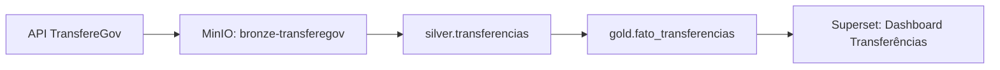

# OpenMetadata

Plataforma de governança e catalogação de dados do GovHub BR.

## Papel na Arquitetura

OpenMetadata fornece catálogo de dados, linhagem e ownership para garantir que os dados do GovHub são descobríveis, rastreáveis e confiáveis.

## Funcionalidades

| Feature | Descrição |
|---------|-----------|
| Catálogo | Descoberta de datasets (search) |
| Linhagem | Rastreio Bronze → Silver → Gold |
| Ownership | Responsáveis por cada dataset |
| Domínios | Organização por órgão/sistema |
| Qualidade | Integração com testes dbt |
| Tags | Classificação e sensibilidade |

## Domínios

| Domínio | Datasets | Owner |
|---------|----------|-------|
| Transferências | transferegov_*, fato_transferencias | Equipe Pipeline |
| Pessoal | siape_*, fato_servidores | Equipe Pipeline |
| Financeiro | siafi_*, execucao_financeira | Equipe Pipeline |
| Compras | comprasgov_*, fato_compras | Equipe Pipeline |
| Organizacional | siorg_*, dim_orgaos | Equipe Pipeline |

## Linhagem



OpenMetadata captura essa linhagem automaticamente via integração com dbt e Airflow.

## Configuração Declarativa

O repositório [`openmetadata-declarative-governance`](https://github.com/GovHub-br/openmetadata-declarative-governance) permite configurar governança como código:

- Domínios
- Times e usuários
- Produtos de dados
- Tags e classificações

```yaml
# Exemplo de configuração declarativa
domains:
  - name: Transferências
    description: Dados de convênios e transferências voluntárias
    owner: equipe-pipeline
    data_products:
      - gold.fato_transferencias
      - silver.transferencias
```

## Referências

- [OpenMetadata Docs](https://docs.open-metadata.org/)
- Repo: [`openmetadata-declarative-governance`](https://github.com/GovHub-br/openmetadata-declarative-governance)
