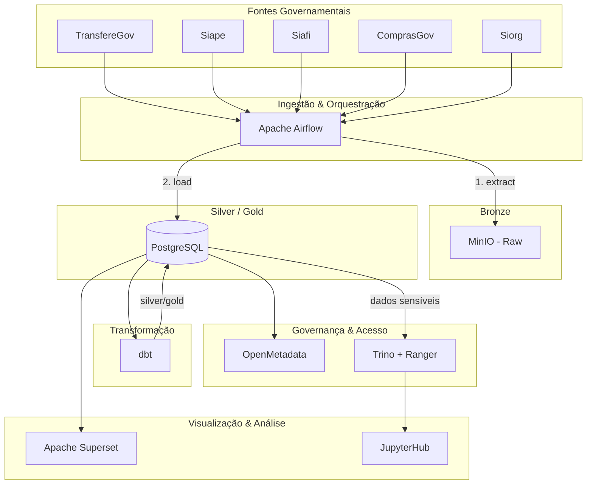

# GovHub BR

> Transformando dados públicos em ativos estratégicos para gestão pública.

## Sobre o Projeto

O **GovHub BR** é uma iniciativa open source para integrar, qualificar e disponibilizar dados governamentais de forma estruturada. A plataforma reduz a fragmentação de sistemas, otimiza processos internos e oferece informações estratégicas para gestores públicos e sociedade civil.

## Princípios

- **Transparência** — Cultura de dados abertos
- **Evidências** — Decisões baseadas em dados
- **Eficiência** — Redução de redundância e fragmentação
- **Colaboração** — Open source, forks temáticos

## Stack

| Componente | Tecnologia |
|------------|------------|
| Orquestração | Apache Airflow |
| Transformação | dbt |
| Object Storage | MinIO (Bronze) |
| Banco Analítico | PostgreSQL (Silver/Gold) |
| BI | Apache Superset |
| Notebooks | JupyterHub |
| Governança | OpenMetadata |
| Acesso Governado | Trino + Ranger |
| Deploy | Argo CD / Kubernetes |

## Fontes de Dados

| Sistema | Domínio |
|---------|---------|
| TransfereGov | Transferências voluntárias |
| Siape | Pessoal civil e militar |
| Siafi | Administração financeira |
| ComprasGov | Compras públicas |
| Siorg | Estrutura organizacional |

## Navegação Rápida

- [Arquitetura](arquitetura/visao-geral.md) — Design do sistema e fluxo de dados
- [Pipeline](pipeline/airflow.md) — Airflow, dbt, ingestão
- [Infraestrutura](infraestrutura/kubernetes.md) — Kubernetes, Argo CD, GitOps
- [Visualização](visualizacao/superset.md) — Superset, JupyterHub
- [Governança](governanca/openmetadata.md) — Catálogo, linhagem, controle de acesso
- [Onboarding](onboarding/roteiro.md) — Guia para novos contribuidores

---

**Organização**: [github.com/GovHub-br](https://github.com/GovHub-br)
**Site**: [gov-hub.io](https://gov-hub.io)
**Apoio**: Lab Livre (UnB) + IPEA/Dides
