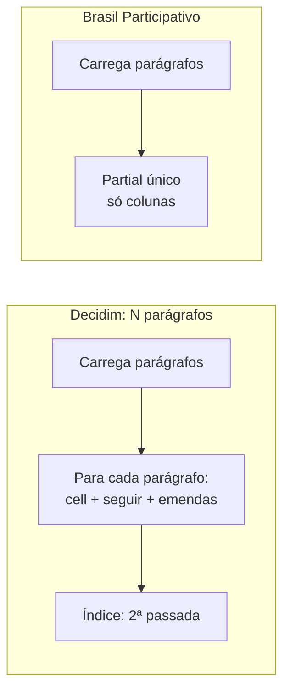

# Texto participativo

O **texto participativo** publica um documento (minuta de lei, plano, decreto) dividido em parágrafos, e cada parágrafo pode ser comentado. No Decidim, cada parágrafo é uma **proposta** do componente de propostas, com `participatory_text_level` (seção, subseção, artigo) e `position`.

Textos com milhares de parágrafos são comuns no Brasil Participativo, e o desenho original do Decidim não foi pensado para essa escala. Esta página mostra o que mudou.

## Resultado em uma frase

!!! success "Medido (MR !560)"
    "No meu local o tempo de resposta para renderizar a página de textos participativos com ~2000 parágrafos saiu de ~80000ms (1min 20s) para ~2000ms (2s)."
    — [MR !560](https://gitlab.com/lappis-unb/decidimbr/decidim-govbr/-/merge_requests/560), março de 2025.

Ressalvas importantes estão no [fim da página](#ressalvas).

## O que mudou

### 1. Leitura: renderização leve

=== "Decidim 0.27.2"

    A página renderiza **uma *cell* por parágrafo**. Cada *cell*:

    - renderiza o botão "seguir", que consulta se o participante segue o parágrafo (**1 consulta por parágrafo**, se logado);
    - verifica e conta as emendas visíveis (**1 a 2 consultas por parágrafo**);
    - gera 3 a 4 URLs com `resource_locator`;
    - aplica `simple_format` e sanitização.

    Depois, um **índice** percorre todos os parágrafos uma segunda vez.

    ```erb
    <% @proposals.each do |proposal| %>
      <%= cell("decidim/proposals/participatory_text_proposal", proposal, ...) %>
    <% end %>
    ...
    <%= follow_button_for(model, true) %>
    <% if amendmendment_creation_enabled? || visible_emendations.any? %>
      <%= visible_emendations.count %>
    ```

=== "Brasil Participativo"

    Um **partial único** (`_lightweight_text_render.html.erb`) percorre os parágrafos já carregados e lê só colunas: `position`, `body`, `is_hidden`, `is_interactive`, `comments_count`, `published_at`. As rotas vêm de um roteador memoizado. Não há botão de seguir nem de emendas, e o índice não é mais renderizado.

    ```erb
    <% proposals.each do |participatory_text| %>
      <% next if participatory_text.comments_section? %>
      <% next if participatory_text.is_hidden && !user_can_edit %>
      <% participatory_text_body = translated_attribute(participatory_text.body) %>
      <% paragraph_path = participatory_text.is_interactive ?
           current_component_engine_router.proposal_path(participatory_text) : "#" %>
      <%== decidim_sanitize_editor(participatory_text_body) %>
      <%= participatory_text.comments_count %>
    <% end %>
    ```

**Efeito (inferido):** o número de consultas ao banco deixa de crescer com o número de parágrafos.



### 2. Edição: um parágrafo por vez

=== "Decidim 0.27.2"

    O painel monta **um formulário com todos os rascunhos**: um campo de título e uma área de texto por parágrafo. "Salvar rascunho" envia tudo, e o comando `UpdateParticipatoryText` busca, reposiciona e salva **cada parágrafo** a cada salvamento.

=== "Brasil Participativo"

    A edição acontece na própria página pública (`edit_participatory_text`). Cada ação atua em **um parágrafo**, via AJAX (`manipulate_paragraph`):

    | Ação | O que faz |
    |------|-----------|
    | `publish` | Publica os rascunhos |
    | `toggle_interaction` | Liga ou desliga comentários no parágrafo (`is_interactive`) |
    | `toggle_visibility` | Oculta ou mostra o parágrafo (`is_hidden`) |
    | `move` | Muda a posição (`acts_as_list#insert_at`) |
    | `merge` | Mescla parágrafos |
    | `destroy` / `destroy_all` | Remove um ou todos |

    Editar o conteúdo usa `UpdateProposal` em **um** registro. Os modais são renderizados uma vez por página, e o parágrafo alvo vai por atributo `data-*`.

**Efeito (inferido):** o custo de cada edição passa de proporcional ao tamanho do texto para constante.

### 3. Criação: novos formatos

| Forma | Decidim 0.27.2 | Brasil Participativo |
|-------|----------------|----------------------|
| Markdown e ODT | :white_check_mark: | :white_check_mark: |
| DOCX | :x: (referenciado, mas a classe não existe) | :white_check_mark: via `pandoc-ruby` (MR !181) |
| Tabelas Excel | :x: | :white_check_mark: via RubyXL (MR !468) |
| Copiar e colar com formatação | :x: | :white_check_mark: (MR !561). Títulos `h1` viram seções, `h2`/`h3` subseções, o resto artigos |
| Imagens coladas | — | Extraídas do HTML (base64) para o ActiveStorage, em vez de ficarem dentro do texto no banco |

### 4. Comentários fora da página do texto

O Decidim não mostra comentários na página do texto. O Brasil Participativo chegou a mostrar os comentários de cada parágrafo ali (2024), com uma requisição por parágrafo e atualização periódica. Isso pesava muito em textos grandes e foi **removido** em outubro de 2025 (MR !715). Os comentários continuam na página de cada parágrafo.

!!! note "Volta à paridade"
    Essa remoção desfaz um custo criado pelo próprio Brasil Participativo. Em relação ao Decidim original, os ganhos reais são: o fim das *cells* por parágrafo, o fim do índice e a edição por parágrafo.

### 5. Retrocompatibilidade (v2)

Textos novos usam só o corpo do parágrafo. Os antigos combinavam título e corpo. Para não quebrar os antigos, a organização tem a data de corte `participatory_text_v2_release_date` (padrão: **25/05/2025**, editável no admin):

- texto **publicado a partir** da data → renderização leve;
- texto **publicado antes** → caminho antigo, com *cells* (sem botão de seguir, mas ainda com consultas de emendas por parágrafo).

### 6. Componente próprio (2026)

O MR !777 ("Separação total de propostas") criou a opção **Texto participativo** na lista de componentes. Ela habilita os textos participativos e esconde configurações que não se aplicam. É uma melhoria de usabilidade do painel, sem efeito de desempenho.

## Linha do tempo

| Data | Mudança | Referência |
|------|---------|-----------|
| fev/2024 | Remove o índice da página | `cce8718a` |
| fev/2024 | Parágrafos não interativos (`is_interactive`) | MR !91 |
| abr/2024 | Importação de DOCX | MR !181 |
| out/2024 | Tabelas por copiar/colar e Excel | MR !468 |
| out/2024 | Comentários de todos os parágrafos na página; *polling* passa de 60 s para 120 s | `0571717a`, `2699855b`, `85487e5f` |
| dez/2024 | Ocultar parágrafos (`is_hidden`) | migração `20241203204147` |
| jan/2025 | Mesclar, remover, ocultar e prévia | MR !504 |
| 31/03/2025 | Renderização inline: **~80 s → ~2 s** | MR !560 |
| 07/04/2025 | Rollback: "entrou em prod. sem homologar no lab" | MR !571 |
| 25/04/2025 | Copiar/colar com formatação e renderização leve reescrita | MR !561 |
| 26/05/2025 | Data de corte v2 para textos antigos | MR !615 |
| jul/2025 | Imagens coladas vão para o ActiveStorage | `3a77bde5` |
| 22/10/2025 | Remove comentários da página do texto | MR !715 |
| 25/03/2026 | Opção "Texto participativo" na lista de componentes | MR !777 |

## Onde está no código

| Arquivo | Papel |
|---------|-------|
| `app/views/decidim/proposals/proposals/_lightweight_text_render.html.erb` | Renderização leve (novo) |
| `app/views/decidim/proposals/proposals/participatory_texts/participatory_text.html.erb` | Escolhe entre v2 e o caminho antigo |
| `app/views/decidim/proposals/proposals/participatory_texts/edit.html.erb` e modais | Edição na página pública (novo) |
| `app/controllers/concerns/decidim/govbr/public_participatory_text_editing.rb` | Ação de edição e roteadores memoizados (novo) |
| `app/commands/decidim/proposals/admin/manipulate_participatory_text_paragraph.rb` | Operações por parágrafo (novo) |
| `app/commands/decidim/proposals/admin/create_participatory_text_from_copy_and_paste.rb` | Copiar e colar (novo) |
| `app/commands/decidim/proposals/admin/inline_images_handling_methods.rb` | Extração de imagens (novo) |
| `app/lib/decidim/proposals/docx_to_markdown.rb` | DOCX → Markdown (novo) |
| `app/packs/src/decidim/govbr/participatory_texts/public_view_editing.js` | AJAX da edição (novo) |
| `app/controllers/decidim/proposals/admin/participatory_texts_controller.rb` | Sobrescrito: o `index` redireciona para a edição pública |
| `app/commands/decidim/proposals/admin/update_participatory_text.rb` | Sobrescrito: mescla, remoção, tabelas e imagens (ainda percorre todos os parágrafos) |
| `app/cells/decidim/proposals/participatory_text_proposal_cell.rb` | Sobrescrito: caminho antigo, sem botão de seguir |
| `app/lib/decidim/proposals/participatory_text_section.rb` | Sobrescrito: níveis `table`, `image` e `comments-section` |
| `app/models/decidim/proposals/proposal.rb` | Sobrescrito: imagens e bloqueio de edição de parágrafo comentado |

## Ressalvas

1. **A versão em produção não foi medida.** O número de ~80 s → ~2 s é do MR !560, revertido em sete dias e reescrito no MR !561, que não traz números.
2. **A linha de base não era o Decidim puro.** Os 80 s já incluíam os comentários por parágrafo acrescentados pelo próprio Brasil Participativo.
3. **Textos antigos não ganham.** O que foi publicado antes da data de corte v2 continua no caminho com *cells*.
4. **Consultas desnecessárias (inferido).** O controller ainda pré-carrega categoria, escopo, anexos e coautorias, que o partial leve não usa. Parágrafos do tipo imagem fazem uma consulta cada.
5. **Publicação e copiar/colar continuam proporcionais ao tamanho do texto.** Não há inserção em lote. O copiar/colar também grava histórico de versões (PaperTrail) para cada parágrafo, ao contrário da importação original.
6. **Seção de comentários gerais (inferido).** Desde o MR !715, o bloco de comentários gerais do texto (`comments-section`) não aparece em nenhuma view. Vale confirmar se é intencional.

## Oportunidades

- Criar um benchmark reproduzível (por exemplo, um texto de 2.000 parágrafos nos seeds e uma spec de desempenho).
- Remover do controller os pré-carregamentos que o partial leve não usa.
- Migrar os textos anteriores à data de corte para o formato v2.
- Publicar parágrafos em lote, sem uma transação de rastreabilidade por parágrafo.
