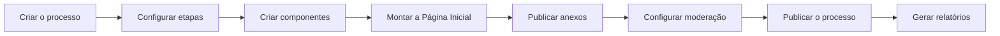

# Manual de Uso

Guias passo a passo para quem administra processos participativos no Brasil Participativo: criar e publicar um processo, montar a página inicial, publicar documentos, gerar relatórios e moderar conteúdo.

!!! info "Fonte"
    Este manual é baseado nos [Guias e tutoriais](https://brasilparticipativo.presidencia.gov.br/pages) publicados na plataforma, seção **Capacitação para Órgão Federal**. As capturas de tela estão nas páginas originais, cujo link aparece no início de cada guia.

## Antes de começar

- Você precisa de um **perfil de administrador** no processo participativo. Peça o acesso aos administradores do Brasil Participativo.
- A criação de um processo é feita em conjunto com o **ponto focal da Coordenação-Geral de Participação Digital**, que revisa e valida as informações.
- Todo o trabalho acontece no **painel de administração** (`/admin`).

## Guias

-   :material-file-document-edit:{ .lg .middle } **Criar e publicar um processo**

    ---

    Informações gerais, etapas, componentes e publicação, em 6 etapas.

    [:octicons-arrow-right-24: Começar](informacoes-gerais.md)

-   :material-view-dashboard-edit:{ .lg .middle } **Página Inicial do processo**

    ---

    Monte a vitrine do processo com blocos: cabeçalho, notícias, cards, etapas, enquete EJ e outros.

    [:octicons-arrow-right-24: Configurar](pagina-inicial.md)

-   :material-paperclip:{ .lg .middle } **Anexos**

    ---

    Publique documentos e materiais de apoio em pastas ou como arquivos avulsos.

    [:octicons-arrow-right-24: Publicar anexos](anexos.md)

-   :material-file-chart:{ .lg .middle } **Relatórios (devolutivas)**

    ---

    Exporte propostas, eventos e outros registros de participação.

    [:octicons-arrow-right-24: Gerar relatórios](relatorios.md)

-   :material-shield-account:{ .lg .middle } **Moderação**

    ---

    Configure o bot do Telegram, acompanhe os alertas e oculte conteúdo impróprio.

    [:octicons-arrow-right-24: Moderar](moderacao.md)

-   :material-account-voice:{ .lg .middle } **Guias para o cidadão**

    ---

    Materiais para quem participa dos processos. Em preparação.

    [:octicons-arrow-right-24: Ver](cidadao.md)

## Ordem recomendada

## Atendimento

Dúvidas, sugestões ou solicitações: **brasilparticipativo@presidencia.gov.br**, de segunda a sexta-feira, das 9h às 12h e das 14h às 18h.

Para detalhes técnicos de cada funcionalidade, veja também [Administração](../operador/administracao.md) no Guia do Operador.
