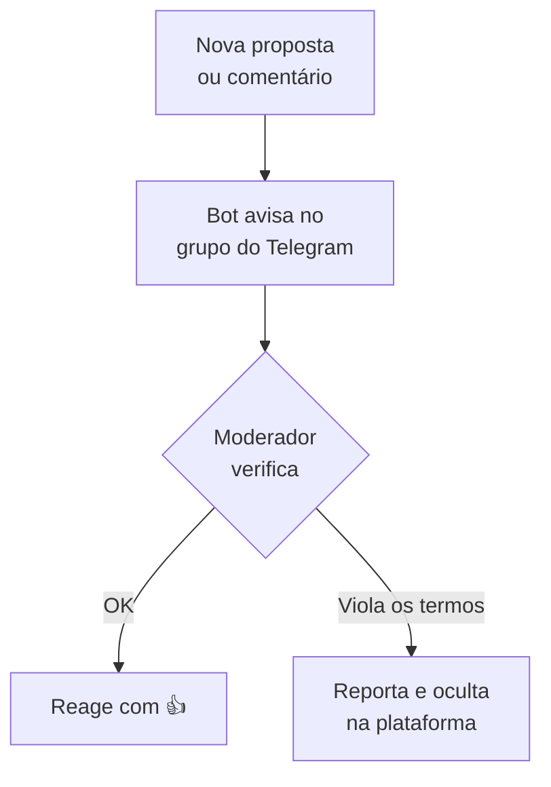

# Moderação

Como moderar propostas, comentários e reuniões publicados pela sociedade no Brasil Participativo.

[:material-open-in-new: Guia original com capturas de tela](https://brasilparticipativo.presidencia.gov.br/pages/tutorial-moderacao){ .md-button }

## Como funciona



1. **Configurar**: um bot é colocado num grupo do Telegram e ligado ao processo.
2. **Monitorar**: a cada nova proposta ou comentário, o bot envia o conteúdo e o link para o grupo.
3. **Moderar**: se o conteúdo violar os termos de uso, a equipe o oculta na plataforma.

## O que deve ser ocultado

A moderação verifica se o conteúdo respeita os [Termos de Uso](https://brasilparticipativo.presidencia.gov.br/pages/terms-and-conditions). Deve ser ocultado o conteúdo que:

- apresente calúnia, difamação ou injúria;
- contenha linguagem vulgar ou imprópria;
- apresente conteúdo sexual ou pornográfico;
- promova discriminação, hostilidade ou violência por religião, etnia, nacionalidade, raça, cor, descendência, gênero ou outra característica de identidade;
- induza ou incite condutas homofóbicas ou transfóbicas;
- promova assédio ou *bullying* virtual;
- propague informações falsas ou enganosas que possam prejudicar a saúde ou a segurança das pessoas (*fake news*, fraudes, abordagens criminosas);
- exiba cenas de violência, crueldade, tortura ou morte;
- comprometa a isonomia ou o objetivo da página;
- compartilhe informações pessoais (CPF, telefone);
- faça propaganda de produtos ou serviços;
- contenha links externos.

!!! note "Casos duvidosos"
    Violações claras são moderadas imediatamente pela equipe. Conteúdos duvidosos vão para a liderança da moderação, que decide se ocultam ou não.

## Etapa 1: Configurar

### Criar o grupo e adicionar o bot

As instruções seguem o Telegram em português e atualizado.

=== "iPhone, iPad e macOS"

    **1. Crie um grupo**

    1. Abra o Telegram e toque no ícone de lápis no canto superior direito da lista de conversas.
    2. Toque em **Novo Grupo** e depois em **Próximo** (os membros podem ser adicionados depois).
    3. Dê um nome ao grupo, por exemplo "Moderação Brasil Participativo", e toque em **Criar**.

    **2. Ative os tópicos**

    1. Abra o grupo, toque no nome dele e em **Editar**.
    2. Ative **Tópicos**. O bot cria os tópicos sozinho, um para cada tipo de participação.

    **3. Adicione o bot**

    1. Toque no nome do grupo e em **Adicionar Membros**.
    2. Busque **`@moderacao_bp_bot`** e selecione **Moderação Brasil Participativo**.
    3. Confirme em **Pronto**. Repita o processo para adicionar as pessoas moderadoras.

    **4. Torne o bot administrador**

    1. Na lista de membros, deslize o bot para a esquerda (no macOS, clique com o botão direito).
    2. Toque em **Promover** e confirme em **Pronto**, sem alterar as permissões.

    Para promover pessoas, faça o mesmo, ative **Adicionar novos admins** e deixe **Permanecer anônimo** desmarcado.

=== "Android, Windows e Web"

    **1. Crie um grupo**

    1. Abra o Telegram ou acesse [web.telegram.org](https://web.telegram.org).
    2. No Android e no Windows, toque no menu no canto superior esquerdo. Na versão web, toque no lápis no canto inferior direito.
    3. Toque em **Novo Grupo**, avance sem escolher membros, dê um nome e confirme.

    **2. Ative os tópicos**

    1. Abra o grupo, toque no nome dele e no ícone de lápis (ou em gerenciar/editar).
    2. Ative **Tópicos**. O bot cria os tópicos sozinho.

    **3. Adicione o bot**

    1. Toque no nome do grupo e em **Adicionar Membros**.
    2. Busque **`@moderacao_bp_bot`** e selecione **Moderação Brasil Participativo**.
    3. Confirme no ícone de OK e, se pedido, em **Adicionar**.

    **4. Torne o bot administrador**

    1. Toque no nome do grupo e segure o perfil do bot.
    2. Escolha **Promover a Administrador** e confirme em OK ou **Salvar**, sem alterar as permissões.

    Para promover pessoas, faça o mesmo, ative **Adicionar novos admins** e deixe **Permanecer anônimo** desmarcado.

### Obter o Chat ID

1. Saia das configurações e abra o tópico **# General** do grupo.
2. Envie a mensagem:

    ```text
    /chat_id@moderacao_bp_bot
    ```

3. O bot responde com um número, o **Chat ID** do grupo. Copie-o **com o sinal de menos**.

### Configuração no Brasil Participativo

1. No painel de administração, abra o processo (ou crie um novo).
2. Em **Informação geral**, encontre o campo **Identificador do grupo do Telegram para moderação**.
3. Cole o Chat ID e salve.

## Etapa 2: Monitorar

Com o bot funcionando, cada novo conteúdo gera um aviso no grupo.

1. Todas as pessoas moderadoras leem os avisos.
2. Quem verificou e não viu problema reage com 👍. Assim, as outras pessoas sabem que o conteúdo já foi checado.
3. Se o conteúdo precisar de moderação, clique no link do aviso. Ele leva direto ao conteúdo na plataforma.

!!! tip "Rapidez"
    Quanto antes o conteúdo impróprio for ocultado, menor o dano. Mantenha o grupo com notificações ativas.

## Etapa 3: Moderar

### Reportar o conteúdo

1. Clique no link **acesse aqui** enviado pelo bot.
2. Faça login com o perfil de administrador.
3. Clique em **Moderação** (denunciar).
4. Em **Comentários adicionais**, explique o motivo (discurso de ódio, *fake news*, informações pessoais etc.) e clique em **Reportar**.

### Ocultar o conteúdo reportado

1. No painel de administração, clique em **Moderação**.
2. A lista **Não oculto** mostra o que foi reportado e ainda está visível.
3. Identifique o conteúdo pelo ID e clique em **Ocultar**.

## Veja também

- [Administração › Moderação](../operador/administracao.md#moderacao): regras de comentários e papéis.
