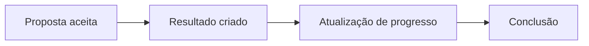

# Accountability

**Gem**: `decidim-accountability`

O módulo de accountability (prestação de contas) permite acompanhar a execução de resultados vinculados a propostas aceitas, dando transparência ao que foi decidido coletivamente.

## Funcionalidades

- **Resultados** — itens que representam compromissos ou ações resultantes da participação
- **Status de execução** — percentual de progresso (0–100%) com categorias (não iniciado, em andamento, concluído)
- **Vinculação com propostas** — resultados podem ser linkados a propostas aceitas
- **Sub-resultados** — hierarquia de resultados para projetos complexos
- **Timeline** — histórico de atualizações de progresso

## Fluxo

## Configuração

| Opção | Descrição |
|-------|-----------|
| **Comentários habilitados** | Permitir discussão sobre resultados |
| **Categorias** | Organizar resultados por tema |

## Referência

- [Documentação oficial do Decidim — Accountability](https://docs.decidim.org/en/develop/admin/components/accountability/)
