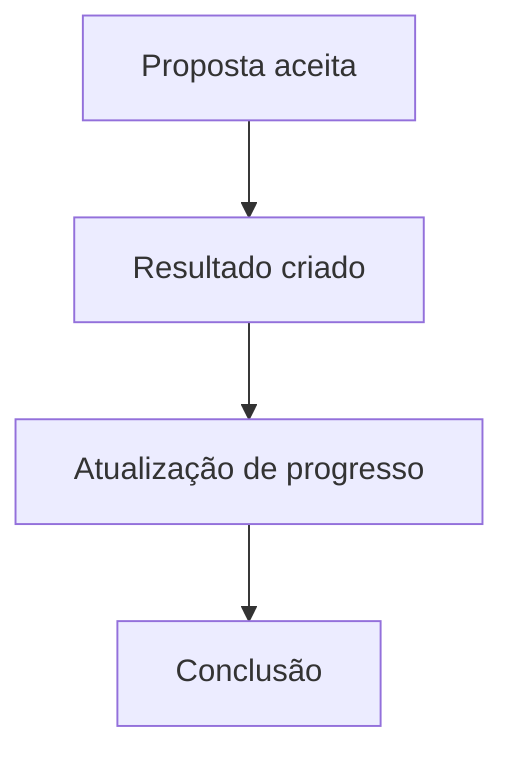

# Prestação de contas

**Gem**: `decidim-accountability`

O módulo de prestação de contas permite acompanhar a execução de resultados vinculados a propostas aceitas, dando transparência ao que foi decidido coletivamente.

!!! note "Não é sinônimo de devolutiva"
    A **devolutiva** é o retorno do poder público aos participantes sobre o que foi feito com a participação. Este módulo pode ser um dos meios de devolutiva, mas ela também acontece por outros, como os [relatórios](../manual/relatorios.md).

## Funcionalidades

- **Resultados** — itens que representam compromissos ou ações resultantes da participação
- **Status de execução** — percentual de progresso (0–100%) com categorias (não iniciado, em andamento, concluído)
- **Vinculação com propostas** — resultados podem ser linkados a propostas aceitas
- **Sub-resultados** — hierarquia de resultados para projetos complexos
- **Timeline** — histórico de atualizações de progresso

## Fluxo

```mermaid
flowchart TB
    A[Proposta aceita] --> B[Resultado criado]
    B --> C[Atualização de progresso]
    C --> D[Conclusão]
```

## Configuração

| Opção | Descrição |
|-------|-----------|
| **Comentários habilitados** | Permitir discussão sobre resultados |
| **Categorias** | Organizar resultados por tema |

## Referência

- [Documentação oficial do Decidim — Prestação de contas (Accountability)](https://docs.decidim.org/en/develop/admin/components/accountability/)
