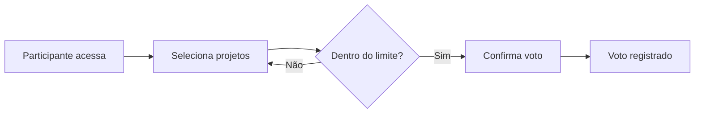

# Orçamento Participativo

**Gem**: `decidim-budgets`

O módulo de orçamento participativo permite que cidadãos votem em projetos dentro de um limite orçamentário definido, priorizando onde recursos públicos devem ser investidos.

## Funcionalidades

- **Projetos com custo** — cada projeto tem um valor associado
- **Orçamento total** — limite máximo que o participante pode distribuir
- **Votação** — participante seleciona projetos até esgotar o orçamento disponível
- **Múltiplos orçamentos** — possibilidade de criar vários exercícios orçamentários no mesmo espaço
- **Resultados** — projetos mais votados dentro do limite são selecionados

## Fluxo de Votação

## Configuração

| Opção | Descrição |
|-------|-----------|
| **Orçamento total** | Valor máximo que cada participante pode distribuir |
| **Voto mínimo** | Percentual mínimo do orçamento que deve ser utilizado |
| **Comentários** | Habilitar discussão sobre projetos |

## Referência

- [Documentação oficial do Decidim — Budgets](https://docs.decidim.org/en/develop/admin/components/budgets/)
