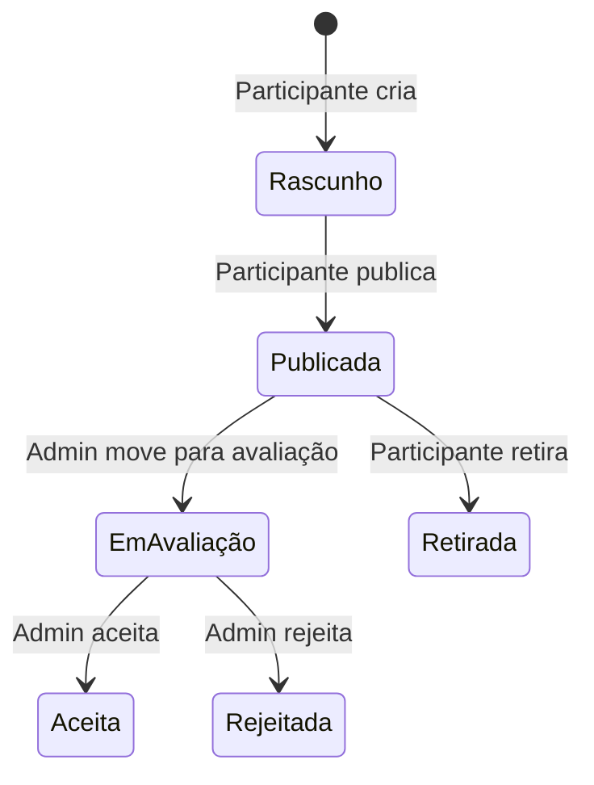

# Propostas

**Gem**: `decidim-proposals`

O módulo de propostas é o principal mecanismo de participação do Decidim. Permite que cidadãos criem, debatam e votem em propostas dentro de espaços participativos.

## Funcionalidades

- **Criação de propostas** — participantes submetem contribuições com título e corpo
- **Votação** — apoio (endorse) e voto em propostas
- **Comentários** — discussão encadeada em cada proposta
- **Moderação** — administradores podem aceitar, rejeitar ou ocultar propostas
- **Propostas oficiais** — administradores podem criar propostas em nome da organização
- **Emendas** — participantes podem propor alterações a propostas existentes
- **Georreferenciamento** — propostas podem ser associadas a coordenadas no mapa
- **Categorias e escopos** — organização por tema e abrangência geográfica

## Configuração no Espaço

Ao adicionar o componente de Propostas a um espaço participativo:

| Opção | Descrição |
|-------|-----------|
| **Votação habilitada** | Permitir que participantes votem em propostas |
| **Limite de propostas** | Número máximo de propostas por participante |
| **Limite de votos** | Número máximo de votos por participante |
| **Criação habilitada** | Permitir criação de novas propostas |
| **Emendas habilitadas** | Permitir propostas de emenda |
| **Texto colaborativo** | Habilitar edição colaborativa (Etherpad) |
| **Geolocalização** | Habilitar mapa para propostas |

## Ciclo de Vida

## Referência

- [Documentação oficial do Decidim — Proposals](https://docs.decidim.org/en/develop/admin/components/proposals/)
