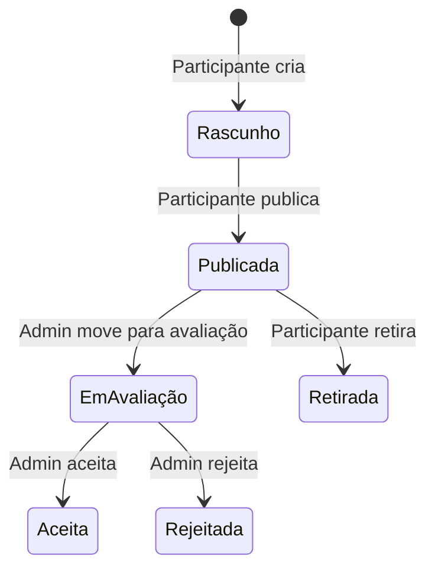

# Propostas

**Gem**: `decidim-proposals` (com sobrescritas no core)

O módulo de propostas é o principal mecanismo de participação. Participantes criam, comentam e votam propostas dentro de processos e instâncias. No Brasil Participativo ele também é usado para textos participativos e para o Orçamento Participativo.

## Funcionalidades

- **Criação de propostas** com título e corpo.
- **Votação** e apoio.
- **Comentários** encadeados.
- **Moderação e avaliação** por administradores.
- **Propostas oficiais** e propostas criadas a partir de reuniões.
- **Emendas**.
- **Georreferenciamento**.
- **Categorias e escopos**.
- **Selos** em propostas (rotas `proposal_badges`).
- **Textos participativos**: importação de documento dividido em parágrafos, cada um virando uma proposta comentável.

## Opções do Brasil Participativo

| Opção | Onde | Efeito |
|-------|------|--------|
| **Exibir votos** (`show_votes`) | Configuração do componente | Mostra a contagem de votos ao participante |
| **Votos mutuamente exclusivos** | Configuração do processo participativo | Quem votou num componente de propostas do processo não pode votar em outro |
| **Tempo de edição** (`proposal_edit_time`, `proposal_edit_before_minutes`) | Configuração do componente | Limita a edição após publicar; `infinite` remove o limite |
| **Texto participativo** | Lista de componentes | Opção própria que habilita os textos participativos e esconde configurações que não se aplicam. Veja [Inovação › Texto participativo](../inovacao/texto-participativo.md) |

## Orçamento Participativo

Quando o componente de propostas é usado para Orçamento Participativo, o core usa uma listagem própria:

- página única com ordenação;
- cards com botão de voto de texto e ícone dinâmicos;
- contador de votos restantes por mensagem;
- ao esgotar os votos, o participante é direcionado ao botão de confirmar.

O participante que chega pelo WhatsApp ou Telegram vincula a conta pelo [fluxo OP-BP](../operador/integracao-op-bp.md).

## Exportação

A exportação de propostas inclui **nome e ID do autor**, e distingue propostas oficiais das criadas a partir de reuniões.

## Ciclo de vida

```mermaid
stateDiagram-v2
    [*] --> Rascunho: Participante cria
    Rascunho --> Publicada: Participante publica
    Publicada --> EmAvaliação: Admin move para avaliação
    EmAvaliação --> Aceita: Admin aceita
    EmAvaliação --> Rejeitada: Admin rejeita
    Publicada --> Retirada: Participante retira
```

## Referência

- [Documentação oficial do Decidim: Proposals](https://docs.decidim.org/en/develop/admin/components/proposals/)
