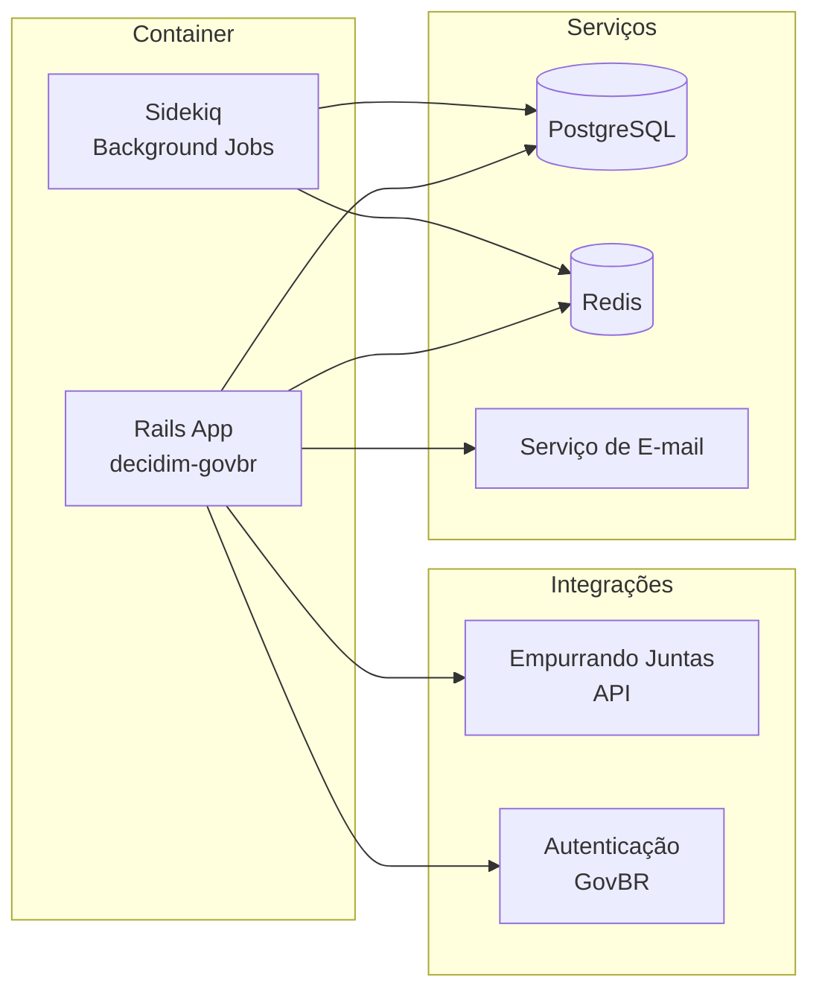

# Deploy

Guia para implantar o Brasil Participativo em ambiente de produção.

## Visão Geral

O Brasil Participativo é implantado em **Kubernetes**. A aplicação é containerizada via Docker e orquestrada no cluster K8s.



## Pré-requisitos de Infraestrutura

| Recurso | Requisito mínimo | Recomendado |
|---------|-------------------|-------------|
| Cluster Kubernetes | 1.24+ | 1.28+ |
| PostgreSQL | 14+ | 15+ |
| Redis | 6+ | 7+ |
| Armazenamento (PV) | 20 GB | 100 GB |
| RAM (por pod Rails) | 512 MB | 1 GB |
| CPU (por pod Rails) | 0.5 vCPU | 1 vCPU |

## Imagem Docker

O build da imagem Docker é feito a partir do repositório core:

```dockerfile
# Exemplo simplificado
FROM ruby:3.1-slim

WORKDIR /app
COPY Gemfile Gemfile.lock ./
RUN bundle install --without development test
COPY . .
RUN bin/rails assets:precompile

EXPOSE 3000
CMD ["bin/rails", "server", "-b", "0.0.0.0"]
```

## Kubernetes

### Recursos Necessários

Os seguintes recursos K8s são necessários para o deploy:

| Recurso | Descrição |
|---------|-----------|
| **Deployment** (web) | Pods da aplicação Rails |
| **Deployment** (worker) | Pods do Sidekiq |
| **Service** | Exposição interna da aplicação |
| **Ingress** | Exposição externa com TLS |
| **ConfigMap** | Variáveis de ambiente não-sensíveis |
| **Secret** | Credenciais e chaves sensíveis |
| **PersistentVolumeClaim** | Storage para uploads |

### Exemplo de Deployment

```yaml
apiVersion: apps/v1
kind: Deployment
metadata:
  name: brasil-participativo-web
spec:
  replicas: 2
  selector:
    matchLabels:
      app: brasil-participativo
      component: web
  template:
    metadata:
      labels:
        app: brasil-participativo
        component: web
    spec:
      containers:
        - name: web
          image: registry.gitlab.com/lappis-unb/decidimbr/decidim-govbr:latest
          ports:
            - containerPort: 3000
          envFrom:
            - configMapRef:
                name: brasil-participativo-config
            - secretRef:
                name: brasil-participativo-secrets
          resources:
            requests:
              memory: "512Mi"
              cpu: "500m"
            limits:
              memory: "1Gi"
              cpu: "1000m"
```

## Dependências Externas

### Empurrando Juntas (EJ)

O componente `decidim-ej` requer acesso à API do EJ:

- Configure a URL da API via variável de ambiente
- O EJ deve estar acessível via rede a partir dos pods

### Autenticação

!!! note "A detalhar"
    Detalhes sobre integração com Login Único GovBR serão documentados conforme as informações forem consolidadas.

## Checklist de Deploy

- [ ] Cluster Kubernetes provisionado
- [ ] PostgreSQL disponível e acessível
- [ ] Redis disponível e acessível
- [ ] Imagem Docker buildada e publicada no registry
- [ ] Secrets configurados (DB, Redis, SECRET_KEY_BASE, etc.)
- [ ] Migrações executadas (`bin/rails db:migrate`)
- [ ] Seeds de produção executados (se necessário)
- [ ] Ingress configurado com TLS
- [ ] Sidekiq rodando para jobs em background
- [ ] EJ acessível (se o componente estiver habilitado)
- [ ] Health checks configurados (`/health`)
