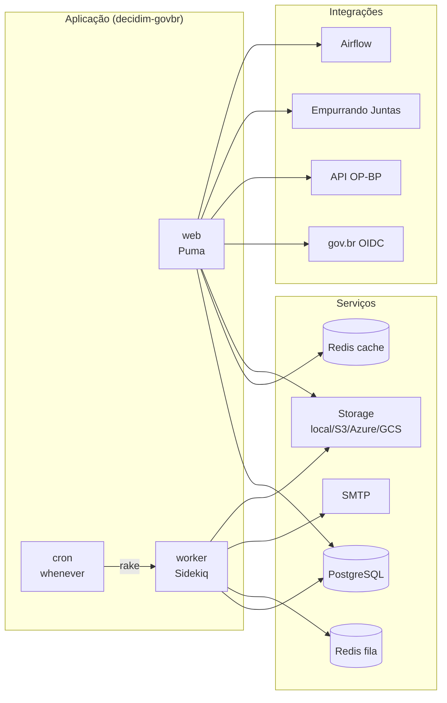

# Deploy

O que é preciso para implantar o Brasil Participativo. A produção oficial é hospedada pela **Dataprev**; os manifestos de infraestrutura de produção não estão no repositório `decidim-govbr`.

## Componentes do ambiente


```mermaid
graph LR
    subgraph "Aplicação (decidim-govbr)"
        WEB[web<br/>Puma]
        WORKER[worker<br/>Sidekiq]
        CRON[cron<br/>whenever]
    end

    subgraph "Serviços"
        PG[(PostgreSQL)]
        RQ[(Redis fila)]
        RC[(Redis cache)]
        SMTP[SMTP]
        ST[Storage<br/>local/S3/Azure/GCS]
    end

    subgraph "Integrações"
        GOV[gov.br OIDC]
        OPBP[API OP-BP]
        EJ[Empurrando Juntas]
        AF[Airflow]
    end

    WEB --> PG & RC & ST & GOV
    WEB --> OPBP
    WEB --> EJ
    WORKER --> PG & RQ & SMTP & ST
    CRON -->|rake| WORKER
    WEB --> AF
```

## Processos

| Processo | Comando | Observação |
|----------|---------|------------|
| `web` | `bundle exec puma -p 3000 -C config/puma.rb` | Escala horizontalmente |
| `worker` | `bundle exec sidekiq -t 25 -C config/sidekiq.yml` | Usa `REDIS_URL` |
| `cron` | `bundle exec whenever --update-crontab` + `cron` | Uma única instância, para não duplicar tarefas |

As tarefas agendadas estão listadas em [Arquitetura](../visao-geral/arquitetura.md#tarefas-agendadas). Várias delas enfileiram jobs, então o `worker` precisa estar no ar.

## Imagem Docker

O `Dockerfile` do repositório parte da imagem `lappis/decidim-govbr:v1-release`, instala `pandoc`, roda `bundle install` e `yarn` e copia `.env.dev`. Ele foi feito para desenvolvimento e para o job `Build` do CI.

Para produção, a imagem precisa:

- compilar os assets (`bundle exec rails webpacker:compile` ou `assets:precompile`);
- **não** copiar `.env.dev`; as variáveis vêm do ambiente;
- incluir `pandoc` (importação de textos participativos);
- iniciar `web`, `worker` ou `cron` conforme o papel do container.

## Pré-requisitos

| Recurso | Versão de referência |
|---------|----------------------|
| PostgreSQL | 13 (versão usada no CI e no Compose) |
| Redis | 6, duas instâncias ou dois bancos lógicos (fila e cache) |
| SMTP | Qualquer servidor com STARTTLS |
| Storage | Volume persistente (`local`) ou bucket S3/Azure/GCS |
| Credenciais gov.br | Client ID e segredo do Login Único |

## Passo a passo

1. Provisione PostgreSQL, os dois Redis, SMTP e storage.
2. Configure as variáveis de ambiente (veja [Configuração](configuracao.md)). No mínimo: `SECRET_KEY_BASE`, `SECRET_KEY_JWT`, `DATABASE_URL`, `REDIS_URL`, `REDIS_CACHE_URL`, `ALLOW_HOSTS`, `DEFAULT_HOST`, `DEFAULT_PROTOCOL`, `SMTP_*`, `DECIDIM_DEFAULT_LOCALE=pt-BR`, `ADMIN_USERNAME` e `ADMIN_PASSWORD`.
3. Rode as migrações:

    ```bash
    bundle exec rails db:migrate
    ```

4. Crie o administrador de sistema (sem rodar o seed completo em produção):

    ```ruby
    Decidim::System::Admin.create!(email: "...", password: "...", password_confirmation: "...")
    ```

5. Acesse `/system`, crie a organização com o host público e habilite o gov.br nas autorizações.
6. Suba `web`, `worker` e `cron`.
7. Configure as integrações que serão usadas: [OP-BP](integracao-op-bp.md), EJ, Airflow, mapas.

## Kubernetes

Se o ambiente for Kubernetes, crie um Deployment para cada processo (`web`, `worker`) e um único pod ou CronJobs para as tarefas do `schedule.rb`. Use Secret para as variáveis sensíveis e ConfigMap para as demais.

```yaml
apiVersion: apps/v1
kind: Deployment
metadata:
  name: brasil-participativo-web
spec:
  replicas: 2
  selector:
    matchLabels: { app: brasil-participativo, component: web }
  template:
    metadata:
      labels: { app: brasil-participativo, component: web }
    spec:
      containers:
        - name: web
          image: <registry>/decidim-govbr:<tag>
          command: ["bundle", "exec", "puma", "-p", "3000", "-C", "config/puma.rb"]
          ports:
            - containerPort: 3000
          envFrom:
            - configMapRef: { name: brasil-participativo-config }
            - secretRef: { name: brasil-participativo-secrets }
```

## Checklist

- [ ] PostgreSQL, Redis (fila e cache), SMTP e storage acessíveis
- [ ] `ALLOW_HOSTS` com o domínio público (sem ela a aplicação não sobe)
- [ ] Migrações executadas
- [ ] Admin de sistema criado e organização configurada em `/system`
- [ ] `worker` (Sidekiq) e `cron` (whenever) rodando, cron em instância única
- [ ] `/sidekiq` protegido por `ADMIN_USERNAME`/`ADMIN_PASSWORD`
- [ ] Credenciais gov.br configuradas
- [ ] `OP_BP_JWT_SECRET` e `OP_BP_CALLBACK_API_KEY` configurados, se a integração OP-BP for usada
- [ ] `EJ_JWT_SECRET`/`EJ_SECRET_KEY`, se o componente EJ for usado
