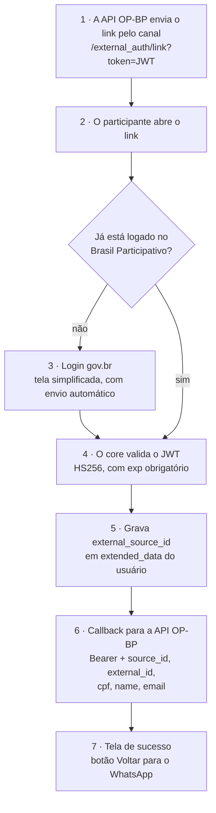

# Integração OP-BP (login externo)

A integração OP-BP permite que um participante que interage com a plataforma por **WhatsApp** ou **Telegram** vincule esse canal à sua conta gov.br no Brasil Participativo. O vínculo usa um JWT assinado com segredo compartilhado entre o core e a API OP-BP.

## Fluxo



## Conteúdo do JWT

| Claim | Obrigatório | Uso |
|-------|-------------|-----|
| `exp` | Sim | Expiração. Tokens sem `exp` são rejeitados |
| `source_id` | Sim | Identificador do usuário no canal; gravado em `extended_data["external_source_id"]` |
| `callback_url` | Sim | URL que recebe a notificação do vínculo |
| `redirect_channel` | Não | `whatsapp` ou `telegram` |
| `redirect_url` | Não | Link de retorno exibido como botão na tela final |

O `redirect_url` só é exibido se o host estiver na allowlist do canal:

| Canal | Hosts aceitos |
|-------|---------------|
| `whatsapp` | `wa.me`, `api.whatsapp.com` |
| `telegram` | `t.me`, `telegram.me` |

Se o token estiver expirado, o core ainda verifica a assinatura ignorando a expiração para recuperar o link de retorno e mostrar o botão na tela de erro. Sem assinatura válida, usa `OP_BP_FALLBACK_WHATSAPP_URL`.

## Callback

O core envia um `POST` JSON para `callback_url`:

```json
{
  "source_id": "…",
  "external_id": "<JWT HS256 com user_id>",
  "cpf": "<uid da identidade govbr>",
  "name": "…",
  "email": "…",
  "status": "linked"
}
```

Cabeçalhos: `Content-Type: application/json` e `Authorization: Bearer <OP_BP_CALLBACK_API_KEY>`.

O callback também é enviado quando a conta já estava vinculada ao mesmo `source_id`. Falhas são registradas no log com o prefixo `[ExternalAuth]` e não interrompem o fluxo do usuário.

## Variáveis de ambiente

| Variável | Uso | Fallback legado |
|----------|-----|-----------------|
| `OP_BP_JWT_SECRET` | Segredo HS256 para assinar e verificar tokens | `EXTERNAL_AUTH_SECRET` |
| `OP_BP_CALLBACK_API_KEY` | Valor do `Bearer` enviado no callback | `N8N_SECRET_KEY` |
| `OP_BP_API_KEY` | API key para as mutations GraphQL usadas pela OP-BP | — |
| `OP_BP_CALLBACK_ALLOWED_HOSTS` | Hosts permitidos para `callback_url`, separados por vírgula. `*` desliga a checagem | Host de `API_BASE_URL`, depois `api-opbp.lablivre.rocks` |
| `OP_BP_FALLBACK_WHATSAPP_URL` | Link de retorno quando o token não pode ser lido | — |
| `API_BASE_URL` | URL da API do Brasil Participativo usada pelo bot | — |

Quando o fallback legado é usado, o log registra um aviso de depreciação. Migre para as variáveis `OP_BP_*`.

!!! warning "Proteja o segredo do JWT"
    Quem tiver o `OP_BP_JWT_SECRET` consegue gerar links de vínculo válidos. Guarde-o em cofre, troque-o periodicamente e configure `OP_BP_CALLBACK_ALLOWED_HOSTS` com os hosts da API OP-BP. Pendências de segurança desta integração estão em canal restrito ([Segurança e LGPD](../transferencia/seguranca.md#riscos-conhecidos)).

## Detalhes de implementação

- **Controller**: `Decidim::ExternalAuth::ExternalAuthController#link`, sem layout, renderiza `link_success` tanto no sucesso quanto no erro.
- **Serviço**: `app/services/external_auth_service.rb`.
- **Tela de resultado**: no sucesso, mostra "Obrigado, {primeiro nome}!", mensagem de agradecimento e o botão de retorno ao canal. No erro, mostra o botão "Tentar com gov.br" e, se houver link de retorno, uma dica de fallback manual.
- **Login**: a tela de login com `external=true` é simplificada, envia automaticamente para o gov.br e tem guarda contra loop. A resposta usa `Cache-Control: no-store` para evitar reenvio pelo cache de navegação.
- **Testes**: `spec/services/external_auth_service_spec.rb` e `spec/requests/decidim/external_auth/`.
