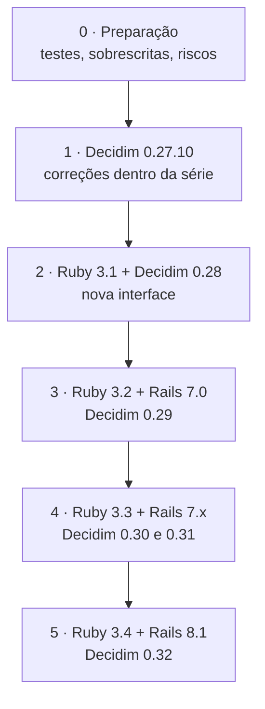

# Plano de atualização tecnológica

A plataforma roda sobre versões que já não recebem correções de segurança. Este plano organiza a saída dessa situação, que é a principal dívida técnica a ser assumida pela equipe receptora.

## Situação atual

| Componente | Em uso | Fim do suporte | Mais recente (out/2026) |
|------------|--------|----------------|--------------------------|
| Ruby | 3.0.4 | 04/2024 | 4.0 |
| Rails | 6.1.7.2 | 10/2024 | 8.1 |
| Decidim | 0.27.2 | — | 0.32.1 |
| Node (imagem base) | 16 | 09/2023 | — |
| PostgreSQL (CI e desenvolvimento) | 13 | 11/2025 | — |

Fonte das datas: [endoflife.date](https://endoflife.date/). Detalhes em [Estatísticas › Qualidade](../estatisticas/qualidade.md#dependencias-e-plataforma).

## Caminho de versões do Decidim

Cada versão do Decidim exige uma versão de Ruby e de Rails:

| Decidim | Ruby | Rails | Destaque |
|---------|------|-------|----------|
| 0.27.10 | 3.0 | 6.1 | Última da série 0.27: correções sem mudança de interface |
| 0.28.6 | 3.1 | 6.1 | **Redesign completo da interface** |
| 0.29.7 | 3.2 | 7.0 | |
| 0.30.9 | 3.3 | 7.0 | |
| 0.31.7 | 3.3 | 7.2 | |
| 0.32.1 | 3.4 | 8.1 | Atual |

Fonte: requisitos publicados no rubygems.org para `decidim` e `decidim-core`. Leia as notas de versão de cada salto (`CHANGELOG.md` do Decidim), que trazem os passos de migração.

## O tamanho do trabalho

O core sobrescreve **492 arquivos** do Decidim, com cerca de **21 mil linhas** diferentes do original. A maior parte são **views** (182 arquivos e 10 mil linhas) e **cells** (92). Veja o [Inventário de sobrescritas](sobrescritas.md).

!!! warning "O salto para 0.28"
    O Decidim 0.28 trocou toda a camada de interface. As 182 views e 92 cells sobrescritas, e a aplicação do [Design System gov.br](../design-system/index.md), terão de ser refeitas sobre a nova base. É o maior item do plano.

## Plano em etapas

| Etapa | O que fazer | Resultado |
|-------|-------------|-----------|
| **0. Preparação** | Remover as 26 sobrescritas idênticas ao original; cobrir com testes as sobrescritas mais alteradas; corrigir os riscos 1 e 2 de [Segurança](seguranca.md); fixar as gems de git em tags; reconciliar `main` e `develop` ([Release](release.md)) | Base segura para mudar |
| **1. Decidim 0.27.10** | Atualizar dentro da série 0.27, sem mudar Ruby | Correções do Decidim aplicadas |
| **2. Decidim 0.28** | Ruby 3.1; refazer views e cells sobre a nova interface; reavaliar quais sobrescritas ainda são necessárias; reaplicar o Design System gov.br | Interface nova; muitas sobrescritas eliminadas |
| **3. Decidim 0.29** | Ruby 3.2, Rails 7.0 | Rails com suporte |
| **4. Decidim 0.30 e 0.31** | Ruby 3.3, Rails 7.2 | |
| **5. Decidim 0.32** | Ruby 3.4, Rails 8.1 | Plataforma atual |

Em todas as etapas:

- atualize também os componentes LabLivre (`decidim-homes`, `decidim-ej`, `decidim-enhanced_process_groups_and_scopes`, `decidim-extra_user_fields`, `decidim-mobile`) para a mesma versão do Decidim;
- rode as migrações do Decidim (`bin/rails decidim:upgrade` e `db:migrate`) primeiro numa cópia do banco de produção;
- atualize a imagem base (`Dockerfile.DockerHub`) e o CI.

## Reduzir sobrescritas

A estratégia que mais reduz o custo de cada atualização é **sobrescrever menos**:

| Em vez de | Prefira |
|-----------|---------|
| Copiar uma view inteira para mudar um trecho | Usar os pontos de extensão do Decidim (*view hooks*, *content blocks*, *cells* próprias) |
| Sobrescrever um command ou form | Decorar a classe original (`Module#prepend`) só no método alterado |
| Mudar o comportamento no core | Criar um [componente](../dev/criar-componente.md) ou propor a mudança ao Decidim |
| Manter melhorias só no Brasil Participativo | Contribuir de volta (*upstream*) com o que for útil para outras instâncias |

## Melhorias de operação

Itens identificados durante a documentação para incluir no plano:

- endpoint de verificação de saúde (`/health`);
- versão do rodapé gerada a partir da tag;
- bloco HTML da página inicial versionado no repositório;
- política de segurança (`SECURITY.md`) e notas de versão;
- cobertura de testes publicada no CI;
- análises de segurança bloqueantes para severidade alta.
