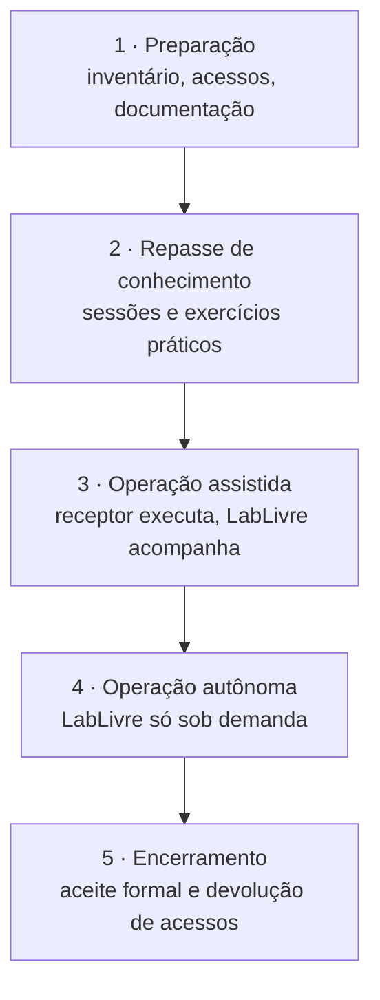

# Transferência de Tecnologia

Plano e documentação para transferir o Brasil Participativo do LabLivre/UnB, que o desenvolve no âmbito do TED, para a equipe que vai mantê-lo e operá-lo: a Secretaria Nacional de Participação Social, a Dataprev ou outra equipe designada.

A transferência só está completa quando a equipe receptora consegue, **sem depender do LabLivre**:

1. subir o ambiente de desenvolvimento e entender o código;
2. corrigir um defeito e publicar uma versão;
3. implantar, operar, monitorar e recuperar a plataforma;
4. manter as integrações e as credenciais;
5. planejar a evolução tecnológica.

## Fases

| Fase | Entregas | Responsável principal |
|------|----------|-----------------------|
| 1. Preparação | Inventário de ativos completo, acessos concedidos à equipe receptora, documentação revisada | LabLivre |
| 2. Repasse de conhecimento | Trilha de sessões com exercícios ([Plano de repasse](repasse.md)) | LabLivre, com participação do receptor |
| 3. Operação assistida | Pelo menos um ciclo completo de release e deploy feito pelo receptor | Receptor, com apoio do LabLivre |
| 4. Operação autônoma | Incidentes e releases tratados pelo receptor | Receptor |
| 5. Encerramento | Termo de aceite, revogação de acessos do LabLivre, transferência de contas | SNPS |

## Pacote de documentação

Situação de cada documento exigido numa transferência de tecnologia.

| Documento | Para quê | Situação |
|-----------|----------|----------|
| [Visão geral](../visao-geral/sobre.md) e [Arquitetura](../visao-geral/arquitetura.md) | Entender o sistema e onde fica cada parte | :white_check_mark: |
| [Setup local](../dev/setup.md) e [Estrutura do código](../dev/estrutura.md) | Começar a desenvolver | :white_check_mark: |
| [Como contribuir](../dev/contribuir.md) | Fluxo de branches, MR e CI | :white_check_mark: |
| [Banco de dados](../banco-de-dados/index.md) | Dicionário de dados e consultas | :white_check_mark: |
| [Configuração](../operador/configuracao.md) | Variáveis de ambiente | :white_check_mark: |
| [Deploy](../operador/deploy.md) | Implantação | :white_check_mark: |
| [Administração](../operador/administracao.md) e [Manual de uso](../manual/index.md) | Operar os painéis e apoiar gestores de processo | :white_check_mark: |
| [Inventário de ativos](inventario.md) | Repositórios, imagens, serviços, contas e credenciais a transferir | :white_check_mark: nesta seção (itens marcados "a confirmar") |
| [Operação e continuidade](operacao.md) | Rotinas, monitoramento, incidentes, backup e recuperação | :white_check_mark: nesta seção |
| [Segurança e LGPD](seguranca.md) | Controles, riscos conhecidos e dados pessoais | :white_check_mark: nesta seção |
| [APIs](apis.md) | Contratos das APIs e integrações | :white_check_mark: nesta seção |
| [Versionamento e release](release.md) | Como gerar e publicar uma versão | :white_check_mark: nesta seção |
| [Testes e qualidade](testes.md) | Suíte de testes e verificações do CI | :white_check_mark: nesta seção |
| [Plano de atualização tecnológica](atualizacao.md) | Sair de Ruby 3.0, Rails 6.1 e Decidim 0.27 | :white_check_mark: nesta seção |
| [Inventário de sobrescritas](sobrescritas.md) | Arquivos do Decidim alterados pelo core | :white_check_mark: gerado do código |
| [Decisões de arquitetura](decisoes.md) | Por que o sistema é como é | :white_check_mark: nesta seção |
| [Plano de repasse de conhecimento](repasse.md) | Sessões, exercícios e responsabilidades | :white_check_mark: nesta seção |
| Credenciais e segredos | Lista de segredos e onde estão guardados | :warning: só a lista de nomes está aqui; os valores devem ser entregues por canal seguro |
| Contratos e acordos | Hospedagem, gov.br, WhatsApp Business, verificação de CPF | :warning: a reunir pela SNPS |

## Critérios de aceite

A equipe receptora considera a transferência concluída quando demonstra, sem ajuda:

- [ ] ambiente local funcionando a partir do [Setup local](../dev/setup.md);
- [ ] uma correção feita, testada, revisada e integrada em `develop`;
- [ ] uma versão gerada e publicada em homologação e produção ([Versionamento e release](release.md));
- [ ] restauração de um backup em ambiente de teste ([Operação e continuidade](operacao.md#backup-e-recuperacao));
- [ ] rotação de um segredo de integração (por exemplo, `OP_BP_JWT_SECRET`) sem indisponibilidade;
- [ ] acesso administrativo a todos os ativos do [Inventário](inventario.md);
- [ ] leitura e entendimento das [decisões de arquitetura](decisoes.md) e dos riscos em [Segurança e LGPD](seguranca.md).
