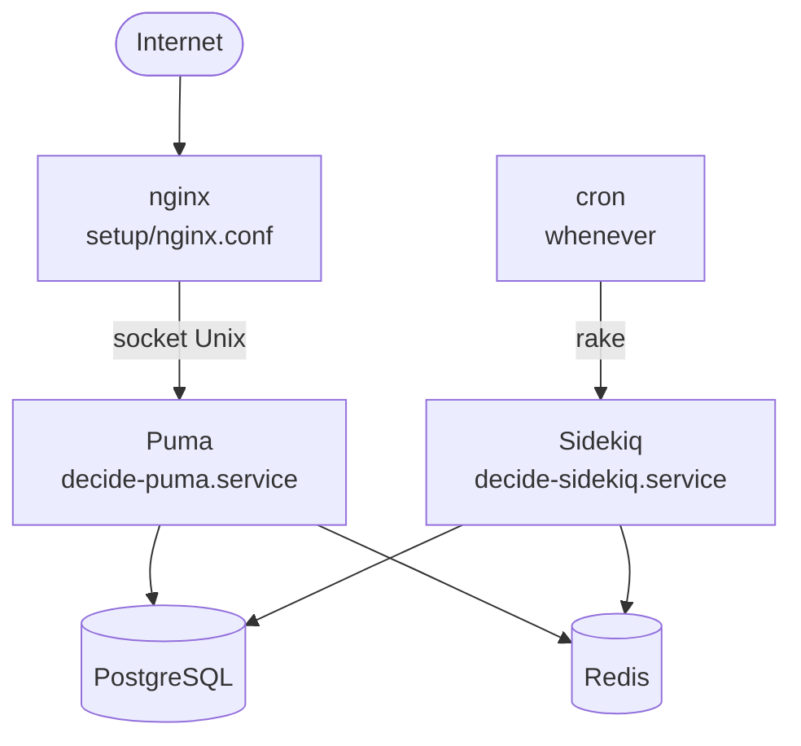

# Operação e continuidade

Manual de operação (runbook) do Brasil Participativo: como a aplicação roda, o que acompanhar, como reagir a incidentes e como fazer backup e recuperação.

## Modelo de implantação de referência

O repositório traz, na pasta `setup/`, um modelo de implantação em **máquina virtual** com systemd e nginx:



| Arquivo | Função |
|---------|--------|
| `setup/decide-puma.service` | Serviço systemd do Puma, usuário `decide`, diretório `/srv/decide` |
| `setup/decide-sidekiq.service` | Serviço systemd do Sidekiq, com *watchdog* de 10 s |
| `setup/puma.production.rb` | 16 *workers*, 10 a 20 *threads*, socket em `/srv/decide/tmp/sockets/puma.sock` |
| `setup/nginx.conf` | Proxy para o socket do Puma e arquivos estáticos de `public/` |
| `setup/logrotate` | Rotação semanal dos logs, 8 cópias, compactadas |
| `setup/env` | Exemplo de variáveis de ambiente |

!!! warning "Confirmar o ambiente real"
    O modelo acima é o que está versionado. Confirme com a Dataprev como a produção roda hoje (VM, containers, número de instâncias, balanceador) e registre aqui.

## Rotinas

### Contínuas

| Rotina | Onde ver |
|--------|----------|
| Filas do Sidekiq (tamanho, falhas, retentativas) | `/sidekiq` (Basic Auth com `ADMIN_USERNAME`/`ADMIN_PASSWORD`) |
| Logs da aplicação | `log/production.log` (ou saída padrão com `RAILS_LOG_TO_STDOUT`; JSON com `RAILS_LOG_TO_JSON`) |
| Logs do Sidekiq | `journalctl -u decide-sidekiq` |
| Desempenho | Elastic APM, se configurado |

### Agendadas

As tarefas periódicas estão em `config/schedule.rb` e são instaladas no crontab com `bundle exec whenever --update-crontab`. Rode o cron em **uma única** máquina, para não duplicar tarefas. Lista completa em [Arquitetura › Tarefas agendadas](../visao-geral/arquitetura.md#tarefas-agendadas).

Para rodar manualmente as tarefas diárias do Decidim, há o script `tasks.sh`.

### Por versão

| Rotina | Comando |
|--------|---------|
| Migrações | `bundle exec rails db:migrate` |
| Assets | `bundle exec rails assets:precompile` (inclui o Webpacker) |
| Reinício | `systemctl restart decide-puma decide-sidekiq` |
| Atualizar o cron | `bundle exec whenever --update-crontab` |

Veja [Versionamento e release](release.md).

## Monitoramento recomendado

O core não tem um endpoint de verificação de saúde (*health check*). Recomenda-se monitorar:

| Sinal | Como | Alerta sugerido |
|-------|------|-----------------|
| Disponibilidade | Requisição HTTP à página inicial | Resposta diferente de 200 por mais de 2 min |
| Fila do Sidekiq | API do Sidekiq ou `/sidekiq/stats` | Fila `default` ou `mailers` acima de 1.000 itens |
| Jobs com falha | Painel `/sidekiq` (aba *Retries* e *Dead*) | Crescimento contínuo |
| PostgreSQL | Conexões, espaço em disco, consultas lentas | Disco acima de 80% |
| Redis | Memória | Acima de 80% |
| Login gov.br | Taxa de erro no callback `/users/auth/govbr/callback` | Aumento súbito |
| Login externo | Mensagens `[ExternalAuth]` no log | Qualquer erro de callback |

!!! tip "Health check"
    Criar uma rota leve (por exemplo `/health`) que verifique banco e Redis facilita o balanceador e o monitoramento. Registre como melhoria no [Plano de atualização](atualizacao.md).

## Incidentes comuns

??? question "Usuários não conseguem entrar com o gov.br"
    1. Verifique se o callback `OMNIAUTH_GOVBR_REDIRECT_URI` corresponde ao domínio em uso.
    2. Confira o status do Login Único.
    3. Procure erros do OmniAuth no log.
    4. Confira se o certificado e o relógio do servidor estão corretos (o OpenID Connect valida datas).

??? question "E-mails não chegam"
    1. Veja a fila `mailers` no `/sidekiq`.
    2. Procure erros de SMTP nos jobs com falha.
    3. Teste as credenciais `SMTP_*`.

??? question "Fila do Sidekiq crescendo"
    1. Confira se o processo está ativo: `systemctl status decide-sidekiq`.
    2. Veja se há jobs presos em *Busy* há muito tempo.
    3. Confira a memória e a conexão com o Redis (`REDIS_URL`).
    4. Aumente `SIDEKIQ_CONCURRENCY` com cuidado, porque cada *thread* abre conexão com o banco.

??? question "Vínculo pelo WhatsApp/Telegram falha"
    Procure `[ExternalAuth]` no log. As causas comuns são token expirado, `OP_BP_JWT_SECRET` diferente entre o core e a API OP-BP e `OP_BP_CALLBACK_API_KEY` ausente. Veja [Integração OP-BP](../operador/integracao-op-bp.md).

??? question "Página inicial lenta"
    Confirme que o bloco HTML da home usa `GET /api/home_processes`, que tem cache, e não a consulta GraphQL antiga. Veja [Inovação › Desempenho](../inovacao/desempenho.md#home-api-propria-com-cache).

??? question "Processo não muda de etapa"
    A troca de etapa roda de hora em hora (`decidim_participatory_processes:change_active_step`). Confira se o cron está instalado e se as datas das etapas estão corretas no fuso da organização.

## Backup e recuperação

O repositório não traz rotina de backup. O procedimento abaixo é a recomendação mínima.

| O quê | Como | Frequência sugerida |
|-------|------|---------------------|
| PostgreSQL | `pg_dump -Fc` (ou backup contínuo com WAL) | Diário, com retenção de 30 dias |
| Arquivos enviados | Cópia do diretório `storage/` ou versionamento do bucket | Diário |
| Configuração | Variáveis de ambiente e segredos no cofre da instituição | A cada mudança |
| Redis | Não precisa de backup: fila e cache são recriáveis (jobs pendentes podem se perder) | — |

### Restauração

```bash
# 1. banco
createdb decide_restore
pg_restore -d decide_restore backup.dump

# 2. arquivos
rsync -a backup/storage/ /srv/decide/storage/

# 3. aplicação apontando para o banco restaurado
DATABASE_URL=postgres://.../decide_restore bundle exec rails db:migrate:status
```

!!! danger "Teste a restauração"
    Um backup só vale se a restauração foi testada. Faça uma restauração completa em ambiente de teste pelo menos a cada trimestre. Esse é um dos [critérios de aceite](index.md#criterios-de-aceite) da transferência.

## Continuidade

| Cenário | Impacto | Resposta |
|---------|---------|----------|
| Perda do servidor de aplicação | Indisponibilidade | Recriar a VM a partir do modelo `setup/`, implantar a última tag e apontar para banco e storage |
| Perda do banco | Perda de dados desde o último backup | Restaurar o último backup; comunicar o período afetado |
| Gov.br fora do ar | Ninguém consegue entrar | Comunicar na página inicial; a participação aguarda |
| API OP-BP fora do ar | Canais de mensagem param; a web continua | Comunicar nos canais |
| Vazamento de segredo | Risco de acesso indevido | Trocar o segredo, reiniciar a aplicação e revisar logs. Veja [Segurança e LGPD](seguranca.md) |
