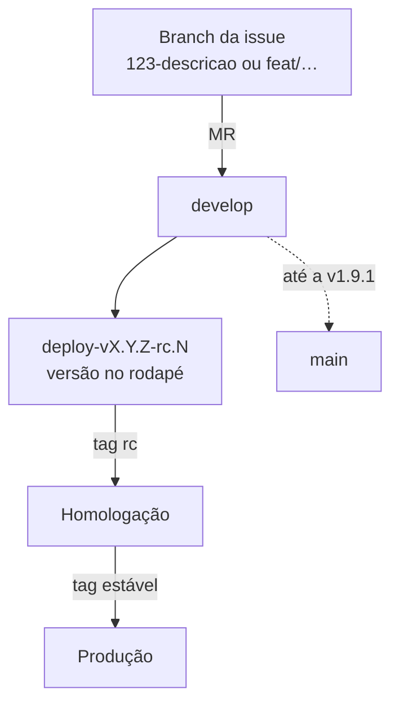

# Versionamento e release

Como as versões do `decidim-govbr` são numeradas, geradas e publicadas, a situação atual das branches e o procedimento recomendado.

## Numeração

Versionamento semântico com prefixo `v`:

| Tipo | Exemplo | Uso |
|------|---------|-----|
| Estável | `v1.9.2` | Versão em produção |
| Candidata | `v1.10.0-rc.1` | Homologação antes da estável |

A versão aparece no rodapé do site, escrita à mão em `app/views/layouts/decidim/_main_footer.html.erb`. Por isso há tantos commits `chore: atualiza versão no footer`.

Últimas versões:

| Tag | Data | Branch onde está |
|-----|------|------------------|
| `v1.10.0-rc.1` | 13/07/2026 | `develop`, `deploy-v1.10.0-rc.1` |
| `v1.9.3-rc.2` | 07/07/2026 | `develop`, `deploy-v1.9.3-rc.2` |
| `v1.9.2` | 11/06/2026 | `develop` (não está em `main`) |
| `v1.9.1` | 03/06/2026 | `main` e `develop` |
| `v1.9.0` | 16/04/2026 | `main` e `develop` |

Em 07/10/2026 o rodapé de produção mostrava **v1.9.2**.

## Fluxo observado



1. Cada mudança entra por merge request em `develop`.
2. Para homologar, cria-se uma branch `deploy-vX.Y.Z-rc.N`, atualiza-se a versão no rodapé e cria-se a tag candidata.
3. Aprovada, a versão recebe a tag estável e vai para produção.
4. Até a **v1.9.1**, `develop` era integrada em `main` e as tags ficavam em `main`. A partir da **v1.9.2**, as tags ficam na linha de `develop`.

!!! danger "Branches divergentes"
    Em outubro de 2026, `develop` tinha 117 commits que não estão em `main`, e `main` tinha 100 commits que não estão em `develop`: por exemplo, a integração OP-BP integrada direto em `main` em junho e reverts de julho e agosto. Antes da transferência:

    1. Confirme com a Dataprev **qual commit** está em produção.
    2. Reconcilie `main` e `develop`.
    3. Defina e registre um fluxo único (proposta abaixo).

## Fluxo recomendado

| Branch | Papel |
|--------|-------|
| `develop` | Integração contínua de MRs |
| `release/vX.Y` | Estabilização e candidatas (`-rc.N`); só correções |
| `main` | Sempre igual à versão em produção; recebe o merge da release e a tag estável |
| `hotfix/…` | Correção urgente a partir de `main`, integrada de volta em `develop` |

Automatize a versão do rodapé lendo a tag no build (por exemplo, `git describe --tags` gravado numa variável `APP_VERSION`), para eliminar os commits manuais.

## Gerar uma versão

1. Garanta que o pipeline de `develop` está verde (lint e testes).
2. Crie a branch de release e a tag candidata:

    ```bash
    git checkout -b release/v1.10 develop
    # atualize a versão no rodapé (ou APP_VERSION)
    git commit -am "chore: versão v1.10.0-rc.1"
    git tag -a v1.10.0-rc.1 -m "v1.10.0-rc.1"
    git push origin release/v1.10 --tags
    ```

3. Implante a candidata em homologação e valide com a SNPS.
4. Aprovada, crie a tag estável, integre em `main` e em `develop`.
5. Escreva as notas da versão: o projeto não tem `CHANGELOG` nem *releases* no GitLab. Recomenda-se publicar notas em cada tag estável.

## Implantar

No modelo de VM da pasta `setup/` ([Operação](operacao.md)):

```bash
cd /srv/decide
git fetch --tags && git checkout v1.10.0
bundle install --deployment --without development test
yarn install --frozen-lockfile
RAILS_ENV=production bundle exec rails assets:precompile
RAILS_ENV=production bundle exec rails db:migrate
bundle exec whenever --update-crontab
sudo systemctl restart decide-puma decide-sidekiq
```

Depois de implantar, verifique:

- [ ] página inicial e login gov.br;
- [ ] criação de uma proposta em um processo de teste;
- [ ] painel `/sidekiq` sem filas acumulando;
- [ ] versão correta no rodapé.

## Reverter

1. Volte o código para a tag anterior e reinicie os serviços.
2. Se a versão nova tinha **migrações**, avalie antes de reverter: migrações que removem colunas ou dados exigem restaurar o backup. Faça backup do banco **antes** de cada implantação com migrações.

## Imagem base

A imagem `lappis/decidim-govbr:v1-release` (Docker Hub), usada no `Dockerfile` de desenvolvimento e no CI, é gerada por `scripts/generate_dockerhub_image.sh`. Ela fixa Ruby 3.0.4 e Node 16. Atualize-a junto com o [Plano de atualização tecnológica](atualizacao.md) e transfira a conta do Docker Hub (ver [Inventário](inventario.md)).
