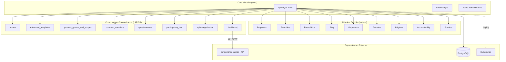

# Arquitetura

## Visão Geral

O Brasil Participativo é uma aplicação Ruby on Rails baseada no fork do Decidim. A arquitetura segue o padrão modular do Decidim, onde funcionalidades são encapsuladas em engines Rails instaladas como gems.

## Camadas da Aplicação

### Core (`decidim-govbr`)

O core é o fork do Decidim que contém:

- **Aplicação Rails principal** — configuração, rotas, assets, seeds
- **Customizações brasileiras** — modificações diretas no código do Decidim (autenticação, layout, traduções)
- **Painel administrativo** — interface de administração para gestores da plataforma
- **Gemfile** — declaração de todas as dependências, incluindo módulos nativos e componentes customizados

### Módulos Decidim (nativos)

Os 9 módulos nativos do Decidim que estão ativos na plataforma:

| Módulo | Gem | Responsabilidade |
|--------|-----|------------------|
| Propostas | `decidim-proposals` | Criação, votação e moderação de propostas |
| Reuniões | `decidim-meetings` | Agendamento, inscrição e atas de reuniões |
| Formulários | `decidim-surveys` / `decidim-forms` | Enquetes e formulários customizáveis |
| Blog | `decidim-blogs` | Publicação de posts e notícias |
| Orçamento Participativo | `decidim-budgets` | Votação em projetos com limite orçamentário |
| Debates | `decidim-debates` | Discussões abertas entre participantes |
| Páginas | `decidim-pages` | Conteúdo estático informativo |
| Accountability | `decidim-accountability` | Acompanhamento de resultados e prestação de contas |
| Sorteios | `decidim-sortitions` | Seleção aleatória de propostas |

### Componentes Customizados (LAPPIS/UnB)

Gems desenvolvidas especificamente para o Brasil Participativo:

| Componente | Responsabilidade |
|------------|------------------|
| `decidim-module-homes` | Página inicial customizada |
| `decidim-module-enhanced_templates` | Templates melhorados para processos |
| `decidim-module-enhanced_process_groups_and_scopes` | Agrupamento e escopos regionais/temáticos |
| `decidim-module-common_questions` | FAQ compartilhado entre processos |
| `decidim-module-questionnaires` | Extensão do módulo de questionários |
| `decidim-participatory_text` | Textos participativos (fork do componente oficial) |
| `decidim-api-categorization` | API de categorização de conteúdos |
| `decidim-ej` | Integração com Empurrando Juntas via API |

### Integrações Externas

#### Empurrando Juntas (EJ)

O EJ é uma plataforma externa de opinião e votação desenvolvida pelo LAPPIS/UnB. A integração funciona da seguinte forma:

- O componente `decidim-ej` **consome a API REST do EJ**
- Os dados de opinião/votação são **exibidos no Decidim com UI própria**
- O EJ roda como serviço separado — é uma **dependência externa** da plataforma

!!! warning "Dependência externa"
    O EJ precisa estar disponível e acessível via rede para que o componente `decidim-ej` funcione. Consulte o [Guia do Operador](../operador/configuracao.md) para detalhes de configuração.

## Infraestrutura

A plataforma roda em **Kubernetes** em produção.

!!! note "A detalhar"
    Detalhes sobre banco de dados, cache, e-mail e autenticação serão documentados conforme as informações forem consolidadas.
