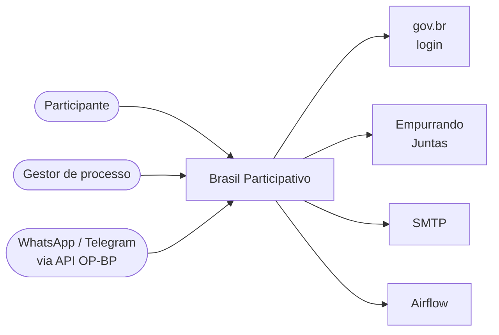
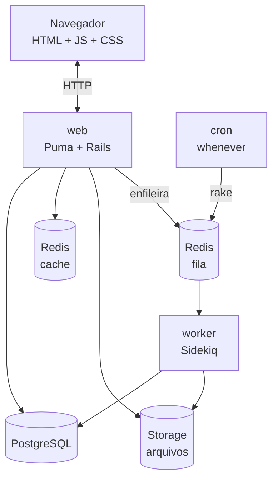
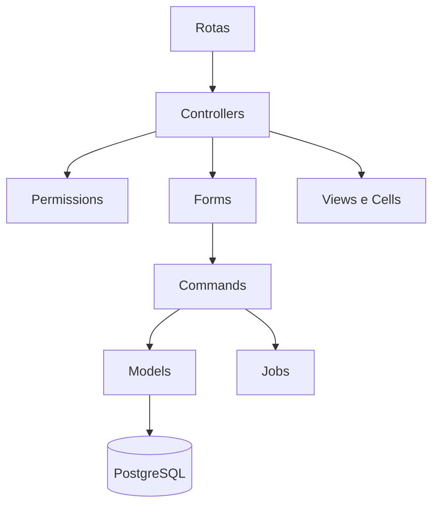
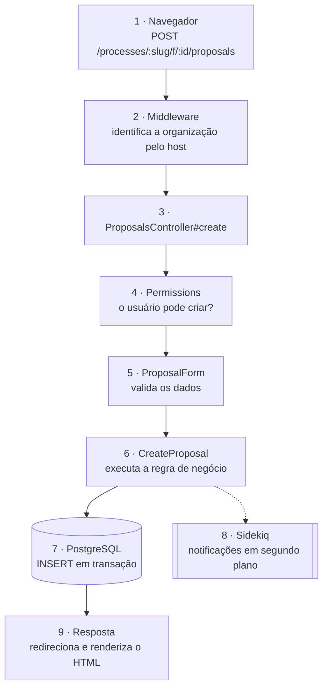
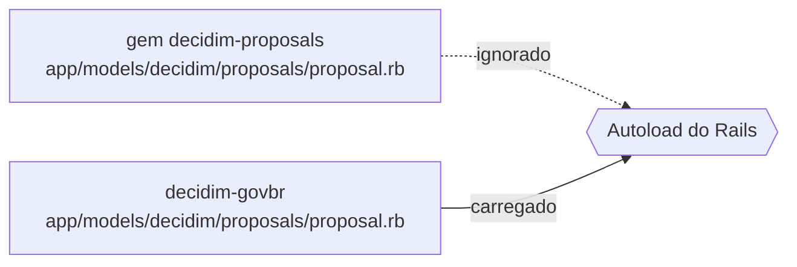
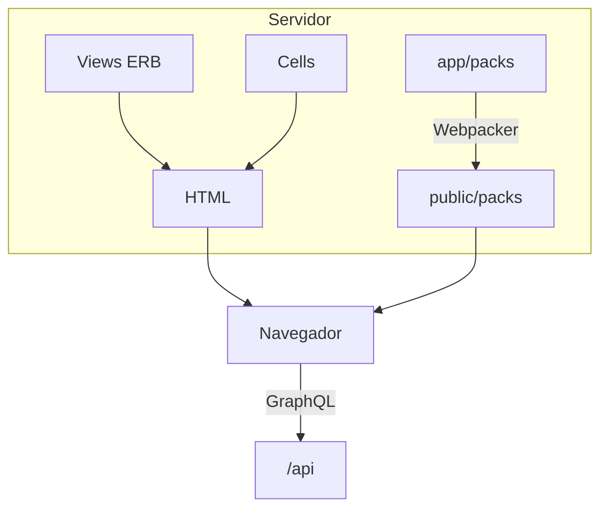
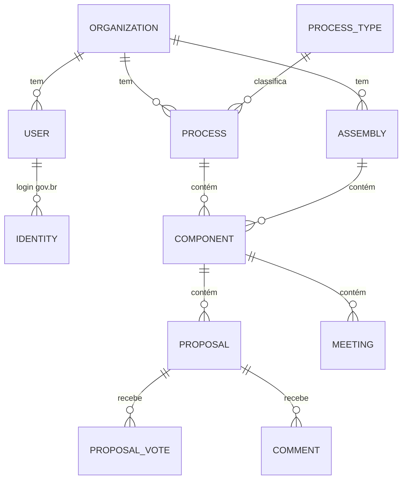

# Arquitetura

O Brasil Participativo é um **monolito Ruby on Rails**: uma única aplicação (`decidim-govbr`) que gera o HTML no servidor, executa as regras de negócio e acessa o banco. Ela é construída sobre o Decidim 0.27.2, que é um conjunto de engines Rails instaladas como gems.

Esta página vai do geral ao detalhe, em quatro níveis:

1. [Contexto](#1-contexto): quem usa a plataforma e com quais sistemas ela conversa.
2. [Processos em execução](#2-processos-em-execucao): o que roda em produção e onde ficam front-end, back-end e banco.
3. [Dentro do monolito](#3-dentro-do-monolito): camadas do Rails e caminho de uma requisição.
4. [Front-end](#4-front-end), [back-end](#5-back-end) e [banco de dados](#6-banco-de-dados) em detalhe.

| Item | Versão |
|------|--------|
| Ruby | 3.0.4 |
| Rails | 6.1.7.2 |
| Decidim | 0.27.2 |
| Puma | 5.6.5 |
| Sidekiq | 6.5.7 |
| Webpacker | 6.0.0.rc.5 |
| PostgreSQL | 13 (versão do CI e do ambiente de desenvolvimento) |

## 1. Contexto

```mermaid
flowchart LR
    P([Participante]) --> BP
    A([Gestor de processo]) --> BP
    BOT([WhatsApp / Telegram<br/>via API OP-BP]) --> BP
    BP[Brasil Participativo]
    BP --> GOV[gov.br<br/>login]
    BP --> EJ[Empurrando<br/>Juntas]
    BP --> MAIL[SMTP]
    BP --> AF[Airflow]
```

| Sistema externo | Para quê | Detalhes |
|-----------------|----------|----------|
| gov.br | Login dos participantes (OpenID Connect) | `config/initializers/omniauth_govbr.rb` |
| API OP-BP | Vínculo de conta vindo do WhatsApp/Telegram | [Integração OP-BP](../operador/integracao-op-bp.md) |
| Empurrando Juntas | Conversas e votação de opiniões | [decidim-ej](../componentes/ej.md) |
| SMTP | E-mails transacionais e newsletters | [Configuração](../operador/configuracao.md#e-mail-smtp-producao) |
| Airflow | Relatórios disparados pelo admin | `Decidim::Govbr::Airflow::TriggerAirflowReport` |

## 2. Processos em execução

A mesma base de código roda em três papéis. O navegador recebe HTML pronto; não há uma aplicação de front-end separada.

```mermaid
flowchart TB
    NAV[Navegador<br/>HTML + JS + CSS]
    WEB[web<br/>Puma + Rails]
    WRK[worker<br/>Sidekiq]
    CRN[cron<br/>whenever]
    PG[(PostgreSQL)]
    RQ[(Redis<br/>fila)]
    RC[(Redis<br/>cache)]
    ST[(Storage<br/>arquivos)]

    NAV <-->|HTTP| WEB
    WEB --> PG
    WEB --> RC
    WEB --> ST
    WEB -->|enfileira| RQ
    CRN -->|rake| RQ
    RQ --> WRK
    WRK --> PG
    WRK --> ST
```

### Onde fica cada parte

| Parte | Onde roda | Onde está no código | Tecnologia |
|-------|-----------|---------------------|------------|
| **Front-end** | Gerado no processo `web`, executado no navegador | `app/views`, `app/cells`, `app/packs` | ERB, Cells, SCSS, JavaScript, Webpacker, Design System gov.br |
| **Back-end** | Processo `web` (requisições) e `worker` (jobs) | `app/controllers`, `app/commands`, `app/forms`, `app/models`, `app/jobs`, `app/services` | Rails 6.1, Decidim 0.27 |
| **Banco de dados** | Servidor PostgreSQL | `db/migrate`, `db/schema.rb` | PostgreSQL, ActiveRecord |
| **Fila de jobs** | Redis da fila | `config/sidekiq.yml` | Sidekiq |
| **Cache** | Redis do cache | `config/environments/production.rb` | `redis_cache_store` |
| **Arquivos enviados** | Disco local ou bucket (S3, Azure, GCS) | `config/storage.yml` | ActiveStorage |
| **Tarefas agendadas** | Processo `cron` | `config/schedule.rb`, `lib/tasks` | whenever + rake |

## 3. Dentro do monolito

### Camadas

O Decidim organiza o Rails em camadas com responsabilidades bem separadas. O core do Brasil Participativo segue o mesmo padrão: quando muda um comportamento, cria ou sobrescreve um arquivo na camada correspondente.

```mermaid
flowchart TB
    R[Rotas] --> C[Controllers]
    C --> PERM[Permissions]
    C --> F[Forms]
    F --> CMD[Commands]
    CMD --> M[Models]
    CMD --> J[Jobs]
    M --> DB[(PostgreSQL)]
    C --> V[Views e Cells]
```

| Camada | Pasta | Responsabilidade | Exemplo no Brasil Participativo | Arquivos no core |
|--------|-------|------------------|----------------------------------|-----------------:|
| Rotas | `config/routes.rb` + engines | Mapeiam URL para controller | `GET /api/home_processes` | 1 |
| Controllers | `app/controllers` | Recebem a requisição e coordenam a resposta | `Api::HomeProcessesController` | 67 |
| Permissions | `app/permissions` | Dizem se o usuário pode executar a ação | Edição de comentário em até 5 minutos | 8 |
| Forms | `app/forms` | Validam a entrada do usuário | `max_files` em perguntas de arquivo | 42 |
| Commands | `app/commands` | Executam a regra de negócio e publicam eventos | `AnswerQuestionnaire` com e-mail de confirmação | 83 |
| Models | `app/models` | Representam tabelas (ActiveRecord) | `Proposal`, `Assembly` (`unlisted`) | 30 |
| Queries | `app/queries` | Consultas complexas reutilizáveis | Componentes com voto exclusivo já usado | 2 |
| Jobs | `app/jobs` | Trabalho assíncrono no Sidekiq | `PublicBodiesToInstancesJob` | 4 |
| Services | `app/services` | Integrações e lógica fora do padrão Decidim | `ExternalAuthService` | 7 |
| Serializers | `app/serializers`, `lib/decidim` | Exportações (CSV, JSON, Excel) | Exportação de comentários | 4 |
| Views | `app/views` | Templates ERB | Login externo, listagem do OP | 450 |
| Cells | `app/cells` | Componentes de interface reutilizáveis | Cards de reuniões e propostas | 109 |
| Helpers / Presenters | `app/helpers`, `app/presenters` | Formatação para a interface | Texto do botão de voto | 36 |

### Caminho de uma requisição

Exemplo: um participante envia uma proposta.

```mermaid
flowchart TB
    S1["1 · Navegador<br/>POST /processes/:slug/f/:id/proposals"]
    S2["2 · Middleware<br/>identifica a organização pelo host"]
    S3["3 · ProposalsController#create"]
    S4["4 · Permissions<br/>o usuário pode criar?"]
    S5["5 · ProposalForm<br/>valida os dados"]
    S6["6 · CreateProposal<br/>executa a regra de negócio"]
    S7[("7 · PostgreSQL<br/>INSERT em transação")]
    S8[["8 · Sidekiq<br/>notificações em segundo plano"]]
    S9["9 · Resposta<br/>redireciona e renderiza o HTML"]
    S1 --> S2 --> S3 --> S4 --> S5 --> S6 --> S7 --> S9
    S6 -.-> S8
```

**Multi-organização**: um middleware do Decidim lê o host da requisição e carrega a organização correspondente (`decidim_organizations.host`). Todas as consultas são filtradas por essa organização.

### Como as engines se encaixam

O Decidim é uma coleção de engines Rails. A aplicação monta a engine principal na raiz, e as demais se registram dentro dela:

| Prefixo da URL | Engine | Conteúdo |
|----------------|--------|----------|
| `/` | `decidim-core` | Home, login, perfil, busca |
| `/processes/:slug` | `decidim-participatory_processes` | Consultas, conferências, planos, audiências |
| `/assemblies/:slug` | `decidim-assemblies` | Instâncias (conselhos, fóruns) |
| `/processes/:slug/f/:component_id/` | Engine do componente | Propostas, reuniões, formulários etc. |
| `/admin` | `decidim-admin` + `admin_engine` de cada módulo | Painel administrativo |
| `/system` | `decidim-system` | Organizações e feature flags |
| `/api` | `decidim-api` | API GraphQL |
| `/sidekiq` | Sidekiq Web | Painel de filas |

### Como o core sobrescreve o Decidim

```mermaid
flowchart LR
    GEM["gem decidim-proposals<br/>app/models/decidim/proposals/proposal.rb"]
    APP["decidim-govbr<br/>app/models/decidim/proposals/proposal.rb"]
    RAILS{{Autoload do Rails}}
    GEM -.->|ignorado| RAILS
    APP -->|carregado| RAILS
```

Quando o core tem um arquivo com o mesmo caminho de um arquivo da gem, o Rails carrega a versão do core. É assim que o Brasil Participativo altera o Decidim sem manter um fork das gems. O custo é que cada arquivo sobrescrito precisa ser revisado ao atualizar o Decidim. Veja [Estrutura do Código](../dev/estrutura.md#como-as-customizacoes-sao-feitas).

## 4. Front-end

O front-end é **renderizado no servidor**: o Rails monta o HTML com ERB e Cells, e o navegador carrega CSS e JavaScript compilados pelo Webpacker.

```mermaid
flowchart TB
    subgraph Servidor
        ERB[Views ERB] --> HTML
        CELL[Cells] --> HTML
        PACK[app/packs] -->|Webpacker| ASSETS[public/packs]
    end
    HTML[HTML] --> NAV[Navegador]
    ASSETS --> NAV
    NAV -->|GraphQL| API["/api"]
```

| Peça | Local | Observação |
|------|-------|------------|
| Templates | `app/views` (450 arquivos) | Sobrescrevem views do Decidim e criam telas próprias, como o login externo |
| Componentes de interface | `app/cells` (109 arquivos) | Cards, listas, botões de voto |
| Pontos de entrada JS | `app/packs/entrypoints` (9) | `application.js`, `home.js`, `questionnaires.js`, `jodit_editor.js`… |
| Código JS | `app/packs/src` | Regras de voto, acessibilidade, menu, mapa de reuniões |
| Estilos | `app/packs/stylesheets` | Design System gov.br (`govbr-ds/`) + ajustes (`custom/`) |
| Bibliotecas | `package.json` | `@decidim/core`, Jodit, formBuilder, Leaflet, CodeMirror, Select2 |

- **Design System gov.br**: a interface usa os componentes e tokens do padrão visual do governo federal, sobre a base Foundation do Decidim. Veja a aba [Design System gov.br](../design-system/index.md).
- **Chamadas do navegador**: a maior parte das telas é HTML completo. Algumas partes buscam dados no cliente, como a home, que consulta a API GraphQL (`renderProcesses.js`). O core também expõe `GET /api/home_processes` em JSON.
- **Acessibilidade**: VLibras e um widget próprio de contraste e tamanho de fonte (`acessibility_widget.js`).

## 5. Back-end

| Responsabilidade | Implementação |
|------------------|---------------|
| Servidor HTTP | Puma (`config/puma.rb`) |
| Autenticação | Devise + OmniAuth. gov.br via OpenID Connect com PKCE |
| Autorização | Permissions do Decidim por componente e espaço |
| API | GraphQL (`graphql` 1.12) em `/api`, com `decidim-apiauth`. JSON próprio em `/api/home_processes` |
| Jobs | ActiveJob + Sidekiq, com filas priorizadas |
| Tarefas agendadas | `whenever` gera o crontab a partir de `config/schedule.rb` |
| E-mails | ActionMailer via SMTP |
| Arquivos | ActiveStorage (local, S3, Azure ou GCS) |
| Cache | Redis (`REDIS_CACHE_URL`) |

### Filas do Sidekiq

Definidas em `config/sidekiq.yml` (o número é o peso de prioridade):

| Fila | Peso | Fila | Peso |
|------|-----:|------|-----:|
| `mailers` | 4 | `events` | 2 |
| `vote_reminder` | 2 | `user_report` | 2 |
| `reminders` | 2 | `block_user` | 2 |
| `default` | 2 | `translations` | 1 |
| `newsletter` | 2 | `metrics` | 1 |
| `newsletters_opt_in` | 2 | `exports` | 1 |
| `conference_diplomas` | 2 | | |

### Tarefas agendadas

| Frequência | Tarefa |
|-----------|--------|
| Diária, 00:00–00:40 | Limpeza de "baixar meus dados", métricas, dados abertos, lembretes, iniciativas, resumo diário de notificações |
| Sábado, 01:00 | Resumo semanal de notificações |
| Diária, 01:00 | Estatísticas de propostas por participante |
| Diária, 02:00 | Sitemap |
| De hora em hora | Troca automática de fase dos processos |
| De hora em hora | Criação de instâncias a partir de órgãos públicos |
| A cada 5 minutos | Remoção de identidades gov.br duplicadas (se a flag estiver ativa) |

## 6. Banco de dados

PostgreSQL acessado pelo ActiveRecord. O esquema tem **147 tabelas** e o histórico tem **745 migrações**. Cada módulo usa um prefixo próprio (`decidim_proposals_*`, `decidim_meetings_*`…). As tabelas criadas pelo Brasil Participativo usam `decidim_govbr_*`.

### Modelo principal

```mermaid
erDiagram
    ORGANIZATION ||--o{ USER : tem
    ORGANIZATION ||--o{ PROCESS : tem
    ORGANIZATION ||--o{ ASSEMBLY : tem
    PROCESS_TYPE ||--o{ PROCESS : classifica
    USER ||--o{ IDENTITY : "login gov.br"
    PROCESS ||--o{ COMPONENT : contém
    ASSEMBLY ||--o{ COMPONENT : contém
    COMPONENT ||--o{ PROPOSAL : contém
    COMPONENT ||--o{ MEETING : contém
    PROPOSAL ||--o{ PROPOSAL_VOTE : recebe
    PROPOSAL ||--o{ COMMENT : recebe
```

| Entidade no diagrama | Tabela | Chaves importantes |
|----------------------|--------|--------------------|
| ORGANIZATION | `decidim_organizations` | `host` (define a organização da requisição) |
| USER | `decidim_users` | `decidim_organization_id`, `extended_data` |
| IDENTITY | `decidim_identities` | `provider` (`govbr`), `uid` (CPF) |
| PROCESS | `decidim_participatory_processes` | `slug`, `decidim_participatory_process_type_id` |
| PROCESS_TYPE | `decidim_participatory_process_types` | Consulta, Conferência, Plano, Audiência |
| ASSEMBLY | `decidim_assemblies` | `slug`, `parent_id` (sub-instâncias), `unlisted` |
| COMPONENT | `decidim_components` | `manifest_name`, `participatory_space_type`/`_id` (polimórfico) |
| PROPOSAL | `decidim_proposals_proposals` | `decidim_component_id` |
| PROPOSAL_VOTE | `decidim_proposals_proposal_votes` | `decidim_proposal_id`, `decidim_author_id` |
| MEETING | `decidim_meetings_meetings` | `decidim_component_id` |
| COMMENT | `decidim_comments_comments` | `decidim_commentable_type`/`_id` (polimórfico) |

Relações **polimórficas** são comuns no Decidim: um componente pertence a um processo **ou** a uma instância, e um comentário pode estar numa proposta, reunião, post etc.

### Tabelas por módulo

| Prefixo | Tabelas | Prefixo | Tabelas |
|---------|--------:|---------|--------:|
| `decidim_meetings` | 12 | `decidim_govbr` | 5 |
| `decidim_proposals` | 7 | `decidim_consultations` | 5 |
| `decidim_participatory` | 7 | `decidim_awesome` | 5 |
| `decidim_forms` | 7 | `decidim_budgets` | 4 |
| `decidim_conferences` | 7 | `decidim_messaging` | 4 |
| `decidim_initiatives` | 6 | `decidim_homes` | 2 |

Tabelas próprias do Brasil Participativo:

| Tabela | Uso |
|--------|-----|
| `decidim_govbr_user_proposals_statistics` | Estatísticas de propostas por participante |
| `decidim_govbr_user_proposals_statistic_settings` | Configuração desses relatórios por processo |
| `decidim_govbr_partners` | Parceiros exibidos em processos e instâncias |
| `decidim_govbr_media_links` | Links de mídia |
| `decidim_govbr_media_links_collections` | Coleções de links de mídia |

### Dados fora do PostgreSQL

| Dado | Onde fica |
|------|-----------|
| Arquivos enviados (imagens, anexos) | Storage do ActiveStorage. O PostgreSQL guarda só os metadados (`active_storage_*`) |
| Fila de jobs | Redis da fila |
| Cache de fragmentos e da API da home | Redis do cache |
| Sessões | Cookie criptografado (padrão do Rails) |

## Componentes e extensões

| Gem | Origem | Responsabilidade |
|-----|--------|------------------|
| `decidim-homes` | LabLivre | Página inicial e home das instâncias |
| `decidim-enhanced_process_groups_and_scopes` | LabLivre | Agrupamento e escopos de processos |
| `decidim-ej` | LabLivre | Integração com o Empurrando Juntas |
| `decidim-extra_user_fields` | LabLivre | Campos extras no cadastro |
| `decidim-mobile` | LabLivre | Suporte ao app móvel |
| `decidim-decidim_awesome` 0.10.2 | Comunidade Decidim | Ajustes de editor, permissões e formulários |
| `decidim-apiauth` | Mainio | Autenticação na API GraphQL |

Além do pacote `decidim`, o Gemfile instala `decidim-conferences`, `decidim-consultations` e `decidim-initiatives`. Componentes do grupo LabLivre que não estão no Gemfile estão listados em [Componentes Customizados](../componentes/homes.md).

## Rotas próprias do core

| Rota | Uso |
|------|-----|
| `GET /api/home_processes` | JSON com tipos de processo e instâncias públicas, cacheado por organização (10 min) |
| `GET /external_auth/link?token=…` | Vínculo de conta com a API OP-BP |
| `GET /surveys/:id/download_attachments` e `/download_zip` | Download de anexos de formulários |
| `/admin/participatory_processes/:slug/user_proposals_statistic_settings` | Relatórios de estatísticas de propostas |
| `PATCH /proposal_badges/...` | Selos em propostas |
| `/sidekiq` | Painel do Sidekiq (Basic Auth em produção) |
