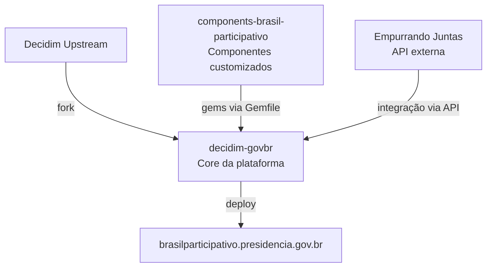

# Sobre a Plataforma

O **Brasil Participativo** é a plataforma nacional de participação social digital do governo federal brasileiro. Ela permite que cidadãos participem diretamente de decisões governamentais por meio de processos participativos, consultas públicas, conferências e outros mecanismos de democracia direta.

## Decidim

O Brasil Participativo é construído sobre o [Decidim](https://decidim.org/), um framework open source de democracia participativa desenvolvido originalmente pela Prefeitura de Barcelona e mantido por uma comunidade internacional. O Decidim é escrito em Ruby on Rails e oferece uma arquitetura modular baseada em engines Rails.

!!! info "Fork direto"
    O Brasil Participativo **não** é uma instância padrão do Decidim que apenas consome gems oficiais. É um **fork direto** do código-fonte do Decidim (`decidim-govbr`), com modificações aplicadas diretamente ao código upstream para atender às necessidades específicas do contexto brasileiro.

## Organização dos Repositórios

| Repositório | Descrição | Link |
|-------------|-----------|------|
| **decidim-govbr** | Core da plataforma — fork do Decidim com customizações brasileiras | [GitLab](https://gitlab.com/lappis-unb/decidimbr/decidim-govbr) |
| **components-brasil-participativo** | Componentes customizados (gems Ruby) | [GitLab](https://gitlab.com/lappis-unb/decidimbr/components-brasil-participativo) |

## Quem Desenvolve

O Brasil Participativo é desenvolvido pelo [LAPPIS](https://lappis.rocks/) (Laboratório Avançado de Produção, Pesquisa e Inovação em Software) da Universidade de Brasília (UnB), em parceria com o governo federal.

## Módulos e Componentes

A plataforma utiliza dois tipos de extensões:

- **Módulos Decidim** — módulos nativos que já vêm com o Decidim upstream (propostas, reuniões, formulários, etc.). Todos os 9 módulos nativos estão ativos.
- **Componentes customizados** — gems Ruby desenvolvidas pelo LAPPIS/UnB que estendem o Decidim além dos módulos oficiais (página inicial customizada, integração EJ, templates melhorados, etc.).

Para detalhes, consulte a seção [Módulos](../modulos/propostas.md) e [Componentes Customizados](../componentes/homes.md).
