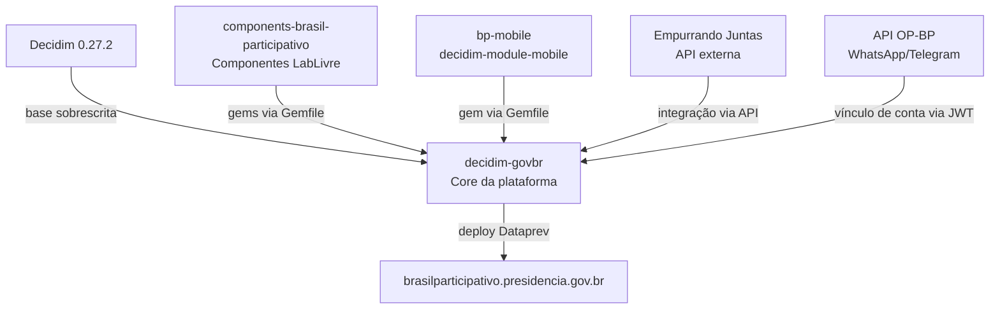

# Sobre a Plataforma

O **Brasil Participativo** é a plataforma de participação digital do governo federal. Por meio dela, cidadãos com cadastro ativo no [gov.br](https://www.gov.br/governodigital/pt-br/identidade/conta-gov-br) interagem em processos de criação, monitoramento e aperfeiçoamento de políticas públicas: enviam e votam propostas e participam de consultas públicas, conferências, planos, formulários e enquetes promovidos por ministérios e órgãos federais.

Produção: [brasilparticipativo.presidencia.gov.br](https://brasilparticipativo.presidencia.gov.br/)

## Quem mantém

| Papel | Instituição |
|-------|-------------|
| Gestão da plataforma | Secretaria Nacional de Participação Social, da Secretaria-Geral da Presidência da República |
| Desenvolvimento | Laboratório de Competência em Software Livre (**LabLivre**) da Universidade de Brasília (UnB) |
| Hospedagem | Dataprev |
| Apoio | Ministério da Gestão e da Inovação em Serviços Públicos, por meio do ColaboraGov |

A versão atual é uma evolução do fork do projeto [decide](https://gitlab.com/nomadetec/decide), da Nomade, desenvolvida com apoio da comunidade Decidim Brasil.

## Brasil Participativo em números

Valores exibidos na página [Sobre o Brasil Participativo](https://brasilparticipativo.presidencia.gov.br/processes/brasilparticipativo/f/1400/) em outubro de 2026:

| Indicador | Valor |
|-----------|-------|
| Usuários | 1.942.985 |
| Acessos | 12.406.894 |
| Processos | 463 |

!!! warning "Período eleitoral de 2026"
    Por determinação da legislação eleitoral, os processos já encerrados estão temporariamente ocultos na plataforma e voltam após as eleições de 2026. As bases de dados abertos continuam disponíveis.

## Modalidades de participação

A plataforma usa a definição de **processos participativos** como "mecanismos institucionais de interlocução entre a administração pública e os cidadãos para elaboração, execução, monitoramento ou avaliação de leis, projetos e políticas públicas" ([Sobre os Processos Participativos](https://brasilparticipativo.presidencia.gov.br/processes/brasilparticipativo/f/1401/)).

Cada modalidade do menu de produção corresponde a um espaço participativo do Decidim:

| Modalidade | O que é | Espaço no Decidim | Rota em produção |
|------------|---------|-------------------|------------------|
| **Consultas Públicas** | Mecanismo consultivo com prazo determinado, aberto a qualquer pessoa, para envio de subsídios, sugestões e críticas sobre um tema | Processo participativo, tipo 1 | `/processes?with_type=1` |
| **Conferências** | Instâncias de debate entre poder público e sociedade civil para avaliar políticas e propor diretrizes. Ocorrem em etapas municipal, estadual e nacional, com eleição de delegados | Processo participativo, tipo 2 | `/processes?with_type=2` |
| **Planos Participativos** | Instrumentos de planejamento de médio ou longo prazo construídos com a sociedade civil (cultura, educação, saúde, direitos humanos etc.) | Processo participativo, tipo 3 | `/processes?with_type=3` |
| **Audiências Públicas** | Item de menu sem descrição na página de produção; agrupa os processos de audiência pública | Processo participativo, tipo 4 | `/processes?with_type=4` |
| **Conselhos e Colegiados** | Instâncias formais e permanentes, com representação paritária entre governo e sociedade civil, de caráter consultivo, deliberativo, fiscalizador ou normativo | Assembleia ("instância") | `/assemblies` |
| **Fóruns de Participação** | Espaços flexíveis de articulação da sociedade civil, temporários ou permanentes, sem poder normativo necessário | Assembleia | `/assemblies/fps` |

!!! info "Tipos de processo"
    Os números 1–4 são IDs de `Decidim::ParticipatoryProcessType` na base de produção. Os mesmos agrupamentos são expostos em JSON pelo endpoint `GET /api/home_processes` (veja [Arquitetura](arquitetura.md)).

Além das modalidades, o menu traz **Notícias** (blog do processo institucional `brasilparticipativo`), **Sobre** e **Capacitação para Órgão Federal** (páginas estáticas em `/pages`).

## Decidim

O Brasil Participativo é construído sobre o [Decidim](https://decidim.org/), framework open source de democracia participativa criado pela Prefeitura de Barcelona e mantido por uma comunidade internacional. O Decidim é escrito em Ruby on Rails e organizado em engines Rails.

!!! info "Fork direto"
    O Brasil Participativo **não** é uma instância padrão do Decidim que apenas consome gems oficiais. O repositório `decidim-govbr` sobrescreve diretamente models, controllers, views, comandos e permissões do Decidim 0.27.2 para atender ao contexto brasileiro.

## Organização dos repositórios

```mermaid
graph TD
    UP[Decidim 0.27.2] -->|base sobrescrita| CORE[decidim-govbr<br/>Core da plataforma]
    COMP[components-brasil-participativo<br/>Componentes LabLivre] -->|gems via Gemfile| CORE
    MOB[bp-mobile<br/>decidim-module-mobile] -->|gem via Gemfile| CORE
    EJ[Empurrando Juntas<br/>API externa] -->|integração via API| CORE
    OPBP[API OP-BP<br/>WhatsApp/Telegram] -->|vínculo de conta via JWT| CORE
    CORE -->|deploy Dataprev| PROD[brasilparticipativo.presidencia.gov.br]
```

| Repositório | Descrição | Link |
|-------------|-----------|------|
| **decidim-govbr** | Core da plataforma | [GitLab](https://gitlab.com/lappis-unb/decidimbr/decidim-govbr) |
| **components-brasil-participativo** | Grupo com os componentes customizados (um repositório por gem) | [GitLab](https://gitlab.com/lappis-unb/decidimbr/components-brasil-participativo) |
| **decidim-extra_user_fields** | Campos extras no cadastro de usuário | [GitLab](https://gitlab.com/lappis-unb/decidimbr/decidim-extra_user_fields) |
| **decidim-module-mobile** | Suporte ao app móvel | [GitLab](https://gitlab.com/lappis-unb/decidimbr/bp-mobile/decidim-module-mobile) |

## Módulos e componentes

A plataforma usa dois tipos de extensão:

- **Módulos Decidim**: módulos nativos do Decidim upstream (propostas, reuniões, formulários etc.), vários deles com comportamento sobrescrito no core.
- **Componentes customizados**: gems desenvolvidas pelo LabLivre/UnB que estendem o Decidim (página inicial, integração com o EJ, agrupamento de processos etc.).

Para detalhes, consulte [Módulos](../modulos/propostas.md) e [Componentes Customizados](../componentes/homes.md).
